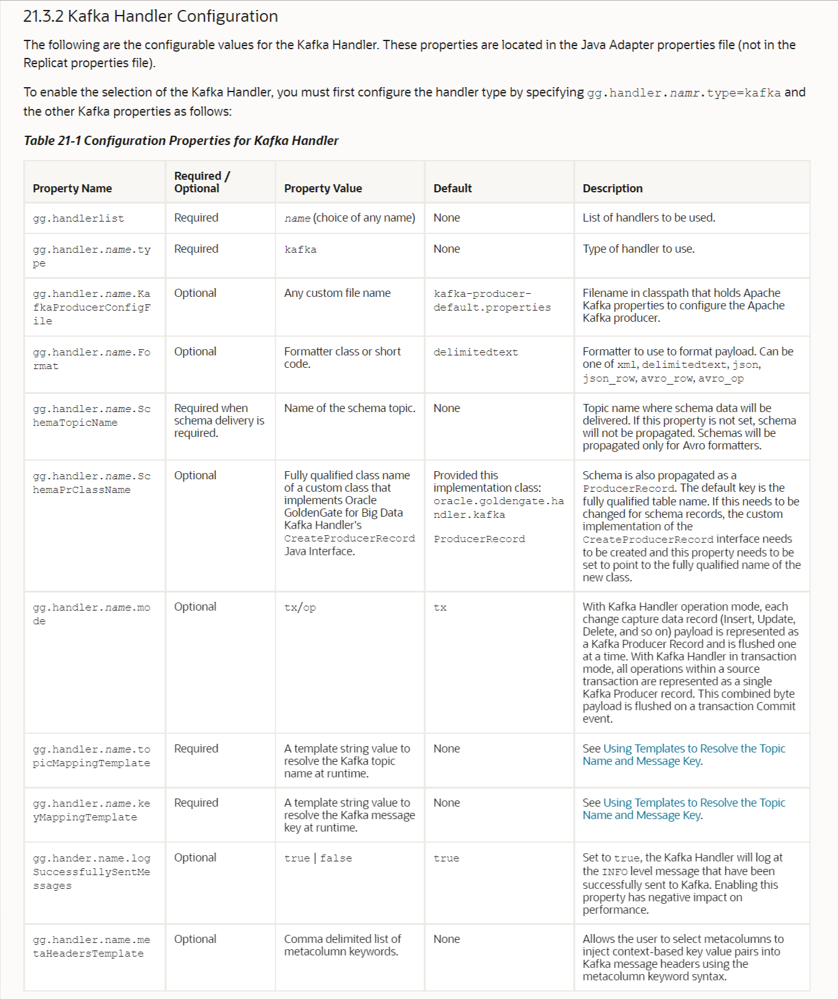
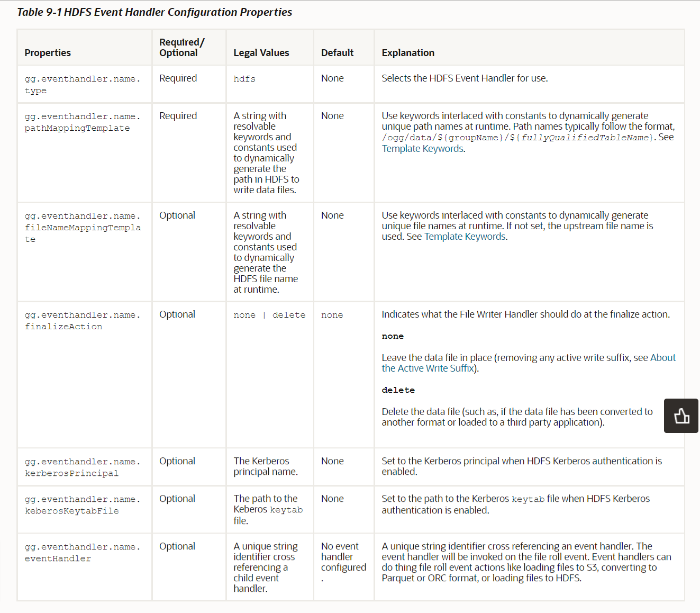
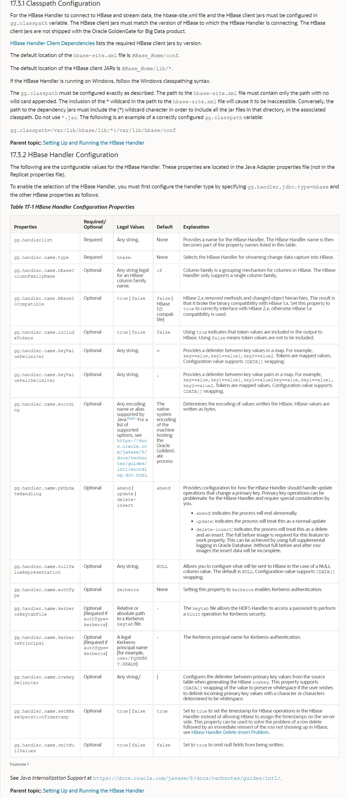
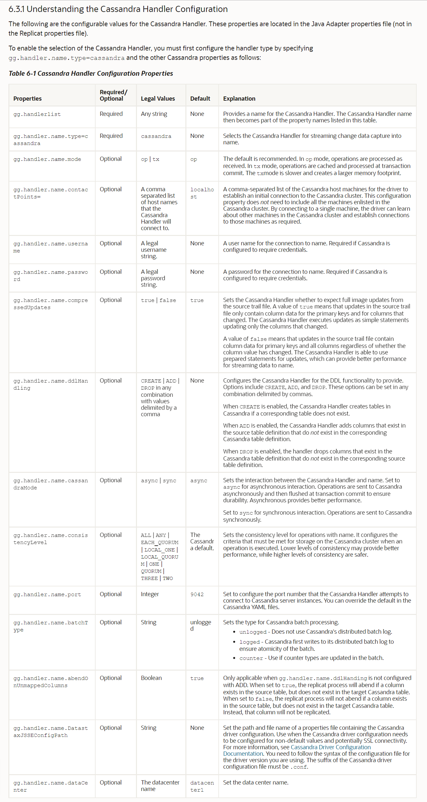
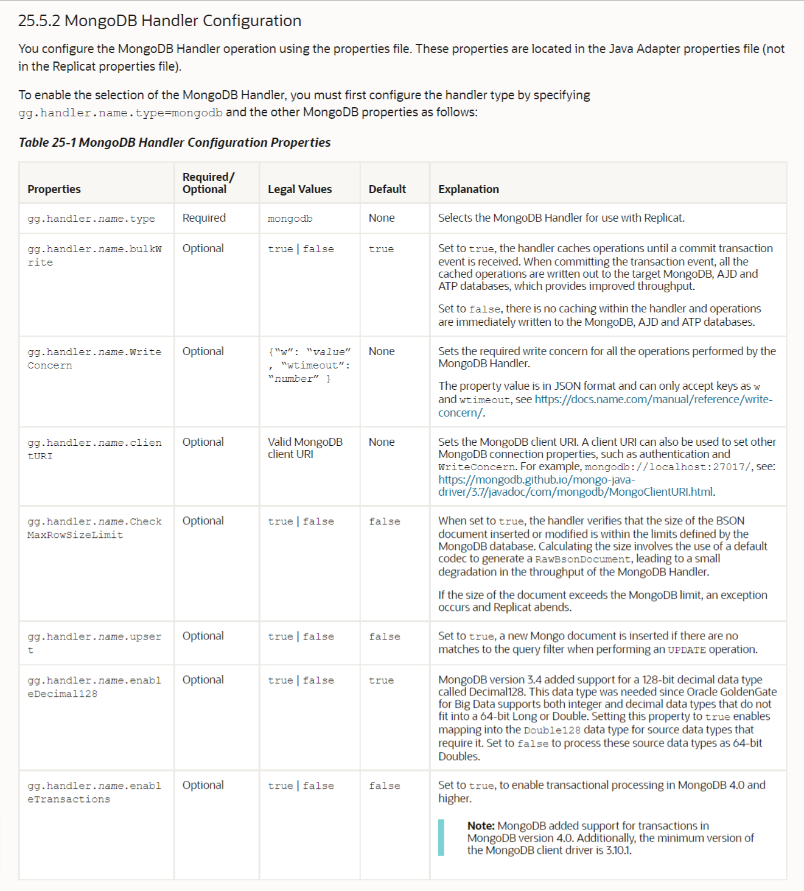
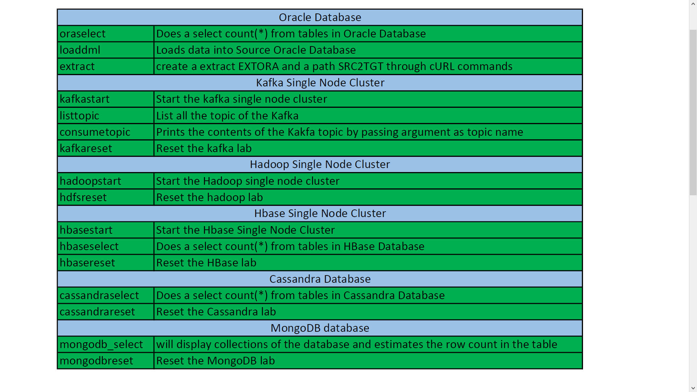
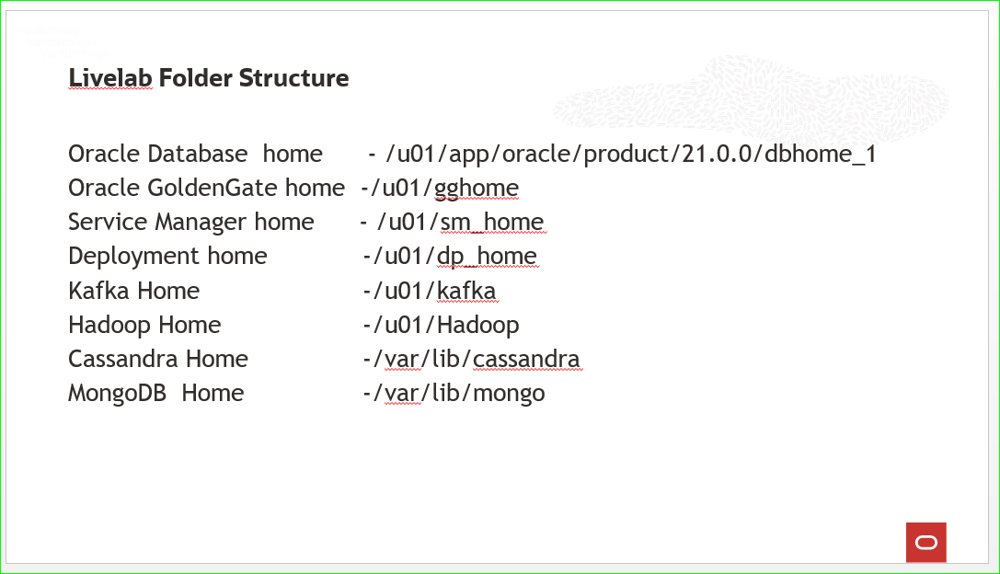

# Appendix

## Appendix A - Handler Configuration Properties
Here are a few of the properties for the GG HDFS,HBASE,Kafka & Cassandra Handlers.
Please refer to the ‘Introducing Oracle GoldenGate for Big Data’ doc for a complete list:

[Introducing Oracle GoldenGate for Big Data](https://docs.oracle.com/en/middleware/goldengate/big-data/21.1/gadbd/introduction-oracle-goldengate-big-data.html)
***

**Kafka Properties**
  
  
**HDFS Properties**

  

**HBASE Properties**
  
  
**Cassandra Properties**
  

**MongoDB Properties**
  

## Appendix B – Command Reference List

Aliases have been created for this workshop, so that you can focus on GG functionality. These aliases will make it simple to look at files in HDFS, select data from MongoDB, HBase, Cassandra or consume a Kafka topic.

  
  

## Appendix C – Workshop folder structure Reference List

Workshop folder structure reference will give board idea about the Oracle Database home,GoldenGate homes ,Hadoop home, HBase home, Cassandra home ,MongoDB home and Kafka home.

  
  
  
## Learn More

* [Oracle GoldenGate for Big Data 21c | Oracle] (https://docs.oracle.com/en/middleware/goldengate/big-data/21.1/gadbd/introduction-oracle-goldengate-big-data.html)

## Acknowledgements
* **Author** - Madhu Kumar S, AppDev and Integration, Bangalore Tech Team, June 2022
* **Contributors** - Madhu Kumar S
* **Last Updated By/Date** - Madhu Kumar S, AppDev and Integration, Bangalore Tech Team, June 2022

