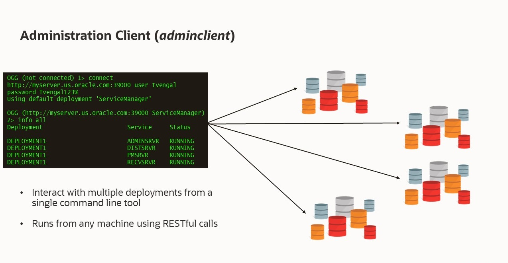
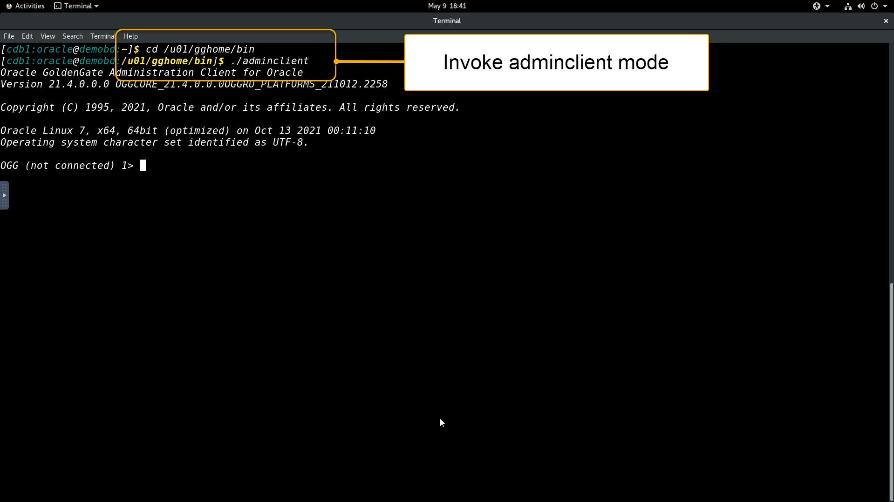
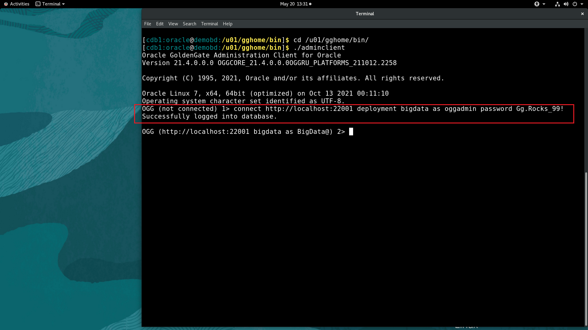

# GGMA Adminclient

## Introduction
This workshop will demonstrate how to connect to the Oracle GoldenGate Admin Client and use it to view all running processes, Extract statistics, log messages, and purge unused files.

*Estimated Time*: 5 minutes

#### Lab Architecture



### Objectives
In this lab you will learn:
-  How to connect to the Admin Client.
-  How to run various commands.


### Prerequisites
This lab assumes you have:
- A Free Tier, Paid or LiveLabs Oracle Cloud account
- You have completed:
    - Lab: Initialize Environment
    - Please execute any one of the lab (2-7)

## Task 1: Login to Adminclient

1. Open  a terminal, Change directories to ***/u01/gghome/bin/***, and then start the Admin Client:
    Navigate to GGMA Adminclient folder:

    ```
    <copy>
   cd /u01/gghome/bin/
    ./adminclient

    </copy>
    ```

    
2.  Connect to the GoldenGate deployment of the target deployment:
    ```
    <copy>
    connect http://localhost:22001 deployment bigdata as oggadmin password Gg.Rocks_99!
    </copy>
    ```



3. After connecting successfully, you can run any of the following commands:

    Display the status of GoldenGate processes:

    ```
    <copy>
    info all
    </copy>
    ```


    View statistics of  Replicat ***REPLICAT NAME***

    ```
    <copy>
    STATS REPLICAT <REPLICAT-NAME> TOTAL
    </copy>
    ```
	ex:

	 View statistics of  Replicat ***REPKAFKA***
	```
    <copy>
    STATS REPLICAT REPKAFKA TOTAL
    </copy>
    ```


    View the content of a ggserror log file:

    ```
    <copy>
    VIEW MESSAGES
    </copy>
    ```


## Summary
To summarize, Admin Client is a command line utility (similar to the classic GGSCI utility). It uses the REST API published by the Microservices Servers to accomplish control and configuration tasks in an Oracle GoldenGate deployment.

## Learn More

* [Using the Admin Client](https://docs.oracle.com/en/middleware/goldengate/core/21.1/admin/getting-started-oracle-goldengate-process-interfaces.html#GUID-84B33389-0594-4449-BF1A-A496FB1EDB29)

## Acknowledgements
* **Author** - Madhu Kumar S, AppDev and Integration, Bangalore Tech Team, June 2022
* **Contributors** - Madhu Kumar S, Brian Elliott,Deniz Sendil,Meghana Banka
* **Last Updated By/Date** - Madhu Kumar S, AppDev and Integration, Bangalore Tech Team, June 2022
