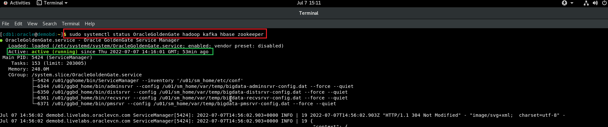
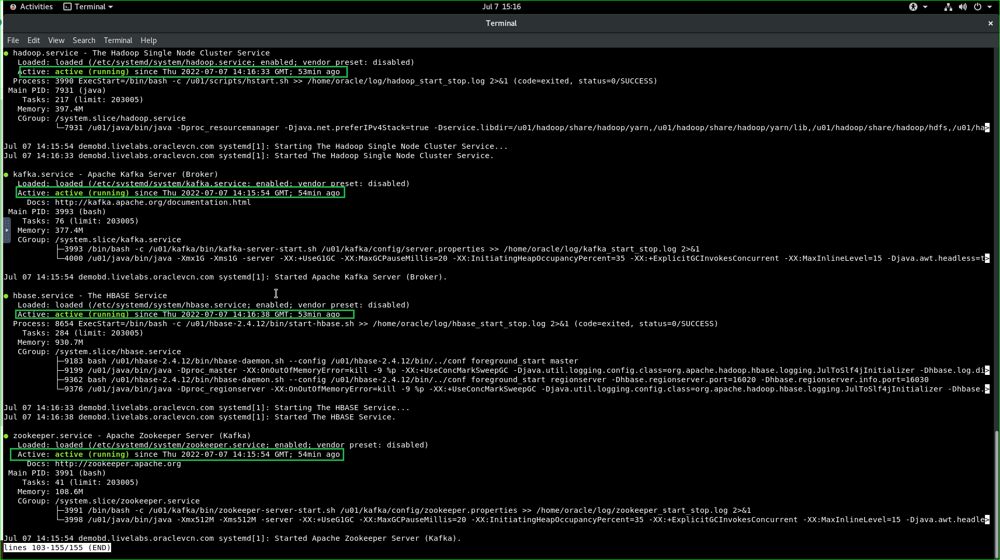
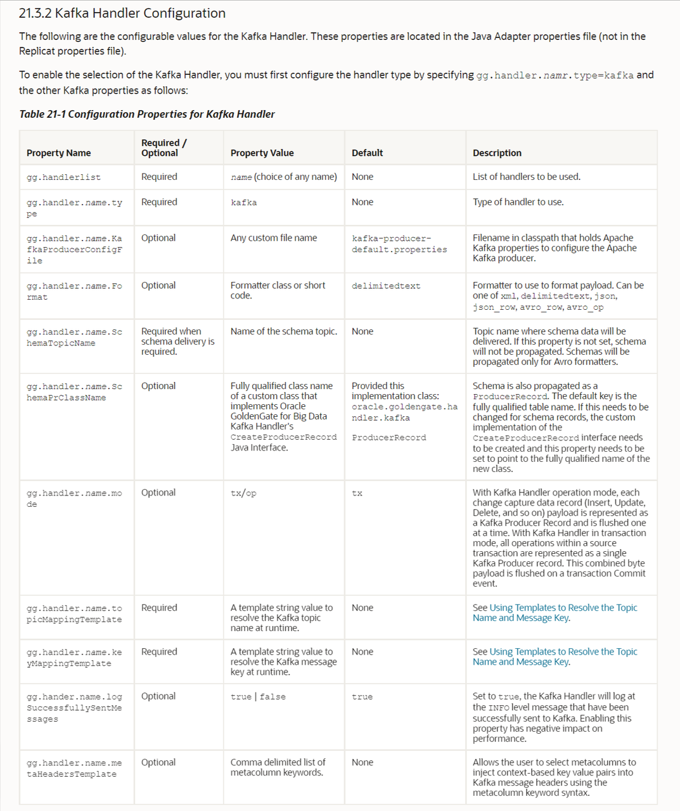
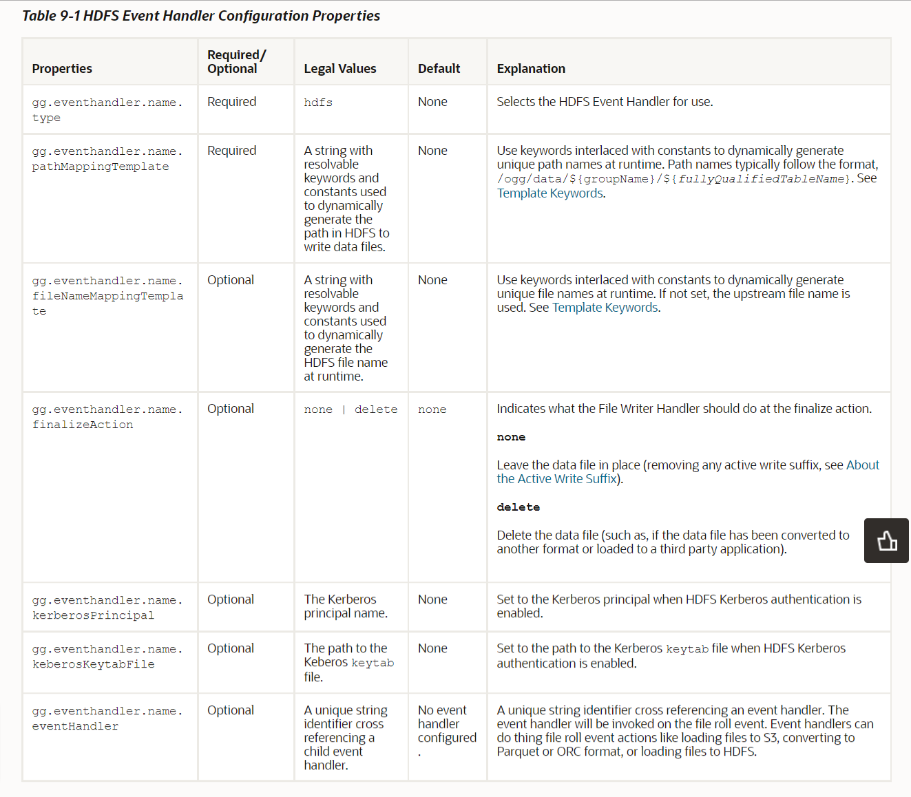
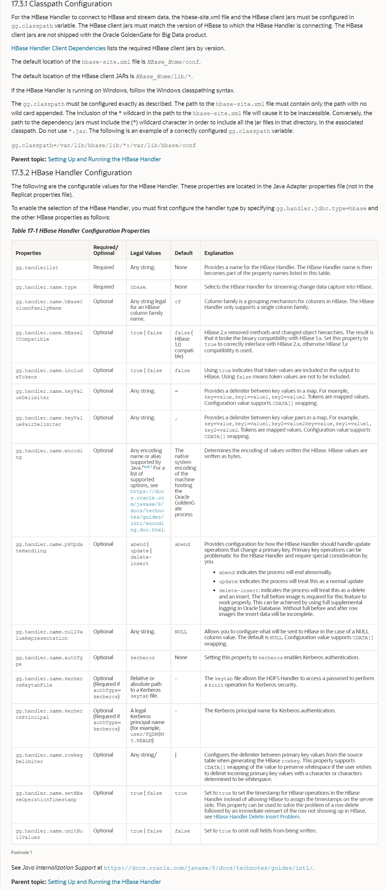
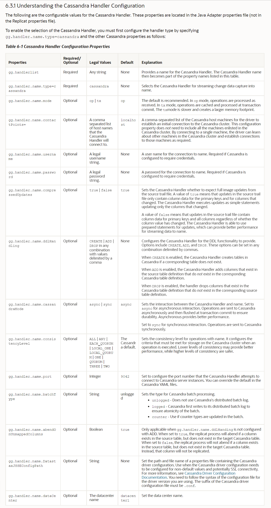
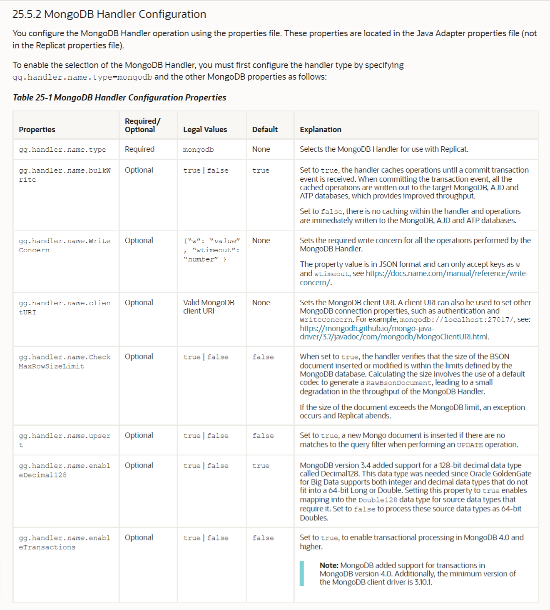
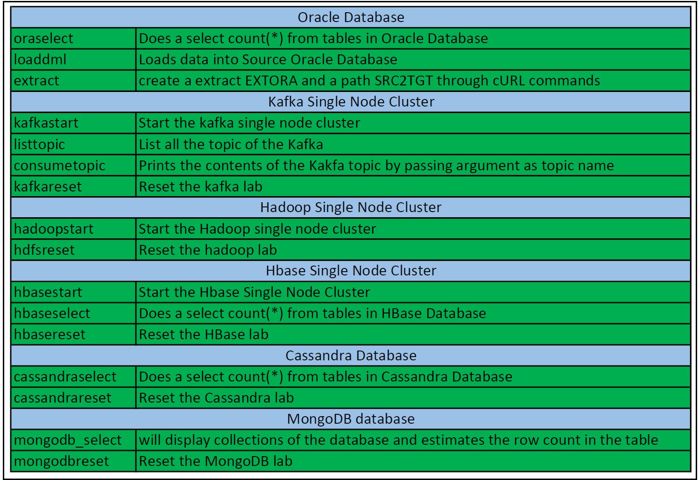
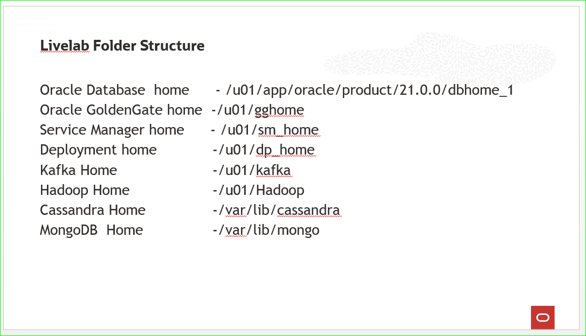

# Initialize Environment

## Introduction
In this lab we will setup the initialize required databases and GoldenGate Services.

*Estimated Time*:  30 minutes

### Lab Architecture


### Objectives
In this lab you will:
- Understanding how to start and check the status of the Oracle Database,Kafka,Hadoop,Hbase,Cassandra and mongoDB.

### Prerequisites
This lab assumes you have:
- A Free Tier, Paid or LiveLabs Oracle Cloud account

## Task 1: Validate That Required Processes are Up and Running.
1. Now with access to your remote desktop session, proceed as indicated below to validate your environment before you start executing the subsequent labs. The following Processes should be up and running:

    - Database Listener
        - LISTENER
    - Database Server instance
        - CDB1
    - Oracle GoldenGate ServiceManager
    - Kafka cluster
    - hadoop single-node cluster
    - Cassandra 
    - mongoDB

    Open the terminal on the remote desktop and run the following for a clean start.

    ```
    <copy>
    sudo systemctl status oracle-database 
    </copy>
    ```
     

    if the output show  ***active (running)*** indicates Oracle Database is up and running,Kindly press ***Ctrl+c*** to exit from the output.
    ```
    <copy>
    sudo systemctl status OracleGoldenGate hadoop kafka hbase zookeeper
    </copy>
    ```
     
     
    if the output show  ***active (running)*** indicates OracleGoldenGate Services are up and running,Kindly press ***Ctrl+c*** to exit from the output.
    


2. If you see questionable output(s), failure or down component(s), Please reach out to the workshop instructor.                                     

You may now [proceed to the next lab](#next).

## Appendix 1: Managing Startup Services

1. Database Service (Database and Listener).

    - Start

    ```
    <copy>sudo systemctl start oracle-database</copy>
    ```

    - Stop

    ```
    <copy>sudo systemctl stop oracle-database</copy>
    ```

    - Status

    ```
    <copy>sudo systemctl status oracle-database</copy>
    ```

    - Restart

    ```
    <copy>sudo systemctl restart oracle-database</copy>
    ```

2. Oracle GoldenGate ServiceManager

    - Start

    ```
    <copy>sudo systemctl start OracleGoldenGate</copy>
    ```

    - Stop

    ```
    <copy>sudo systemctl stop OracleGoldenGate</copy>
    ```

    - Status

    ```
    <copy>sudo systemctl status OracleGoldenGate</copy>
    ```

    - Restart

    ```
    <copy>sudo systemctl restart OracleGoldenGate</copy>
    ```
3. Kafka Service.

    - Start

    ```
    <copy>sudo systemctl start kafka</copy>
    ```

    - Stop

    ```
    <copy>sudo systemctl stop kafka</copy>
    ```

    - Status

    ```
    <copy>sudo systemctl status kafka</copy>
    ```

    - Restart

    ```
    <copy>sudo systemctl restart kafka</copy>
    ```
4. Zookeeper Service.

    - Start

    ```
    <copy>sudo systemctl start zookeeper</copy>
    ```

    - Stop

    ```
    <copy>sudo systemctl stop zookeeper</copy>
    ```

    - Status

    ```
    <copy>sudo systemctl status zookeeper</copy>
    ```

    - Restart

    ```
    <copy>sudo systemctl restart zookeeper</copy>
    ```
5. Hadoop Service.

    - Start

    ```
    <copy>sudo systemctl start hadoop</copy>
    ```

    - Stop

    ```
    <copy>sudo systemctl stop hadoop</copy>
    ```

    - Status

    ```
    <copy>sudo systemctl status hadoop</copy>
    ```

    - Restart

    ```
    <copy>sudo systemctl restart hadoop</copy>
    ```
6.HBase Service.

    - Start

    ```
    <copy>sudo systemctl start hbase</copy>
    ```

    - Stop

    ```
    <copy>sudo systemctl stop hbase</copy>
    ```

    - Status

    ```
    <copy>sudo systemctl status hbase</copy>
    ```

    - Restart

    ```
    <copy>sudo systemctl restart hbase</copy>
    ```
## Appendix 2: Handler Configuration Properties

Here are a few of the properties for the GG HDFS,HBASE,Kafka & Cassandra Handlers.
Please refer to the ‘Introducing Oracle GoldenGate for Big Data’ doc for a complete list:

[Introducing Oracle GoldenGate for Big Data](https://docs.oracle.com/en/middleware/goldengate/big-data/21.1/gadbd/introduction-oracle-goldengate-big-data.html)
***

**Kafka Properties**
  
  
**HDFS Properties**

  


**HBASE Properties**
  
  
**Cassandra Properties**
  

**MongoDB Properties**
  

## Appendix 3: Command Reference List

Aliases have been created for this workshop, so that you can focus on GG functionality. These aliases will make it simple to look at files in HDFS, select data from MongoDB, HBase, Cassandra or consume a Kafka topic.

  
  

## Appendix 4: Workshop folder structure Reference List

Workshop folder structure reference will give board idea about the Oracle Database home,GoldenGate homes ,Hadoop home, HBase home, Cassandra home ,MongoDB home and Kafka home.

  
  
  
## Learn More

* [Oracle GoldenGate (MA) for Big Data](https://docs.oracle.com/en/middleware/goldengate/big-data/21.1/gadbd/getting-started-oracle-goldengate-microservices-big-data.htm)

## Acknowledgements
* **Author** - Madhu Kumar S, AppDev and Integration, Bangalore Tech Team
* **Contributors** - Madhu Kumar S
* **Last Updated By/Date** - Madhu Kumar S, AppDev and Integration, Bangalore Tech Team, June 2022
