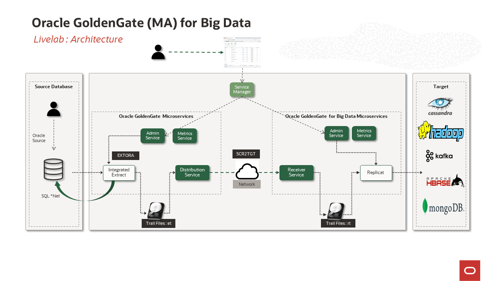
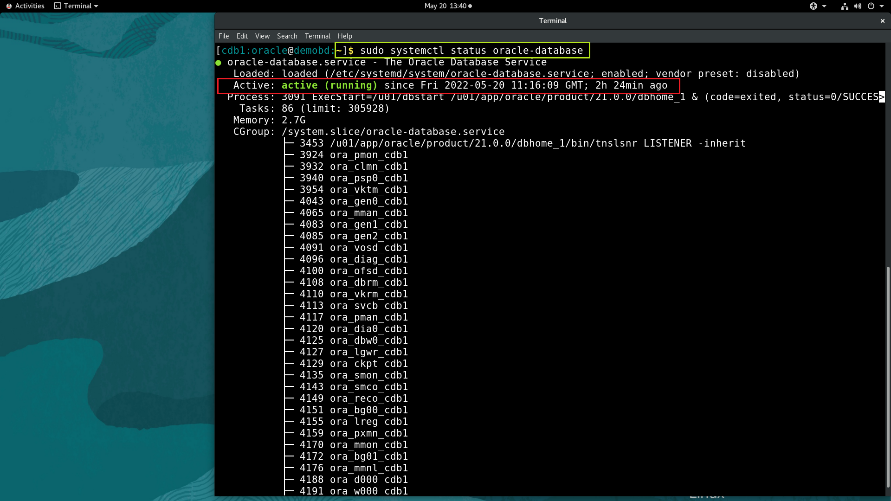
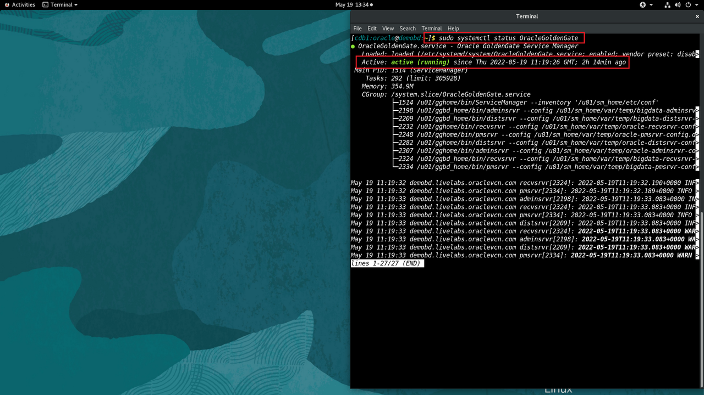

# Initialize Environment

## Introduction
In this lab we will setup the initialize required databases and GoldenGate Services.

*Estimated Time*:  30 minutes

### Lab Architecture


### Objectives
In this lab you will:
Understanding how to start and check the status of the Oracle Database,Kafka,Hadoop,Hbase,Cassandra and mongoDB.

### Prerequisites
This lab assumes you have:
- A Free Tier, Paid or LiveLabs Oracle Cloud account

## Task 1: Validate That Required Processes are Up and Running.
1. Now with access to your remote desktop session, proceed as indicated below to validate your environment before you start executing the subsequent labs. The following Processes should be up and running:

    - Database Listener
        - LISTENER
    - Database Server instance
        - CDB1
    - Oracle GoldenGate ServiceManager
    - Kafka cluster
    - hadoop single-node cluster
    - Cassandra 
    - mongoDB

    Open the terminal on the remote desktop and run the following for a clean start.

    ```
    <copy>
    sudo systemctl status oracle-database 
    </copy>
    ```
     

    if the output show  ***active (running)*** indicates Oracle Database is up and running,Kindly press ***Ctrl+c*** to exit from the output.
    ```
    <copy>
    sudo systemctl status OracleGoldenGate
    </copy>
    ```
     
    if the output show  ***active (running)*** indicates OracleGoldenGate Services are up and running,Kindly press ***Ctrl+c*** to exit from the output.

2. If you see questionable output(s), failure or down component(s), Please reach out to the workshop instructor.                                     

You may now [proceed to the next lab](#next).


## Learn More

* [Oracle GoldenGate (MA) for Big Data](https://docs.oracle.com/en/middleware/goldengate/big-data/21.1/gadbd/getting-started-oracle-goldengate-microservices-big-data.htm)

## Acknowledgements
* **Author** - Madhu Kumar S, AppDev and Integration, Bangalore Tech Team
* **Contributors** - Madhu Kumar S
* **Last Updated By/Date** - Madhu Kumar S, AppDev and Integration, Bangalore Tech Team, June 2022
