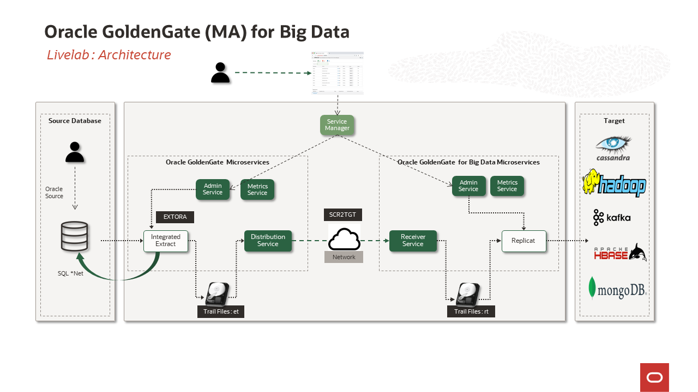

# Introduction

## About Oracle GoldenGate Microservices for Big Data
Oracle GoldenGate Microservices for Big Data  offers high-performance, fault-tolerant, easy-to-use, and flexible real- time data streaming platform for big data environments.  Oracle GoldenGate Microservices Architecture (MA) would    be configure and manage your data replication using an HTML user interface. The Oracle GoldenGate MA comprises the following components: Service Manager, Administration Server, Distribution Server, Receiver Server, Performance Metrics Server, and Admin Client. This workshop focuses on **GoldenGate Real Time Data Replication** demonstrating five scenarios that you can use (both on-premise and in the cloud) to capture real time data changes from your sources.

This hands-on lab is designed to demonstrate how  **Oracle GoldenGate Microservices Architecture** and  **Oracle GoldenGate (MA) for Big Data** can be used to setup a replication environment by a mix of web page, shell scripts and Rest API interfaces. All labs will use shell scripts to facilitate the building of the environment, at the same time provide insight into how to use the web pages and AdminClient.The labs will walk the end-user through how to add all components of Oracle GoldenGate replication.

**Workshop  Microservices Architecture**
    

### Objectives
In this workshop, you will learn how to:
- How to  replicate from  Oracle to Kafka.
- How to  replicate from  Oracle to Hadoop cluster.
- How to  replicate from  Oracle to HBase.
- How to  replicate from  Oracle to Cassandra.
- How to  replicate from  Oracle to MongoDB.

### Prerequisites
This lab assumes you have:
* An Oracle Cloud Account - Please view this workshop's LiveLabs landing page to see which environments are supported

*Note: If you have a **Free Trial** account, when your Free Trial expires your account will be converted to an **Always Free** account. You will not be able to conduct Free Tier workshops unless the Always Free environment is available. **[Click here for the Free Tier FAQ page.](https://www.oracle.com/cloud/free/faq.html)***

You may now proceed to the next lab..

## Learn More

* [GoldenGate](https://www.oracle.com/middleware/data-integration/goldengate/")
* [GoldenGate for Big Data](https://www.oracle.com/middleware/data-integration/goldengate/big-data/")
* [GoldenGate Microservices Architecture (MA)](https://docs.oracle.com/en/middleware/goldengate/big-data/21.1/gadbd/getting-started-oracle-goldengate-microservices-big-data.html#GUID-248D5562-397F-4D10-9E95-CE9477012950)

## Acknowledgements
* **Author** - Madhu Kumar S, AppDev and Integration, Bangalore Tech Team
* **Contributors** - Madhu Kumar S, Brian Elliott,Deniz Sendil
* **Last Updated By/Date** - Madhu Kumar S, AppDev and Integration, Bangalore Tech Team, June 2022
