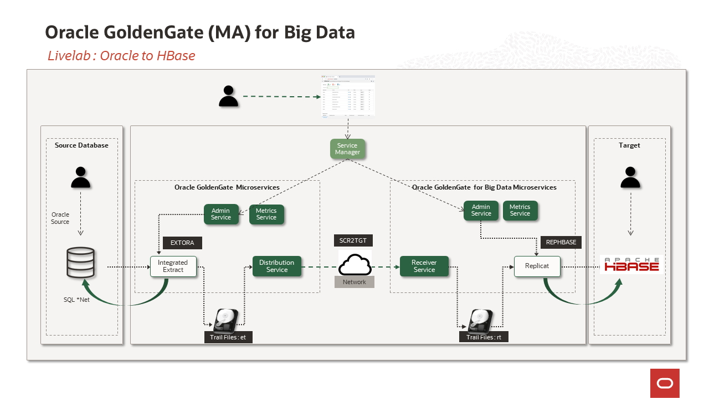
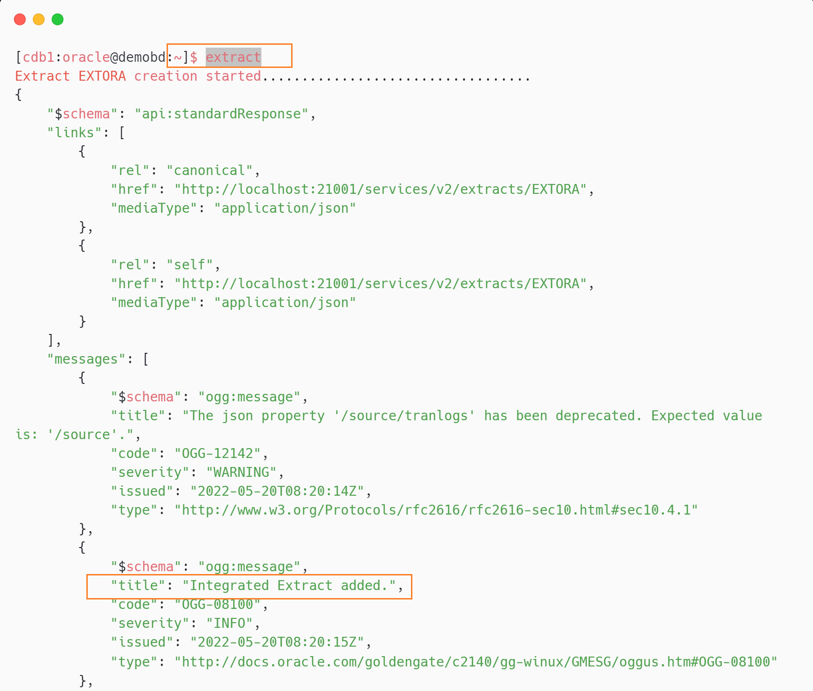
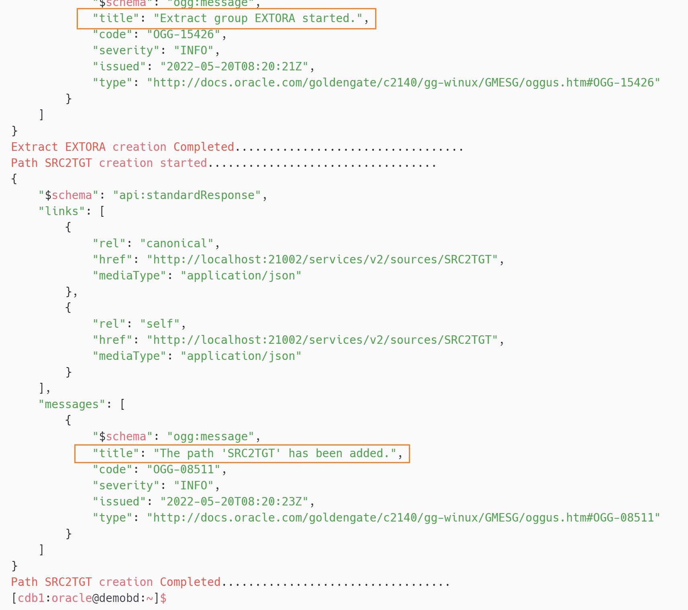
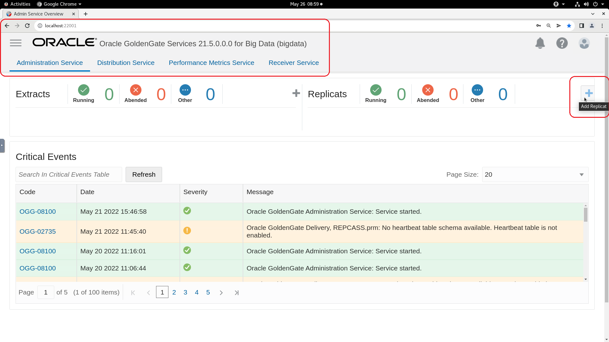

# Replicate the data from Oracle Database to Apache HBase

## Introduction

This lab will demonstrate how to  ***Replicate from Oracle Database to Apache HBase*** using **Oracle GoldenGate 21c Microservices** and **Oracle GoldenGate (MA) for Big Data**. All labs will use shell scripts to facilitate the building of the environment, at the same time provide insight into how to use the web pages and AdminClient.

In this lab, we will load data in the Oracle Database schema ***SOE***  of Pluggable Database ***PDB***. GG extract process ***EXTORA*** will capture the changes from Oracle Database and write them to the local trail file ***et***. From the Distribution Service, path ***SRC2TGT*** will route the trail file  ***et*** to target GoldenGate (MA) for Big Data Receiver Service as ***rt***. The replicat process ***REPHBASE*** will read the remote trail files and replicates to the target HBase database.


Estimated Time: 30 minutes

#### Lab Architecture

  

### Objectives
In this lab you will learn:
-  How to reset the GoldenGate configuration
-  How to create an extract for the source database and a path to distribute the trail to target deployment.
-  How to configure the GoldenGate for HBase as a target
-  How to validate the GoldenGate configuration for HBase as a target

### Prerequisites
This lab assumes you have:
- An Oracle Cloud account
- You have completed:
    - Lab: Initialize Environment

## Task 1: GoldenGate Configuration Reset

1.  Open a terminal and type ***hbasereset*** to reset the lab.

    ```
    <copy>hbasereset</copy>
    ```
    
    

## Task 2: GoldenGate Configuration  for Oracle as Source
1.  Open  a terminal and type ***extract*** to create a extract ***EXTORA*** and a path ***SRC2TGT*** through cURL commands.
    
    

2. To validate the GoldenGate process, sign in to the Administration Service console from the below URL with username as ***oggadmin*** and password as ***Gg.Rocks_99***.

    Click here : [http://localhost:21001/?root=account](http://localhost:21001/?root=account)

    ***username***

    ```
    <copy>oggadmin</copy>
    ```
    ***password***

    ```
    <copy>Gg.Rocks_99</copy>
    ``` 


3. On welcome pages, a green tick with the name ***EXTORA*** indicates extract is up and running on the  Administration Service console.
        
4. Navigate to Distribution Service, to validate the path ***SRC2TGT*** 
        

    ***Source deployment completed!***

## Task 3: GoldenGate Configuration  for HBase as Target

1. To create a replicat, sign in to the Administration service of GoldenGate (MA) of Big Data from the below URL with username as ***oggadmin*** and password as ***Gg.Rocks_99*** 

    Click here : [http://localhost:22001/?root=account](http://localhost:22001/?root=account)

    ***username***

    ```
    <copy>oggadmin</copy>
    ```
    ***password***

    ```
    <copy>Gg.Rocks_99</copy>
    ```


2. On the welcome page, Click on the **Add Replicat** (***+*** plus icon) to get the replicat creation wizard.

    Replicat is a process that delivers data to a target database. It reads the trail file on the target database, reconstructs the DML or DDL operations, and applies them to the target database.

    

3. On Add Replicat page, choose the replicat type as ***Classic Replicat*** and Click on **Next** to proceed to Replicat Options.    

    
4. On the Replicat Options wizard, enter the replicat process name as ***REPHBASE***.
    ```
    <copy>
    REPHBASE
    </copy>
    ```


5.  Enter trail Name as ***rt***, which is received from the source ***Oracle Database***


6. Choose Target as **HBASE** from the top-down menu and click **Next** to navigate the **parameter** tab


7. In the Parameter File text area, replace ***`MAP *.*, TARGET *.*; `***with the following script:

    ```
    <copy>
    MAP PDB.SOE.*, TARGET SOE.*;
    </copy>
    ```


8. On properties file tab, enter "**gg.handler.HBase.hBaseColumnFamilyName=**"  as ***cf***.


9. Set the classpath to read the jar files of the HBase and click ***create and run*** to complete the replication creation wizard.

    ```
    <copy>
    /u01/hbase_2.4.4/*:/u01/hbase-2.4.12/lib/*:/u01/hbase-2.4.12/conf
    </copy>
    ```

    
10. Replicat ***REPHBASE*** created successfully

    

    ***Target deployment completed!***
## Task 4: Validation of the GoldenGate Configuration for HBase as Target

1. Open a ***New Window*** on the terminal, and move the terminal side by side as shown below.

    On the left side terminal, enter ***oraselect*** will display the row counts of all the tables of the Oracle(Source) Database.

    ```
    <copy>
    oraselect
    </copy>
    ```
On the right side terminal, enter ***hbaseselect*** will display the row counts of all the tables of the HBase(target) database.

    ```
    <copy>
    hbaseselect
    </copy>
    ```
    
2. Enter ***loaddml*** on any one of the terminals to load the data to Oracle Database tables
    ```
    <copy>
    loaddml
    </copy>
    ```

    

3. To validate the GoldenGate replication, execute the below commands.

    On the left side terminal, enter ***oraselect*** will display the row counts of all the tables of the Oracle(Source) Database.
    ```
    <copy>
    oraselect
    </copy>
    ```
    

    On the right side terminal, enter ***hbaseselect*** will display the row counts of all the tables of the HBase(target) database.

    ```
    <copy>
    hbaseselect
    </copy>
    ```
    
4. Replication statistics can be viewed from the GoldenGate Microservice console also. Click on the replicat ***REPHBASE*** and navigate to ***statistics***
    

## Summary

To summarize, you loaded data in the Oracle Database ***SOE*** schema of Pluggable Database ***PDB***. The GG extract process ***EXTORA*** captured the changes from the Oracle Database and wrote them to the local trail file ***et***. From the Distribution Service, path ***SRC2TGT*** will route the trail file  ***et*** to target GoldenGate (MA) for Big Data Receiver Service as ***rt***. The replicat process ***REPHBASE*** will read the remote trail files and replicates to the target HBase database.

You may now proceed to the next lab.

## Learn More

* [Oracle GoldenGate for Big Data 21c ](https://docs.Oracle.com/en/middleware/goldengate/big-data/21.1/index.html)
* [ Using the HBase  Handler ](https://docs.Oracle.com/en/middleware/goldengate/big-data/21.1/gadbd/using-hbase-handler.html)

## Acknowledgements
* **Author** - Madhu Kumar S, AppDev and Integration, Bangalore Tech Team
* **Contributors** - Madhu Kumar S, Brian Elliott, Deniz Sendil, Meghana Banka 
* **Last Updated By/Date** - Madhu Kumar S, AppDev and Integration, Bangalore Tech Team, August 2022
