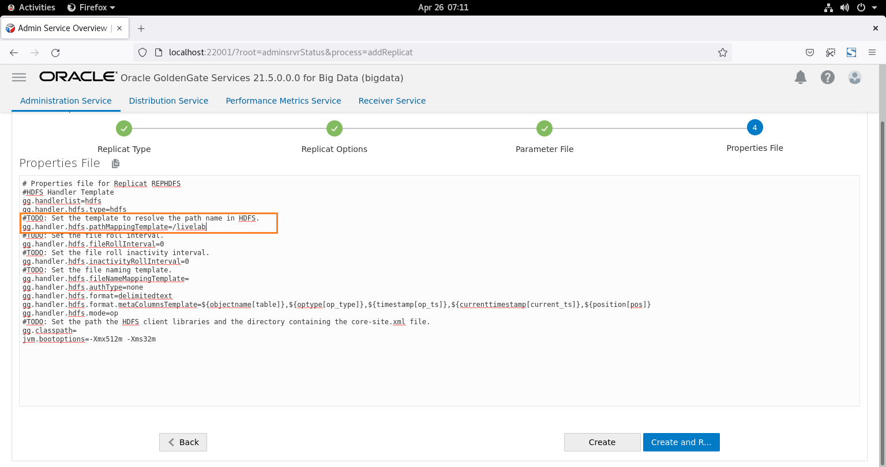

#  Replicate data from Oracle Database to HDFS

## Introduction
This lab will demonstrate how to  ***Replicate the data from Oracle Database to HDFS*** using **Oracle GoldenGate 21c Microservices** and **Oracle GoldenGate (MA) for Big Data**. All labs will use shell scripts to facilitate the building of the environment, at the same time provide insight into how to use the web pages and Admin Client.

In this lab, we will load data in the Oracle Database schema ***SOE***  of Pluggable Database ***PDB***. GG extract process ***EXTORA*** will capture the changes from Oracle Database and write them to the local trail file ***et***. From the Distribution Service, path ***SRC2TGT*** will route the trail file  ***et*** to target GoldenGate (MA) for Big Data Receiver Service as ***rt***. The replicat process ***REPHDFS*** will read the remote trail files and replicates to target the Apache Hadoop file system ***/livelab***.

Estimated Time: 30 minutes

#### Lab Architecture

  

### Objectives
In this lab you will learn:
-  How to reset the GoldenGate configuration.
-  How to create an extract for source database and a path to distribute the trail to target deployment. 
-  How to configure the GoldenGate for HDFS as target.
-  How to validate of the GoldenGate configuration for HDFS as target.


### Prerequisites
This lab assumes you have:
- An Oracle Cloud account
- You have completed:
    - Lab: Initialize Environment

## Task 1: GoldenGate configuration reset

1.	Open a terminal and type ***hdfsreset*** to reset the lab.

    ```
    <copy>hdfsreset</copy>
    ```
    
    
## Task 2: GoldenGate configuration  for Oracle Database as source
1.	Open  a terminal and type ***extract*** to create a extract ***EXTORA*** and a path ***SRC2TGT*** through cURL commands.
    
    

2. To validate the GoldenGate process, login to GoldenGate Administration Service console from the below url with username as ***oggadmin*** and password as ***Gg.Rocks_99***.

    [GoldenGate Administration Service console : http://localhost:21001/?root=account](http://localhost:21001/?root=account)

    ***username***

    ```
    <copy>oggadmin</copy>
    ```
    ***password***

    ```
    <copy>Gg.Rocks_99</copy>
    ```   


3. On welcome pages, a green tick with name ***EXTORA*** indicates extract is up and running on the GoldenGate Administration Service console.
        
4. Navigate to Distribution Service, to validate the path ***SRC2TGT***. 
        

    ***Source deployment completed!***

## Task 3: GoldenGate configuration  for HDFS as target

1. To create a replicat, logon to Administration Service of GoldenGate (MA) of Big Data from the below url with username as ***oggadmin*** and password as ***Gg.Rocks_99***. 

    Click here : [http://localhost:22001/?root=account](http://localhost:22001/?root=account)

    ***username***

    ```
    <copy>oggadmin</copy>
    ```
    ***password***

    ```
    <copy>Gg.Rocks_99</copy>
    ```   


2. On welcome page, Click on the **Add Replicat** (***+*** plus icon) to get the replicat creation wizard.

    Replicat is a process that delivers data to a target database. It reads the trail file on the target database, reconstructs the DML or DDL operations, and applies them to the target database.

    

3. On **Add Replicat** page, choose replicat type as ***Classic Replicat*** and Click on **Next** to procede to **Replicat Options** tab.    

                                                                                            
4. On **Replicat Options** wizard, enter replicat process name as ***REPHDFS***.

    ```
    <copy>
    REPHDFS
    </copy>
    ``` 
    
5.  Enter trail Name as ***rt*** , which is received from the source ***Oracle Database***.

6. Choose target as ***HDFS*** from the top-down menu click **Next**.


7. In the Parameter File text area, replace ***`MAP *.*, TARGET *.*; `*** with the following script:

    ```
    <copy>
    MAP PDB.SOE.*, TARGET SOE.*;
    </copy>
    ```
    

8. Append **pathMappingTemplate** as ***/livelab*** 
  
  **gg.eventhandler.name.pathMappingTemplate**, A string with resolvable keywords and constants used to dynamically generate the path in HDFS to write data files.
    ```
    <copy>
    /livelab
    </copy>
    ``` 


9. Update **fileNameMappingTemplate** as ***${fullyQualifiedTableName}_${groupName}_${currentTimestamp}.txt***. 
  
    **fileNameMappingTemplate**, A string with resolvable keywords and constants used to dynamically generate the HDFS file name at runtime.
    ```
    <copy>
    ${fullyQualifiedTableName}_${groupName}_${currentTimestamp}.txt
    </copy>
    ```

10. Update the **gg.classpath** as follows below and click ***create and run*** to complete the replication creation wizard.
 
 gg.classpath includes the HDFS client libraries.Ensure that the directory containing the HDFS core-site.xml file is in gg.classpath. This is so the core-site.xml file can be read at runtime and the connectivity information to HDFS can be resolved.
    ```
    <copy>
    /u01/hadoop/etc/hadoop:/u01/hadoop/share/hadoop/common/lib/*:/u01/hadoop/share/hadoop/common/*:/u01/hadoop/share/hadoop/hdfs/*:/u01/hadoop/share/hadoop/hdfs/lib/*
    </copy>
    ```


11. Replicat **REPHDFS** has been created successfully.

    ***Target deployment completed!***
## Task 4: Validation of the GoldenGate configuration for HDFS as target

1. Open a ***New Window*** on the terminal, and move the terminals side by side as shown below.

    On the left side terminal, enter ***oraselect*** will display the row counts of all the tables of the Oracle(Source) Database.

    ```
    <copy>
    oraselect
    </copy>
    ```
    On the right side terminal, enter ***hdfs dfs -ls -t /livelab/***  will  list all the files in the Apache Hadoop (target).

    ```
    <copy>
    hdfs dfs -ls -t /livelab/
    </copy>
    ```

    


2. Enter ***loaddml*** on any one of the terminals to load the data to Oracle Database tables. 
    ```
    <copy>
    loaddml
    </copy>
    ```
    

3. To validate the GoldenGate replication, execute the below commands.

    On the left side terminal, enter ***oraselect*** will display the row counts of all the tables of the Oracle(Source) Database.
    ``` 
    <copy>
    oraselect
    </copy>
    ```
    On the right side terminal, enter ***hdfs dfs -ls -t /livelab/***  will list all the files in the Apache Hadoop (target). 
    ```
    <copy>
    hdfs dfs -ls -t /livelab/
    </copy>
    ```  
    
4. Replication statistics can be viewed from GoldenGate Microservice console  also. Click on the replicat name ***REPHDFS*** and navigate to ***statistics***.


    

## Summary
To summarize, you loaded data in the Oracle Database ***SOE*** schema of Pluggable Database ***PDB***. The GG extract process ***EXTORA*** captured the changes from the Oracle Database and wrote them to the local trail file ***et***. From the Distribution Service, path ***SRC2TGT*** will route the trail file  ***et*** to target GoldenGate (MA) for Big Data Receiver Service as ***rt***. The replicat process ***REPHDFS*** will read the remote trail files and replicates to the target Hadoop file system ***/livelab***.

You may now proceed to the next lab.

## Learn More

* [Oracle GoldenGate for Big Data 21c ](https://docs.Oracle.com/en/middleware/goldengate/big-data/21.1/index.html)
* [ Using the HDFS  Handler ](https://docs.Oracle.com/en/middleware/goldengate/big-data/21.1/gadbd/using-hdfs-handler.html)

## Acknowledgements
* **Author** - Madhu Kumar S, AppDev and Integration, Bangalore Tech Team
* **Contributors** - Madhu Kumar S, Brian Elliott, Deniz Sendil, Meghana Banka, Rene Fontcha 
* **Last Updated By/Date** - Madhu Kumar S, AppDev and Integration, Bangalore Tech Team, August 2022