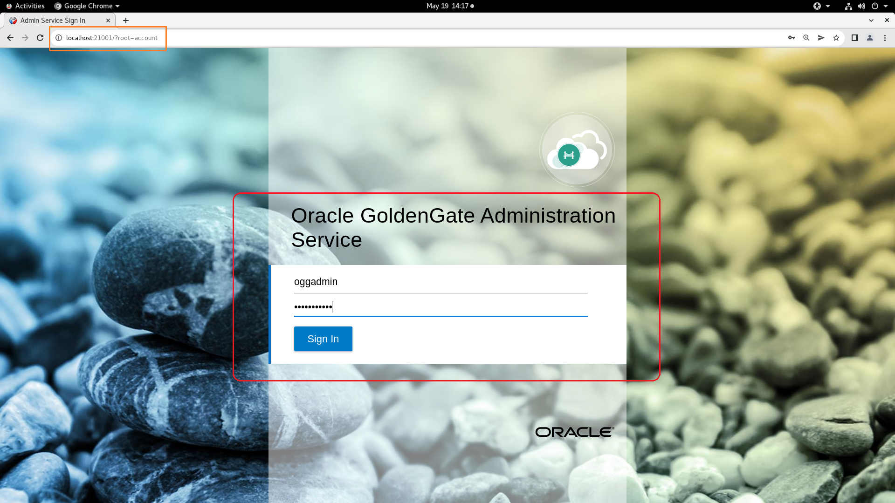
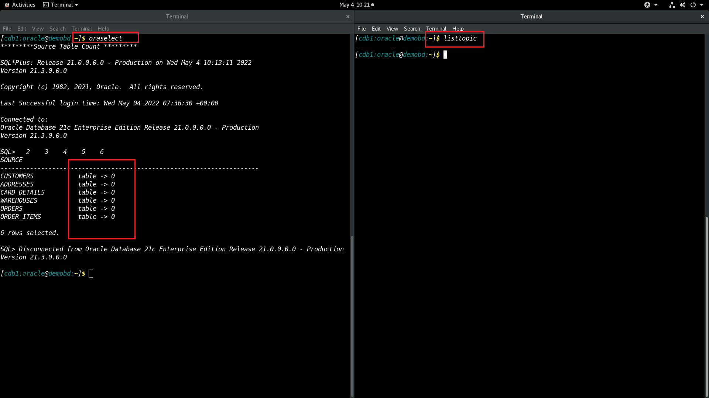

# Replicate the data from Oracle Database to Apache Kafka

## Introduction
This lab will demonstrate how to  ***Replicate from Oracle Database to Apache Kafka*** using **Oracle GoldenGate 21c Microservices** and **Oracle GoldenGate (MA) for Big Data**. All labs will use shell scripts to facilitate the building of the environment, at the same time provide insight into how to use the web pages and AdminClient.

In this lab, we will load data in the Oracle Database schema ***SOE***  of Pluggable Database ***PDB***. GG extract process ***EXTORA*** will capture the changes from Oracle Database and write them to the local trail file ***et***. From the Distribution Service, path ***SRC2TGT*** will route the trail file  ***et*** to target GoldenGate (MA) for Big Data Receiver Service as ***rt***. The replicat process ***REPKAFKA*** will read the remote trail files ***rt***, act as a producer and write the messages to an auto-created topic for each table in the source database.

Estimated Time: 30 minutes

#### Lab Architecture


### Objectives
In this lab you will learn:
-  How to reset the GoldenGate configuration.
-  How to create an extract for the source database and a path to distribute the trail to target deployment. 
-  How to configure the GoldenGate for Kafka as a target.
-  How to validate the GoldenGate configuration for Kafka as a target.

### Prerequisites
This Workshop assumes you have:
- An Oracle account
- You have completed:
    - Lab: Initialize Environment

## Task 1: GoldenGate configuration reset

1.  Open a terminal and type ***kafkareset*** to reset the lab.

    ```
    <copy>kafkareset</copy>
    ```
    
    

## Task 2: GoldenGate configuration for Oracle Database as source
1.  Open  a terminal and type ***extract*** to create a extract ***EXTORA*** and a path ***SRC2TGT*** through cURL commands.
    
    

2. To validate the GoldenGate process, sign in to the GoldenGate Administration Service console from the below URL with username as ***oggadmin*** and password as ***Gg.Rocks_99***.

    Click here : [http://localhost:21001/?root=account](http://localhost:21001/?root=account)

    ***username***

    ```
    <copy>oggadmin</copy>
    ```
    ***password***

    ```
    <copy>Gg.Rocks_99</copy>
    ```



3. On welcome pages, a green tick with the name ***EXTORA*** indicates extract is up and running on the  Administration Service console.
        
4. Navigate to Distribution Service, to validate the path ***SRC2TGT***. 
        

    ***Source deployment completed!***
## Task 3: GoldenGate Configuration for Kafka as Target

1. To create a replicat, sign into Administration service of GoldenGate (MA) of Big Data from the below URL with username as ***oggadmin*** and password as ***Gg.Rocks_99*** 

    Click here : [http://localhost:22001/?root=account](http://localhost:22001/?root=account)


    ***username***

    ```
    <copy>oggadmin</copy>
    ```
    ***password***

    ```
    <copy>Gg.Rocks_99</copy>
    ```
    

2. On the welcome page, Click on the **Add Replicat** (***+*** plus icon) to get the replicat creation wizard.

    Replicat is a process that delivers data to a target database. It reads the trail file on the target database, reconstructs the DML or DDL operations, and applies them to the target database.

    

3. On Add Replicat page, choose the replicat type as ***Classic Replicat*** and Click on **Next** to proceed to Replicat Options.    

    

4. On the Replicat Options wizard, enter the replicat process name as ***REPKAFKA***.
    Process Name ***REPKAFKA*** will be 8-character user-defined.

    ```
    <copy> REPKAFKA </copy>
    ```

    

5. Enter trail Name as ***rt***, which is received from the source ***Oracle database***.

    Trail Name:***rt***   
    

6. Type ***Kafka*** on **Target** field and choose ***kafka***  from the top-down menu.Click ***Next*** To navigate **parameter** tab.

    

7. In the Parameter File text area, replace ***`MAP *.*, TARGET *.*; `***with the following script:

    ```
    <copy>
    MAP PDB.SOE.*, TARGET SOE.*;
    </copy>
    ```
    


8. On the **Properties File** tab, append the location of the **Kafka Producer Configuration File** as ***`/u01/kafka/custom_kafka_producer.properties`***.

   The Kafka Handler provides functionality to resolve the topic name and the message key at runtime using a template configuration value. Templates allow you to configure static values and keywords. Keywords are used to dynamically resolve content at runtime and inject that resolved value into the resolved string.
   
    ```
    <copy>
    /u01/kafka/custom_kafka_producer.properties
    </copy>
    ```

9. Set the Kafka topic name as ***${tableName}*** by passing an argument to **gg.handler.kafkahandler.topicMappingTemplate=**.

    The Kafka Connect Handler provides functionality to resolve the topic name and the message key at runtime using a template configuration value. Templates allow you to configure static values and keywords. Keywords are used to dynamically replace the keyword with the context of the current processing. Templates are applicable to the following configuration parameters:

    gg.handler.name.topicMappingTemplate

    gg.handler.name.keyMappingTemplate

    ```
    <copy>
    ${tableName}
    </copy>
    ```

    

10. Add the **Classpath Configuration** for the Kafka properties file and click tab ***Create and Run***to complete the replication creation wizard.

    Two things must be configured in the gg.classpath configuration variable so that the Kafka Connect Handler can connect to Kafka and run. The required items are the Kafka Producer properties file and the Kafka client JARs. The Kafka client JARs must match the version of Kafka that the Kafka Connect Handler is connecting to. The recommended storage location for the Kafka Producer properties file is the Oracle GoldenGate dirprm directory.

    The default location of the Kafka Connect client JARs is the Kafka_Home/libs/* directory.

    The gg.classpath variable must be configured precisely. Pathing to the Kafka Producer properties file should contain the path with no wildcard appended. The inclusion of the asterisk (*) wildcard in the path to the Kafka Producer properties file causes it to be discarded. Pathing to the dependency JARs should include the * wildcard character to include all of the JAR files in that directory in the associated classpath. Do not use *.jar.


    ```
    <copy>
    /u01/kafka/libs/* 

    </copy>
    ```
    
12. The Replicat ***REPKAFKA*** creation is completed. The green check mark will show that Replicat ***REPKAFKA*** is up and running.
    

    ***Target deployment completed!***
## Task 4: Validation of the GoldenGate configuration for Kafka as target

1. Open a ***New Window*** on the terminal, and move the terminal side by side as shown below.

    On the left side terminal, enter ***oraselect*** will display the row counts of all the tables of the Oracle(Source) Database.

    ```
    <copy>
    oraselect
    </copy>
    ```
    On the right side terminal, enter ***listtopic*** will display the row counts of all the topics of the Kafka(target) database.

    ```
    <copy>
    listtopic
    </copy>
    ```

    


2. Enter ***loaddml*** on any one of the terminals to load the data to Oracle Database tables.

    ```
    <copy>
    loaddml
    </copy>
    ```

    

3. To validate the GoldenGate replication, execute the below commands.

    On the left side terminal, enter ***oraselect*** will display the row counts of all the tables of the Oracle(Source) Database.


    ``` 
    <copy>
    oraselect
    </copy>
    ```


    On the right side terminal, enter ***listtopic*** will list all the topics in an Apache Kafka (target) and run the console consumer client to read the events, which are replicated from GoldenGate (MA) for Big Data. 

    ```
    <copy>
    listtopic
    </copy>
    ```
    
        
    
 4. Execute the below command to consume messages from an Apache Kafka Topic.
    
    ```
    <copy>
    consumetopic <topic_name>
    </copy>
    ```
    EXAMPLE:
    ```
    <copy>
    consumetopic ORDERS
    </copy>
    ```
    
    
5. Replication statistics can be viewed from the GoldenGate Microservice console also. Click on the replicat name ***REPKAFKA*** and navigate to ***statistics***.


    


## Summary
To summarize, you loaded data in the Oracle database ***SOE*** schema of Pluggable database ***PDB***. The GG extract process ***EXTORA*** captured the changes from the Oracle database and wrote them to the local trail file ***et***. From the Distribution Service, path ***SRC2TGT*** will route the trail file  ***et*** to target GoldenGate (MA) for Big Data Receiver Service as ***rt***. The replicat process ***REPKAFKA*** will read the remote trail files***rt***, act as a producer, and write the messages to an auto-created topic for each table in the source database.

You may now proceed to the next lab.

## Learn More

* [Oracle GoldenGate for Big Data 21c ](https://docs.Oracle.com/en/middleware/goldengate/big-data/21.1/index.html)
* [ Using the Kafka Handler ](https://docs.Oracle.com/en/middleware/goldengate/big-data/21.1/gadbd/using-kafka-handler.html)

## Acknowledgements
* **Author** - Madhu Kumar S, AppDev and Integration, Bangalore Tech Team
* **Contributors** - Madhu Kumar S, Brian Elliott, Deniz Sendil, Meghana Banka, Rene Fontcha 
* **Last Updated By/Date** - Madhu Kumar S, AppDev and Integration, Bangalore Tech Team, August 2022
