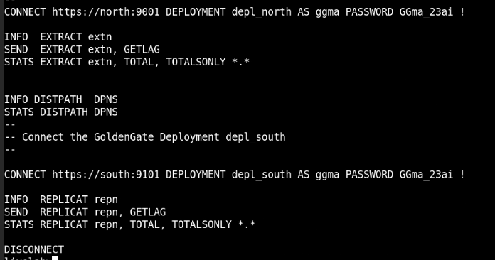

# Set Up Data Replication using OBEY Scripts


## Introduction

This lab describes how to use the OBEY script <code>add_replication_reporting.oby</code> to automatically set up an Oracle GoldenGate processes on the source (<b>depl_north</b>) and target (<b>depl_south</b>) deployments.

The source deployment <b>depl_north</b> is connected to the <b>DBNORTH</b> PDB and the <b>depl_south</b> deployment is connected to the <b>DBSOUTH</b> PDB. The deployments are already created in the environment. 

Estimated Time: 10 minutes

### Objectives

In this lab, you will:

* Run the <code>add_replication_reporting.oby </code> script, to automatically perform the following tasks:

   * Add USERIDALIAS for the PDBs, DBNORTH and DBSOUTH on the CDB to connect to the Database instance
   *	Add supplemental logging to the database schema hr (SCHEMATRANDATA) on the source PDB, <b>DBNORTH</b>
   *	Add heartbeat and checkpoint tables on the source and target PDBs.
   *	Add Extract on the source PDB, <b>DBNORTH</b>
   *	Set up the Extract parameter file
   *	Add Distribution Path from source to target systems
   *	Add Replicat on the target PDB, <b>DBSOUTH</b>
* View the Standard Business Report based on sample data.
* Delete the data replication environment using the <code>delete_replication_reporting.oby</code> script.


### Prerequisites
This lab assumes that you have completed the tasks in **initial-setup**


## Task 1: Set Up Data Replication

  Make sure you are in the /scripts/UseCases/01_Reporting/ directory and perform the following tasks:
   
   1. Move to the <code>AdminClient</code> directory and list the content for this directory:
     
   2. Run the <code>add_replication_reporting.oby</code> script:
      
       ```
         <copy>
            ./add_replication_reporting.oby
         </copy>
       ```
      The script connects to the source and target PDBs and creates the Extract, Replicat, Distribution Path processes. 
   
   
    
## Task 2: Check the Status of Processes

   Check if the Oracle GoldenGate processes are up and running:

   1. Start the Admin Client:
   
       ```
         <copy>
            adminclient
         </copy>
       ```
  
   2. Connect to the deployment:

      ```
      <copy>
       CONNECT https://south:9101 DEPLOYMENT depl_south AS ggma Password GGma_23ai !
      </copy>
      ```

   3. Connect to **pdbwest** using alias **ggwest**

      ```
       <copy>
        DBLOGIN USERIDALIAS ggsouth
       </copy>
      ```

   4. Run the following command:
     
      ```
      <copy>
       INFO EXTRACT extn
      </copy>
      ```
      The output displays the status of the Extract process. You can run the INFO ALL command to check the status of all processes. 
   
   5. You can also run the OBEY script to check these details, as follows: 

   ```
      <copy>
       ./check_replication_reporting.oby
      </copy>
   ```
   
   This script includes the following processes:
        


## Task 3: Delete the Replication Environment

After you check the reports, delete the data replication environment. This is required for testing the other scripts. 

   1. 

      ```
      <copy>
       
      </copy>
      ```
   2. Run the commmand:

      ```
      <copy>
       
      </copy>
      ```
     The output displays 3 update records:

      

   3. Exit from admin client:

      ```
      <copy>
       EXIT
      </copy>
      ```
   


## Learn More
* [Using the Admin Client](https://docs.oracle.com/en/middleware/goldengate/core/21.3/coredoc/administer-microservices-command-line-interface.html#GUID-0403FAF0-B2F7-48A0-838F-AB4421E5C5E2)


## Acknowledgements
* **Author** - Preeti Shukla, Principal UA Developer, Oracle GoldenGate User Assistance
* **Contributors** -  Volker Kuhr, Alex Lima, Madhusudhan Rao
* **Last Updated By/Date** - Preeti Shukla, April 2023
