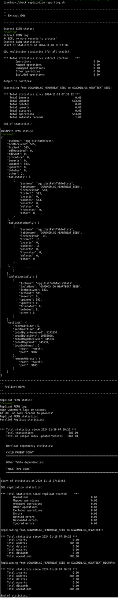
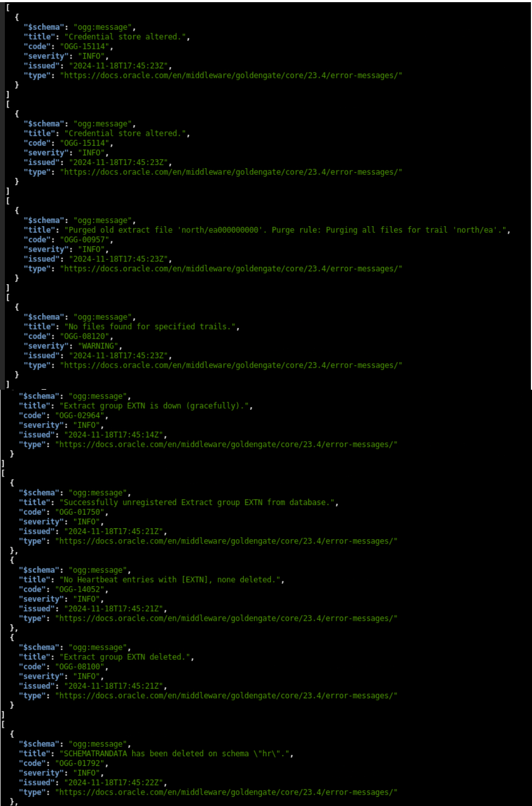

# Set Up Data Replication using cURL Scripts

## Introduction

This lab describes how to use the <code>add_replication_reporting_curl.sh script</code> to automatically set up an Oracle GoldenGate processes on the source (<code>depl_north</code>) and target (<code>depl_south</code>) deployments. 

The source deployment <code>depl_north</code> is connected to the <b>DBNORTH</b> PDB and the <b>depl_south</b> deployment is connected to the <b>DBSOUTH</b> PDB. The deployments are already created in the environment. 

Estimated Time: 10 minutes

### Objectives
In this lab, you will: 

* Run the <code>add_replication_reporting_curl.sh script</code>, which would automatically perform the following tasks:

   * Add USERIDALIAS for the PDBs, DBNORTH and DBSOUTH on the CDB to connect to the Database instance
   *	Add supplemental logging to the database schema hr (SCHEMATRANDATA) on the source PDB, <b>DBNORTH</b>
   *	Add heartbeat and checkpoint tables on the source and target PDBs.
   *	Add Extract on the source PDB, <b>DBNORTH</b>
   *	Set up the Extract parameter file
   *	Add Distribution Path from source to target systems
   *	Add Replicat on the target PDB, <b>DBSOUTH</b>
* View the Standard Business Report based on sample data.
* Delete the data replication environment using the <code>delete_replication_reporting_curl.sh</code> script.


### Prerequisites

This lab assumes that you have completed the tasks in **initial-setup**


## Task 1: Set Up Data Replication

   Make sure you are in the /scripts/UseCases/01_Reporting/ directory and perform the following tasks:
   
   1. Move to the <code>REST-API</code> directory and list the content for this directory:
     
      ```
      <copy>
      cd REST-API
      ls-l
      </copy>
      ```
      The components of the directory are listed as shown in the following image:

       

   2. Run the <code>add_replication_reporting_curl.sh script</code> script:

       ```
       <copy>
        ./add_replication_reporting_curl.sh
       </copy>
       ```
      The output for this command looks similar to the following:

      

      After this script runs successfully, data replication begins between source and target.
   
   In the next task, you will be able to test the sample report based on the transactions committed when the add_replication_reporting_curl.sh script runs.
         
         
    
## Task 2: View the Sample Standard Business Report

   To view the Standard Report based on sample data:

   1. Run the check_replication_reporting.sh script
   
       ```
         <copy>
            ./check_replication_reporting.sh
         </copy>
       ```
  
   2. You can view the report containing statistics for the committed transactions, as shown in the following image:
  
   


## Task 3: Delete the Data Replication Setup

   It's essential to delete the setup to be able to test the same feature using the OBEY commands within the same environment. 
   
   You can also use this script to test and delete data replication environments in your own test enviornment. 
   
   To delete the setup:

   1. Run the script <code>delete_replication_reporting_curl.sh</sh>
   
   ```
     <copy>
      ./delete_replication_reporting_curl.sh  
     </copy>
   ```
   
   2. You can verify that the environment was deleted after you the following message on the screen:
   
   

   After you delete the environment, you can use the script anytime to rebuild the environment or copy the script to apply in your own test environment.

   
## Learn More

* [Oracle GoldenGate Microservices REST APIs](https://docs.oracle.com/en/middleware/goldengate/core/23/oggra/)
* [Command Line Reference Guide](https://docs.oracle.com/en/middleware/goldengate/core/23/gclir/index.html)


## Acknowledgements
* **Author** - Preeti Shukla, Principal UA Developer, Oracle GoldenGate User Assistance
* **Contributors** -  Volker Kuhr, Nick Wagner
* **Last Updated By/Date** - Preeti Shukla, 2024
