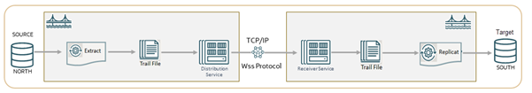

# Introduction

## About this Workshop                             
The labs in this workshop are designed to test the standard reporting feature available with Oracle GoldenGate 23ai. In this tutorial, you will run automated scripts for configuring a sample data replication environment and use it to generate standard business reports.  

The scripts allow you to use two approaches for configuring Oracle GoldenGate data replication and generate standard business reports:

•	Using cURL
•	Using OBEY Commands from the Admin Client

Estimated Workshop Time: 2 hour

### About Oracle GoldenGate Standard Reporting
Oracle GoldenGate is a change data capture software that provides real-time data integration and replication.

The Admin Client command line utility available with Microservices Architecture can be used to run OBEY commands to set up various data replication scenarios. 

The cURL commands are also a way to set up data replication by calling Oracle GoldenGate REST APIs.

The following diagram shows a standard unidirectional replication in Oracle GoldenGate. In the standard Oracle GoldenGate configuration, an Extract sends captured data using the Distribution Service over TCP/IP to a trail on the target system, where it is received by the Receiver Service and stored until processed by the Replicat.

  

### Objectives

In this workshop, you will:
  
  * Run cURL commands using an automation script to set up unidirectional data replication.
  * Access the Standard Business Reports based on preloaded data.
  * Delete the data replication environment using cURL commands in another automation script.
  * Run the OBEY commands using an automation script to set up unidirectional data replication.
  * Access View the Standard Business Reports
  * Delete the data replication environment using OBEY commands in another automation script
  

### Prerequisites
The following are required to complete this lab:

    * Prior knowledge of using cURL commands 
    * Prior knowledge of Oracle GoldenGate  
      commands

Watch this short video on adding Database Credentials, Extract, and Replicat Processes in Oracle GoldenGate Microservices on MySQL database:

  [Add credentials, extract, and replicat in GoldenGate](youtube:h0J070YIK4E)

You may now **proceed to the next lab**.

## Learn More

Use these links to get more information about Oracle GoldenGate 23ai:

* [Oracle GoldenGate Microservices Documentation](https://docs.oracle.com/en/middleware/goldengate/core/23/coredoc/index.html)

* [Command Line Interface Reference for Oracle GoldenGate](https://docs.oracle.com/en/middleware/goldengate/core/23/gclir/add-credentials.html#GUID-6D80E0AC-9497-46C6-92D9-2F817D04BD99)

## Acknowledgements
* **Author** - Preeti Shukla, Principal UA Developer, Oracle GoldenGate User Assistance
* **Contributors** - Volker Kuhr
* **Last Updated By/Date** - Preeti Shukla, October 2024
