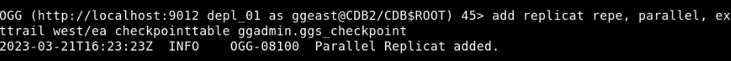
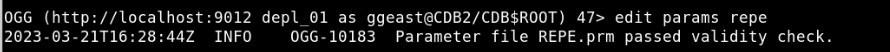
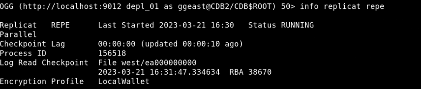

# Add Replicat

## Introduction
Use ADD REPLICAT to create a Replicat process.

This lab describes how to add a Replicat process (`repe`), which then delivers the change data from the trail file (`ea`) created by the Extract, to the target database.
Replicat reads the trail file on the target database, reconstructs the DML or DDL operations, and applies them to the target database.

Estimated Time: 10 minutes

### Objectives
In this lab, you will:
* Create a Replicat process.
* Edit the parameter file.
* Start the Replicat process.

### Prerequisites
This lab assumes that you have:
- The appropriate database privileges to be able to execute the commands in the Admin Client.
- Completed the tasks in **Lab - Configure Database Credentials, Trandata, Heartbeat, and Checkpoint Tables**.
- Completed the tasks in **Lab - Add Extract**.

## Task 1: Add a Replicat

To add a Replicat:

1. Test the database connection by running the following command:
    ```
    <copy>
    DBLOGIN USERIDALIAS ggeast
    </copy>
    ```

2. Add a Replicat:
    ```
    <copy>
    ADD REPLICAT repe, PARALLEL, EXTTRAIL west/ea CHECKPOINTTABLE ggadmin.ggs_checkpoint
    </copy>
    ```
    `repe` is the name of the Replicat that is being created.

    
    
    **Note**: Replicat **repe** is processing the trails from the **pdbwest** pluggable database, so the Replicat looks into the **/west** directory. 

3. Edit the parameter file:
    ```
    <copy>
    EDIT PARAMS repe
    </copy>
    ```
    The Replicat parameter file is as follows:
    ```
    <copy>
    REPLICAT repe
    USERIDALIAS ggeast DOMAIN OracleGoldenGate
    SOURCECATALOG pdbwest
    MAP hr.*, TARGET hr.*;
    </copy>
    ```

4. Save the Replicat parameter file and exit the editor. 

   

5. Start the REPLICAT:
    ```
    <copy>
    START REPLICAT repe
    </copy>
    ```
  The REPLICAT process **repe** starts.

5. To confirm the REPLICAT has started successfully, run the following command:
    ```
    <copy>
    INFO REPLICAT repe
    </copy>
    ```
The following output should be displayed:



You may now **proceed to the next lab**.

## Learn More
* [Using the Admin Client](https://docs.oracle.com/en/middleware/goldengate/core/21.3/coredoc/administer-microservices-command-line-interface.html#GUID-0403FAF0-B2F7-48A0-838F-AB4421E5C5E2)
* [ADD REPLICAT](https://docs.oracle.com/en/middleware/goldengate/core/21.3/gclir/add-replicat.html#GUID-540A171A-71C2-49C3-964E-5D57B27257D4)

## Acknowledgements
* **Author** - Preeti Shukla, Principal UA Developer, Oracle GoldenGate User Assistance
* **Contributors** -  Volker Kuhr
* **Last Updated By/Date** - Preeti Shukla, April 2023
