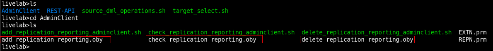
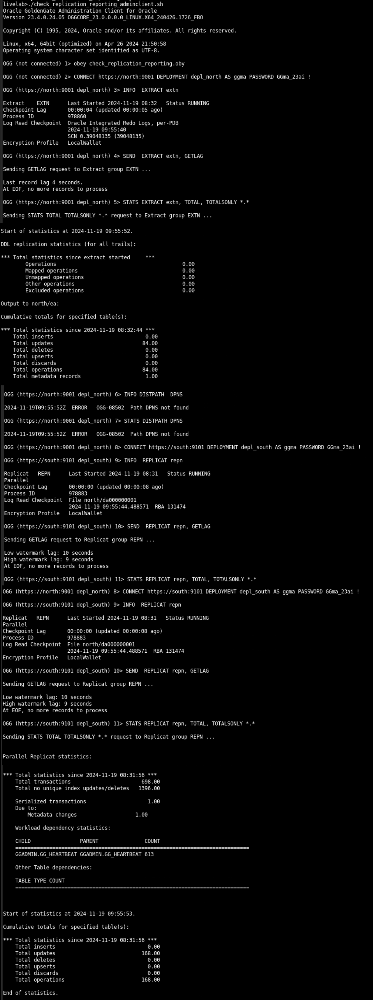

# Set Up Unidirectional Data Replication Using the Admin Client


## Introduction

This lab describes how run OBEY scripts using the Admin Client to set up complete data replication processes across a unidirectional topology. 

The following diagram shows a standard unidirectional replication in Oracle GoldenGate. In the standard Oracle GoldenGate configuration, an Extract sends captured data using the Distribution Service over TCP/IP to a trail on the target system, where it is received by the Receiver Service and stored until processed by the Replicat.

  


### Lab Configuration

The `add_replication_reporting_adminclient.sh` script automates the set up of Oracle GoldenGate processes on the source (`depl_north`) and target (`depl_south`) deployments.

The `check_replication_reporting_adminclient.sh` script automates tasks to check the business reports containing statistical data sorted for Daily, Weekly, and Monthly transactions. 

The `source_dml_operations.sh` script is used to add records to the source database and view the Extract Statistics to confirm that the committed transactions were captured. Then you can run the `source_target_select.sh` script to replicate the changes on the target database. Delete the data replication environment using the `delete_replication_reporting_adminclient.sh`.

The source deployment `depl_north` is connected to the `DBNORTH` PDB and the `depl_south` deployment is connected to the `DBSOUTH` PDB. The deployments are already created in the environment. 

Estimated Time: 10 minutes

### Objectives

In this lab, you will:

* Run the `add_replication_reporting_adminclient.sh` script, to automatically perform the following tasks:

      * Add USERIDALIAS for the PDBs, DBNORTH and DBSOUTH on the CDB to connect to the Database instance
      *	Add supplemental logging to the database schema hr (SCHEMATRANDATA) on the source PDB, `DBNORTH`
      *	Add heartbeat and checkpoint tables on the source and target PDBs.
      *	Add Extract on the source PDB, `DBNORTH`
      *	Set up the Extract parameter file
      *	Add Distribution Path from source to target systems
      *	Add Replicat on the target PDB, `DBSOUTH`
* View the Standard Business Report based on sample data.
* Delete the unidirectional data replication environment using the `delete_replication_reporting_adminclient.sh` script.


### Prerequisites
This lab assumes that you have completed the tasks in <b>Task 1: Load the Oracle GoldenGate and Database Environment</b> of <b>Lab 3: Initialize Environment</b>.


## Task 1: Set Up Unidirectional Data Replication

  Make sure you are in the <code>/scripts/UseCases/01_Reporting/</code> directory and perform the following tasks:
   
   1. Move to the <code>AdminClient</code> directory and list the content for this directory:

       
     
   2. Run the <code>add_replication_reporting_adminclient.sh</code> script:
      
       ```
         <copy>
            ./add_replication_reporting_adminclient.sh
         </copy>
       ```
      
      This script contains the following commands:
      
          ```
           <copy>
              cp EXTN.prm  /u01/app/oracle/deployments/depl_north/etc/conf/ogg/
              
              cp REPN.prm  /u01/app/oracle/deployments/depl_south/etc/conf/ogg/
            
              echo "obey add_replication_reporting.oby" | adminclient
           </copy>
         ```
      When you run this script, it copies the Extract and Replicat parameter files to Oracle GoldenGate deployment's configuration directory and then runs the `add_replication_reporting.oby` script to set up data replication.

      The <code>add_replication_reporting.oby</code> script, which is inside the <code>add_replication_reporting_adminclient.sh</code> script, runs after the Extract and Replicat parameter files are copied to the Oracle GoldenGate deployment's <code>/etc/conf/ogg/</code> directory. 
      
      After the script runs successfully, you will be able to see the Extract and Replicat processes in running state and also view the reports for the committed transactions.  

         
## Task 2: Add DML to Source Database and Check the Target Database for Replicated Records

   To check if the transactions committed to the source database are catpured correctly by the Extract, you can run the script `source_dml_operations.sh`
   
   This script is located in `scripts/UseCases/01_Reporting` folder. 

   Run this script as mentioned in the following steps to add DML to the DBNORTH database and check that Extract has captured DML operations:

   1. Navigate to the folder `/scripts/UseCases/01_Reporting`.

   2. Run the script to add DML operations on the source database:

      ```
      <copy>
   
        ./ source_dml_operations.sh
   
      </copy>
      
      ```
   3. Check the Extract statistics to view that the DML operations was captured using the steps given in Task 3.

   4. Run the script <code>source_target_select.sh</code> to check  the data on the target PDB `DBSOUTH`. This script contains queries to view the PDB records that were updated for the specific tables. 

    ```
     <copy>

        ./source_target_select.sh

     </copy>

    ```
    The script output lists the `DBSOUTH` tables `hr.employees`. You should be able to view the updated table columns that were updated on the source PDB, `DBNORTH`. 


## Task 3: Check the Business Reports

   The statistical reports for the committed transactions are available in the data replication environment. You can also use the <code>./check_replication_reporting_adminclient.sh script</code> script to view the entire business report on the command line. To check these reports, perform the following steps:

   1. Run the <code>./check_replication_reporting_adminclient.sh script</code> to run the OBEY commands in the <code>check_replication_reporting_reporting.oby</code> script:
   
       ```
         <copy>
            ./check_replication_reporting_adminclient.sh
         </copy>
       ```
  
   The output of the report is shown in the following image:

   

## Task 4: Check the Standard Reports in Oracle GoldenGate Microservices Web Interface

   The statistical reports that you viewed in Task 2 can also be viewed from the web interface. Following are the steps to access these reports from the web interface:

   1. Open a web browser within the environment, and enter the URL of the Administration Service: 

      https://north:9001

   2. Log in to the Administration Service using the credentials ggma/GGma_23ai.
   3. From the left-navigation pane, expand the list of Extracts and select the EXTN Extract.
   4. Click the Statistics option to view the report. 

## Task 5: Delete the Replication Environment

   After you check the reports, you can delete the data replication environment using the . This is required for testing the other scripts. 

   1. Make sure you are in the <code>/home/oracle/scripts/UseCases/01_Reporting/AdminClient</code> directory.

   2. Run the following commmand:

      ```
      <copy>
         ./ delete_replication_reporting.sh
      </copy>
      ```
   This script consists of the command to run the <code>delete_replication_reporting.oby</code> script. 
 
      ```
         <copy>
         rm -f /u01/app/oracle/deployments/depl_north/etc/conf/ogg/EXTN.prm

         rm -f /u01/app/oracle/deployments/depl_south/etc/conf/ogg/REPN.prm
         
         echo "obey delete_replication_reporting.oby" | adminclient
      </copy>
      ```
   After you run this script, the data replication environment is deleted.  


## Learn More

* [Oracle GoldenGate Microservices REST APIs](https://docs.oracle.com/en/middleware/goldengate/core/23/oggra/)
* [Command Line Reference Guide](https://docs.oracle.com/en/middleware/goldengate/core/23/gclir/index.html)


## Acknowledgements
* **Author** - Preeti Shukla, Principal UA Developer, Oracle GoldenGate User Assistance
* **Contributors** -  Volker Kuhr, Nick Wagner
* **Last Updated By/Date** - Preeti Shukla, 2025
