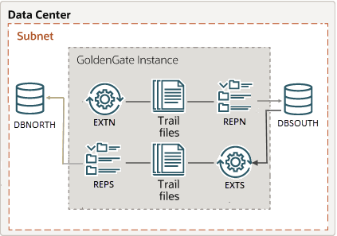

# Set Up an Active-Active Bidirectional Data Replication Using the Admin Client

## Introduction

An active-active bidirectional replication implies that both data sources and targets (PDBs in this case), have the potential to send updates to each other. There are two data sources with identical sets of data that can be changed by application users on either side. Oracle GoldenGate replicates transactional data changes from each database to the other to keep both sets of data current.

This lab describes how to use the Admin Client commands wrapped in an OBEY file to automatically set up Oracle GoldenGate processes on the `depl_north` and `depl_south` deployments in a bidirectional replication environment. 

While the `depl_north` deployment is connected to the `DBNORTH` PDB, the `depl_south` deployment is connected to the `DBSOUTH` PDB. The deployments are already created in the environment. 




Estimated Time: 20 minutes

### Objectives
In this lab, you will: 

* Run the `add_replication_ActiveActive_adminclient.sh` script, which would automatically perform the following tasks:

      * Add USERIDALIAS for the PDBs, DBNORTH and DBSOUTH on the CDB to connect to the database instance
      *	Add supplemental logging to the database schema `hr` (SCHEMATRANDATA) on `DBNORTH` and `DBSOUTH` PDBs
      *	Add heartbeat and checkpoint tables on the both PDBs.
      *	Add Extract on the `DBNORTH` and `DBSOUTH`
      *	Set up the Extract parameter file
      *	Add Distribution Path from `DBNORTH` to `DBSOUTH` and then from `DBSOUTH` to `DBNORTH`
      *	Add Replicat on the both PDBs, `DBNORTH` and `DBSOUTH`
* View the lag statistics and check for data duplication.
* Delete the data replication environment using the `delete_replication_ActiveActive_adminclient.sh` script.


### Prerequisites

This lab assumes that you have completed the tasks in <b>"Task 1: Load the Oracle GoldenGate and Database Environment"</b> in <b>Lab 3: Initialize Environment</b>. 

If you witness the error "ORA-65162: Password of the common database user has expired", then perform the following steps to increase the validity of the password:

1. From the command prompt, log in to SQL Server:
   
   ```
    <copy>

      sqlplus / as sysdba
   
    </copy>

2. On the SQL prompt, run the following commands to set the password validity for the :
   
   ```
    <copy>
      
      alter session set container = DBNORTH;
      create profile ggprofile limit password_life_time unlimitedd;
      alter user ggadmin profile ggprofile;
      select username, expiry_date from DBA_USERS where username = 'GGADMIN';
    
    </copy>
    
   ```
   Perform the same steps for `DBSOUTH`:

   ```
    <copy>
      
      alter session set container = DBSOUTH;
      create profile ggprofile limit password_life_time unlimitedd;
      alter user ggadmin profile ggprofile;
      select username, expiry_date from DBA_USERS where username = 'GGADMIN';
    
    </copy>
    
   ```

## Task 1: Set Up Active Active Data Replication
 
Follow these steps to set up Oracle GoldenGate processes for bidirectional replication:   
   
   1. From the command prompt, navigate to the `scripts/UseCases/02_BiDirectional/AdminClient` directory and list the content of this directory:
     
      ```
      <copy>
      
         cd scripts/UseCases/02_BiDirectional/AdminClient
      
      </copy>
      ```
                 
   2. Run the `add_replication_ActiveActive_adminclient.sh` script:

       ```
       <copy>
        
        ./add_replication_ActiveActive_adminclient.sh
       
       </copy>
       ```
      This script creates the Extract and Replicat processes on `depl_north` and `depl_south` deployments. In the following steps, you will work with the Admin Client to edit the parameter files for the Extract and Replicat processes for `depl_north` and `depl_south` deployments. 

   3. Start the Admin Client from the command prompt.
      
      ```
      <copy>
      
         adminclient
      
      </copy>
      ```
      
   3. Connect to the `depl_north` deployment to check that the parameter files, `EXTN` and `REPS` have been copied correctly.
      
      ```
        <copy>

        CONNECT https://north:9001 deployment depl_north as ggma password GGma_23ai ! 
        
        </copy>
      
      ```

   4. View the parameter files for Extract (`EXTN`) and Replicat (`REPN`) processes using the `EDIT PARAMS` command.

       ```
      <copy>
         
         EDIT PARAMS EXTN
      
      </copy>

      ```
      The output should display the following:

      ```
      <copy>

       EXTRACT extn
       USERIDALIAS ggnorth
       EXTTRAIL north/ea
       
       TRANLOGOPTIONS EXCLUDETAG +
       
       DDL INCLUDE MAPPED
       DDLOPTIONS REPORT
       
       REPORTCOUNT EVERY 10 MINUTES, RATE
       WARNLONGTRANS 15MINUTES, CHECKINTERVAL 5MINUTES
       
       TABLE hr.*;
       
      </copy>
    
      ```
   
   5. Exit the editor and run the EDIT PARAMS command for the Replicat process `REPS`. The output should display the following:

      ```
      <copy>
      
       REPLICAT reps
       USERIDALIAS ggsouth DOMAIN OracleGoldenGate
      
       DDLOPTIONS REPORT
       DDLERROR DEFAULT, DISCARD
      
       REPORTCOUNT EVERY 10 MINUTES, RATE
      
       REPERROR (DEFAULT, DISCARD)
       MAP hr.*, TARGET hr.*;
      
      </copy>
      
      ```

  5. Connect to the `depl_south` deployment to update the Extract (`EXTS.prm`) and Replicat (`REPS.prm`) parameter files.
      
      ```
        <copy>
         
          CONNECT https://south:9101 deployment depl_south as ggma password GGma_23ai ! 
        
        </copy>
      
      ```

  6. Edit the parameter files for Extract (`EXTS`) and Replicat (`REPS`) processes using the EDIT PARAMS command.

      ```
      <copy>
         
         EDIT PARAMS EXTN
      
      </copy>
      ```

   You can copy the parameter file values from the following snippets. The `EXTS.prm` Extract parameter file is as follows:
      
      ```
      <copy>
       
       EXTRACT exts
       USERIDALIAS ggnorth
       EXTTRAIL north/ea
       
       TRANLOGOPTIONS EXCLUDETAG +
      
       DDL INCLUDE MAPPED
       DDLOPTIONS REPORT
       
       REPORTCOUNT EVERY 10 MINUTES, RATE
       WARNLONGTRANS 15MINUTES, CHECKINTERVAL 5MINUTES

       TABLE hr.*;
       
      </copy>
      
      ```
   The Replicat parameter file for REPS.prm is as follows:

      ```
      <copy>
      
      REPLICAT reps
      USERIDALIAS ggnorth DOMAIN OracleGoldenGate
      
      DDLOPTIONS REPORT
      DDLERROR DEFAULT, DISCARD
      
      REPORTCOUNT EVERY 10 MINUTES, RATE
      
      REPERROR (DEFAULT, DISCARD)
      MAP hr.*, TARGET hr.*;
      
      </copy>
    
     ``` 
   
   
  7. To check if the Orcle GoldenGate processes are running successfully on both deployments, run the following commands on both the `depl_north` and `depl_south` deployments: 
     
<b>Note:</b> Connect to the deployment using the `CONNECT` command before running the `INFO ALL` and `INFO DISTPATH ALL` commands.
    
The following command displays the Extract and Replicat proceses running on the `depl_north` and  deployment, if you are connected to the `depl_north` deployment.
      
    ```
     <copy>
       
       INFO ALL
      
     </copy> 
      
    ```
 The following command displays the DISTPATHS running on the `depl_north` deployment.
    
    ```
     <copy>
      
        INFO DISTPATH ALL
      
     </copy>
      
    ```
    
In the next task, you will be able to test the sample report based on the transactions committed when the `add_replication_activeactive_adminclient.sh` script runs.

## Task 2: Add DML to DBNORTH and DBSOUTH PDBs and Check the PDBs for Committed Transactions

In this task, you will use the `dbnorth_dml_operations.sh` and `dbsouth_dml_operations.sh` scripts to automatically add DML records to the `DBNORTH` and `DBSOUTH` PDBs, respectively. 

Verify that the Extract processes on `DBNORTH` and `DBSOUTH` databases are working correctly. 

Run the following scripts to add DML to the `DBNORTH` and `DBSOUTH` databases and check that Extract has captured DML operations:

1. Navigate to the folder: `scripts/UseCases/02_BiDirectional`.

2. Run the script to add DML operations on the `DBNORTH` database:

   ```
   <copy>
    
      ./dbnorth_dml_operations.sh
    
    </copy>
   
   ```
3. Run the script to add DML operations on the `DBSOUTH` database:

   ```
   <copy>
   
      ./dbsouth_dml_operations.sh
   
   </copy>
   
   ```
  To check if the bidirectional replication works correctly, you need to prevent data looping or data duplication while replicating data from `DBNORTH` to `DBSOUTH` and from `DBSOUTH` to `DBNORTH`. To check this, you will run the `dbnorth_select.sh` script to view the INSERTS, UPDATES, DELETES records from `DBNORTH` to `DBSOUTH` and then run the `dbsouth_select.sh` script to view the INSERTS, UPDATES, and DELETES from `DBSOUTH` to `DBNORTH`.

4. Run the script `dbnorth_select.sh`. This script contains queries to check the data on the <b>hr.employees</b> table of the PDB, `DBNORTH`.

   ```
     <copy>

        ./dbnorth_select.sh
     
     </copy>

   ```
  You should be able to view the updated table columns in the table. 

5. Run the script `dbsouth_select.sh` to check the data on the `DBSOUTH` database.

   ```
     <copy>
    
       ./dbsouth_select.sh

     </copy>
   ```
This script displays the content of the  `DBSOUTH` database tables <b>hr.employees</b>. You should be able to view the updated table columns that were updated on the `DBSOUTH` database.
                  
    
## Task 3: Check the Statistics in Oracle GoldenGate Microservices Web Interface

The statistical reports that you viewed in Task 2 can also be viewed from the web interface. Following are the steps to access these reports from the web interface:

1. Open a web browser within the environment, and enter the URL of the Administration Service: 

   https://north:9001

2. Log in to the Administration Service using the credentials <b>ggma/GGma_23ai</b>.

3. From the left-navigation pane, expand the list of Extracts and select the <b>EXTN</b> Extract.

4. Click the <b>Statistics</b> option to view the report.

5. Repeat the steps 1 to 4 for the 

## Task 4: View the Active Active Replicat Using Statistics for Oracle GoldenGate Processes

After adding records, you can view the Extract Statistics to confirm that the committed transactions were captured. The `check_replication_activeactive.sh` script allows you to view the statistics for different Oracle GoldenGate processes.  

To view the Standard Report based on sample data:

   1. Run the `check_replication_activeactive_adminclient.sh` script
   
       ```
         <copy>
         
            ./check_replication_activeactive_adminclient.sh
         
         </copy>
       
       ```
      
      The output for this script shows various detiails. You can view these details to verify that the bidirectional replication is working.

   2. Observe the Extract and Replicat statistics to see the INSERTS, UPDATES, and DELETES of records. If the replication occurred correctly, then the Replicat statistics would have same the same number of INSERTS, UPDATES, and DELETES, as the Extract statistics.

## Task 5: Delete the Bidirectional Replication Setup

   After testing the active-active bidirectional scenario, you must remove this replication setup so that you can test other topologies and environments available in this system. 
   
   To delete this environment, use the `delete_replication_activeactive_adminclient.sh`. You can also use this script to test and delete data replication environments in your own test enviornment. 
   
   To delete the setup:

   1. Run the script `delete_replication_activeactive_adminclient.sh`.
   
      ```
        <copy>
       
           ./delete_replication_activeactive_adminclient.sh  
       
        </copy>
      
      ```
   
   2. You can verify that the environment was deleted by connecting to the deployment and running the `INFO ALL` command on `depl_north` deployment.

      ```
        <copy>
        
          adminclient
          
        </copy>
      ```
      Now run the `CONNECT` command to connect to `depl_north`:

      ```
       <copy>
       
          CONNECT https://north:9001 deployment depl_north as ggma password GGma_23ai ! 
       
       </copy>
     
      ```
   3. Run the `INFO ALL` command and `INFO DISTPATH ALL` commands after connecting to the deployment. These commands display the message `"No processes found"`, if the Extract, Replicat processes have been deleted successfully.

   4. Repeat steps 2 and 3 for the `depl_south` deployment.
   
   After you delete the environment, you can use the script `add_replication_activeactive_adminclient.sh` again to rebuild the environment or copy the script to apply in your own test environment. 


## Learn More

* [Oracle GoldenGate Microservices REST APIs](https://docs.oracle.com/en/middleware/goldengate/core/23/oggra/)
* [Command Line Reference Guide](https://docs.oracle.com/en/middleware/goldengate/core/23/gclir/index.html)
*[Oracle GoldenGate Microservices Architecture Solutions](https://docs.oracle.com/en/middleware/goldengate/core/23/ggsol/)


## Acknowledgements
* **Author** - Preeti Shukla, Principal UA Developer, Oracle GoldenGate User Assistance
* **Contributors** -  Volker Kuhr
* **Last Updated By/Date** - Preeti Shukla, 2025
