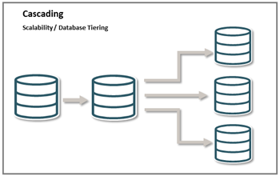

# Configure a Cascading Replication Topology Using Admin Client


Oracle GoldenGate supports cascading synchronization, which means that Oracle GoldenGate propagates data changes from one database to a second transitional database, and then on to a third database.



In a typical cascading configuration: 

* An Extract on the initial database or PDB, writes captured data to a local trail, and a Distribution Path sends the data to a remote trail on the transitional system in the cascade.

* On the second host system, Replicat applies the data to the local database or PDB.

* Another Extract on that same system captures the data from the local database and writes it to a local trail.

* A distribution path (DISTPATH) sends the data to a remote trail on the final system in the cascade, where it is applied to the local database or PDB by another Replicat.

This configuration can be used to perform data filtering and conversion if the character sets on all systems are identical. If character sets differ, then a data pump cannot perform conversion between character sets, and you must configure Replicat to perform the conversion and transformation on the target.

### Cascading Configuration in this Lab

For setting up replication across a Cascading topology, there are some preset configurations. The following diagram depicts the initial, intermediate, and final databases that have been set up for testing the Cascading replication. 


From this diagram, you can deduce the following: 

* The `depl_north` deployment captures from `DBNORTH` and connects to the `depl_south` deployment on another intermediate host machine. 

* The Replicat process on `depl_south`, replicates to the `DBSOUTH` database.  

* The Extract process, EXTS, in `depl_south` captures the replicated data and writes it to the local trail and transfer to the Replicat `REPS` on the `depl_west` deployment.


Estimated Time: 10 minutes

### Objectives

The objective of this tutorial is to:

* Show the use of data replication in a cascading topology.

* Run the automation scripts to set up the Oracle GoldenGate processes in `depl_north`, `depl_west`, and `depl_south` deployments. 

* Test the output to show replication across the environment connected using a Cascading topology configuration.

### Prerequisites

This lab assumes that you have completed the tasks in **initial-setup**.

## Task 1: Set Up Oracle GoldenGate Processes Across Multiple Deployments on Different Databases

   To set up the Extract, Replicat, Distribution Path, and Receiver Path processes across deployments, follow these steps:

   1. Navigate to the `scripts/UseCases/03_Cascading/AdminClient` directory. You will see the script `add_replication_cascading_admin-client.sh`.

   2. Run this script using the following command:

      ```
        <copy>
           ./add_replication_cascading_admin-client.sh
   
        </copy>
      ```
      This script automatically creates the Extract, Replicat, DISTPATH processes for all three deployments. The following processes are created on the `depl_north`, `depl_south`, and `depl_west` deployments:

      * On `depl_north`:
         * `EXTN` Extract process
         * `DPNS` DISTPATH process
      * On `depl_south`:
         * `EXTS` Extract process
         * `REPN` Replicat process
         * `DPSW` DISTPATH
      * On `depl_west`:
        * `REPS` Replicat process 
   3. Check that the processes are running successfully, using the following commands:

      a. Connect to `depl_north` deployment:
          
         
         <copy>
          
          CONNECT https://north:9001 DEPLOYMENT depl_north AS ggma PASSWORD GGma_23ai !
   
         </copy>
          
         
         
      b. Run the `INFO ALL` and `INFO DISTPATH ALL` commands: 
         
         
          <copy>
            INFO ALL   
          </copy>
         
        
      Make sure that the `EXTN` process is in `RUNNING` state.

          
         <copy>
           INFO DISTPATH ALL   
         </copy>
          
      Make sure that the `DPNS` process is in `RUNNING` state.
      
## Task 2: Add DML to DBNORTH PDBs

    

      
      