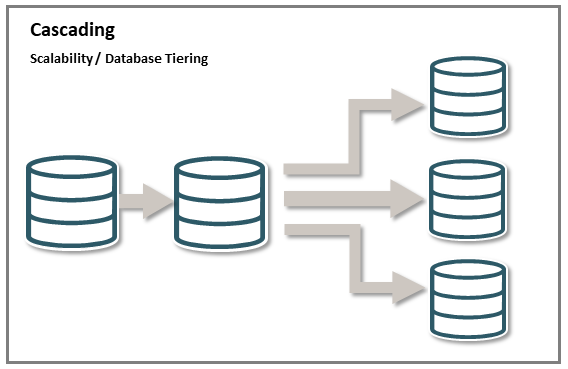
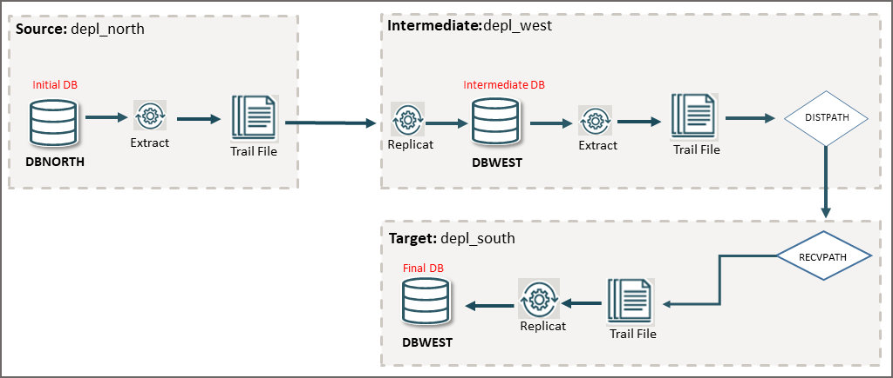
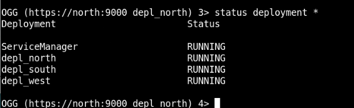
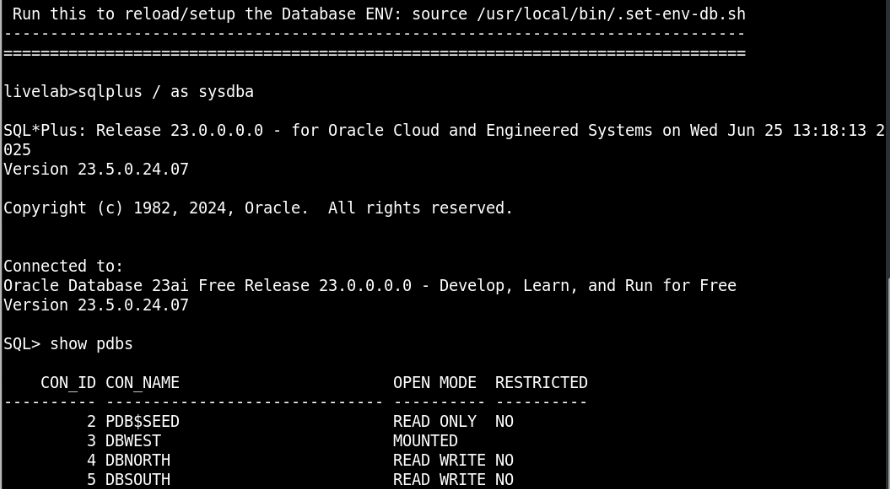
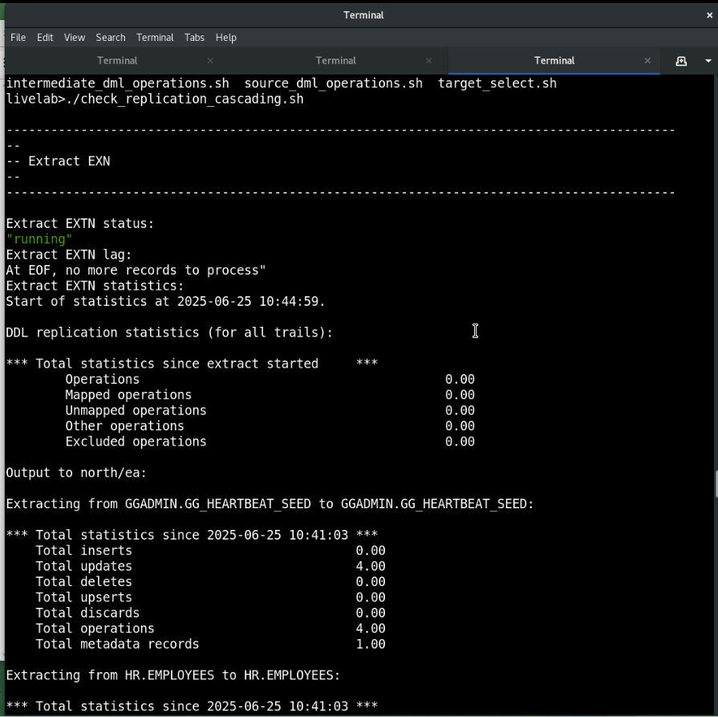

# Set Up a Cascading Replication Environment Using REST API  


## Introduction

Oracle GoldenGate supports cascading synchronization, which means that Oracle GoldenGate propagates data changes from one database to a second transitional database, and then on to a third database.



In a typical cascading configuration: 

* An Extract on the initial database or PDB, writes captured data to a local trail, and a Distribution Path sends the data to a remote trail on the transitional system in the cascade.

* On the second host system, Replicat applies the data to the local database or PDB.

* Another Extract on that same system captures the data from the local database and writes it to a local trail, which then gets replicated to the target database by the Replicat process on the target deployment.

This configuration can be used to perform data filtering and conversion if the character sets on all systems are identical. If character sets differ, then a data pump cannot perform conversion between character sets, and you must configure Replicat to perform the conversion and transformation on the target.

### Cascading Configuration in this Lab

For setting up replication across a Cascading topology, there are some preset configurations. The following diagram depicts the initial, intermediate, and final databases that have been set up for testing the Cascading replication. 



From this diagram, you can deduce the following: 

* The `depl_north` deployment captures from `DBNORTH` and connects to the `depl_south` deployment on another intermediate host machine. 
* The Replicat process on `depl_south`, replicates to the `DBSOUTH` database.  
* The Replicat process on `depl_south`, replicates to the `DBSOUTH` database.  
* The Extract process, EXTS, in `depl_south` captures the replicated data and writes it to the local trail and transfer to the Replicat `REPS` on the `depl_west` deployment.  


Estimated Time: 10 minutes

### Objectives

The objective of this tutorial is to:

* Show the use of data replication in a cascading topology.

* Run the automation scripts to set up the Oracle GoldenGate processes in `depl_north`, `depl_south`, and `depl_west` deployments. 

* Test the output to show replication across the environment connected using a Cascading topology configuration.

### Prerequisites

This lab assumes that you have completed the tasks in <b>"Task 1: Load the Oracle GoldenGate and Database Environment"</b> in <b>Lab 3: Initialize Environment</b>. 

### Tip

If you see the error ORA-00257 Archiver Error, then run the following script to remove redundant archive log files from the system and run the application seamlessly:

1. Navigate to the `scripts/misc' directory.
2. Run the `rman_delete_archivelog.sh` script. 

After you run this script, you would be able to continue to run the scripts successfully.

## Task 1: Set Up Oracle GoldenGate Processes Across Multiple Deployments on Different PDBs

   To set up the Extract, Replicat, Distribution Path, and Receiver Path processes across deployments, follow these steps:

   1. Navigate to the `scripts/UseCases/03_Cascading/REST-API` directory. You will see the script `add_replication_cascading_curl.sh`.

   2. Run this script using the following command:

      ```
        <copy>
           ./add_replication_cascading_curl.sh
   
        </copy>
      ```  
   
     This script automatically creates the Extract, Replicat, DISTPATH processes for all three deployments. The following processes are created on the `depl_north`, `depl_south`, and `depl_west` deployments:
   
         * On `depl_north`:
            * `EXTN` Extract process
            * `DPNS` DISTPATH process
         * On `depl_south`:
            * `EXTS` Extract process
            * `REPN` Replicat process
            * `DPSW` DISTPATH
         * On `depl_west`:
           * `REPS` Replicat process 
      
    3. Run the Admin Client using the command `adminclient`. 
      
    4. Check that all three deployments are running by accessing the Service Manager:
         
         a. Connect to Service Manager from the `depl_north` deployment:
   
            <copy>
              
              connect https://north:9000 deployment depl_north as ggma password GGma_23ai !
   
            </copy>
         
         b. Run the following command to know the status of all the deployments:
   
            <copy>
              
              status deployment *
   
            </copy>
   
            The output should be similar to the following:
   
            
   
      5. Check that the Extract, Replicat, and DISTPATH processes are running successfully for each deployment, using the following commands:
   
         a. Connect to `depl_north` deployment and check that the processes are running:
             
            
            <copy>
             
             CONNECT https://north:9001 DEPLOYMENT depl_north AS ggma PASSWORD GGma_23ai !
   
             DBLOGIN USERIDALIAS ggnorth
   
             INFO ALL
             
             INFO DISTPATH ALL
           </copy>
                    
            
         b. Check the parameter file for the Extract, EXTN. In case, it is not set up, then create the EXTN.prm file using the EDIT PARAMS command: 
            
            
             <copy>
               EDIT PARAMS EXTN.prm   
             </copy>
            
           
            Enter the parameters for `EXTN` parameter file:
   
            <copy>
         
               EXTRACT extn
               USERIDALIAS ggnorth
               EXTTRAIL north/ea
               
               DDL INCLUDE MAPPED
               DDLOPTIONS REPORT
               
               REPORTCOUNT EVERY 10 MINUTES, RATE
               WARNLONGTRANS 15MINUTES, CHECKINTERVAL 5MINUTES
               
               TABLE hr.*;
                
            </copy>
             
         c. Connect to `depl_south` deployment and check that the processes are running:
             
            
            <copy>
             
             CONNECT https://south:9101 DEPLOYMENT depl_south AS ggma PASSWORD GGma_23ai !
   
             DBLOGIN USERIDALIAS ggsouth
   
             INFO ALL
             
             INFO DISTPATH ALL
   
           </copy>
         
         d. Check the parameter file for the Replicat `REPN` and Extract `EXTS` are set up. In case, it is not set up, then create the `EXTS.prm` file using the `EDIT PARAMS` command: 
            
            
             <copy>
               EDIT PARAMS EXTS.prm   
             </copy>
            
           
         Enter the parameters for `EXTS` parameter file:
   
            <copy>
         
               EXTRACT exts
               USERIDALIAS ggsouth
               EXTTRAIL south/ea
               
               DDL INCLUDE MAPPED
               DDLOPTIONS INCLUDETAG 00
               DDLOPTIONS REPORT
               
               REPORTCOUNT EVERY 10 MINUTES, RATE
               WARNLONGTRANS 15MINUTES, CHECKINTERVAL 5MINUTES
                
               TABLE hr.*;
                        
            </copy>
         
         Run the `EDIT PARAMS REPN.prm` command and enter the parameters for the `REPN` parameter file:
   
            <copy>
            
             REPLICAT repn
             USERIDALIAS ggsouth DOMAIN OracleGoldenGate
             
             DDLOPTIONS REPORT
             DDLERROR DEFAULT, DISCARD
            
             REPORTCOUNT EVERY 10 MINUTES, RATE
             
             REPERROR (DEFAULT, DISCARD)
             MAP hr.*, TARGET hr.*;
            
           </copy>
   
      e.  Connect to `depl_west` deployment and check that the processes are running:
             
            
            <copy>
             
             CONNECT https://west:9201 DEPLOYMENT depl_west AS ggma PASSWORD GGma_23ai !
   
             DBLOGIN USERIDALIAS ggwest
   
             INFO ALL
             
             INFO DISTPATH ALL
   
            </copy>
           
           If your DBLOGIN USERIDALIAS ggwest command fails, then check that the `DBWEST` PDB is `OPEN`. If it is not open, then you need to open the PDB. Use the following commands to check and open the `DBWEST` PDB, if required:

           <copy>
              sqlplus / as sysdba

              show PDBs
           <copy>

           If you see an output similar to the following, then you will need to open the `DBWEST` PDB:

           

           Run the following command to bring up the `DBWEST` PDB:

            <copy>
           
              alter pluggable database dbwest open;
            
            </copy>
       
          From the Admin Client, connect to the `DBWEST` deployment and run the `DBLOGIN USERIDALIAS ggwest` command. You should be able to successfully connect to the PDB.

           
      f. Check the parameter file for the Replicat `REPS` is set up. In case, it is not set up, then create the `REPS.prm` file using the `EDIT PARAMS REPS.prm` command:
          
          <copy>
            REPLICAT reps
            USERIDALIAS ggwest DOMAIN OracleGoldenGate
            
            DDLOPTIONS REPORT
            DDLERROR DEFAULT, DISCARD
            
            REPORTCOUNT EVERY 10 MINUTES, RATE
            
            REPERROR (DEFAULT, DISCARD)
            MAP hr.*, TARGET hr.*;
   
          </copy>
   
## Task 2: Add DML to DBNORTH PDBs
    Adding DML to the source PDB, DBNORTH, would allow you to test that the data is captured from DBNORTH. In the following steps, you will run the `source_dml_operations` script to perform DML transactions on DBNORTH:
    
       1. Navigate to the `scripts/UseCases/03_Cascading` directory and run the `ls` command. You should be able to see the `source_dml_operations` script.
    
       2. Run the `source_dml_operations` script:
    
          ```
             <copy>
                
                ./source_dml_operations
    
             </copy>
          
          ``` 
      
   This script commits transactions to the `hr.employees` table on `DBNORTH`.

   <b>NOTE</b>: If you get the error "ORA-65162: Password of the common database user has expired", then run <b>Task 3 Prevent the Database Password from Expiring</b> from the <b>Initialize Environment</b> lab.
    
## Task 3: Check Committed Transactions on Intermediate (DBSOUTH) and Final (DBWEST) PDBs 
    
In case of a cascading environment, a successful replication is one where the committed source transactions are replicated to the intermediate and then to the target data source, correctly. In this task, you will be able to check that the committed transactions in `DBNORTH` are replicated to `DBSOUTH` and then eventually to `DBWEST`:
    
1. Navigate to the `scripts/UseCases/03_Cascading` directory and run the `ls` command. You should be able to see the `check_replication_cascading.sh` script.
    
2. Run this script:
          
     ```
       <copy>
               
        ./check_replication_cascading.sh
          
       </copy>
     ```
    
 This script shows the statistical details of the DML operations, similar to the following:
    
    
   
       
As you can see in the output, the transactions were captured from `DBNORTH` and replicated to `DBSOUTH` and then to `DBWEST`. 
    
## Task 4: Delete the Data Replication Environment
    
After testing the cascading data replication scenario, remove this replication setup so that you can test other topologies and environments available in this system. 
       
To delete this environment, use the `delete_replication_cascading_curl.sh`. You can also use this script to test and delete data replication environments in your own test enviornment. 
       
To delete the setup:
    
1. Run the script `delete_replication_cascading_curl.sh`.
       
     ```
       <copy>
        
         ./delete_replication_cascading_curl.sh  
           
       </copy>
          
     ```
      
2. You can verify that the environment was deleted by connecting to the deployment and running the `INFO ALL` command on `depl_north` deployment.
    
     ```
       <copy>
          
         adminclient
              
       </copy>
 
     ```
          
 Now, run the `CONNECT` command to connect to `depl_north`:
    
     ```
       <copy>
          
         CONNECT https://north:9001 deployment depl_north as ggma password GGma_23ai ! 
           
       </copy>
         
     ```
3. Run the `INFO ALL` command and `INFO DISTPATH ALL` commands after connecting to the deployment. These commands display the message `"No processes found"`, if the Extract, Replicat processes have been deleted successfully.
    
4. Repeat steps 2 and 3 for the `depl_south` and `depl_west` deployments.
       
After you delete the environment, you can use the script `add_replication_cascading_adminclient.sh` again to rebuild the environment or copy the script to apply in your own test environment.

## Learn More

* [Oracle GoldenGate Microservices REST APIs](https://docs.oracle.com/en/middleware/goldengate/core/23/oggra/)
* [Command Line Reference Guide](https://docs.oracle.com/en/middleware/goldengate/core/23/gclir/index.html)
* [Oracle GoldenGate Solutions Guide](https://docs.oracle.com/en/middleware/goldengate/core/23/ggsol/index.html)


## Acknowledgements
* **Author** - Preeti Shukla, Principal UA Developer, Oracle GoldenGate User Assistance
* **Contributors** -  Volker Kuhr
* **Last Updated By/Date** - Preeti Shukla, 2025
