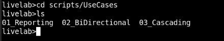

# Initialize environment

## Introduction
The livelab environment set up includes the following:

* 3 CDB databases (free edition) with 3 PDBs.
* One Oracle GoldenGate installation setup.
* The Service Manager manages three deployments: North, West, and South.
* All services, including database, database listener, and Oracle GoldenGate instances, which start when you start the LiveLab environment and run the given scripts.
* Scripts to set up complete data replication for various topologies using cURL commands.
* Scripts to set up complete data replication for various topologies using OBEY commands.

*Estimated Time*:  10 minutes

### Objectives
* Learn to use scripts to perform basic data replication configuration in Oracle GoldenGate 23ai with Oracle Database Free 23ai

* Allow users to copy the scripts and use them to test various tasks in their own environments.

### Preset Configurations in the Environment

The following table provides a snapshot of the available environment:

| Component | Name  | Description |
 -----------| ------- | -------------
| Server Names      | NORTH | north.livelabs.oraclevcn.com
|                   | SOUTH | south.livelabs.oraclevcn.com
| Database Type     | Oracle Database 23.5 Free Edition | Contains 1 CDB and 2 PDBs
| CDB Name   | FREE | CDB login details: 
|            |      |    Username/Password: sys/oracle4GG
| PDB Name   | DBNORTH | PDB login details: 
|            |      |   Username/Password: sys/oracle4GG
|PDB Name    | DBSOUTH | Login Details:  
|            |       |   Username/Password: sys/oracle4GG
|PDB Name    | DBWEST | PDB login details: Username/Password: sys/oracle4GG
Database Connections| | For DBNORTH: Username/Password: ggadmin@dbnorth/ggadmin 
|                   | | For DBSOUTH: Username/Password: ggadmin@dbsouth/ggadmin
|                   | | For DBWEST: Username/Password: ggadmin@dbwest/ggadmin
|Oracle GoldenGate | Service Manager | Port: 9000 
| ||Login Credentials:
| | | Username/Password: ggma/GGma_23ai
|Oracle GoldenGate | Deployment Name: depl_north | Port: 9000 to 9004 <br> </br> Login details: ggma/GGma_23ai 
| | Deployment Name: depl_south | Port: : 9100 to 9104 <br> </br> Login details: ggma/GGma_23ai
|

To set up unidirectional replication, the CDB contains DBNORTH (source) and DBSOUTH (target) pluggable databases.  

### Prerequisites
This lab contains the following tasks:

  - Lab: Understand the Directory Structure

  - Lab: Load the Oracle GoldenGate and Database Environment
  
## Task 1: Load the Oracle GoldenGate and Database Environment 

   1. Load the database environment by running the following command:
    
       ```
       <copy>
       source /usr/local/bin/.set-env-db.sh
       </copy>

       ```
   2. Enter the option 1 to select the FREE database option. This loads the database environment with settings for the required environment variables, Oracle Database, and Oracle GoldenGate directories.

   The following table lists the present environment variables for this tutorial:

   | Directory Name   |     Location         |
   | --------------     | ----------------     |
   | ORACLE_BASE      |  /opt/oracle         |
   | ORACLE_HOME      | /opt/oracle/product/23ai/dbhomeFree                                |
   | TNS_ADMIN        | ~/network/admin      |
   | OGG_HOME         | /u01/app/oracle/product/23.0.0.0/gghome_1                         |
   | Deployments      | /u01/app/oracle/deployments/{ServiceManager, depl_north, depl_south}                               |
   | Certificates     | ~/certs              |
         
   
## Task 2: Understand the Directory Structure

The directory structure lists the location of different automation scripts that would be used in this tutorial. 

   | Topology     |     REST-API Automation      |    Admin Client Automation
   |-----------   |------------------------------|-------------------------
   |Unidirectional |~\scripts\UseCases\01_Reporting\REST-API |~\scripts\UseCases\01_Reporting\AdminClient                  
   |Bidirectional  |~\scripts\UseCases\02_Bidirectional\REST-API| ~\scripts\UseCases\02_BiDirectional\AdminClient                        
   |Cascading      |~\scripts\UseCases\03_Cascading\REST-API | ~\scripts\UseCases\03_Cascading\AdminClient                        

To view the directories mentioned in this table:

1. From the home directory, run the `ls -l` command to view the subdirectories. The output displays the `scripts` directory.

2.  Move to the <code>scripts/UseCases</code> directory

       ```
       <copy>
       cd scripts/UseCases
       ls       
       </copy>

       ```

       This displays the different topology use case directories that would be used in the upcoming labs, as shown in the following image.
      

    You will be able to see the scripts that are going to be used in the labs for data replication and testing purposes.

You may now **proceed to the next lab** to run cURL scripts to set up data replication and test for standard reporting.

## Learn More

* [Oracle GoldenGate Microservices REST APIs](https://docs.oracle.com/en/middleware/goldengate/core/23/oggra/)
* [Command Line Reference Guide](https://docs.oracle.com/en/middleware/goldengate/core/23/gclir/index.html)

## Acknowledgements
* **Author** - Preeti Shukla
* **Contributors** - Preeti Shukla, Volker Kuhr
* **Last Updated By/Date** - Preeti Shukla, Oracle GoldenGate, Principal UAD, March 2025
