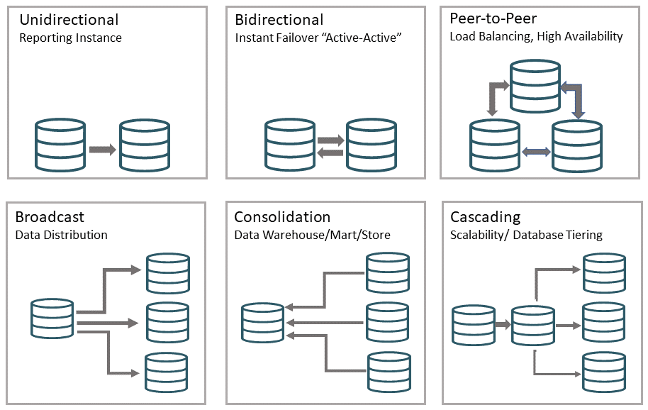

# Introduction

## About this Workshop                             
The labs in this workshop are designed to test the standard reporting feature available with Oracle GoldenGate 23ai. In this tutorial, you will run automated scripts for configuring a sample data replication environment and use it to generate standard business reports.  

The scripts allow you to use two approaches for configuring Oracle GoldenGate data replication and generate standard business reports:

•	Using cURL

•	Using OBEY Commands from the Admin Client

Estimated Workshop Time: 2 hour

### About Oracle GoldenGate Topologies

There are many different topologies in real world scenarios and various combinations of topologies used as per organization requirements. Oracle GoldenGate manages to bring similarities between these configurations, making administration easier irrespective of the topology.

### Objectives

In this workshop, you will:
  
  * Run cURL commands using an automation script to set up unidirectional data replication.
  * Access the Standard Business Reports based on preloaded data.
  * Delete the data replication environment using cURL commands in another automation script.
  * Run the OBEY commands using an automation script to set up unidirectional data replication.
  * Access View the Standard Business Reports
  * Delete the data replication environment using OBEY commands in another automation script
  

### Prerequisites
The following are required to complete this lab:

* Prior knowledge of using cURL commands 
* Prior knowledge of Oracle GoldenGate Admin Client commands

You may now **proceed to the next lab**.

## Learn More

Use these links to get more information about Oracle GoldenGate 23ai:

* [Oracle GoldenGate Microservices Documentation](https://docs.oracle.com/en/middleware/goldengate/core/23/coredoc/index.html)

* [Command Line Interface Reference for Oracle GoldenGate](https://docs.oracle.com/en/middleware/goldengate/core/23/gclir/add-credentials.html#GUID-6D80E0AC-9497-46C6-92D9-2F817D04BD99)

* [Oracle GoldenGate REST API Documentation](https://docs.oracle.com/en/middleware/goldengate/core/23/oggra/)

## Acknowledgements
* **Author** - Preeti Shukla, Principal UA Developer, Oracle GoldenGate User Assistance
* **Contributors** - Volker Kuhr
* **Last Updated By/Date** - Preeti Shukla, October 2024
