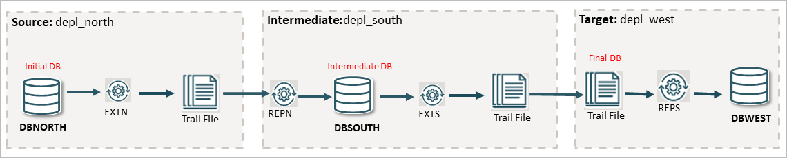

# Set Up a Many to One (Consolidated) Replication Environment Using REST API  

## Introduction

### Many to One Configuration in this Lab

 

From this diagram, you can deduce the following: 

* The `depl_north` deployment captures from `DBNORTH` and connects to the `depl_south` deployment on another intermediate host machine. 
* The Replicat process on `depl_south`, replicates to the `DBSOUTH` database.  
* The Replicat process on `depl_south`, replicates to the `DBSOUTH` database.  
* The Extract process, EXTS, in `depl_south` captures the replicated data and writes it to the local trail and transfer to the Replicat `REPS` on the `depl_west` deployment.  

Estimated Time: 10 minutes

### Objectives

The objective of this tutorial is to:

* Show the use of data replication in a cascading topology.

* Run the automation scripts to set up the Oracle GoldenGate processes in `depl_north`, `depl_south`, and `depl_west` deployments. 

* Test the output to show replication across the environment connected using a Cascading topology configuration.

### Prerequisites

This lab assumes that you have completed the tasks in <b>"Task 1: Load the Oracle GoldenGate and Database Environment"</b> in <b>Lab 3: Initialize Environment</b>. 

## Task 1: Set Up Oracle GoldenGate Processes Across Multiple Deployments on Different PDBs

   
   
## Task 2: Add DML to DBNORTH PDBs
   
    
## Task 3: Check Committed Transactions on Intermediate (DBSOUTH) and Final (DBWEST) PDBs 
    

    
## Task 4: Delete the Data Replication Environment
    

## Learn More

* [Oracle GoldenGate Microservices REST APIs](https://docs.oracle.com/en/middleware/goldengate/core/23/oggra/)
* [Command Line Reference Guide](https://docs.oracle.com/en/middleware/goldengate/core/23/gclir/index.html)
* [Oracle GoldenGate Solutions Guide](https://docs.oracle.com/en/middleware/goldengate/core/23/ggsol/index.html)

## Acknowledgements
* **Author** - Preeti Shukla, Principal UA Developer, Oracle GoldenGate User Assistance
* **Contributors** -  Volker Kuhr
* **Last Updated By/Date** - Preeti Shukla, 2025
