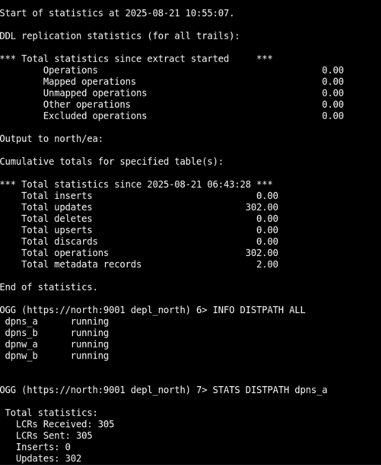

# Set Up a One to Many Replication Environment Using Admin Client


## Introduction
A data distribution configuration is a one-to-many configuration. Oracle GoldenGate supports synchronization of a source database to any number of target systems. Oracle GoldenGate supports like-to-like or heterogeneous transfer of data, with capabilities for filtering and conversion on any system in the configuration although support varies by database platform.

Broadcast topologies can include a mix of unidirectional use cases, including offloading of reporting, replication to a data warehouse, or sending data to a lower level environment. In most cases, administrators configure a single Extract process that writes to multiple trail files. Each trail file is used for a different target database. This reduces the overhead on the source database, and allows each target platform to receive just the data that it requires.


### One to Many Configuration in this Lab
In the following use case, a trail file is replicated across different destinations with the following conditions:

* One trail file is used to replicate across multiple destinations.
* Multiple Distribution Paths are configured to send the trail data with filtered options to specify which tables will be replicated on to a particular destination.
  


From this diagram, you can deduce the following: 

* The `depl_north` deployment captures from `DBNORTH` and connects to the `depl_south` and `depl_west` deployments.  
* The DISTPATH processes broadcasts the trail data to the `depl_west` and `depl_south` deployments.  


Estimated Time: 10 minutes

### Objectives

The objective of this tutorial is to:

* Showcase the broadcast topology with multiple DISTPATHS. 

* Run the automation scripts to set up the Oracle GoldenGate processes to configure an environment where trail data is distributed from source to multiple targets. 

* Run DML operations on source database to induce capturing of data.

* Check the statistics for DISTPATH processes to view the DML operations .


### Prerequisites

This lab assumes that you have completed the tasks in <b>"Task 1: Load the Oracle GoldenGate and Database Environment"</b> in <b>Lab 3: Initialize Environment</b>. 


## Task 1: Run the script to set up Oracle GoldenGate Processes Across Multiple Deployments on Different Databases

In this task, you will run the script to add Oracle GoldenGate Extract process and multiple distribution paths to the deployment, `depl_north`.

   1. Navigate to the directory where the Data Distribution scripts for Admin Client are located:

     <copy>
     
        cd scripts/UseCases/04_DataDistribution/AdminClient
     
     </copy>
   
   2. Run the script `add_replication_datadistribution_adminclient.sh`.

      <b>NOTE:</b> You may witness some errors similar to `The syntax for specifying authentication method using URI credentials is deprecated.`. This causes some distribution paths to not run. These errors occur because the `depl_west` deployment is not started when this script runs. You will need to manually start the `depl_west` deployment from the Service Manager to remove these errors.

   3. To start the `depl_west` deployment from the Service Manager, connect to Service Mananger from the Admin Client:
    
    ```
    <copy>
        
    #Run the adminclient command to start the session with Admin Client
        
        adminclient

        #Connect to the Service Manager 

        connect https://north:9000 deployment depl_north as ggma password GGma_23ai!

        #Check the status of the deployments from the Service Manager

        status deployment *

      </copy>
    
    ```

   4. If you notice that the `depl_west` deployment is not in `RUNNING` state, then start this deployment using the following commands:
   
     ``` 
      <copy>
       
         start deployment depl_west
      
      </copy>
     
     ```
    
   5. Re-check the status all the deployments:
         
     ```
       <copy>
        
         status deployment *
      
       </copy>
     ```
     At this point, all deployments should be in `RUNNING` state. 

   
   4. Run the following commands to check if the Extract process and the distribution path processes are running:

      ```
      <copy>
        
       #Check that the Extract process is running
                
       info all
        
       #Check that the Distribution Paths are running
         
       info distpath all
       
      </copy>
     
     ```  
   
At this point, the Extract process `EXTN` and the distribution paths `dpns_a`, `dpns_b`, `dpnw_a`, and `dpnw_b` should be running.

## Task 2: Add DML to the DBNORTH PDB

In this task, you will run the script that performs DML operations on the source database DBNORTH. 

   1. Navigate to the `scripts/UseCases/04_DataDistribution` directory.

   2. Run the script `./source_dml_operations.sh`.

After this script runs successfully, the DML operation would be comitted to the DBNORTH source database.

## Task 3: Check Replication from Source PDB (DBNORTH) to the Intermediate PDB (DBSOUTH)

In this task, you will check the status of the distribution paths to determine that the trail data is being broadcast across the two target deployments:

   1. From the `scripts/UseCases/04_DataDistribution/AdminClient` directory, run the `check_replication_datadistribution_adminclient.sh` script.

   2. After the scripts runs successfully, the status of the distribution paths is displayed. Check the status and notice LCR Received and LCRs Sent values. This implies that the trail data has been transmitted to the target deployments using the respective distribution paths allocated for each deployment. The following image is a sample of the statistical output of the status of the distribution paths:

   

   Alternatively, you can view the statistics from the web interface also, as shown in the following image:

   


## Task 4: Delete the Data Replication Environment

In this task, you will remove the data distribution replication environment. 

   1. From the `scripts/UseCases/04_DataDistribution/AdminClient` directory, run the `delete_replication_datadistribution_adminclient.sh` script.

   2. After running the script, connect to the `depl_north` deployment and check that all processes have been removed from the deployment.

      ```
       <copy>

       #Run the adminclient command to start the Admin Client session

        adminclient
       
       #Connect to the depl_north deployment
        
        connect https://north:9001 deployment depl_north as ggma password GGma_23ai!
       
       #Run the INFO command to check Extract process has been removed

        INFO ALL
       
       #Check that Distribution Path processes have been removed

        INFO DISTPATH ALL
      
      </copy>
     
     ```
    The output should display `No processes exist.`


## Learn More

* [Oracle GoldenGate Microservices REST APIs](https://docs.oracle.com/en/middleware/goldengate/core/23/oggra/)
* [Command Line Reference Guide](https://docs.oracle.com/en/middleware/goldengate/core/23/gclir/index.html)
* [Oracle GoldenGate Solutions Guide](https://docs.oracle.com/en/middleware/goldengate/core/23/ggsol/index.html)


## Acknowledgements
* **Author** - Preeti Shukla, Principal UA Developer, Oracle GoldenGate User Assistance
* **Contributors** -  Volker Kuhr
* **Last Updated By/Date** - Preeti Shukla, 2025


    

      
      