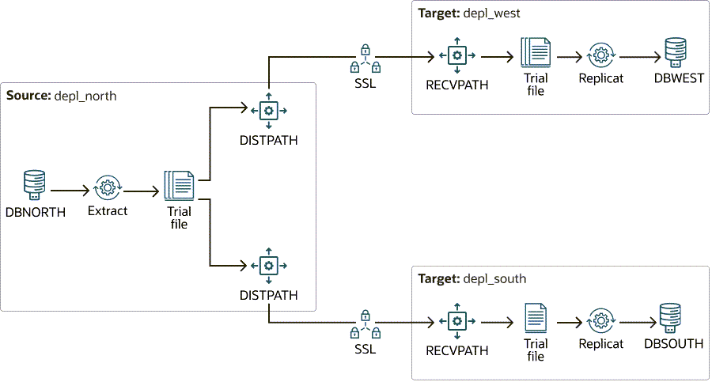

# Set Up a One to Many Replication Environment Using Admin Client

## Introduction
A data distribution configuration is a one-to-many configuration. Oracle GoldenGate supports synchronization of a source database to any number of target systems. Oracle GoldenGate supports like-to-like or heterogeneous transfer of data, with capabilities for filtering and conversion on any system in the configuration although support varies by database platform.

Broadcast topologies can include a mix of unidirectional use cases, including offloading of reporting, replication to a data warehouse, or sending data to a lower level environment. In most cases, administrators configure a single Extract process that writes to multiple trail files. Each trail file is used for a different target database. This reduces the overhead on the source database, and allows each target platform to receive just the data that it requires.

### One to Many Configuration in this Lab
In the following use case, a trail file is replicated across different destinations with the following conditions:

* One trail file is used to replicate across multiple destinations.
* Multiple Distribution Paths are configured to send the trail data with filtered options to specify which tables will be replicated on to a particular destination.
  

From this diagram, you can deduce the following: 

* The `depl_north` deployment captures from `DBNORTH` and connects to the `depl_south` deployment on another intermediate host machine. 
* The Replicat process on `depl_south`, replicates to the `DBSOUTH` database.  
* The Extract process, EXTS, in `depl_south` captures the replicated data and writes it to the local trail and transfer to the Replicat `REPS` on the `depl_west` deployment.

Estimated Time: 10 minutes

### Objectives

The objective of this tutorial is to:

* Show the use of data replication in a cascading topology.

* Run the automation scripts to set up the Oracle GoldenGate processes in `depl_north`, `depl_west`, and `depl_south` deployments. 

* Test the output to show replication across the environment connected using a Cascading topology configuration.

### Prerequisites

This lab assumes that you have completed the tasks in <b>"Task 1: Load the Oracle GoldenGate and Database Environment"</b> in <b>Lab 3: Initialize Environment</b>. 

## Task 1: Set Up Oracle GoldenGate Processes Across Multiple Deployments on Different Databases

   
## Task 2: Add DML to DBNORTH PDBs
   
   

## Task 3: Check Replication from Source PDB (DBNORTH) to the Intermediate PDB (DBSOUTH)

   

## Task 4: Delete the Data Replication Environment

## Learn More

* [Oracle GoldenGate Microservices REST APIs](https://docs.oracle.com/en/middleware/goldengate/core/23/oggra/)
* [Command Line Reference Guide](https://docs.oracle.com/en/middleware/goldengate/core/23/gclir/index.html)
* [Oracle GoldenGate Solutions Guide](https://docs.oracle.com/en/middleware/goldengate/core/23/ggsol/index.html)

## Acknowledgements
* **Author** - Preeti Shukla, Principal UA Developer, Oracle GoldenGate User Assistance
* **Contributors** -  Volker Kuhr
* **Last Updated By/Date** - Preeti Shukla, 2025

    

      
      