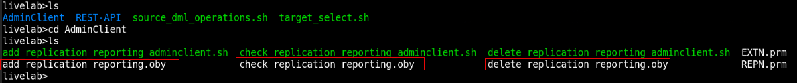
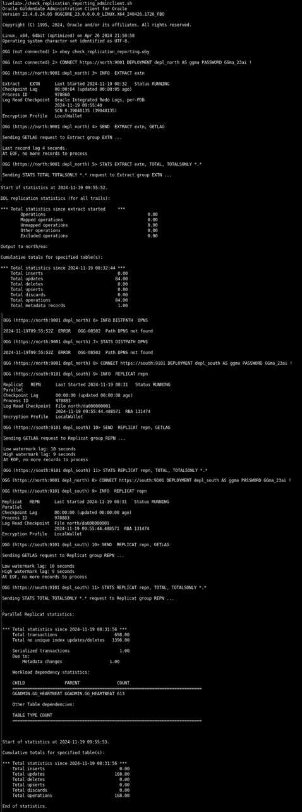

# Set Up Data Replication Using the Admin Client


## Introduction

This lab describes how to use Admin Client to run OBEY scripts `add_replication_reporting.oby`, which would automate the set up of Oracle GoldenGate processes on the source (`depl_north`) and target (`depl_south`) deployments. 

Check the business reports using the `check_replication_reporting.oby` script. You can use the `source_dml_operations.sh` script to add records to the source database and view the Extract Statistics to confirm that the committed transactions were captured. Then you can run the `source_target_select.sh` script to replicate the changes on the target database. Delete the data replication environment using the `delete_replication_reporting.oby`.

The source deployment `depl_north` is connected to the `DBNORTH` PDB and the `depl_south` deployment is connected to the `DBSOUTH` PDB. The deployments are already created in the environment. 

Estimated Time: 10 minutes

### Objectives

In this lab, you will:

* Run the <code>add_replication_reporting.oby </code> script, to automatically perform the following tasks:

   * Add USERIDALIAS for the PDBs, DBNORTH and DBSOUTH on the CDB to connect to the Database instance
   *	Add supplemental logging to the database schema `hr` (SCHEMATRANDATA) on the source PDB, `DBNORTH`
   *	Add heartbeat and checkpoint tables on the source and target PDBs.
   *	Add Extract on the source PDB, `DBNORTH`
   *	Set up the Extract parameter file
   *	Add Distribution Path from source to target systems
   *	Add Replicat on the target PDB, `DBSOUTH`
* View the Standard Business Report based on sample data.
* Delete the data replication environment using the commands in the `delete_replication_reporting.oby` script.


### Prerequisites
This lab assumes that you have completed the tasks in <b>"Task 1: Load the Oracle GoldenGate and Database Environment"</b> in <b>Lab 3: Initialize Environment</b>.


## Task 1: Set Up Data Replication

  Make sure you are in the <code>/scripts/UseCases/01_Reporting/</code> directory and perform the following tasks:
   
   1. Move to the `AdminClient` directory and list the content for this directory:

       
     
   2. Run the `add_replication_reporting.sh` script:
      
       ```
         <copy>
            ./add_replication_reporting.sh
         </copy>
       ```
      
      This script contains the following commands:
      
          ```
           <copy>
              cp EXTN.prm  /u01/app/oracle/deployments/depl_north/etc/conf/ogg/
              
              cp REPN.prm  /u01/app/oracle/deployments/depl_south/etc/conf/ogg/
            
              echo "obey add_replication_reporting.oby" | adminclient
           </copy>
         ```
You need to run this script to copy the Extract and Replicat parameter files to Oracle GoldenGate deployment's configuration directory and then run the <code>add_replication_reporting.oby</code> script to set up data replication. 

   The <code>add_replication_reporting.oby</code> script, which is inside the <code>add_replication_reporting_adminclient.sh</code> script, runs after the Extract and Replicat parameter files are copied to the Oracle GoldenGate deployment's <code>/etc/conf/ogg/</code> directory. After the script runs successfully, you will be able to see the Extract and Replicat processes in running state and also view the reports for the committed transactions.  

   This script contains the following commands:
      
      ```
      <copy>

        --
        -- Connect the GoldenGate Deployment    
           depl_north

        --
        CONNECT https://north:9001 DEPLOYMENT 
        depl_north AS ggma PASSWORD GGma_23ai !

        ALTER CREDENTIALSTORE ADD USER ggadmin@dbnorth ALIAS ggnorth DOMAIN OracleGoldenGate PASSWORD ggadmin

        INFO CREDENTIALSTORE

        DBLOGIN USERIDALIAS ggnorth DOMAIN OracleGoldenGate

        ADD SCHEMATRANDATA hr

        ADD HEARTBEATTABLE

        ADD EXTRACT extn INTEGRATED TRANLOG BEGIN NOW

        REGISTER EXTRACT extn database

        ADD EXTTRAIL north/ea, EXTRACT extn

       START EXTRACT extn

       ADD DISTPATH dpns SOURCE trail://north:9002/services/v2/sources?trail=north/ea TARGET wss://south:9103/services/v2/targets?trail=north/da !

       START DISTPATH dpns

       --
       -- Connect the GoldenGate Deployment 
          depl_south
       --
       CONNECT https://south:9101 DEPLOYMENT    
       depl_south AS ggma PASSWORD GGma_23ai !
      
       ALTER CREDENTIALSTORE ADD USER ggadmin@dbsouth ALIAS ggsouth DOMAIN OracleGoldenGate PASSWORD ggadmin

       INFO CREDENTIALSTORE

       DBLOGIN USERIDALIAS ggsouth DOMAIN OracleGoldenGate
      
      ADD CHECKPOINTTABLE ggadmin.ggs_checkpointtable
      
      ADD HEARTBEATTABLE
      
      ADD REPLICAT repn, PARALLEL, EXTTRAIL north/da, CHECKPOINTTABLE ggadmin.ggs_checkpointtable 
      
      START REPLICAT repn
      
      INFO ALL
      
      INFO DISTPATH ALL
      
      DISCONNECT

      </copy>    
      ```
   
    
## Task 2: Check the Business Reports

   The statistical reports for the committed transactions are available in the data replication environment. To check these reports, perform the following steps:

   1. Run the <code>./check_replication_reporting_adminclient.sh script</code> to run the OBEY commands in the <code>check_replication_reporting_reporting.oby</code> script:
   
       ```
         <copy>
            ./check_replication_reporting_adminclient.sh
         </copy>
       ```
  
   The output of the report is shown in the following image:

   


## Task 3: Check the Standard Reports in Oracle GoldenGate Microservices Web Interface

The statistical reports that you viewed in Task 2 can also be viewed from the web interface. Following are the steps to access these reports from the web interface:

1. Open a web browser within the environment, and enter the URL of the Administration Service: 

      https://north:9001

2. Log in to the Administration Service using the credentials ggma/GGma_23ai.
3. From the left-navigation pane, expand the list of Extracts and select the EXTN Extract.
4. Click the Statistics option to view the report. 

## Task 4: Add DML to Source Database and Check the Target Database for Replicated Records

To check if the transactions committed to the source database are catpured correctly by the Extract, you can run the script <code>source_dml_operations.sh</code>. 
This script is located in <code>/home/oracle/scripts/UseCases/01_Reporting</code> folder. 

Run this script as mentioned in the following steps to add DML to the DBNORTH database and check that Extract has captured DML operations:

1. Navigate to the folder: <code>/home/oracle/scripts/UseCases/01_Reporting</code> 
2. Run the script to add DML operations on the source database:

   ```
   <copy>
   
     ./ source_dml_operations.sh
   
   </copy>
   ```
3. Check the Extract statistics to view that the DML operations was captured using the steps given in Task 3.

4. After you checked that the DML was captured on the source database, run the script `source_target_select.sh`. This script contains queries that allow you to check the data on the target database (`DBSOUTH`). 

```
<copy>
    ./source_target_select.sh
</copy>
```
This script displays the content of the DBSOUTH database tables `hr.employees`. You should be able to view the updated table columns that were updated on the source database DBNORTH.

## Task 5: Delete the Replication Environment

After you check the reports, you can delete the data replication environment using the . This is required for testing the other scripts. 

1. Navigate to the `/home/oracle/scripts/UseCases/01_Reporting/AdminClient` directory, if you are not already at this location.

2. Run the script with following commmand:

      ```
      <copy>
         ./ delete_replication_reporting.sh
      </copy>
      ```
   This script consists of the command to run the <code>delete_replication_reporting.oby</code> script. 
 
      ```
         <copy>
         rm -f /u01/app/oracle/deployments/depl_north/etc/conf/ogg/EXTN.prm

         rm -f /u01/app/oracle/deployments/depl_south/etc/conf/ogg/REPN.prm
         
         echo "obey delete_replication_reporting.oby" | adminclient
      </copy>
      ```
    After you run this script, the data replication environment is deleted.  

  


## Learn More

* [Oracle GoldenGate Microservices REST APIs](https://docs.oracle.com/en/middleware/goldengate/core/23/oggra/)
* [Command Line Reference Guide](https://docs.oracle.com/en/middleware/goldengate/core/23/gclir/index.html)


## Acknowledgements
* **Author** - Preeti Shukla, Principal UA Developer, Oracle GoldenGate User Assistance
* **Contributors** -  Volker Kuhr, Nick Wagner
* **Last Updated By/Date** - Preeti Shukla, 2025
