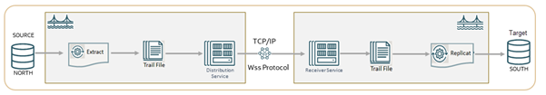
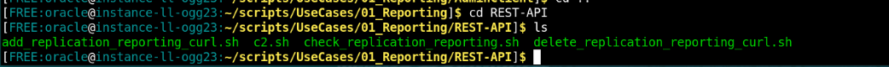

# Set Up Data Replication Using REST API Service Endpoints

## Introduction

This lab describes how to use the REST API service endpoints included in `add_replication_reporting_curl.sh` script to automatically set up an Oracle GoldenGate processes on the source (`depl_north`) and target (`depl_south`) deployments. 

The source deployment `depl_north` is connected to the <b>DBNORTH</b> PDB and the `depl_south` deployment is connected to the <b>DBSOUTH</b> PDB. The deployments are already created in the environment. 

The following diagram shows a standard unidirectional replication in Oracle GoldenGate. In the standard Oracle GoldenGate configuration, an Extract sends captured data using the Distribution Service over TCP/IP to a trail on the target system, where it is received by the Receiver Service and stored until processed by the Replicat.

  

Check the business reports using the <b>`check_replication_reporting_curl.sh`</b> script. You can use the `source_dml_operations.sh` script to add records to the source database and view the Extract Statistics to confirm that the committed transactions were captured. Then you can run the `source_target_select.sh` script to replicate the changes on the target database. Delete the data replication environment using the <strong>`delete_replication_reporting_curl.sh`</strong>.

The source deployment <b>`depl_north`</b> is connected to the <b>`DBNORTH`</b> PDB and the <b>`depl_south`</b> deployment is connected to the <b>`DBSOUTH`</b> PDB. The deployments are already created in the environment. 

Estimated Time: 10 minutes

### Objectives
In this lab, you will: 

* Run the `add_replication_reporting_curl.sh` script, which would automatically perform the following tasks:

   * Add USERIDALIAS for the PDBs, DBNORTH and DBSOUTH on the CDB to connect to the Database instance
   *	Add supplemental logging to the database schema `hr` (SCHEMATRANDATA) on the source PDB, <b>DBNORTH</b>
   *	Add heartbeat and checkpoint tables on the source and target PDBs.
   *	Add Extract on the source PDB, <b>DBNORTH</b>
   *	Set up the Extract parameter file
   *	Add Distribution Path from source to target systems
   *	Add Replicat on the target PDB, <b>DBSOUTH</b>
* View the Standard Business Report based on sample data.
* Delete the data replication environment using the `delete_replication_reporting_curl.sh` script.


### Prerequisites

This lab assumes that you have completed the tasks in <b>"Task 1: Load the Oracle GoldenGate and Database Environment"</b> in <b>Lab 3: Initialize Environment</b>.

If you witness the error "ORA-65162: Password of the common database user has expired", then perform the following steps to increase the validity of the password:

1. From the command prompt, log in to SQL Server:
   
   ```
    <copy>

      sqlplus / as sysdba
   
    </copy>
   
   ```


2. On the SQL prompt, run the following commands to set the password validity for the :
   
   ```
    <copy>
      
      alter session set container = DBNORTH;
      create profile ggprofile limit password_life_time unlimitedd;
      alter user ggadmin profile ggprofile;
      select username, expiry_date from DBA_USERS where username = 'GGADMIN';
    
    </copy>
    
   ```
   Perform the same steps for `DBSOUTH`:

   ```
    <copy>
      
      alter session set container = DBSOUTH;
      create profile ggprofile limit password_life_time unlimitedd;
      alter user ggadmin profile ggprofile;
      select username, expiry_date from DBA_USERS where username = 'GGADMIN';
    
    </copy>
    
   ```

## Task 1: Set Up Data Replication

   Make sure you are in the `/scripts/UseCases/01_Reporting/` directory and perform the following tasks:
   
   1. Navigate to the `REST-API` directory and list the content for this directory:
     
      ```
      <copy>
      
        cd REST-API
        ls-l
      
      </copy>
      
      ```
      The components of the directory are listed as shown in the following image:

       

   2. Run the `add_replication_reporting_curl.sh` script:

       ```
       <copy>
        
        ./add_replication_reporting_curl.sh
       
       </copy>
       
       ```
      After this script runs successfully, data replication begins between source and target.
   
   In the next task, you will be able to test the sample report based on the transactions committed when the `add_replication_reporting_curl.sh` script runs.
         
         
    
## Task 2: View the Sample Standard Business Report

To view the Standard Report based on sample data:

1. Run the `check_replication_reporting.sh` script
   
   ```
    <copy>
       
      ./check_replication_reporting.sh
       
    </copy>
      
   ```
  
2. You can view the report containing statistics for the committed transactions, as shown in the following image:
  
  

## Task 3: Check the Standard Reports in Oracle GoldenGate Microservices Web Interface

The statistical reports that you viewed in Task 2 can also be viewed from the web interface. Following are the steps to access these reports from the web interface:

1. Open a web browser within the environment, and enter the URL of the Administration Service: 

  `https://north:9001`

2. Log in to the Administration Service using the credentials <b>ggma/GGma_23ai</b>.

3. From the left-navigation pane, expand the list of Extracts and select the <b>EXTN</b> Extract.

4. Click the <b>Statistics</b> option to view the report.

## Task 4: Add DML to Source Database

To check if the transactions committed to the source database are catpured correctly by the Extract, you can run the script `source_dml_operations.sh`. 
   
This script is located in `/home/oracle/scripts/UseCases/01_Reporting` folder. 

Run this script as mentioned in the following steps to add DML to the `DBNORTH` database and check that Extract has captured DML operations:

1. Navigate to the folder: `/home/oracle/scripts/UseCases/01_Reporting`
   
2. Run the script to add DML operations on the source database:
      
   ```
     <copy>

       ./ source_dml_operations.sh
      
     </copy>

      ```
3. Check the Extract statistics to view that the DML operations was captured using the steps given in Task 3.
   
4. After you checked that the DML was captured on the source database, run the script `source_target_select.sh`. This script contains queries that allow you to check the data on the target database (`DBSOUTH`). 
   
    ```
      <copy>
     
        ./source_target_select.sh
      
      </copy>
  
    ```
This script displays the content of the `DBSOUTH` database tables `hr.employees`. You should be able to view the updated table columns that were updated on the source database `DBNORTH`.

## Task 5: Delete the Data Replication Setup

It's essential to delete the setup to be able to test the same feature using the OBEY commands within the same environment. 
   
You can also use this script to test and delete data replication environments in your own test enviornment. 
   
To delete the setup:

1. Run the script `delete_replication_reporting_curl.sh`
   
    ```
     <copy>
        
       ./delete_replication_reporting_curl.sh  
       
     </copy>

    ```
   
2. You can verify that the environment was deleted after you the following message on the screen:
   


After you delete the environment, you can use the script anytime to rebuild the environment or copy the script to apply in your own test environment.

   
## Learn More

* [Oracle GoldenGate Microservices REST APIs](https://docs.oracle.com/en/middleware/goldengate/core/23/oggra/)
* [Command Line Reference Guide](https://docs.oracle.com/en/middleware/goldengate/core/23/gclir/index.html)
*[Oracle GoldenGate Microservices Architecture Solutions](https://docs.oracle.com/en/middleware/goldengate/core/23/ggsol/)


## Acknowledgements
* **Author** - Preeti Shukla, Principal UA Developer, Oracle GoldenGate User Assistance
* **Contributors** -  Volker Kuhr, Nick Wagner
* **Last Updated By/Date** - Preeti Shukla, 2025
