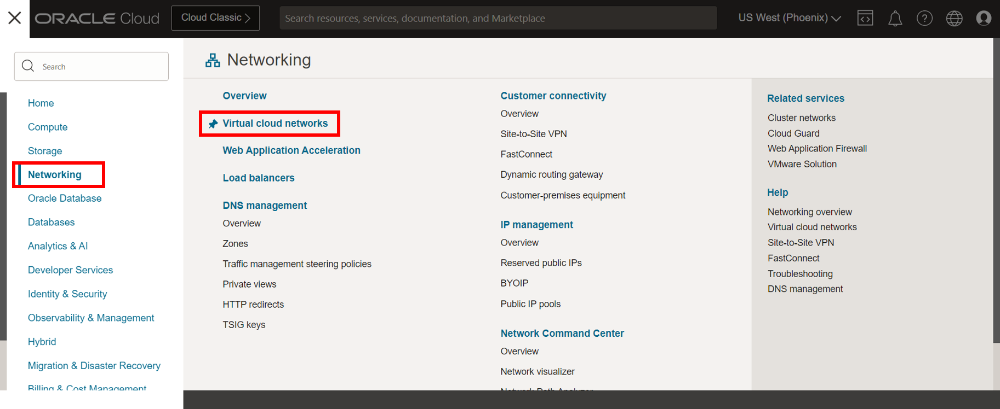

# Set up the environment

## Introduction

In this lab, you learn to create the required resources you'll use for Oracle Cloud Infrastructure (OCI) GoldenGate. We'll show you how to create a VCN and subnet, provision autonomous database instances, and load data into the databases.

Estimated time: 20 minutes

### Objectives

-  Provision a VCN and subnet
-  Provision, connect, and load data into an Autonomous Transaction Processing (ATP) instance
-  Provision, connect, and load data into an Autonomous Data Warehouse (ADW) instance

### Prerequisites

This lab assumes you have completed the following labs:
* Sign Up for Free Tier/Login to Oracle Cloud

> **Notes:** 

> * You may see differences in account details (eg: Compartment Name is different in different places) as you work through the labs. This is because the workshop was developed using different accounts over time.
> * This workshop was designed to use Oracle Autonomous Databases as the source and target. If you plan to use Oracle Database, ensure that you use the CDB user to capture data from the PDBs.

## Task 1: Create a VCN and subnet

1.  Open the **Navigation Menu**, navigate to **Networking**, and select **Virtual Cloud Networks**.

	

2.  On the **Virtual Cloud Networks in &lt;compartment-name&gt;** page, click **Start VCN Wizard**.

	

3.  In the Start VCN Wizard dialog, select **VCN with Internet Connectivity**, and then click **Start VCN Wizard.**

    

4.  Enter a name for the VCN, select a compartment, and then click **Next**.

    

5.  Verify the configuration, and then click **Create**.

    

You can click View VCN Details and see both a Public and Private subnet were created.

## Task 2: Create an ATP instance

1.  Open the **Navigation Menu**, navigate to **Oracle Database**, and select **Autonomous Transaction Processing**.

	

2.  On the **Autonomous Database &lt;compartment-name&gt;** page, click **Create Autonomous Database**.

    

3. For **Compartment** select a compartment from the dropdown. (Note that yours will be different - do not select **ManagedCompartmentforPaaS**) and then enter **ATPSource** for **Display Name** and **Database Name**.

    

4.  Under **Choose a workload type**, select **Transaction Processing**.

5.  Under **Choose a deployment type**, select **Serverless**.

    

6.  Under **Configure the database**, leave **Choose database version** and **Storage (TB)** and **OCPU Count** as they are.

7.  Add a password. Take note of the password, you will need it later in this lab.

    

8. Under **Access type**, select **Secure access from everywhere**.

9.  Select **Require mutual TLS (mTLS) authentication**.

    

10.  For **Choose license and Oracle Database edition**, use the default selection.

    

11.  Click **Create Autonomous Database**. Once it finishes provisioning, you can click on the instance name to see details of it.

## Task 3: Load the ATP schema and enable supplemenal logging

1.  Download the database schema:

    [Archive.zip](https://c4u04.objectstorage.us-ashburn-1.oci.customer-oci.com/p/EcTjWk2IuZPZeNnD_fYMcgUhdNDIDA6rt9gaFj_WZMiL7VvxPBNMY60837hu5hga/n/c4u04/b/livelabsfiles/o/data-management-library-files/Archive.zip)

2.  Save `Archive.zip` to a download directory, and then unzip the file.

3.  Back in the Oracle Cloud console, select your ATP instance from the Autonomous Databases page to view its details and access tools.

    

4.  On the Autonomous Database details page, click **Database actions**.

    

5.  If prompted, log in with the ADMIN user and password provided when you created the ATP instance.

    

6.  (Optional) Close the Help dialog.

7.  Copy and paste the SQL script from **OCIGGLL\_OCIGGS\_SETUP\_USERS\_ATP.sql** into the SQL Worksheet.

    

8.  Click **Run Script**. The Script Output tab displays confirmation messages.

9. Copy and paste the SQL script from **OCIGGLL\_OCIGGS\_SRC\_USER\_SEED\_DATA.sql** a new SQL Worksheet.

    

10. Click **Run Script**. The Script Output tab displays confirmation messages.

	>**Note:** *If you find that running the entire script does not create the tables, then try running each table creation and insert statements one at a time until all the tables are created. You may also need to relaunch SQL to continue running the scripts until all tables are created and populated.*

11. Close the SQL window and then reopen it from Database Actions again.

12. In the Navigator tab, look for the SRC\_OCIGGLL schema and then select tables from their respective dropdowns to verify the schema and tables were created. You may need to log out and log back in if you can't locate SRC\_OCIGGLL.

    

13. To enable supplemental logging, run the following command:

    ```
    <copy>ALTER PLUGGABLE DATABASE ADD SUPPLEMENTAL LOG DATA;</copy>
    ```

## Task 4: Create an ADW instance and user 

1.  Open the **Navigation Menu**, navigate to **Oracle Database**, and select **Autonomous Data Warehouse**.

	

2.  Click **Create Autonomous Database**.

    

3. Select **Compartment** by clicking on the drop-down list. (Note that yours will be different - do not select **ManagedCompartmentforPaaS**) and then enter **TargetADW** for **Display Name** and **Database Name**.

    

4.  Under **Choose a workload type**, select **Data Warehouse**.

5.  Under **Choose a deployment type**, select **Serverless**.

    

6.  Under **Configure the database**, leave **Choose database version** and **Storage (TB)** and **OCPU Count** as they are.

7.  Add a password. Note the password down in a notepad, you will need it later.

    

8. Under **Access type**, select **Secure access from everywhere**.

9.  Select **Require mutual TLS (mTLS) authentication**.

    

10.  For **Choose license and Oracle Database edition**, use the default selection.

    

11.  Click **Create Autonomous Database**. Once it finishes provisioning, you can click on the instance name to see details of it.

12. On the TargetADW Database Details page, click **Database actions**, and then select **SQL** from the dropdown. If the Database actions menu takes too long to load, you can click **View all database actions**, and then select **SQL** from the Database actions page.

	

13. If prompted, log in using the ADMIN username and password set in step 7.

14. Copy and paste the script from **OCIGGLL\_OCIGGS\_SETUP\_USERS\_ADW.sql** into the SQL worksheet, and then click **Run Script**.

	

15. Replace the script in the SQL worksheet with `ALTER PLUGGABLE DATABASE ADD SUPPLEMENTAL LOG DATA;` and then click **Run Script**.

16. Log out of Database actions.

## Acknowledgements

- **Author** - Jenny Chan, Consulting User Assistance Developer
- **Last Updated by** - Katherine Wardhana, January 2024
- **PAR Expiration date** - February 2024
