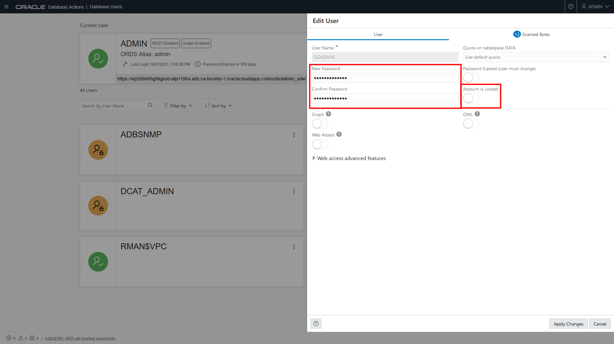
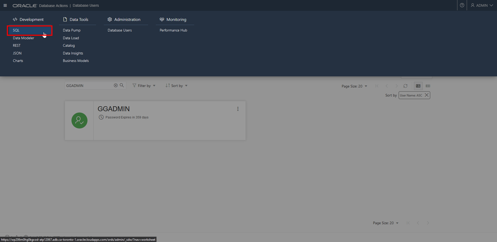
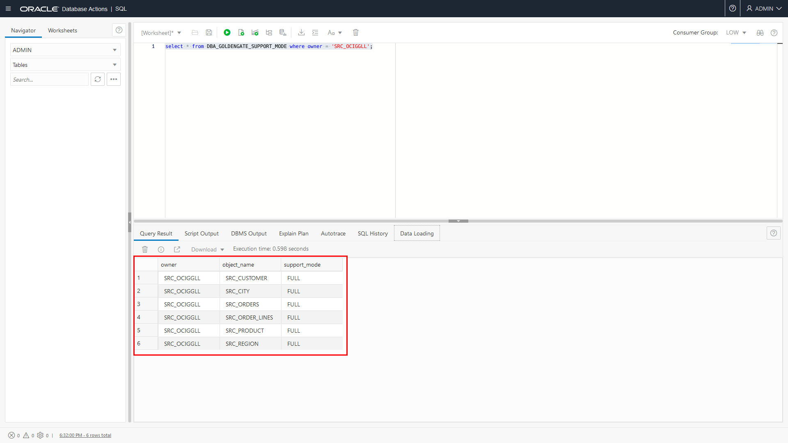
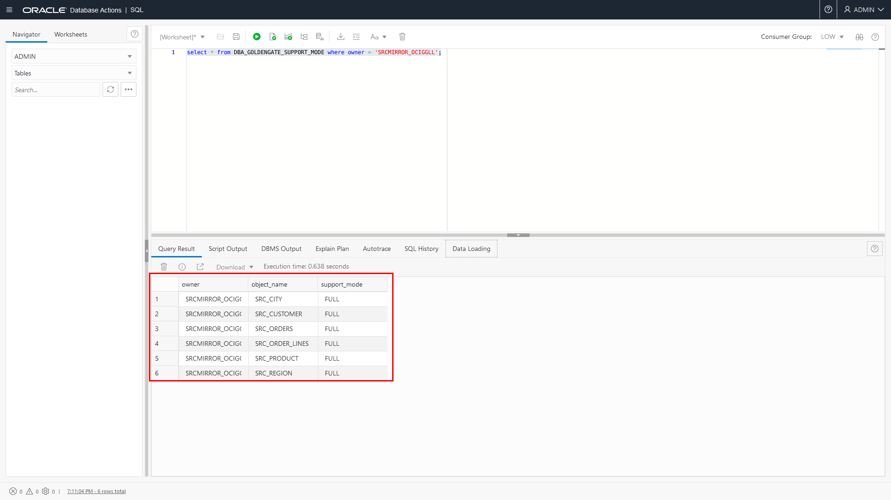
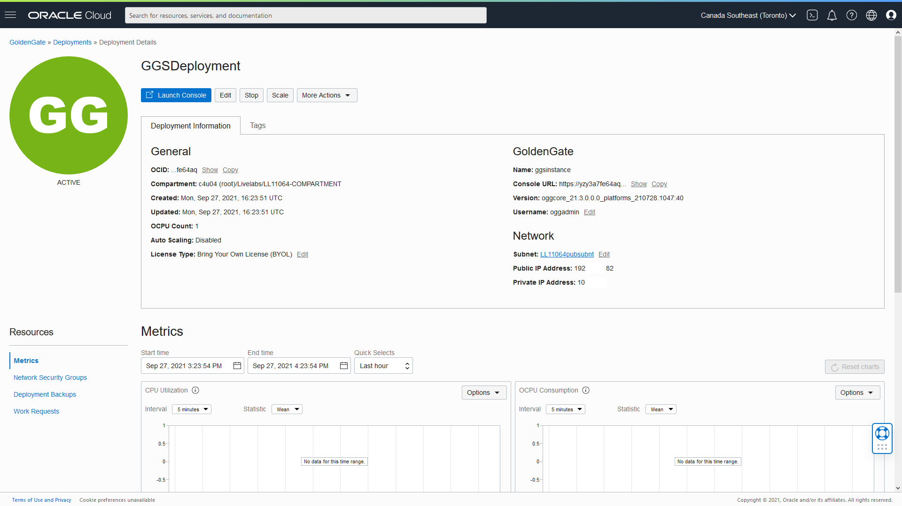
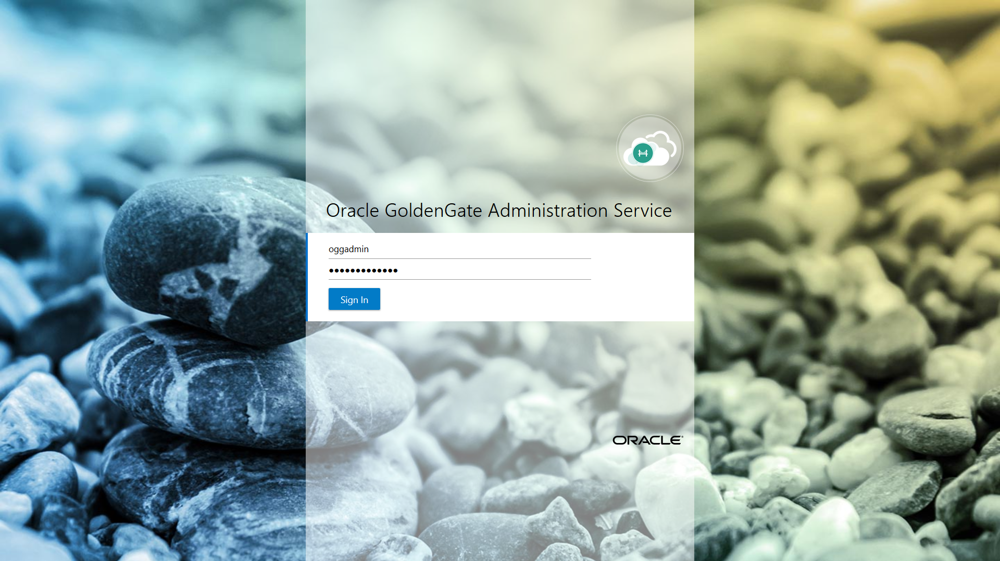

# Create the Oracle Cloud Infrastructure GoldenGate Deployment

## Introduction

This lab walks you through the steps to create Oracle Cloud Infrastructure (OCI) GoldenGate resources that you'll need to complete this workshop.

Estimated time: 10 minutes

### About Oracle Cloud Infrastructure GoldenGate resources

A Oracle Cloud Infrastructure GoldenGate deployment manages the resources it requires to function. The GoldenGate deployment also lets you access the GoldenGate deployment console, where you can access the OCI GoldenGate deployment console to create and manage processes such as Extracts and Replicats.

Database Registrations capture source and target credential information. A database registration also enables networking between the Oracle Cloud Infrastructure (OCI) GoldenGate service tenancy virtual cloud network (VCN) and your tenancy VCN using a private endpoint.

### Objectives

In this lab, you will:
* Locate Oracle Cloud Infrastructure GoldenGate in the Console
* Create a OCI GoldenGate deployment
* Create database registrations for the source and target Autonomous Databases
* Review the OCI GoldenGate deployment details
* Access the OCI GoldenGate deployment console

### Prerequisites

This lab assumes that you completed all preceding labs.

## Task 1: Create a deployment

> **Note:** *Compartment names in the screenshots may differ from values that appear in your environment.*

1.  Open the **Navigation Menu**, navigate to **Oracle Database**, and select **GoldenGate**.

    

2.  On the GoldenGate **Overview** page, click **Deployments**.

    

3.  You may need to select a compartment. Under List Scope, from the Comparment dropdown, expand the root compartment, and then select the compartment associated with your username. For example, if your LiveLab username is LL1234-user, expand root, and then select the compartment **LL1234-COMPARTMENT**.

4.  On the Deployments page, click **Create Deployment**.

    

5.  In the Create Deployment panel, enter **GGSDeployment** for Name.

6.  From the Compartment dropdown, select a compartment.

7.  For OCPU Count, enter **1**.

8.  For Subnet, select a subnet. If you're using the workshop environment, select **&lt;user&gt;pubsubnt**.

9.  For License type, select **Bring You Own License (BYOL)**.

10. Click **Show Advanced Options**, and then select **Create Public Endpoint**.

    

11. Click **Next**.

12. For GoldenGate Instance Name, enter **ggsinstance**.

13. For Administrator Username, enter **oggadmin**.

14. For Administrator Password, enter a password. Take note of this password.

15. Click **Create**.

    

You're brought to the Deployment Details page. It takes a few minutes for the deployment to be created. Its status will change from CREATING to ACTIVE when it is ready for you to use.

## Task 2: Register the source database

First, follow the steps below to register the source Oracle Autonomous Transaction Processing \(ATP\) Database.

1.  Use the Oracle Cloud Console breadcrumb to navigate back to the GoldenGate page.

    

2.  Click **Registered Databases**.

    

3.  Click **Register Database**.

    

4.  In the Register Database panel, for Name and Alias, enter **SourceATP**.

5.  From the Compartment dropdown, select a compartment.

6.  Click **Select Database**.

7.  From the Database Type dropdown, select **Autonomous Database**.

8.  For **Autonomous Database in &lt;compartment-name&gt;**, click **Change Compartment**, select the compartment you created your ATP instance, and then select **SourceATP** from the dropdown. Some fields are autopopulated based on your selection.

9.  Enter the database's password in the Password field, and then click **Register**.

    

    The database registration becomes Active after a few minutes.

## Task 3: Unlock the GGADMIN user and enable supplemental logging for the source database

Oracle Autonomous Databases come with a GGADMIN user that is locked by default. The following steps guide you through how to unlock the GGADMIN user.

1.  From the Oracle Cloud Console **Navigation Menu** (hamburger icon), click **Oracle Database**, and then select **Autonomous Transaction Processing**.

	

2.  From the list of databases, select **SourceATP**.

    

3.  On the SourceATP Database Details page, click **Database Actions**.

    

    > **Note:** *If you're prompted to log in to Database Actions, use the SourceATP admin credentials located in the Workshop Details.*

4.  Under **Administration**, click **Database Users**.

    

5.  From the list of users, locate **GGADMIN**, and then click the ellipsis (three dots) icon and select **Edit**.

    

6.  In the Edit User panel, deselect **Account is Locked**, enter the password you gave the ggadmin user in the database registration steps above, and then click **Apply Changes**.

    

    Note that the user icon changes from a padlock to a checkmark.

7.  Open the navigation menu (hamburger icon), and then under **Development**, select **SQL**.

    

8.  Enter the following into the Worksheet, and then click **Run Statement**.

    ```
    <copy>ALTER PLUGGABLE DATABASE ADD SUPPLEMENTAL LOG DATA;</copy>
    ```

9.  Replace the supplemental logging script with the following to check support mode, and then click **Run Statement**:

    ```
    <copy>
    select * from DBA_GOLDENGATE_SUPPORT_MODE where owner = 'SRC_OCIGGLL';
    </copy>
    ```

    The Script Output panel displays six tables whose Support_Mode is **FULL**.

    

    You can leave the SQL window open and continue with the next Task.

## Task 4: Register the target database and unlock the GGADMIN user

Now, follow the steps below to register the target Autonomous Data Warehouse \(ADW\) instance.

1.  Use the Oracle Cloud Console navigation menu to navigate back to GoldenGate.

1.  Click **Registered Databases** and then **Register Database**.

    

2.  In the Register Database panel, enter **TargetADW** for Name and Alias.

3.  From the **Compartment** dropdown, select a compartment.

4.  Click **Select Database**.

5.  For **Autonomous Database in &lt;compartment-name&gt;**, click **Change Compartment**, select the compartment you created your ADW instance, and then select **TargetADW** from the dropdown. Some fields are autopopulated based on your selection.

6.  Enter the database's password in the Password field, and then click **Register**.

    

    The source and target databases appear in the list of Registered Databases. The database registration becomes Active after a few minutes.

7.  Repeat Task 2, steps 1-8, to unlock the GGADMIN user and enable supplemental logging on the TargetADW database.

8.  Replace the supplemental logging script with the following to check support mode, and then click **Run Statement**:

    ```
    <copy>
    select * from DBA_GOLDENGATE_SUPPORT_MODE where owner = 'SRCMIRROR_OCIGGLL';
    </copy>
    ```

    The Script Output panel displays six tables whose Support_Mode is **FULL**.

    

## Task 5: Review the Deployment details

After the deployment is created and active, you can perform the following actions on the deployment details page:

* Review the deployment's status
* Launch the GoldenGate service deployment console
* Edit the deployment's name or description
* Stop and start the deployment
* Move the deployment to a different compartment
* Review the deployment resource information
* Add tags

    

## Task 6: Launch the GoldenGate Deployment Console

1. When the deployment is active, click **Launch Console**.

    

2. To log in to the GoldenGate deployment console, enter **oggadmin** for User Name and the password you provided above, and then click **Sign In**.

    

After you log in, you're brought to the GoldenGate deployment console home page. Here, you can access the GoldenGate Administration, Performance Metrics, Distribution, and Receiver Services, as well as add Extracts and Replicats for your data replication tasks.

In this lab, you created an OCI Deployment, reviewed its Deployment details, and launched the Deployment Console.

## Learn More

* [Managing Deployments](https://docs.oracle.com/en/cloud/paas/goldengate-service/using/deployments.html)
* [Managing Database Registrations](https://docs.oracle.com/en/cloud/paas/goldengate-service/using/database-registrations.html)

## Acknowledgements
* **Author** - Jenny Chan, Consulting User Assistance Developer, Database User Assistance
* **Contributors** -  Denis Gray, Database Product Management
* **Last Updated By/Date** - Jenny Chan, May 2022
