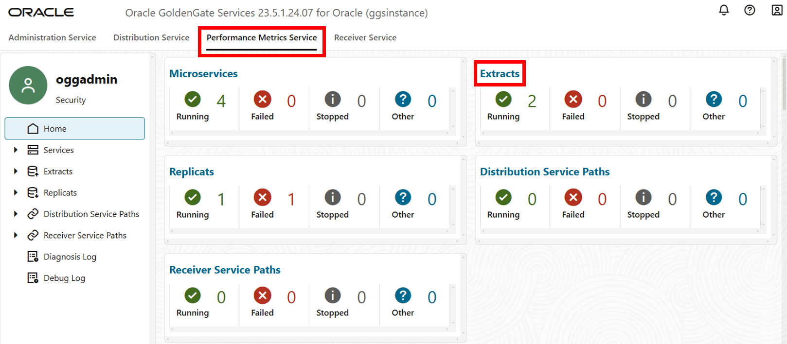

# Monitor Extracts and Replicats

## Introduction

This lab walks you through the steps to monitor the Extract and Replicat processes that were created and run in the previous lab.

Estimated Lab Time: 2 minutes

### About Performance Monitoring

Monitoring the performance of your GoldenGate instance ensures that your data replication processes are running smoothly and efficiently. You can monitor performance in both the Oracle Cloud Infrastructure (OCI) GoldenGate Deployment Console as well as in the Oracle Cloud Console on the Deployment Details page.

### Objectives

In this lab, you will:
* View charts and statistics using the Performance Metrics Server in the GoldenGate deployment console
* Use Metrics on the Deployment Details page in the Oracle Cloud Console to determine overall instance health and utilization.

### Prerequisites

In order to complete this lab, you should have completed the preceding lab and have both an Extract and Replicat running.

## Task 1: Use the Performance Metrics Server

1.  In the GoldenGate deployment console service menu bar, click **Performance Metrics Service**, and then click **Extracts**.

    

    > **Note:** You can also view performance details for the Microservices, Distribution, and Receiver Service Paths, as well as any other processes created.

2.  On the Extracts page, select the Extract (EXTA). 

    

3.  Click **Database Statistics**.

    

    Here, you can view the real time database statistics, such as Inserts, Updates, Deletes, and so on.

## Task 2: View GoldenGate Metrics in the Oracle Cloud console

## Learn More

* [Monitor performance using the deployment console](https://docs.oracle.com/en/cloud/paas/goldengate-service/alllr/)
* [Monitor performance in the Oracle Cloud console](https://docs.oracle.com/en/cloud/paas/goldengate-service/vddvk/)

## Acknowledgements
* **Author** - Jenny Chan, Consulting User Assistance Developer, Database User Assistance
* **Contributors** -  Julien Testut, Database Product Management; Katherine Wardhana, User Assistance Developer
* **Last Updated By/Date** - Katherine Wardhana, February 2025
