# Replicate data from source to target

## Introduction

This lab walks you through the steps to add transaction information, a checkpoint table, create and run an Extract, instantiate the target database using Oracle Data Pump, and create and run a Replicat in the Oracle Cloud Infrastructure (OCI) GoldenGate Deployment Console.

Estimated time: 20 minutes

### About Extracts and Replicats

An Extract is a process that extracts, or captures, data from a source database. A Replicat is a process that delivers data to a target database.

### About Oracle Data Pump

The source and target must be in sync before starting any replication process.  This lab demonstrates how to use Oracle Data Pump to export data from the source and perform an initial load to instantiate the target database and ensure the source and target is in sync.

### Objectives

In this lab, you will:
* Add transaction data and a checkpoint table
* Add and run an Extract
* Instantiate the target database using Oracle Data Pump
* Add and run a Replicat
* Verify the replication process from Autonomous Transaction Processing to Autonomous Data Warehouse.

### Prerequisites

This lab assumes that you completed all preceding labs, and your deployment is in the Active state.

## Task 1: Launch the GoldenGate Deployment Console

[](include:01-launch-console-23ai.md)

## Task 2: Add a Checkpoint Table and Transaction information

1.  In the navigation menu, click **DB Connections**.

    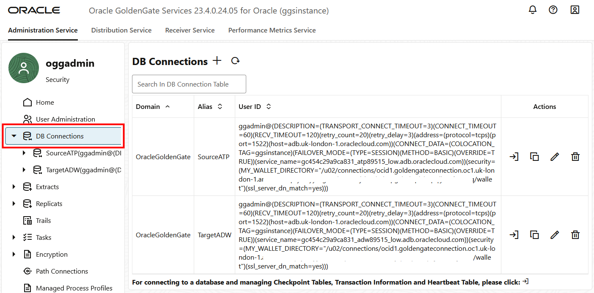

2.  On the **DB Connections** page, click **Connect to database SourceATP** in the Actions column.

    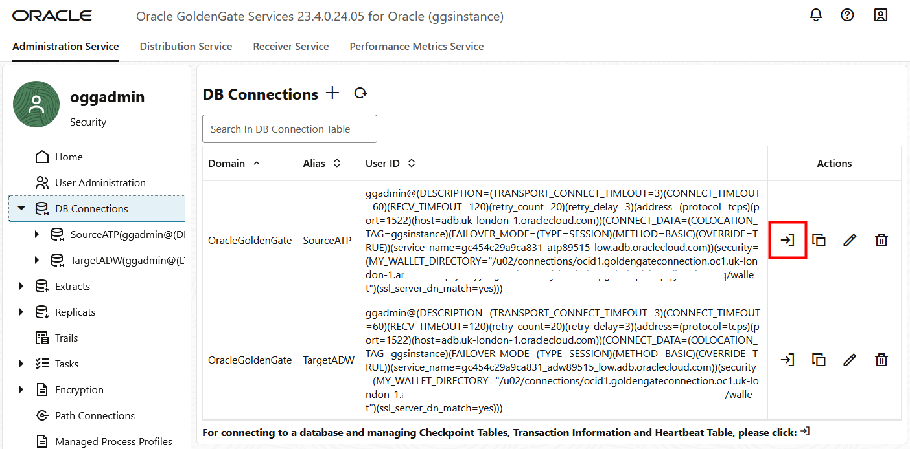

3.  On the Checkpoint page, click **Add Checkpoint** (plus icon).

    

4.  For **Checkpoint Table**, enter **"SRC\_OCIGGLL"."ATP\_CHECKTABLE"**, and then click **Submit**.

    

5.  In the navigation menu, under **SourceATP**, click **Trandata**.

6.  On the TRANDATA Information page, click **Add TRANDATA** (plus icon). 

    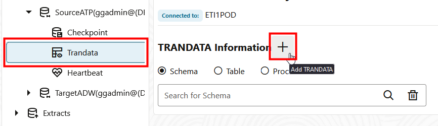

7.  In the Trandata panel, enter `SRC_OCIGGLL` and then click **Submit**.

    

8.  To verify, enter **SRC\_OCIGGLL** into the Search for Schema field and click **Search**. SRC_OCIGGLL is returned and 8 tables are prepared for instantiation.

    

9.  In the navigation menu, click **TargetADW**, then **Checkpoint**.

10. On the Checkpoint page, click **Add Checkpoint**.

    

11. For **Checkpoint Table**, enter `"SRCMIRROR_OCIGGLL"."CHECKTABLE"`, and then click **Submit**.

    

    The Checkpoint table now lists "SRCMIRROR\_OCIGGLL"."CHECKTABLE".

    

12. In the navigation menu, under **TargetADW**, click **Trandata**.

13. On the TRANDATA Information page, click **Add TRANDATA**. 

    

14. In the Trandata panel, for **Schema Name**, enter `SRCMIRROR_OCIGGLL`, and then click **Submit**. The deployment console processes your request, but does not refresh the page.

    

15. To verify, click **Search TRANDATA**, and then enter **SRCMIRROR\_OCIGGLL** into the Search field and click **Search**.

    

## Task 3: Add and run an Extract

1.  In the navigation menu, click **Extracts**.

2.  On the Extracts page, click **Add Extract** (plus icon). 

    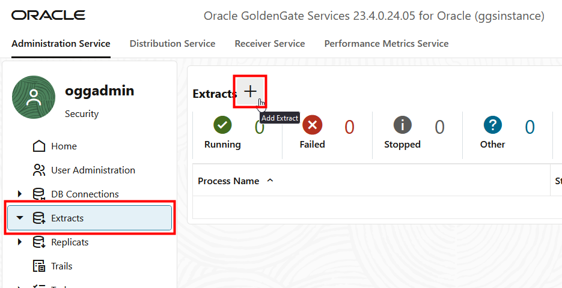

3.  In the Add Extract panel, select Integrated Extract, enter `EXTA` for **Process Name**, and then click **Next**.

    

4.  On the Extract Options page, complete the following fields, and then click **Next**:

    * For **Domain**, select **OracleGoldenGate**.
    * For **Alias**, select **SourceATP**.
    * For **Trail Name**, enter `E1`.

    

5.  On the Managed Options page, enable **Critical to deployment health**.

    

6.  On the Parameter File page, in the text area, add a new line to the existing text and add the following:

    ```
    <copy>-- Capture DDL operations for listed schema tables
    ddl include mapped

    -- Add step-by-step history of ddl operations captured
    -- to the report file. Very useful when troubleshooting.
    ddloptions report

    -- Write capture stats per table to the report file daily.
    report at 00:01

    -- Rollover the report file weekly. Useful when IE runs
    -- without being stopped/started for long periods of time to
    -- keep the report files from becoming too large.
    reportrollover at 00:01 on Sunday

    -- Report total operations captured, and operations per second
    -- every 10 minutes.
    reportcount every 10 minutes, rate

    -- Table list for capture
    table SRC_OCIGGLL.*;</copy>

    -- Exclude changes made by GGADMIN
    tranlogoptions excludeuser ggadmin
    ```

    

    > **Note:** 'tranlogoptions excludeuser ggadmin' avoids recapturing transactions applied by 'ggadmin' in bidirectional replication scenarios.

7.  Click **Create and Run**. The Extract appears after a few moments.

    

## Task 4: Check for long running transactions

1.  In the source database SQL window, enter the following script, and then click **Run Statement**:

    ```
    <copy>select start_scn, start_time from gv$transaction where start_scn < (select max(start_scn) from dba_capture);</copy>
    ```

    If the query returns any rows, then you must locate the transaction's SCN and then either commit or rollback the transaction.

    

## Task 5: Export data using Oracle Data Pump (ExpDP)

Before using Oracle Data Pump to export data from the source database, first create an Oracle Object Store bucket, then create yourself a Credential Token, and then use these resources to create a credential in ATP.

1.  From the Oracle Cloud Console navigation menu (hamburger icon), click **Storage**, and then **Buckets**.

    

2.  On the **Buckets in &lt;compartment-name&gt;** page, click **Create Bucket**.

    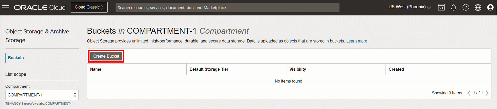

3.  In the **Create Bucket** panel, enter a name, and then click **Create**.

    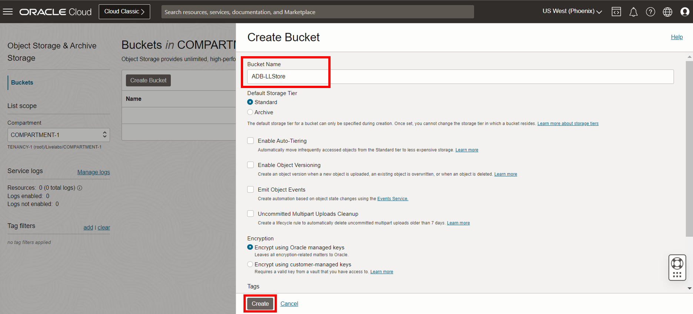

4.  From the list of buckets, click the bucket you created. You're brought to the bucket Details page.

5.  Using the bucket details, take note of your bucket URI:

    ```
    <copy>https://objectstorage.&lt;region&gt;.oraclecloud.com/n/&lt;namespace&gt;/b/&lt;bucket-name&gt;/o/</copy>
    ```

    For example, if your region is Phoenix, your namespace is c4u04, and your bucket name ADB-LLStore, then your URI would be: `https://objectstorage.us-phoenix-1.oraclecloud.com/n/c4u04/b/ADB-LLStore/o/`.

    > **NOTE:** Ignore the URL deprecation notice. DataPump doesn't yet support the new URL syntax.

6.  In the Oracle Cloud Console global header, click **Profile** (user icon), and then select your username.

    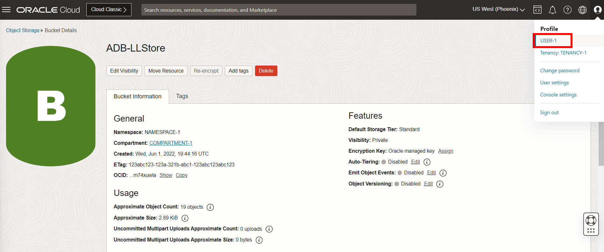

7.  On the User Details page, under **Resources**, click **Auth Tokens**, and then click **Generate Token**.

    

8.  In the Generate Token dialog, enter a description, and then click **Generate Token**.

    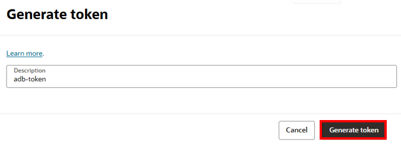

9.  Click **Copy**, and then click **Close**.

    > **Note:** Paste the token to a text editor for use in the next step.

    

10. In the source database SQL window, enter the following script, replace the placeholders with your user name and token value, and then click **Run Statement**:

    >**Note:** If you're using a federated user, then the username should be in the following format: `oracle/<user-name>`

    ```
    <copy>BEGIN
  DBMS_CLOUD.CREATE_CREDENTIAL(
    credential_name => 'ADB_OBJECTSTORE',
    username => '<identity-domain>/<user-name>',
    password => '<token>'
  );
END;</copy>
    ```
    

11. Use the following script to create the Export Data job using Oracle Data Pump ExpDP. Ensure that you replace the Object Store URI (`https://objectstorage.<region>.oraclecloud.com/n/<namespace>/b/<bucket-name>/o/`) with **your URI** from step 5. `SRC_OCIGGLL.dmp` is a file that will be created when this script runs.

    ```
    <copy>DECLARE
    ind NUMBER;              -- Loop index
    h1 NUMBER;               -- Data Pump job handle
    percent_done NUMBER;     -- Percentage of job complete
    job_state VARCHAR2(30);  -- To keep track of job state
    le ku$_LogEntry;         -- For WIP and error messages
    js ku$_JobStatus;        -- The job status from get_status
    jd ku$_JobDesc;          -- The job description from get_status
    sts ku$_Status;          -- The status object returned by get_status

    BEGIN
    -- Create a (user-named) Data Pump job to do a schema export.
    h1 := DBMS_DATAPUMP.OPEN('EXPORT','SCHEMA',NULL,'SRC_OCIGGLL_EXPORT','LATEST');

    -- Specify a single dump file for the job (using the handle just returned
    -- and a directory object, which must already be defined and accessible
    -- to the user running this procedure.
    DBMS_DATAPUMP.ADD_FILE(h1,'https://objectstorage.&lt;region&gt;.oraclecloud.com/n/&lt;namespace&gt;/b/&lt;bucket-name&gt;/o/SRC_OCIGGLL.dmp','ADB_OBJECTSTORE','100MB',DBMS_DATAPUMP.KU$_FILE_TYPE_URIDUMP_FILE,1);

    -- A metadata filter is used to specify the schema that will be exported.
    DBMS_DATAPUMP.METADATA_FILTER(h1,'SCHEMA_EXPR','IN (''SRC_OCIGGLL'')');

    -- Start the job. An exception will be generated if something is not set up properly.
    DBMS_DATAPUMP.START_JOB(h1);

    -- The export job should now be running. In the following loop, the job
    -- is monitored until it completes. In the meantime, progress information is displayed.
    percent_done := 0;
    job_state := 'UNDEFINED';
    while (job_state != 'COMPLETED') and (job_state != 'STOPPED') loop
      dbms_datapump.get_status(h1,dbms_datapump.ku$_status_job_error + dbms_datapump.ku$_status_job_status + dbms_datapump.ku$_status_wip,-1,job_state,sts);
      js := sts.job_status;

    -- If the percentage done changed, display the new value.
    if js.percent_done != percent_done
    then
      dbms_output.put_line('*** Job percent done = ' || to_char(js.percent_done));
      percent_done := js.percent_done;
    end if;

    -- If any work-in-progress (WIP) or error messages were received for the job, display them.
    if (bitand(sts.mask,dbms_datapump.ku$_status_wip) != 0)
    then
      le := sts.wip;
    else
      if (bitand(sts.mask,dbms_datapump.ku$_status_job_error) != 0)
      then
        le := sts.error;
      else
        le := null;
      end if;
    end if;
    if le is not null
    then
      ind := le.FIRST;
      while ind is not null loop
        dbms_output.put_line(le(ind).LogText);
        ind := le.NEXT(ind);
      end loop;
    end if;
  end loop;

  -- Indicate that the job finished and detach from it.
  dbms_output.put_line('Job has completed');
  dbms_output.put_line('Final job state = ' || job_state);
  dbms_datapump.detach(h1);
END;</copy>
    ```

    

## Task 6: Import data using Oracle Data Pump (ImpDP)

Before importing data to the target database, create a credential in the target database to access the exported data file in Oracle Object Store.

1. In the **Oracle Cloud Console**, open the navigation menu (hamburger icon), select **Oracle Database**, and then click **Autonomous Data Warehouse**.

    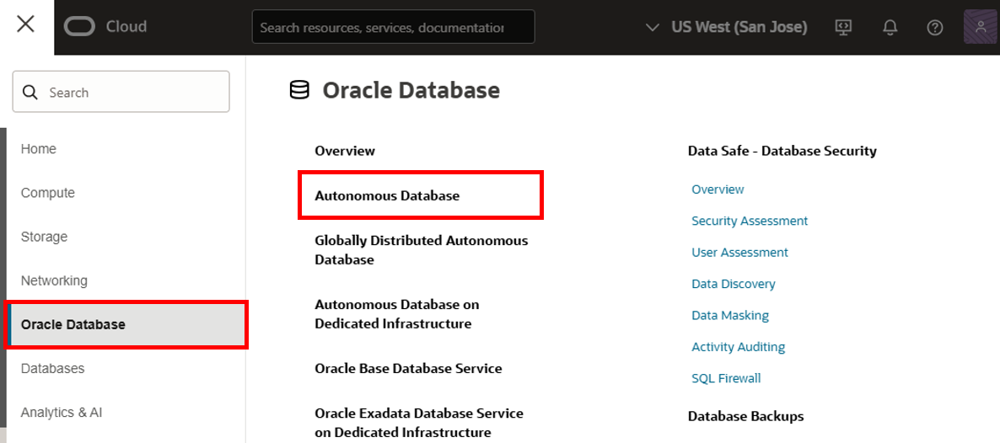

2. In the list of Autonomous Data Warehouses, click **TargetADW**.

    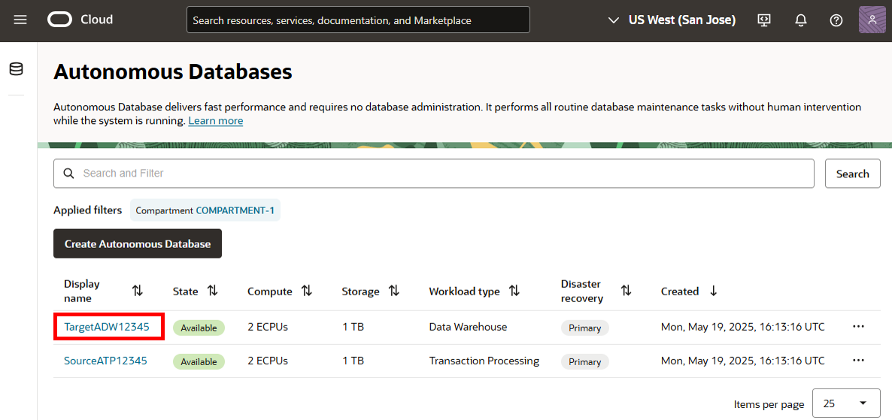

3. On the **TargetADW Details** page, from the **Database actions** dropdown, select **SQL**.

    

4. If prompted, log in to Database Actions as ADMIN, and then click **SQL**.

    > **NOTE:** If using the LiveLabs Sandbox environment, you can find the database admin password in the View Login Details panel of your workshop instructions.

5. Enter the following script and then click **Run Statement** to create a credential in ADW:

    ```
    <copy>BEGIN
    DBMS_CLOUD.CREATE_CREDENTIAL(
      credential_name => 'ADB_OBJECTSTORE',
      username => '<identity-domain>/<user-name>',
      password => '<token>'
    );
    END;
    </copy>
    ```

    > **Note:** If you're using a federated user, then the username should be in the following format: `oracle/<user-name>`

    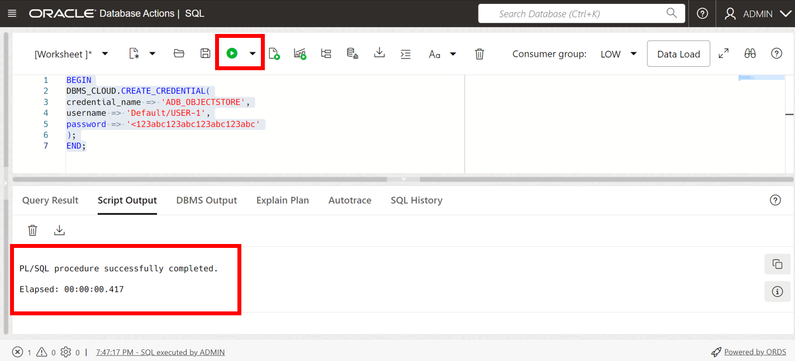

6.  Enter the following script and then click **Run Statement** to import data using ImpDP:

    ```
    <copy>DECLARE
    ind NUMBER;  -- Loop index
    h1 NUMBER;  -- Data Pump job handle
    percent_done NUMBER;  -- Percentage of job complete
    job_state VARCHAR2(30);  -- To keep track of job state
    le ku$_LogEntry;  -- For WIP and error messages
    js ku$_JobStatus;  -- The job status from get_status
    jd ku$_JobDesc;  -- The job description from get_status
    sts ku$_Status;  -- The status object returned by get_status
    BEGIN

    -- Create a (user-named) Data Pump job to do a "full" import (everything
    -- in the dump file without filtering).
    h1 := DBMS_DATAPUMP.OPEN('IMPORT','FULL',NULL,'SRCMIRROR_OCIGGLL_IMPORT');

    -- Specify the single dump file for the job (using the handle just returned)
    -- and directory object, which must already be defined and accessible
    -- to the user running this procedure. This is the dump file created by
    -- the export operation in the first example.

    DBMS_DATAPUMP.ADD_FILE(h1,'https://objectstorage.<region>.oraclecloud.com/n/<namespace>/b/<bucket-name>/o/SRC_OCIGGLL.dmp','ADB_OBJECTSTORE',null,DBMS_DATAPUMP.KU$_FILE_TYPE_URIDUMP_FILE);


    -- A metadata remap will map all schema objects from SRC_OCIGGLL to SRCMIRROR_OCIGGLL.
    DBMS_DATAPUMP.METADATA_REMAP(h1,'REMAP_SCHEMA','SRC_OCIGGLL','SRCMIRROR_OCIGGLL');

    -- If a table already exists in the destination schema, skip it (leave
    -- the preexisting table alone). This is the default, but it does not hurt
    -- to specify it explicitly.
    DBMS_DATAPUMP.SET_PARAMETER(h1,'TABLE_EXISTS_ACTION','SKIP');

    -- Start the job. An exception is returned if something is not set up properly.
    DBMS_DATAPUMP.START_JOB(h1);

    -- The import job should now be running. In the following loop, the job is
    -- monitored until it completes. In the meantime, progress information is
    -- displayed. Note: this is identical to the export example.
    percent_done := 0;
    job_state := 'UNDEFINED';
    while (job_state != 'COMPLETED') and (job_state != 'STOPPED') loop
      dbms_datapump.get_status(h1,
        dbms_datapump.ku$_status_job_error +
        dbms_datapump.ku$_status_job_status +
        dbms_datapump.ku$_status_wip,-1,job_state,sts);
        js := sts.job_status;

      -- If the percentage done changed, display the new value.
      if js.percent_done != percent_done
      then
        dbms_output.put_line('*** Job percent done = ' ||
        to_char(js.percent_done));
        percent_done := js.percent_done;
      end if;

      -- If any work-in-progress (WIP) or Error messages were received for the job, display them.
      if (bitand(sts.mask,dbms_datapump.ku$_status_wip) != 0)
      then
        le := sts.wip;
      else
        if (bitand(sts.mask,dbms_datapump.ku$_status_job_error) != 0)
        then
          le := sts.error;
        else
          le := null;
        end if;
      end if;
      if le is not null
      then
        ind := le.FIRST;
        while ind is not null loop
          dbms_output.put_line(le(ind).LogText);
          ind := le.NEXT(ind);
        end loop;
      end if;
    end loop;

    -- Indicate that the job finished and gracefully detach from it.
    dbms_output.put_line('Job has completed');
    dbms_output.put_line('Final job state = ' || job_state);
    dbms_datapump.detach(h1);
    END;</copy>
    ```

    

## Task 7: Add and run the Replicat

1.  In the navigation menu, click **Replicats**. 

2.  On the Replicats page, click **Add Replicat** (plus icon).

    

3.  In the Add Replicat panel, select **Nonintegrated Replicat**, enter `REPA` **Process Name**, and then click **Next**.

    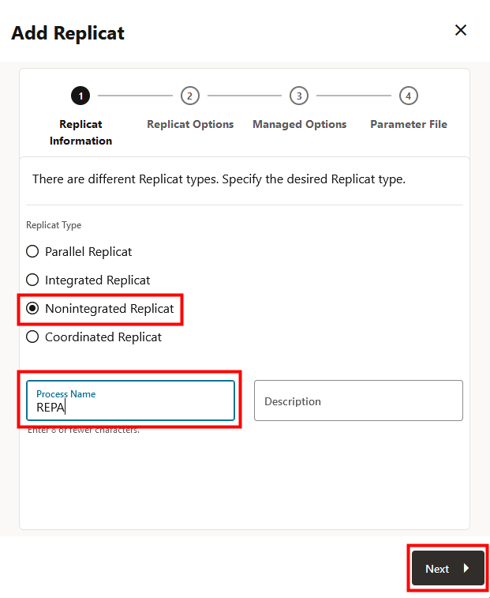

3.  On the Replicat Options page, complete the following fields, and then click **Next**: 

    * For **Replicat Trail Name**, enter `E1`.
    * For **Domain**, select **OracleGoldenGate**.
    * For **Alias**, select **TargetADW**.
    * For **Checkpoint Table**, select **"SRCMIRROR_OCIGGLL","CHECKTABLE"**.

    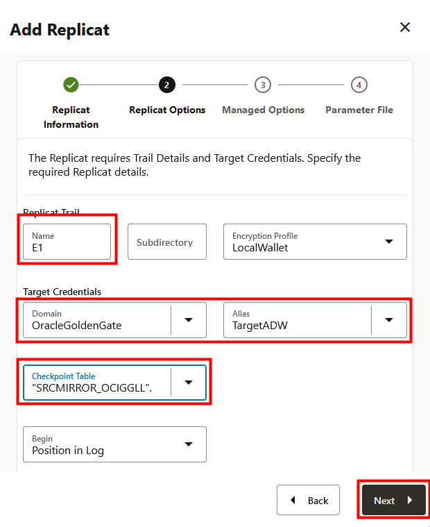

4.  On the **Managed Options** page, enable **Critical to deployment health**, and then click **Next**.

    

5.  On the **Parameter File** page, in the text area, replace **MAP \*.\*, TARGET \*.\*;** with the following script:

    ```
    <copy>-- Capture DDL operations for listed schema tables
    --
    ddl include mapped
    --
    -- Add step-by-step history of ddl operations captured
    -- to the report file. Very useful when troubleshooting.
    --
    ddloptions report
    --
    -- Write capture stats per table to the report file daily.
    --
    report at 00:01
    --
    -- Rollover the report file weekly. Useful when PR runs
    -- without being stopped/started for long periods of time to
    -- keep the report files from becoming too large.
    --
    reportrollover at 00:01 on Sunday
    --
    -- Report total operations captured, and operations per second
    -- every 10 minutes.
    --
    reportcount every 10 minutes, rate
    --
    -- Table map list for apply
    --
    DBOPTIONS ENABLE_INSTANTIATION_FILTERING;
    MAP SRC_OCIGGLL.*, TARGET SRCMIRROR_OCIGGLL.*;</copy>
    ```

    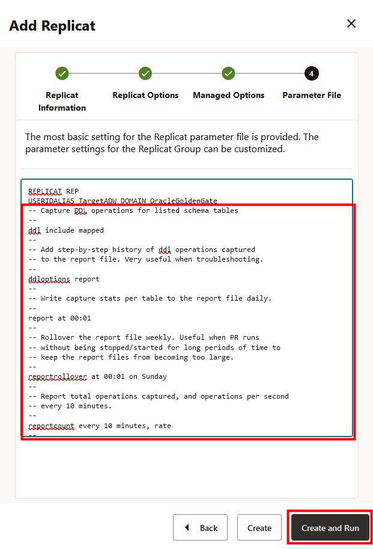

    > **Note:** 'DBOPTIONS ENABLE\_INSTATIATION\_FILTERING' enables CSN filtering on tables imported using Oracle Data Pump. For more information, see [DBOPTIONS Reference](https://docs.oracle.com/pls/topic/lookup?ctx=en/cloud/paas/goldengate-service/using&id=GWURF-GUID-BA8C0CED-D87F-4106-862E-4AD22D910160).

6.  Click **Create and Run**. Your Replicat appears after a few moments.

    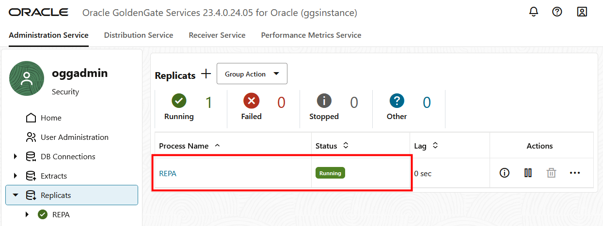

## Task 8: Perform Inserts to the Source Database

1.  Return to the Oracle Cloud Console and use the navigation menu (hamburger icon) to navigate back to **Oracle Database**, **Autonomous Transaction Processing**, and then **SourceATP**.

    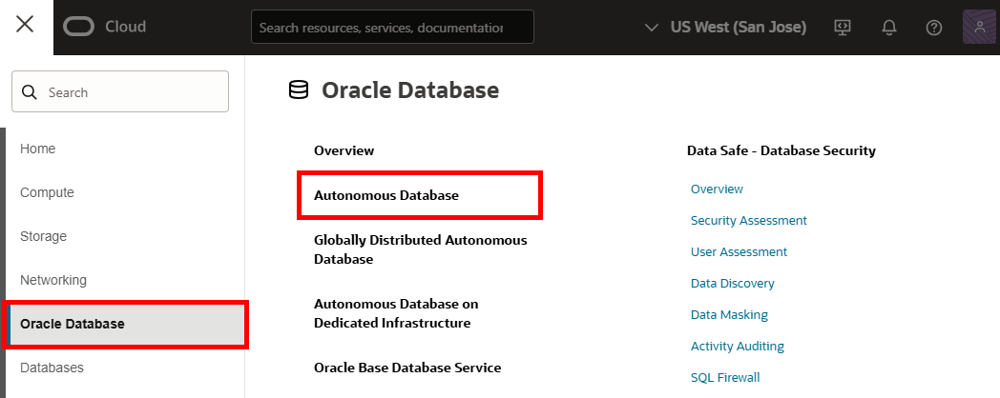

    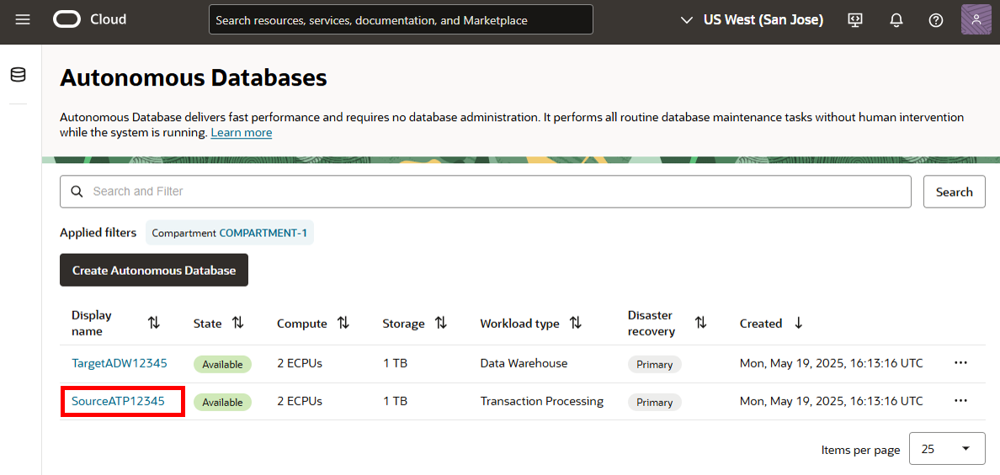

2.  On the Source ATP Details page, click **Database Actions**, then **SQL**.
    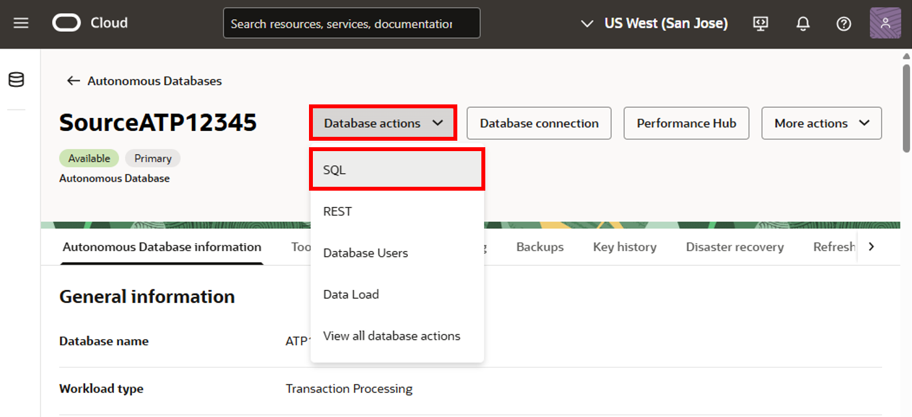

3.  Enter the following inserts, and then click **Run Script**:

    ```
    <copy>Insert into SRC_OCIGGLL.SRC_CITY (CITY_ID,CITY,REGION_ID,POPULATION) values (1000,'Houston',20,743113);
    Insert into SRC_OCIGGLL.SRC_CITY (CITY_ID,CITY,REGION_ID,POPULATION) values (1001,'Dallas',20,822416);
    Insert into SRC_OCIGGLL.SRC_CITY (CITY_ID,CITY,REGION_ID,POPULATION) values (1002,'San Francisco',21,157574);
    Insert into SRC_OCIGGLL.SRC_CITY (CITY_ID,CITY,REGION_ID,POPULATION) values (1003,'Los Angeles',21,743878);
    Insert into SRC_OCIGGLL.SRC_CITY (CITY_ID,CITY,REGION_ID,POPULATION) values (1004,'San Diego',21,840689);
    Insert into SRC_OCIGGLL.SRC_CITY (CITY_ID,CITY,REGION_ID,POPULATION) values (1005,'Chicago',23,616472);
    Insert into SRC_OCIGGLL.SRC_CITY (CITY_ID,CITY,REGION_ID,POPULATION) values (1006,'Memphis',23,580075);
    Insert into SRC_OCIGGLL.SRC_CITY (CITY_ID,CITY,REGION_ID,POPULATION) values (1007,'New York City',22,124434);
    Insert into SRC_OCIGGLL.SRC_CITY (CITY_ID,CITY,REGION_ID,POPULATION) values (1008,'Boston',22,275581);
    Insert into SRC_OCIGGLL.SRC_CITY (CITY_ID,CITY,REGION_ID,POPULATION) values (1009,'Washington D.C.',22,688002);</copy>
    ```

    

5.  In the OCI GoldenGate deployment console navigation menu, click **Extracts**, then **Extract name (EXTA)**, and then **Statistics**. Verify that **SRC\_OCIGGLL.SRC\_CITY** is listed with 10 inserts.

    

6.  In the navigation menu, click **Replicats**, then **Replicat name (REPA)**, and then **Statistics**. Verify that **SRC\_OCIGGLL.SRC\_CITY** is listed with 10 inserts.

    


## Learn more

* [Add an Extract](https://docs.oracle.com/en/cloud/paas/goldengate-service/eeske/)
* [Add a Replicat](https://docs.oracle.com/en/cloud/paas/goldengate-service/cress/)

## Acknowledgements
* **Author** - Jenny Chan, Consulting User Assistance Developer, Database User Assistance
* **Contributors** -  Julien Testut, Database Product Management; Katherine Wardhana, User Assistance Developer
* **Last Updated By/Date** - Jenny Chan, June 2024