# Replicate data from target to source

## Introduction

Now that replication is established and verified from the source database to the target database, you can set up bidirectional replication from the target to the source. This lab walks you through the steps create and run an Extract on the target, and create and run a Replicat on the source in the Oracle Cloud Infrastructure (OCI) GoldenGate Deployment Console.

Estimated time: 20 minutes

### About Extracts and Replicats

An Extract is a process that extracts, or captures, data from a source database. A Replicat is a process that delivers data to a target database.

### Objectives

In this lab, you will:
* Add and run an Extract
* Add and run a Replicat
* Verify the replication from Autonomous Data Warehouse to Autonomous Transaction Processing

### Prerequisites

This lab assumes that you completed all preceding labs, and your deployment is in the Active state.

## Task 1: Add and run an Extract

First, create the Extract for the target (ADW) database.

1.  In the navigation menu, click **Extracts**.

2.  On the Extracts page, click **Add Extract** (plus icon).
    
    

3.  In the Add Extract panel, select **Integrated Extract**, enter `EXTB` for **Process Name**, and then click **Next**.
    
    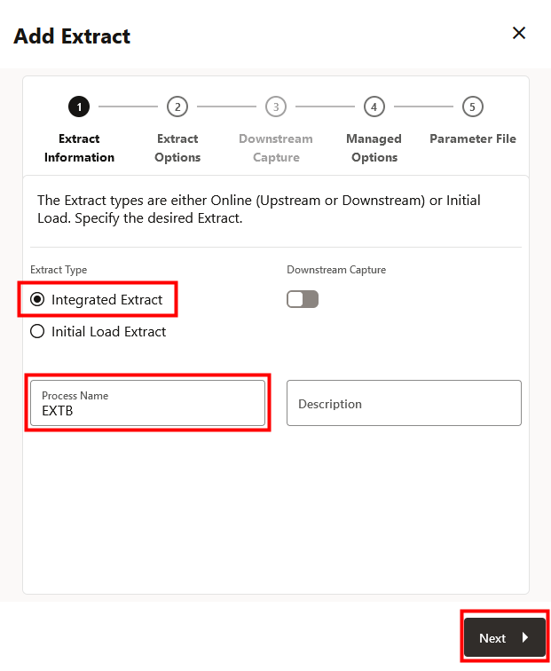

4.  On the Extract Options page, complete the following fields and then click **Next**: 

    * From the **Domain** dropdown, select **OracleGoldenGate**.
    * From the **Alias** dropdown, select **TargetADW**.
    * For Extract **Trail Name**, enter `E2` 

    

7.  On the Managed Options page, enable **Critical to deployment health**, and then click **Next**.

    

9.  On the Parameter File page, in the text area, add a new line under EXTTRAIL E2, and then add the following:

    ```
    <copy>-- Table list for capture
    table SRCMIRROR_OCIGGLL.*;

    -- Exclude changes made by GGADMIN
    tranlogoptions excludeuser ggadmin</copy>
    ```

    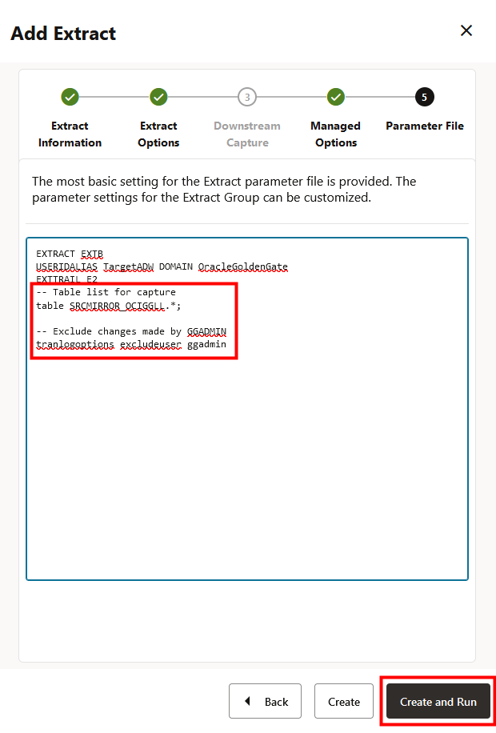

10. Click **Create and Run**. The EXTB Extract process appears after a few moments.

    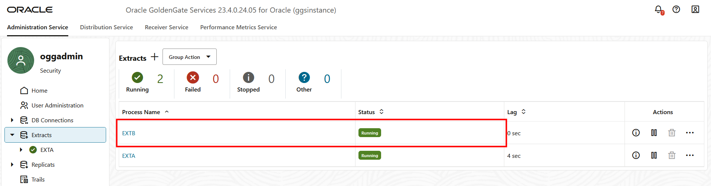

## Task 2: Add and run the Replicat

Next, create the Replicat on the source (ATP) database.

1.  In the navigation menu, click **Replicats**. 

2.  On the Replicats page, click **Add Replicat** (plus icon).

    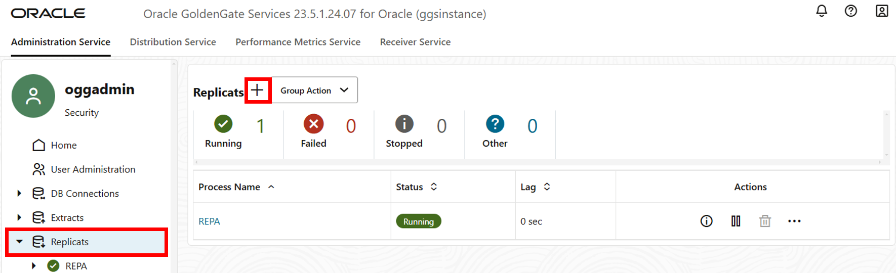

3.  In the Add Replicat panel, on the Replicat Information page, select **Nonintegrated Replicat**, enter `REPB` for Process Name, and then click **Next**.

    

4.  On the Replicat Options page, complete the following fields, and then click **Next**:

    * For Replicat Trail **Name**, enter `E2`.
    * From the Target Credential **Domain** dropdown, select **OracleGoldenGate**.
    * From the Target Credential **Alias** dropdown, select **SourceATP**.
    * For Checkpoint Table, select **"SRC\_OCIGGLL"."ATP\_CHECKTABLE"**.

        > **NOTE**: The Checkpoint Table may take a few moments to populate.

    

5.  On the Managed Options page, enable **Critical to deployment health**, and then click **Next**.

    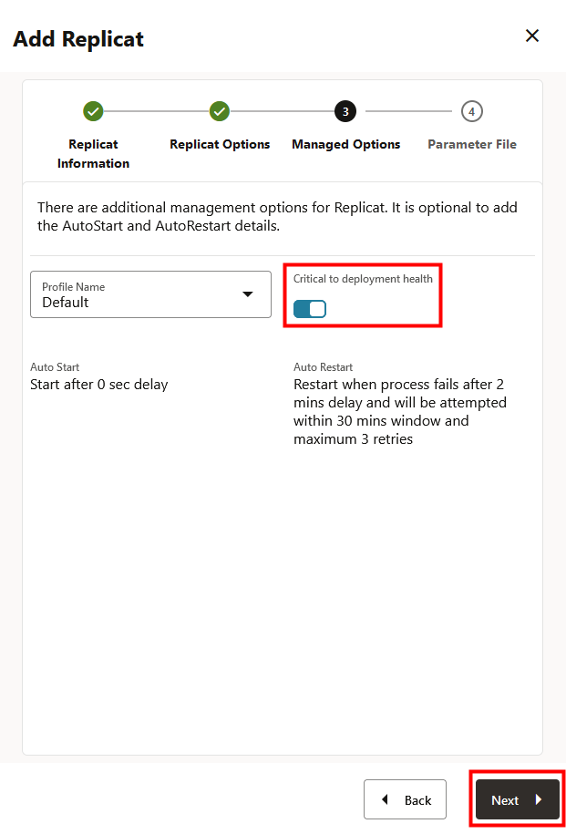

10. On the Parameter File page, in the text area, replace **MAP \*.\*, TARGET \*.\*;** with the following:

    ```
    <copy>MAP SRCMIRROR_OCIGGLL.*, TARGET SRC_OCIGGLL.*;</copy>
    ```
    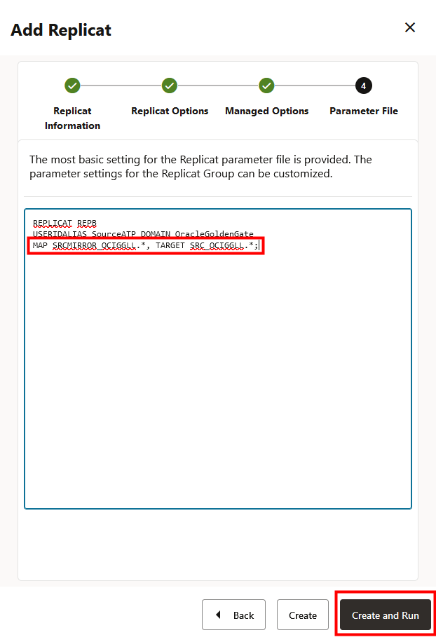

11. Click **Create and Run**. The new Replicat appears after a few moments. 

    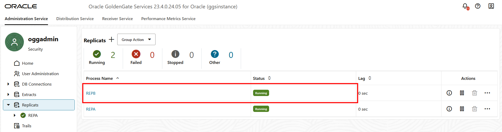

## Task 3: Perform Inserts into the target database

1.  Return to the Oracle Cloud Console and use the navigation menu (hamburger icon) to navigate back to **Oracle Database**, **Autonomous Database**, and then **TargetADW**.

    

    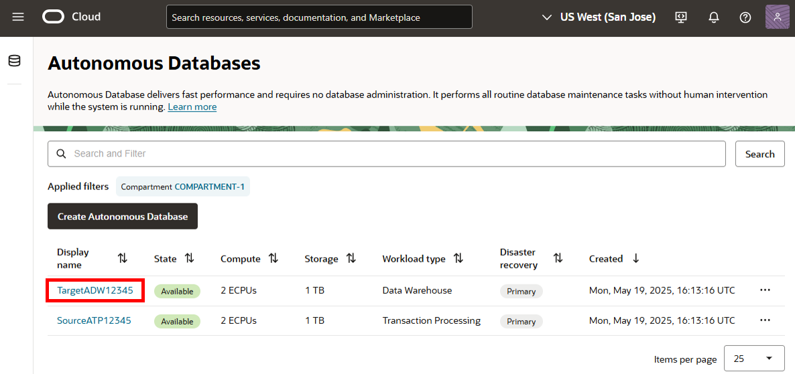

2.  On the Target ADW Details page, click **Database Actions**, then **SQL**.

    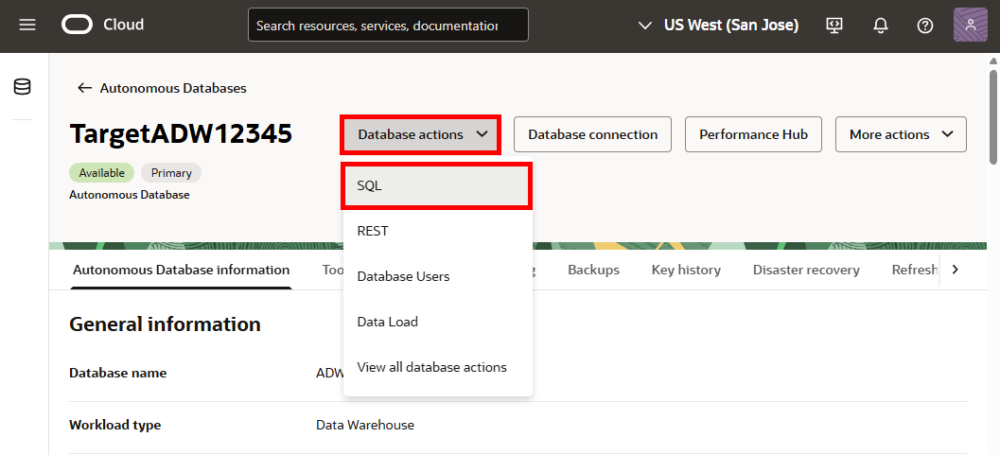

3.  Enter the following inserts, and then click **Run Script**:

    ```
    <copy>Insert into SRCMIRROR_OCIGGLL.SRC_CITY (CITY_ID,CITY,REGION_ID,POPULATION) values (2000,'Houston',20,743113);
Insert into SRCMIRROR_OCIGGLL.SRC_CITY (CITY_ID,CITY,REGION_ID,POPULATION) values (2001,'Dallas',20,822416);
Insert into SRCMIRROR_OCIGGLL.SRC_CITY (CITY_ID,CITY,REGION_ID,POPULATION) values (2002,'San Francisco',21,157574);
Insert into SRCMIRROR_OCIGGLL.SRC_CITY (CITY_ID,CITY,REGION_ID,POPULATION) values (2003,'Los Angeles',21,743878);
Insert into SRCMIRROR_OCIGGLL.SRC_CITY (CITY_ID,CITY,REGION_ID,POPULATION) values (2004,'San Diego',21,840689);
Insert into SRCMIRROR_OCIGGLL.SRC_CITY (CITY_ID,CITY,REGION_ID,POPULATION) values (2005,'Chicago',23,616472);
Insert into SRCMIRROR_OCIGGLL.SRC_CITY (CITY_ID,CITY,REGION_ID,POPULATION) values (2006,'Memphis',23,580075);
Insert into SRCMIRROR_OCIGGLL.SRC_CITY (CITY_ID,CITY,REGION_ID,POPULATION) values (2007,'New York City',22,124434);
Insert into SRCMIRROR_OCIGGLL.SRC_CITY (CITY_ID,CITY,REGION_ID,POPULATION) values (2008,'Boston',22,275581);
Insert into SRCMIRROR_OCIGGLL.SRC_CITY (CITY_ID,CITY,REGION_ID,POPULATION) values (2009,'Washington D.C.',22,688002);</copy>
    ```
    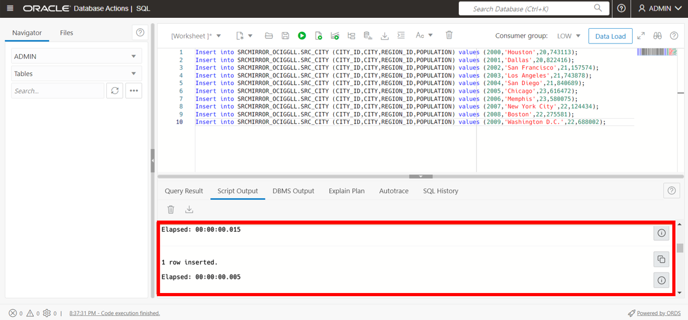

4.  In the OCI GoldenGate deployment console navigation menu, click **Extracts**, then **Extract name (EXTB)**, and then click **Statistics**. Verify that **SRC\_OCIGGLL.SRC\_CITY** is listed with 10 inserts.

    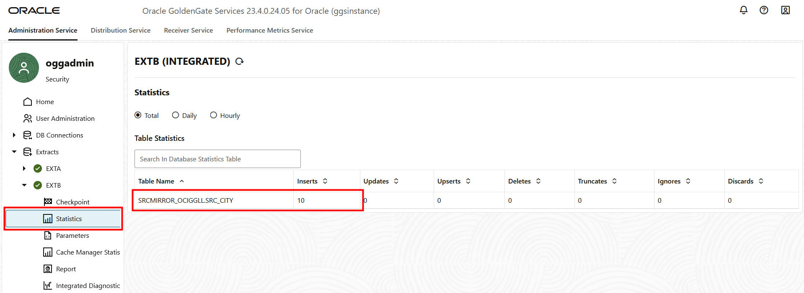

5.  Go back to the Overview screen, click the **Replicat name (REPB)**, and then click **Statistics**. Verify that **SRC\_OCIGGLL.SRC\_CITY** is listed with 10 inserts.

    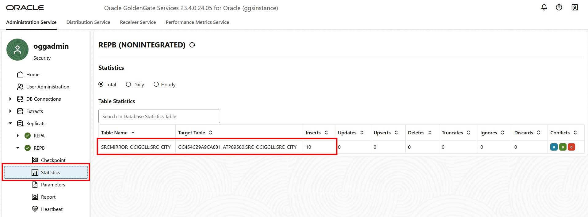


## Learn more

* [Add an Extract](https://docs.oracle.com/en/cloud/paas/goldengate-service/eeske/index.html)
* [Add a Replicat](https://docs.oracle.com/en/cloud/paas/goldengate-service/cress/index.html)

## Acknowledgements
* **Author** - Jenny Chan, Consulting User Assistance Developer, Database User Assistance
* **Contributors** -  Julien Testut, Database Product Management; Katherine Wardhana, User Assistance Developer
* **Last Updated By/Date** - Katherine Wardhana, June 2025
