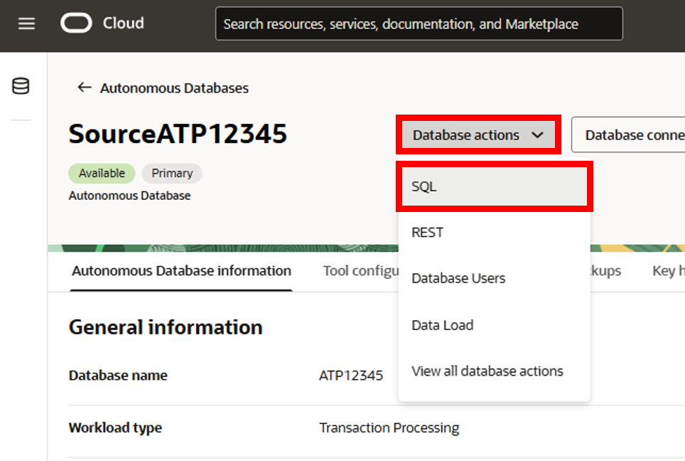

<!--
    {
        "name":"Load the ATP schema",
        "description":"Load the ATP schema"
    }
-->
1.  Download the database schema:

    [Archive.zip](https://objectstorage.us-ashburn-1.oraclecloud.com/p/VEKec7t0mGwBkJX92Jn0nMptuXIlEpJ5XJA-A6C9PymRgY2LhKbjWqHeB5rVBbaV/n/c4u04/b/livelabsfiles/o/data-management-library-files/Archive.zip)

2.  Save `Archive.zip` to a download directory, and then unzip the file.

3.  Back in the Oracle Cloud console, select your ATP instance from the Autonomous Databases page to view its details and access tools.

    

4.  On the SourceATP Database Details page, click **Database actions**, and then select **SQL** from the dropdown. If the Database actions menu takes too long to load, you can click **View all database actions** directly, and then select **SQL** from the Database actions page.

    

5.  If prompted, log in with the ADMIN user and password provided when you created the ATP instance.

    

6.  (Optional) Close the Help dialog.

7.  Copy and paste the SQL script from **OCIGGLL\_OCIGGS\_SETUP\_USERS\_ATP.sql** into the SQL Worksheet.

    

8.  Click **Run Script**. The Script Output tab displays confirmation messages.

9. Copy and paste the SQL script from **OCIGGLL\_OCIGGS\_SRC\_USER\_SEED\_DATA.sql** a new SQL Worksheet.

    

10. Click **Run Script**. The Script Output tab displays confirmation messages.

	> **Note:** If you find that running the entire script does not create the tables, then try running each table creation and insert statements one at a time until all the tables are created. You may also need to relaunch SQL to continue running the scripts until all tables are created and populated.

11. Close the SQL window and then reopen it from Database Actions again.

12. In the Navigator tab, look for the SRC\_OCIGGLL schema and then select tables from their respective dropdowns to verify the schema and tables were created. You may need to log out and log back in if you can't locate SRC\_OCIGGLL.

    

13. To enable supplemental logging, run the following command:

    ```
    <copy>ALTER PLUGGABLE DATABASE ADD SUPPLEMENTAL LOG DATA;</copy>
    ```