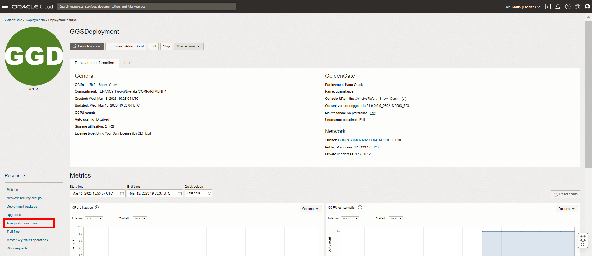

<!--
    {
        "name":"Assign connections to the deployment",
        "description":"Assign connections to the deployment"
    }
-->
1. On the Deployment details page, click **Assigned connections**.

    

2. Click **Assign connection**.

    

3. In the Assign connection dialog, from the Connection in &lt;compartment-number&gt;-COMPARTMENT dropdown, select **SourceATP**. Click **+ Another connection**. From the Connection in &lt;compartment-number&gt;-COMPARTMENT dropdown, select **TargetADW**. Click **Assign connection**.

    

4. Click **Close**.

    

    