# Create the Oracle Cloud Infrastructure GoldenGate resources

## Introduction

This lab walks you through the steps to create Oracle Cloud Infrastructure (OCI) GoldenGate resources that you'll need to complete this workshop.

Estimated time: 30 minutes

### About Oracle Cloud Infrastructure GoldenGate resources

An Oracle Cloud Infrastructure GoldenGate deployment manages the resources it requires to function. You can create different deployments types such as, Oracle Database, MySQL, or Big Data. The GoldenGate deployment also lets you access the GoldenGate deployment console, where you can access the OCI GoldenGate deployment console to create and manage processes such as Extracts and Replicats.

Connections capture source and target credential information. A connection also enables networking between the Oracle Cloud Infrastructure (OCI) GoldenGate service tenancy virtual cloud network (VCN) and your tenancy VCN using a private endpoint.

### Objectives

In this lab, you will:
* Locate Oracle Cloud Infrastructure GoldenGate in the Console
* Create an OCI GoldenGate deployment for MongoDB Database
* Create an OCI GoldenGate deployment for Autonomous Data Warehouse
* Create connections for the source MongoDB System and target Autonomous Data Warehouse
* Assign connections to deployments

### Prerequisites

This lab assumes you completed the environment set up lab, if you're running this workshop on your own tenancy.

## Task 1: Create a deployment for MongoDB Database

1.  Open the Oracle Cloud console navigation menu, click **Oracle Database**, and then click **GoldenGate**.

    

2.  On the GoldenGate **Overview** page, click **Deployments**.

    

3.  You may need to select a compartment.

    > **Note:** If you're running this workshop in a LiveLabs sandbox, then under List Scope, from the Compartment dropdown, expand the root compartment, and select the compartment associated with your username. For example, if your LiveLab username is LL1234-user, expand root, and then select the compartment **LL1234-COMPARTMENT**.

4.  On the Deployments page, click **Create Deployment**.

    

5.  In the Create Deployment panel, enter `MongoDBDeployment` for **Name**.

6.  From the Compartment dropdown, select a compartment.

7.  For OCPU Count, enter `1`.

8.  For **Subnet**, select a subnet.

    > **Note:** If you're using the workshop environment, select **&lt;user&gt;pubsubnt**.

9.  For **License type**, select **Bring Your Own License (BYOL)**.

10. Click **Show Advanced Options**, and then select **Enable GoldenGate console public access**.

11. Click **Next**.

  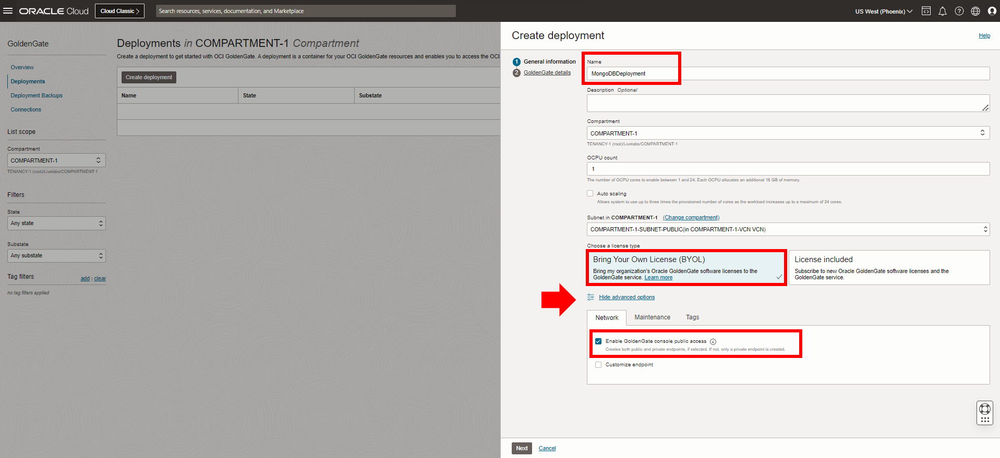

12. From the Select a technology dropdown, select **Big Data**.

13. For GoldenGate Instance Name, enter `MongoDB-Instance`.

14. For Administrator Username, enter `oggadmin`.

15. For Administrator Password, enter a password. Take note of this password.

16. Click **Create**.

  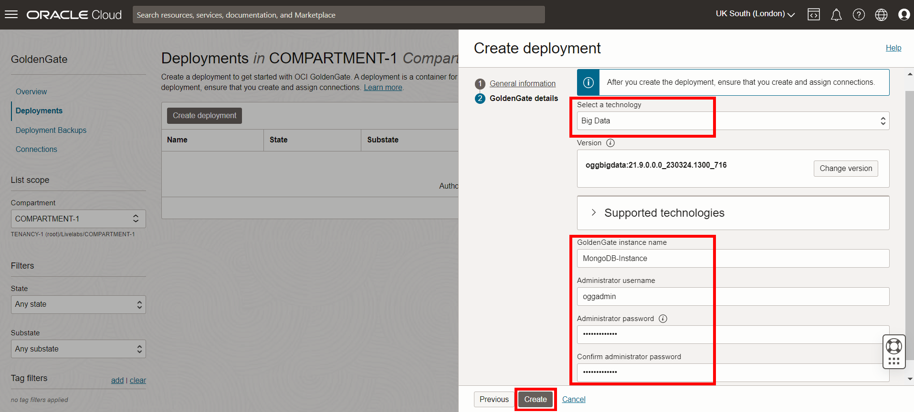

You're brought to the Deployment Details page. It takes a few minutes for the deployment to be created. Its status will change from CREATING to ACTIVE when it is ready for you to use.

## Task 2: Create a deployment for Autonomous JSON Database

1.  On the Deployments page, click **Create Deployment**.

2.  In the Create Deployment panel, enter `AJDBdeployment` for **Name**.

3.  From the Compartment dropdown, select a compartment.

4.  For OCPU Count, enter **1**.

5.  For Subnet, select a subnet.

    >**Note:** If you're using the workshop environment, select **&lt;user&gt;pubsubnt**.

6.  For License type, select **Bring You Own License (BYOL)**.

7.  Click **Show Advanced Options**, and then select **Enable GoldenGate console public access**.

8.  Click **Next**.

  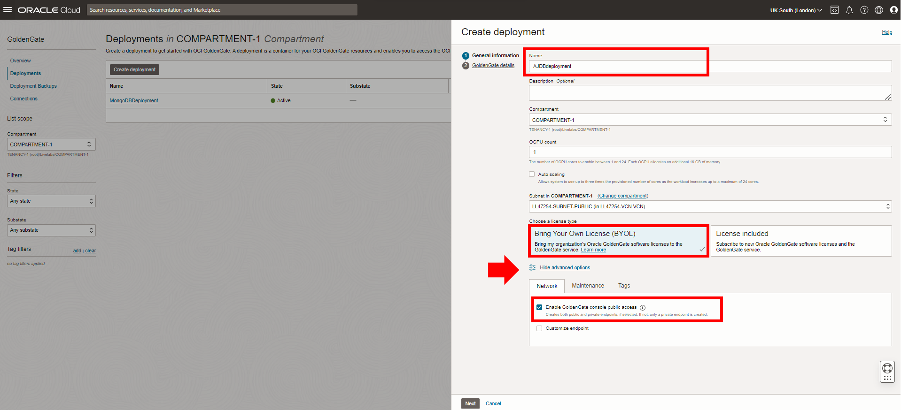

9.  From the Select a technology dropdown, select **Big Data**.

10. For GoldenGate Instance Name, enter `AJDBinstance`.

11. For Administrator Username, enter `oggadmin`.

12. For Administrator Password, enter a password. Take note of this password.

13. Click **Create**.

  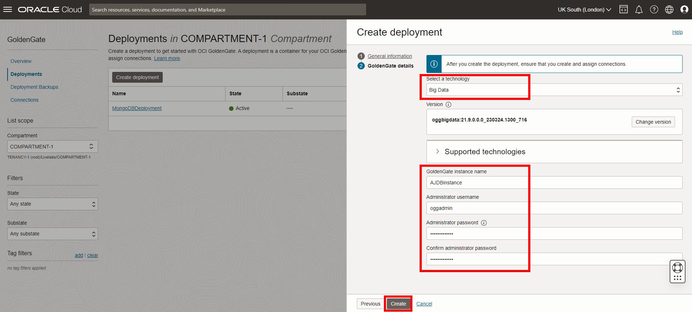

You're brought to the Deployment Details page. It takes a few minutes for the deployment to be created. Its status will change from CREATING to ACTIVE when it is ready for you to use.

## Task 3: Create a connection to the source MongoDB database

1.  Use the Oracle Cloud Console breadcrumb to navigate back to the Deployments page.

    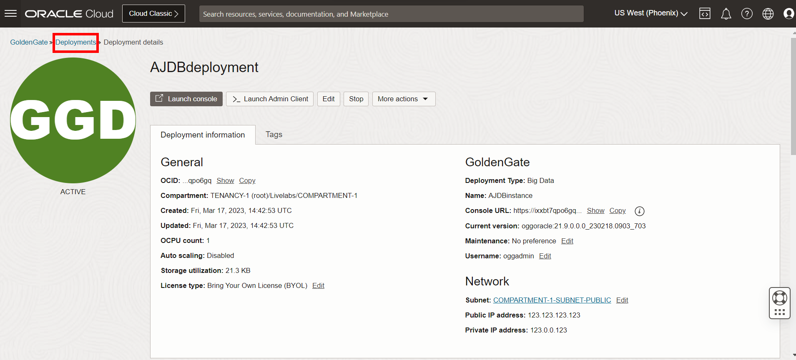

2.  In the GoldenGate menu, click **Connections**.

    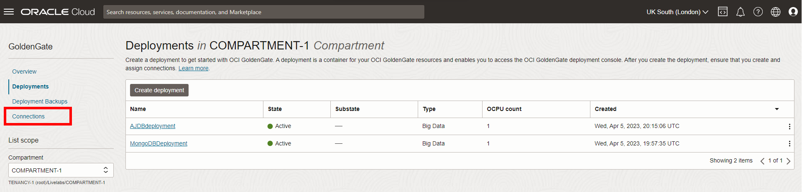

3.  Click **Create Connection**.

    

4.  In the Create Connection panel, for Name, enter `SourceMongoDB`.

5.  From the Type dropdown, select **Oracle Autonomous JSON Database**.

    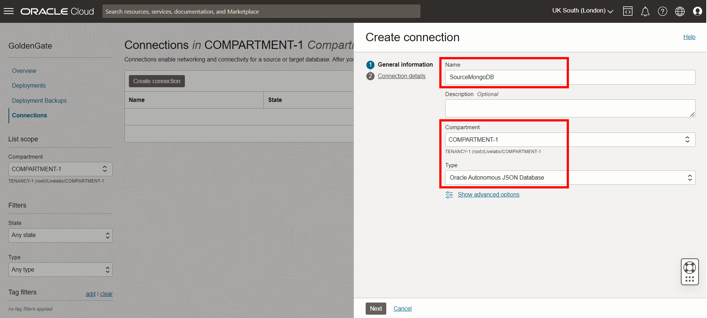

6.  Click **Next**.

7.  Select the source MongoDB Database system (SourceMongoDB) from the Database system dropdown.

8.  For Database name, enter `SRC_OCIGGLL`.

    >**Note:** *If running this lab on your own tenancy using the sample scripts provided, this is the name of the database table created in the environment setup lab.*

9.  For Database username, enter `ggadmin`.

10. For Database user password, enter the password for the `ggadmin` user in the Password field, and then click **Create**.

    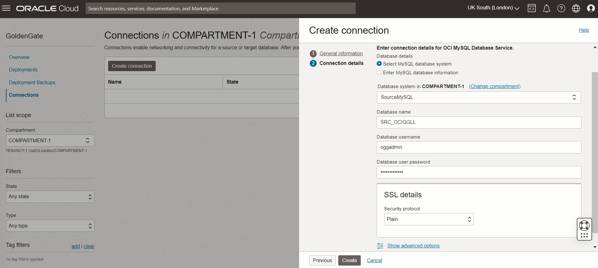

The connection becomes Active after a few minutes. Return to the Connections page.

## Task 4: Create a connection to the target Autonomous Data Warehouse

1.  On the Connections page, click **Create Connection**

2.  In the Create Connection panel, for **Name**, enter `TargetJSON`.

3.  From the **Type** dropdown, select **Oracle Autonomous Data Warehouse**.

    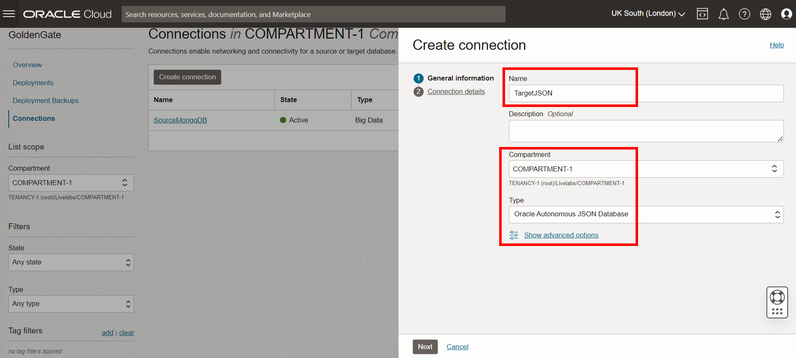

4.  Click **Next**.

5.  Under **Database details**, choose **Select database**.

6.  From the **Database** dropdown, select the Autonomous Data Warehouse (TargetADW).

7.  For **Password**, enter the password for the `ggadmin` user.

    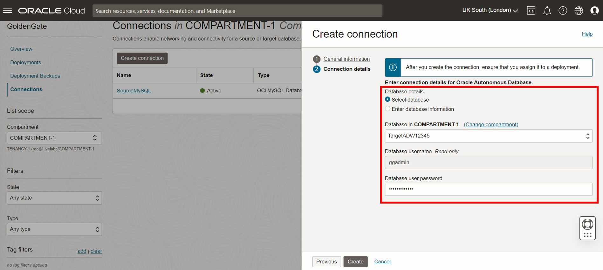

8.  Click **Create**.

The connection becomes Active after a few minutes.

## Task 5: Assign connections to deployments

After your deployments and connections are active, you can assign the connections to the appropriate deployments.

1.  In the GoldenGate menu, click **Deployments**.

2.  Select **MongoDBDeployment** to view its details.

3.  On the MongoDBDeployment details page, under Resources, click **Assigned connections**.

    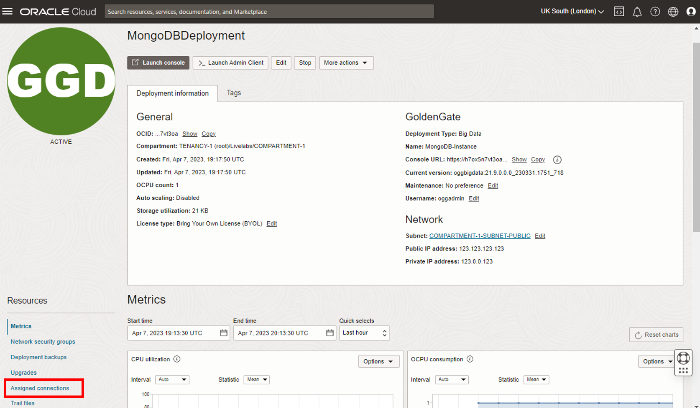

4.  Under Assigned connections, click **Assign connection**.

    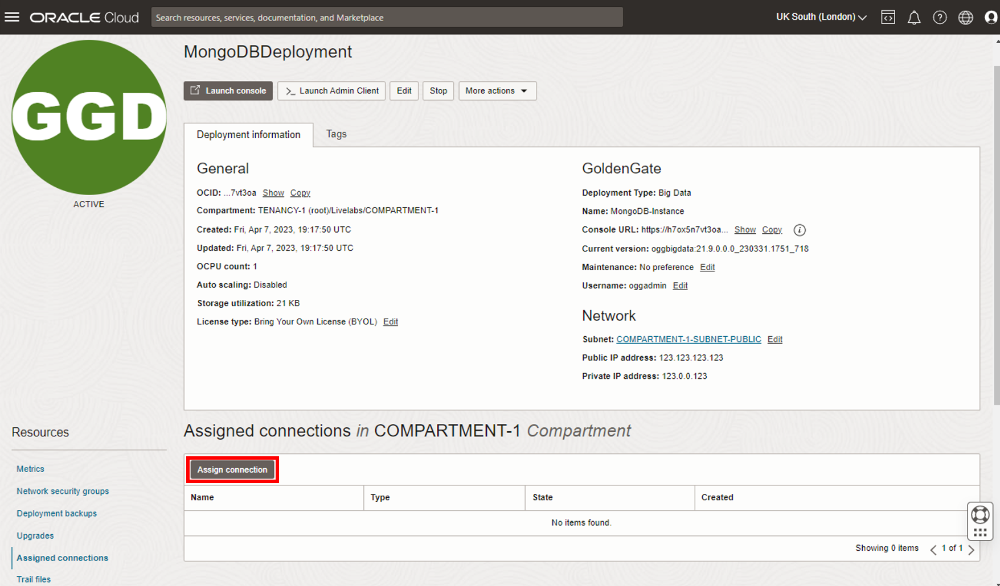

5.  In the Assign connection dialog, from the **Connection** dropdown, select **MongoDB**, and then click **Assign connection**.

    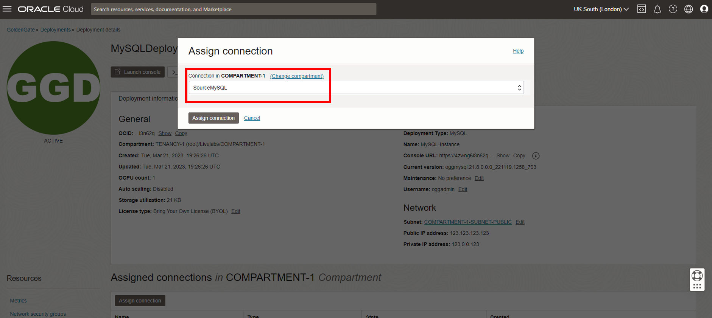

    The connection appears in the Assigned Connections list.

6.  Use the breadcrumb to return to the Deployments page.

    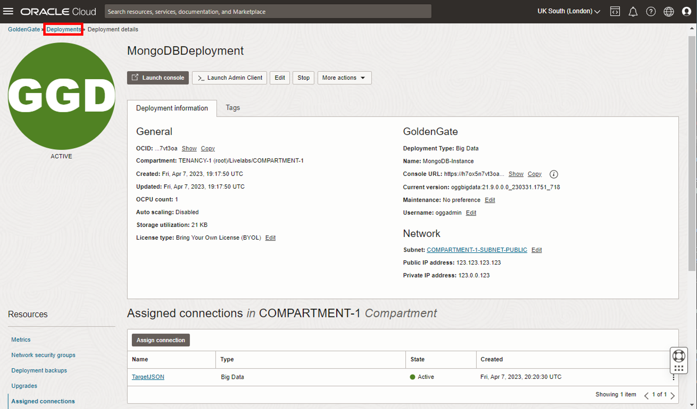

7.  Repeat steps 2 to 6 to assign the **TargetJSON** connection to the **AJDBdeployment**.

    

## Task 6: (Optional) Create a GoldenGate connection

Create a GoldenGate connection if your ADW deployment doesn't have a public endpoint, then assign it to the source MongoDB deployment.

1.  On the Connections page, click **Create Connection**.

2.  In the Create connection panel, enter a **Name** and **Description**.

3.  For **Compartment**, select the compartment in which to create this connection.

4.  For **Type**, select **GoldenGate**.

5.  Click **Next**.

6.  For Connection details, select **ADWDeployment**.

7.  Under Network connectivity, select **Network connectivity via private endpoint**.

8.  For **Subnet**, select the subnet to which a private endpoint is created from the OCI GoldenGate service tenancy.

9.  For **Private IP address**, enter the private IP for the ADWDeployment.

10. Click **Create**.

11. After the connection is active, on its details page, under **Resources**, click **Assigned deployments**.

12. Click **Assign deployment**.

13. In the Assign deployment dialog, select the source **MongoDBDeployment**, and then click **Assign deployment**.

**Proceed to the next lab**.

## Learn more

* [Create a deployments](https://docs.oracle.com/en/cloud/paas/goldengate-service/llyhq/index.html)
* [Create a connection to Autonomous Database](https://docs.oracle.com/en/cloud/paas/goldengate-service/tqrlh/index.html)
* [Create a connection to OCI Object Storage](https://docs.oracle.com/en/cloud/paas/goldengate-service/sjsrj/index.html)
* [Assign connections to a deployment](https://docs.oracle.com/en/cloud/paas/goldengate-service/qsqts/index.html)

## Acknowledgements
* **Author** - Jenny Chan, Consulting User Assistance Developer, Database User Assistance
* **Contributors** -  Julien Testut, Database Product Management
* **Last Updated By/Date** - Jenny Chan, October 2022
* **PAR Expiration** - February 2024
