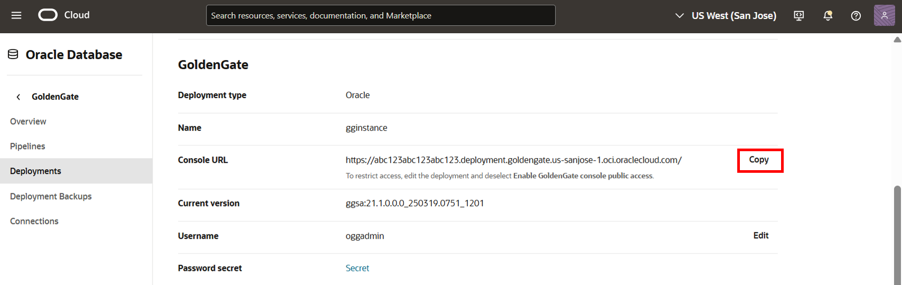
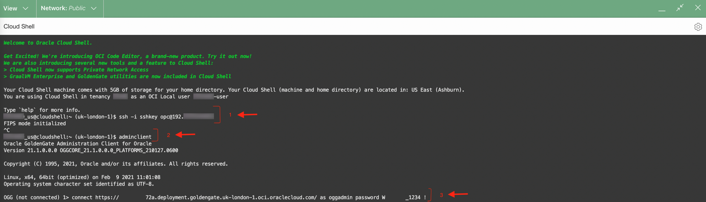

# Use Admin Client to view Extract statistics and Log messages

## Introduction

This is an optional lab that guides you on how to connect to the on premise or Marketplace Oracle GoldenGate Admin Client and use it to view all running processes, Extract statistics, log messages, and purge unused files.

Estimated time: 5 minutes

### About the Admin Client
The Admin Client is a command line utility that uses Microservices REST API to control and configure tasks in an Oracle GoldenGate deployment. You can also use the Admin Client to create, modify, and remove processes.

### Objectives

In this lab, you will:
* Connect to the Admin Client
* Run various commands

### Prerequisites

This lab assumes you successfully completed all preceding labs.

## Task 1: Retrieve the OCI GoldenGate Deployment URL

1.  Log in to Oracle Cloud Infrastructure.

2.  From the navigation menu, under **Oracle Database**, select **GoldenGate**.

    

3.  From the list of OCI GoldenGate deployments, select the deployment you created for this LiveLab.

4.  In the Deployment Details page, next to **Console URL** click **Copy**.

    

## Task 2: Connect to the Admin Client

1.  SSH into the Marketplace Oracle GoldenGate instance.

    ```
    <copy>ssh -i <private-SSH-key> opc@<ip-address></copy>
    ```

2.  Change directories to **/u01/app/ogg/bin**, and then start the Admin Client:

    ```
    <copy>adminclient</copy>
    ```

3.  Connect to the OCI GoldenGate deployment:

    ```
    <copy>connect <OCI-GoldenGate-deployment-url> as oggadmin password <oggadmin-password> !</copy>
    ```
    > **Note:** The exclamation point (!) is very important. Without it, the command fails and returns an error.

    

4.  After connecting successfully, you can run any of the following commands:

    Display the status of OCI GoldenGate processes:
    ```
    <copy>info all</copy>
    ```

    

    View statistics of your Extract:
    ```
    <copy>stats <extract-name></copy>
    ```
    

    View the content of a ggserror log file:
    ```
    <copy>view messages</copy>
    ```

    If your deployment had running Extract processes, then you can also purge old unused trail files using:
    ```
    <copy>purge exttrail <trail-file-name></copy>
    ```

## Learn More
* [Using the Admin Client](https://docs.oracle.com/en/middleware/goldengate/core/21.3/admin/getting-started-oracle-goldengate-process-interfaces.html)

## Acknowledgements
* **Author** - Jenny Chan, Consulting User Assistance Developer, Database User Assistance
* **Contributors** -  Julien Testut, Database Product Management; Katherine Wardhana, User Assistance Developer
* **Last Updated By/Date** - Katherine Wardhana, May 2023
