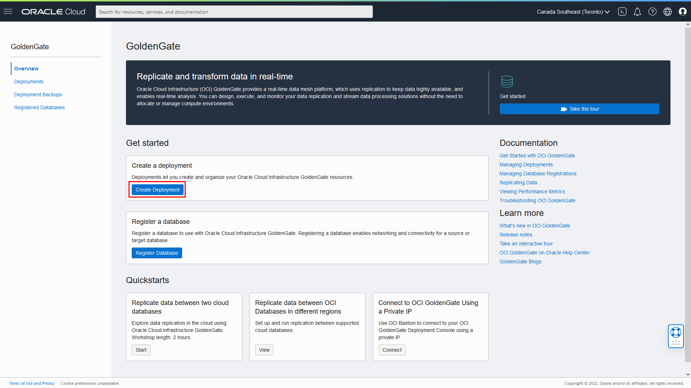
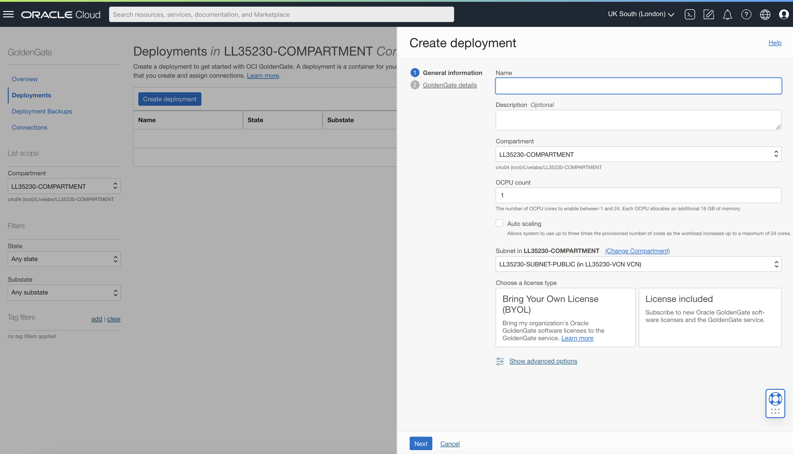
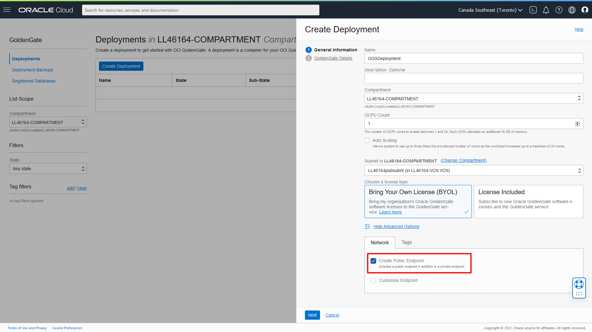
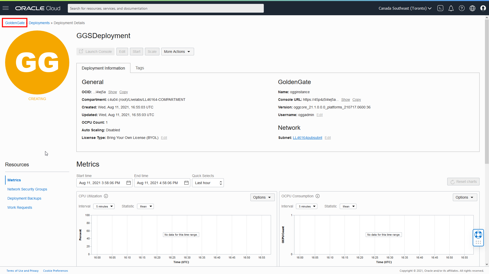
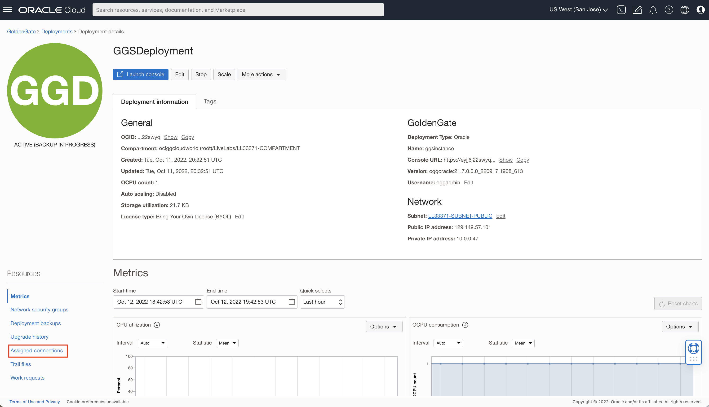
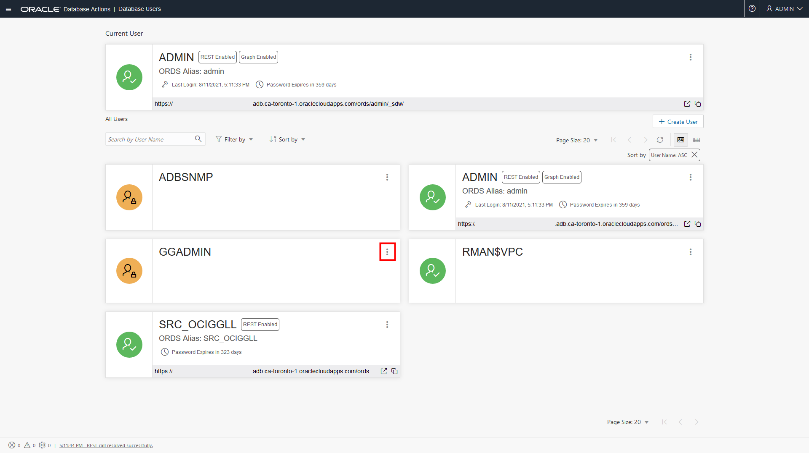

# Create the Oracle Cloud Infrastructure GoldenGate Resources

## Introduction

This lab walks you through the steps to create an Oracle Cloud Infrastructure (OCI) GoldenGate Deployment and register databases.

Estimated Time: 20 minutes

### About Oracle Cloud Infrastructure GoldenGate Resources

A OCI GoldenGate **deployment** manages the resources it requires to function. The deployment also lets you access the GoldenGate deployment console, where you can create and manage GoldenGate processes such as Extracts, Replicats, and paths.

A **database registration** captures source or target database credential information and syncs the information to OCI GoldenGate.

### Objectives

In this lab, you will:

* Create an OCI GoldenGate deployment
* Register the source and target databases
* Enable the GGADMIN user and supplemental logging
* Review the OCI GoldenGate deployment details
* Access the OCI GoldenGate deployment console

### Prerequisites

This lab assumes that you completed all preceding labs.

## Task 1: Create a Deployment

> **Note:** *The compartment names in the screenshots may differ from values that appear in your environment.*

1.  Open the **Navigation Menu**, navigate to **Oracle Database**, and select **GoldenGate**.

    

    You're brought to the **Overview** page.

    

2.  Click **Create Deployment**.

    

3.  In the Create Deployment panel, enter **GGSDeployment** for Name.

4.  From the Compartment dropdown, select your compartment.

5.  For OCPU Count, enter **1**.

6.  For Subnet, select the public subnet you created in Lab 1. You may need to click **Change Compartment** to locate your subnet.

7.  For License type, select **Bring You Own License (BYOL)**.

8.  Click **Show Advanced Options**, and then select **Create Public Endpoint**.

    

9. Click **Next**.

10. For GoldenGate Instance Name, enter **ogginstance**.

11. For Administrator Username, enter **oggadmin**.

12. For Administrator Password, enter a password. Take note of this password.

13. Click **Create**.

You're brought to the Deployment Details page. It takes a few minutes for the deployment to be created. Its status will change from CREATING to ACTIVE when it is ready for you to use.

## Task 2: Register the Source and Target Database

Now, follow the steps below to register the source and target Autonomous Database instances.

*For the purposes of this workshop, registering the target Autonomous Database is purely used for its connection string to help you create the credential in the Oracle GoldenGate Marketplace instance.*

1.  In the Oracle Cloud Console breadcrumb, click **GoldenGate**, and then **Registered Databases**.

    

2.  On the Registered Databases page, click **Register Database**.

    

3.  In the Register Database panel, enter **SourceATP** for Name and Alias.

4.  For Compartment, select your compartment from the dropdown.

5.  Click **Select Database**.

6.  For **Database Type**, select **Autonomous Database**.

7.  For **Database in &lt;compartment-name&gt;**, select **SourceATP**. You may need to click **Change Compartment** to locate your database.

8.  For **Database User Password**, enter a password, and take note of this password for use later in this workshop. If running this workshop from Oracle LiveLabs, you can use the database passwords provided in the Workshop Details.

9.  Click **Register**.

    

10. On the Registered Databases page, under List Scope, ensure that you select your compartment from the dropdown to see your registered databases.

11. Repeat these steps for the Target Autonomous Database.

The source and target databases appear in the list of Registered Databases. The database becomes Active after a few minutes.

## Task 3: Unlock the GGADMIN User and add supplemental logging

Although the GGADMIN user is created during the database registration process, it is disabled by default. The following steps guide you through how to enable the GGADMIN user.

1.  Open the **Navigation Menu** (hamburger icon), navigate to **Oracle Database**, and then click **Autonomous Database**.

    

2.  From the list of databases, select **SourceATP**.

    

3.  On the SourceATP Database Details page, click **Database Actions**.

    

4.  Sign in to Database Actions using the ADMIN user details you created in Lab 1: Set Up the Environment.

5.  Under **Administration**, click **Database Users**.

6.  From the list of users, locate **GGADMIN**, and then click the ellipsis (three dots) icon and select **Edit**.

    

7.  In the Edit User panel, deselect **Account is Locked**, enter the password you gave the ggadmin user in the database registration steps above, and then click **Apply Changes**.

    

    Note that the user icon changes from a blue padlock to a green checkmark.

8.  Log out of Database Actions.

9.  Repeat steps 1 to 7 to enable the ggadmin user for **TargetADW**. Log out of Database Actions when you're done.

## Task 4: Review the Deployment Details

On the Deployment Details page, you can:

* Review the deployment's status
* Launch the GoldenGate service deployment console
* Edit the deployment's name or description
* Stop and start the deployment
* Move the deployment to a different compartment
* Review the deployment resource information
* Add tags

  

## Task 5: Launch the GoldenGate Deployment Console

1. When the deployment is active, click **Launch Console**.

    

2. To log in to the GoldenGate deployment console, enter **oggadmin** for User Name and the password you created in Task 1 of this lab, and then click **Sign In**.

    

After you log in successfully, you're brought to the GoldenGate deployment console home page. Here, you can access the GoldenGate Administration, Performance Metrics, Distribution, and Receiver Servers, as well as add Extracts and Replicats for your data replication tasks.

In this lab, you created the OCI GoldenGate deployment and registered the source and target databases. You may now **proceed to the next lab**.

## Learn More

* [Managing Deployments](https://docs.oracle.com/en/cloud/paas/goldengate-service/using/deployments.html)
* [Managing Database Registrations](https://docs.oracle.com/en/cloud/paas/goldengate-service/using/database-registrations.html)

## Acknowledgements
* **Author** - Jenny Chan, Consulting User Assistance Developer, Database User Assistance
* **Contributors** -  Julien Testut, Database Product Management
* **Last Updated By/Date** - Jenny Chan, February 2022
