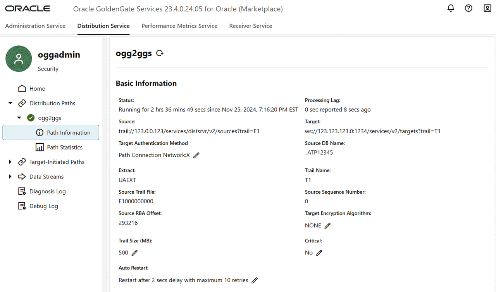

# Monitor processes

## Introduction

In this lab, you learn to monitor the Extract and Replicat processes that were created and run in the previous lab.

Estimated time: 5 minutes

### About Performance Monitoring

Monitoring the performance of your GoldenGate instance ensures that your data replication processes are running smoothly and efficiently. You can monitor performance in both the Oracle Cloud Infrastructure (OCI) GoldenGate deployment console as well as in the Oracle Cloud Console on the deployment details page.

### Objectives

In this lab, you will:
* View charts and statistics using the Performance Metrics Service in the GoldenGate deployment console
* Use Metrics on the deployment details page in the Oracle Cloud console to determine overall instance health and utilization.

### Prerequisites

In order to complete this lab, you should have completed the preceding lab and have both an Extract and Replicat running.

## Task 1: Perform inserts to the source database

8.  In the Oracle GoldenGate Marketplace Distribution Server, verify the Distribution Path is running.

    

## Task 2: Using the Performance Metrics Service

3.  You can view the Performance Metrics Service for the OCI GoldenGate deployment console to view the Replicat's database statistics.

## Task 3: Viewing GoldenGate Metrics in the Oracle Cloud console

In this lab, you learned to monitor performance in the OCI GoldenGate deployment console and in the Oracle Cloud console.

## Learn More

* [Monitor performance in the Oracle Cloud console](https://docs.oracle.com/en/cloud/paas/goldengate-service/vddvk/index.html)
* [Monitor performance in the deployment console](https://docs.oracle.com/en/cloud/paas/goldengate-service/alllr/index.html)

## Acknowledgements
* **Author** - Jenny Chan, Consulting User Assistance Developer, Database User Assistance
* **Contributors** -  Denis Gray, Database Product Management
* **Last Updated By/Date** - Katherine Wardhana, December 2024
