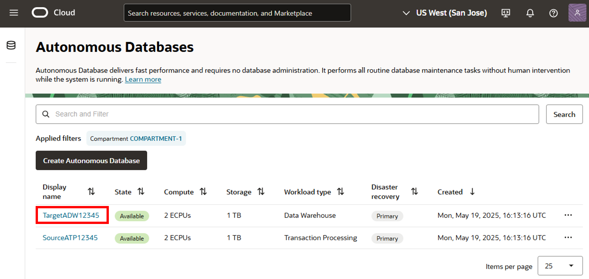
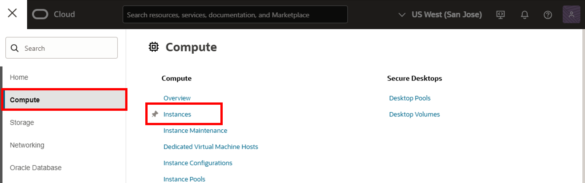
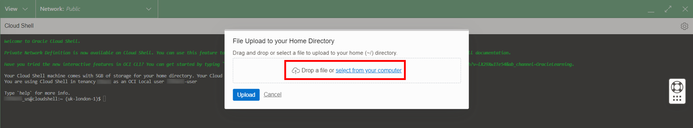
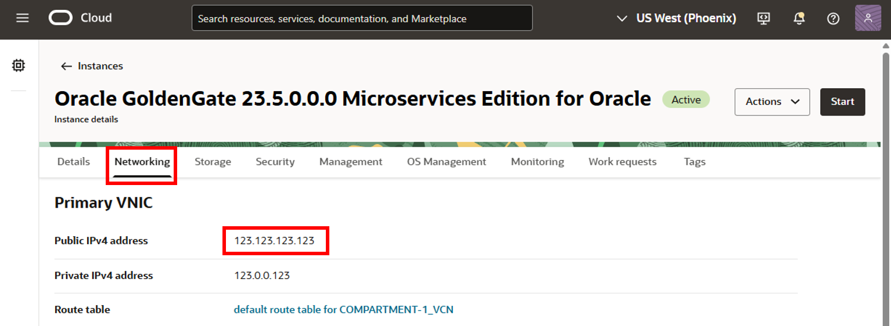
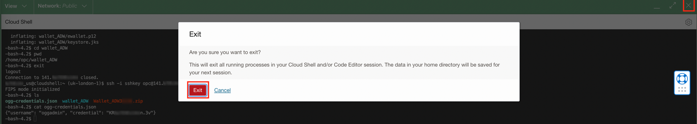

# Connect Oracle GoldenGate to Autonomous Data Warehouse

## Introduction

For the purposes of this workshop, Oracle Autonomous Data Warehouse (ADW) serves as the target database for your Oracle GoldenGate Marketplace deployment. This lab walks you through the steps to connect your Oracle GoldenGate Marketplace deployment to Autonomous Data Warehouse.

Estimated time: 15 minutes

### Objectives

In this lab, you will:
* Download the Autonomous Data Warehouse credentials
* Upload the Autonomous Data Warehouse credentials to the Oracle GoldenGate Marketplace compute instance
* Add the Autonomous Data Warehouse credentials in the Oracle GoldenGate Administration Server

### Prerequisites

* Follow the instructions for [Connecting to a Linux Instance ](https://docs.oracle.com/en-us/iaas/Content/Compute/Tasks/accessinginstance.htm#linux) to enter your private key for the Oracle GoldenGate Marketplace Compute instance.
* Open a text editor to paste values you need for later tasks.

## Task 1: Download the Target Autonomous Data Warehouse Client Credentials

1.  In the OCI Console breadcrumb, click **Autonomous Database**, and then select **TargetADW** from the list of databases.

    

    

2.  On the Target Autonomous Data Warehouse Details page, click **Database connection**.

    

3.  In the Database connection panel, click **Download Wallet**.

    

4.  In the Download Wallet dialog, enter the Target Autonomous Data Warehouse Admin password twice, and then click **Download**.

    <if type="livelabs">
    >**NOTE**: If running this lab in a LiveLab Sandbox environment, you can find the Admin password in View Login Info under OCI GoldenGate Admin Password.
    </if>

    

5.  Save the wallet zip to your local machine.

6.  Close the Database connection panel.

    

## Task 2: Upload the Target Autonomous Data Warehouse Credentials to Oracle GoldenGate

1.  In the Oracle Cloud Console, open the navigation menu (hamburger icon), click **Compute**, and then click **Instances**.

    

2.  Under **List Scope**, ensure that the correct **Compartment** is selected for your workshop. You can find your compartment information in the Workshop Details of this LiveLab.

3.  In the Oracle Cloud Console global header, click **Developer tools**, and then **Cloud Shell**. The Cloud Shell drawer opens at the bottom of your screen.

    >**NOTE**: Cloud Shell takes a few moments to connect the first time it's opened during a session. When prompted, enter N to exit the Cloud Shell tutorial.

    

4.  From the Cloud Shell drawer menu (gear icon) select **Upload**.

    

5.  In the File Upload to your Home Directory dialog, drag and drop or select the TargetADW wallet file you downloaded in Task 1, and then click **Upload**.

    

6.  Repeat step 5 to upload your SSH private key. Click **Hide** to close the File Transfers dialog.

    

    <if type="livelabs">
    >**Note:** Ensure the private key you upload here is the match of the public key you provided when you reserved this lab.
    </if>

7.  To ensure the SSH key permissions are valid, enter the following command in Cloud Shell: (Remember to replace the `<private-SSH-key>` placeholder with the name of your private key.)

    ```
    <copy>chmod 600 <private-SSH-key></copy>
    ```

8.  On the Instances in <compartment-name> page, copy the compute instance's **Public IP Address**.

    

9.  In Cloud Shell, enter the following to connect to the Marketplace Oracle GoldenGate compute instance: (Remember to replace the placeholders with their actual values.)

    ```
    <copy>sftp -i <private-SSH-key> opc@<ip-address></copy>
    ```

    <if type="livelabs">
    >**Note:** If you get a *Permission Denied* error, double check that the private SSH key matches the public SSH key.
    </if>

10. Enter the following `put` command to upload wallet\_ADW.zip to `/home/opc`.

    ```
    <copy>put Wallet_ADW.zip</copy>
    ```

11. Enter `exit` to close the sftp connection.

    

12. SSH to the compute instance.

    ```
    <copy>ssh -i <private-SSH-key> opc@<ip-address></copy>
    ```

13. Enter `ls` to list the contents in the current directory. You should see two files, `ogg-credentials.json` and your wallet file.

14. Make a new directory called **wallet\_ADW**, and then extract the contents of the wallet\_ADW.zip to a new directory.

    ```
    <copy>mkdir wallet_ADW
unzip Wallet_ADW.zip -d wallet_ADW</copy>
    ```

15. Change directories to wallet_ADW.

    ```
    <copy>cd wallet_ADW</copy>
    ```

16. Enter `pwd`, and then copy the full path to the wallet files to be used in a later Task.

    

17. Change directories back to the Home directory.

    ```
    <copy>cd ..</copy>
    ```

> **Note:** Leave Cloud Shell open.

## Task 3: Get the Marketplace Oracle GoldenGate oggadmin Credentials

1.  If you previously closed the Cloud Shell connection, open Cloud Shell once more and SSH to the compute instance.

    ```
    <copy>ssh -i <private-SSH-key> opc@<ip-address></copy>
    ```

2. Enter `ls` to list the contents of the current directory.

3. Open `ogg-credentials.json` and copy the output to a text editor.

    ```
    <copy>cat ogg-credentials.json</copy>
    ```
    

4.  Exit Cloud Shell.

    

## Task 4: Add the Target Autonomous Data Warehouse Credential in the Oracle GoldenGate Administration Server

1. On the deployment details page, click **Launch Console**.

     

2. To log in to the GoldenGate deployment console, enter **oggadmin** for User name, enter the password, and then click **Sign In**. 

    

    > **NOTE:** If using the LiveLab Sandbox environment, copy the OCI GoldenGate Admin Password from the Terraform output section of **View Login Info**.

    

    

After you log in successfully, you're brought to the GoldenGate deployment console home page. Here, you can access the GoldenGate Administration, Performance Metrics, Distribution, and Receiver Services, as well as add Extracts and Replicats for your data replication tasks.

3.  Open the OCI GoldenGate deployment console navigation menu (hamburger icon) and then click **DB Connections**.

    

4.  Copy the TargetADW connection string in the User ID column, and then paste it into a text editor.

    

5.  Edit the TargetADW connection string, replacing the value for **MY\_WALLET\_DIRECTORY** with the location where you unzipped the wallet_ADW.zip. For example, **/home/opc/wallet\_ADW**.

    

6.  In a new browser tab or window, use the compute instance's Public IP and port 443 (**https://&lt;public-ip&gt;:443**) to open the Service Manager.

7.  Log in to the Service Manager using the **oggadmin** credentials found in **/home/opc/ogg-credentials.json**.

8. In the Service Manager console, under Deployment, click **Marketplace**.

    

9. Under Marketplace, click **Administration Server**. The Administration Server opens in a new browser tab. If you're prompted to log in again, use the same oggadmin credentials.

    

10.  In the Administration Server, open the navigation menu (hamburger icon), and then select **DB Connections**.

    

11.  Click **Add DB Connection**.

    

12. Enter the following information, and then click **Submit**:

    * For **Credential Domain**, enter **OracleGoldenGate**.
    * For **Credential Alias**, enter **TargetADW**.
    * For **User ID**, paste the Autonomous Data Warehouse connection string from step 5.
    * For **Password**, enter the ggadmin password provided when you created the TargetADW connection.

    

13. To test the connection, click **Connect to database**. Your connection credentials are correct if you see Checkpoint and TRANDATA options appear. If incorrect, you should check the connection string and ggadmin password.

In this lab, you created a connection from the Oracle GoldenGate Marketplace instance to the target Autonomous Data Warehouse database. You may now **proceed to the next lab**.

## Acknowledgements

* **Author** - Jenny Chan, Consulting User Assistance Developer, Database User Assistance
* **Contributors** -  Julien Testut, Database Product Management; Katherine Wardhana, User Assistance Developer
* **Last Updated By/Date** - Katherine Wardhana, December 2024
