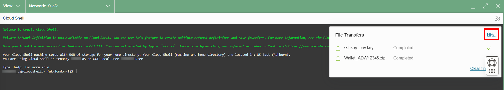

# Connect Oracle GoldenGate to Autonomous Data Warehouse

## Introduction

For the purposes of this workshop, Oracle Autonomous Data Warehouse (ADW) serves as the source database for your Oracle GoldenGate Marketplace deployment. This lab walks you through the steps to connect your Oracle GoldenGate Marketplace deployment to Autonomous Data Warehouse.

Estimated time: 15 minutes

### Objectives

In this lab, you will:
* Download the Autonomous Data Warehouse credentials
* Upload the Autonomous Data Warehouse credentials to the Oracle GoldenGate Marketplace compute instance
* Add the Autonomous Data Warehouse credentials in the Oracle GoldenGate Administration Server

### Prerequisites

Follow the instructions for [Connecting to a Linux Instance ](https://docs.oracle.com/en-us/iaas/Content/Compute/Tasks/accessinginstance.htm#linux) to enter your private key for the Oracle GoldenGate Marketplace Compute instance.

## Task 1: Download the Target Autonomous Data Warehouse Client Credentials

1.  In the OCI Console breadcrumb, click **Autonomous Database**, and then select **TargetADW** from the list of databases.

2.  On the Target Autonomous Data Warehouse Details page, click **DB Connection**.

    

2.  In the DB Connection panel, click **Download Wallet**.

    

3.  In the Download Client Credentials (Wallet) dialog, enter the Target Autonomous Data Warehouse Admin password twice, and then click **Download**.

4.  Close the DB Connection panel.

## Task 2: Upload the Target Autonomous Data Warehouse Credentials to Oracle GoldenGate

1.  In the Oracle Cloud Console, open the navigation menu (hamburger icon), click **Compute**, and then click **Instances**.

    

2.  Under **List Scope**, ensure that the correct **Compartment** is selected for your workshop. You can find your compartment information in the Workshop Details of this LiveLab.

3.  In the Oracle Cloud Console global header, click **Cloud Shell**. The Cloud Shell drawer opens at the bottom of your screen.

    

4.  From the Cloud Shell drawer menu (hamburger icon) select **Upload**.

    

5.  In the File Upload to your Home Directory dialog, drag and drop or select the TargetADW wallet file you downloaded in Task 1, and then click **Upload**.

    

6.  Repeat step 5 to upload your SSH private key. Click **Hide** to close the File Transfers dialog.

    

    <if type="livelabs">
    >**Note:** When you reserve the workshop on LiveLabs, you are asked for a public SSH key. Please make sure the private key you upload here is on the same set with the public key you provided (your public and private SSH keys should match).
    </if>

7.  To ensure the SSH key permissions are valid, enter the following command in Cloud Shell:

    ```
    <copy>chmod 600 <private-SSH-key></copy>
    ```

8.  On the Instances in <compartment-name> page, copy the **Public IP Address**.

    

9.  In Cloud Shell, enter the following to connect to the Marketplace Oracle GoldenGate compute instance:

    ```
    <copy>sftp -i <private-SSH-key> opc@<ip-address></copy>
    ```

    <if type="livelabs">
    >**Note:** If you get a *Permission Denied* error, please double check that the private SSH key matches the public SSH key.
    </if>

10. Enter the following `put` command to upload the wallet\_ADW.zip to /home/opc.

    ```
    <copy>put Wallet_ADW.zip</copy>
    ```

11. Enter `exit` to close the sftp connection.


12. SSH to the compute instance.

    ```
    <copy>ssh -i <private-SSH-key> opc@<ip-address></copy>
    ```

13. Enter `ls` to list the contents in the current directory. You should see two files, `ogg-credentials.json` and your wallet file.

14. Make a new directory called **wallet\_ADW**, and then extract the contents of the wallet\_ADW.zip to a new directory.

    ```
    <copy>mkdir wallet_ADW
unzip Wallet_ADW.zip -d wallet_ADW</copy>
    ```

15. Change directories to wallet_ADW.

    ```
    <copy>cd wallet_ADW</copy>
    ```

16. Enter `pwd`, and then copy the full path to the wallet files to be used in a later Task.

> **Note:** Leave Cloud Shell open.

## Task 3: Get the Marketplace Oracle GoldenGate oggadmin Credentials

1.  Open Cloud Shell if you previously closed the connection and SSH to the compute instance.

    ```
    <copy>ssh -i <private-SSH-key> opc@<ip-address></copy>
    ```

2. Enter `ls` to list the contents of the current directory.

3. Open `ogg-credentials.json` and copy the output.

    ```
    <copy>cat ogg-credentials.json</copy>
    ```

4.  Exit Cloud Shell.

## Task 4: Add the Target Autonomous Data Warehouse Credential in the Oracle GoldenGate Administration Server

1.  Launch the OCI GoldenGate Deployment Console.

2.  Open the navigation menu (hamburger icon) and then click **Configuration**.

    

3.  Copy the TargetADW connection string in the User ID column, and then paste it into a text editor.

    

4.  Edit the TargetADW connection string, replacing the value for **MY\_WALLET\_DIRECTORY** with the location where you unzipped the wallet_ADW.zip. For example, **/home/opc/wallet\_ADW**.

    

5.  In a new browser tab or window, use the Public IP and port 443 (**https://&lt;public-ip&gt;:443**) to open the Service Manager.

6.  Log in to the Service Manager using **oggadmin** credentials found in **/home/opc/ogg-credentials.json**.

7.  In the Service Manager, under **Services**, click the port number associated with the Administration Server. The Administration Server opens in a new browser tab. If you're prompted to log in again, use the same oggadmin credentials.

    

8.  In the Administration Server, open the navigation menu (hamburger icon), and then select **Configuration**.

    

9.  Click **Add Credential**.

    

10. Enter the following information, and then click **Submit**:

    * For **Credential Domain**, enter **OracleGoldenGate**.
    * For **Credential Alias**, enter the Autonomous Data Warehouse database name (low) from /home/opc/wallet\_ADW/tnsnames.ora. For example, **adw&lt;user&gt;\_low**.
    * For **User ID**, paste the Autonomous Data Warehouse connection string from step 4.
    * For **Password**, enter the ggadmin password created when you registered the Target Database.

    

In this lab, you created a connection from the Oracle GoldenGate Marketplace instance to the target Autonomous Data Warehouse database. You may now **proceed to the next lab**.

## Acknowledgements

* **Author** - Jenny Chan, Consulting User Assistance Developer, Database User Assistance
* **Contributors** -  Julien Testut, Database Product Management
* **Last Updated By/Date** - Jenny Chan, February 2022
