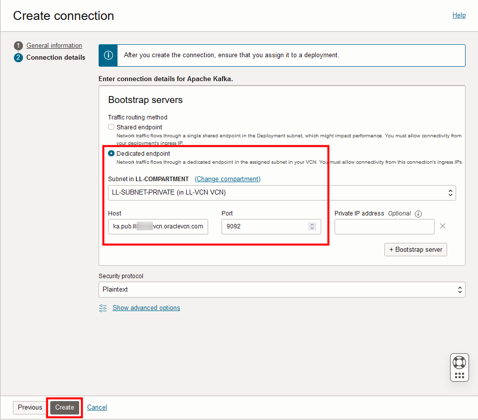
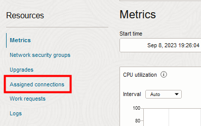
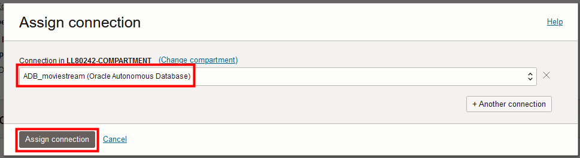

# Create the Oracle Cloud Infrastructure GoldenGate resources

## Introduction

In this lab, you learn to create an Oracle Cloud Infrastructure (OCI) GoldenGate Stream Analytics deployment and connections.

Estimated time: 30 minutes

Watch the video below for a quick walk through of the lab.
[Watch the video](videohub:1_ae299i9n)

### About Oracle Cloud Infrastructure GoldenGate Stream Analytics deployments and connections

A Oracle Cloud Infrastructure GoldenGate deployment manages the resources it requires to function. The GoldenGate deployment also lets you access the GoldenGate Stream Analytics console, where you can create and manage Stream Analytics pipelines and dashboards. For this workshop, you work with two deployments: a Data Replication deployment, and a Stream Analytics deployment.

Connections store the source and target credential information for OCI GoldenGate. A connection also enables networking between the Oracle Cloud Infrastructure (OCI) GoldenGate service tenancy virtual cloud network (VCN) and your tenancy VCN using a private endpoint.

### Objectives

In this lab, you will:
* Locate Oracle Cloud Infrastructure GoldenGate in the Console
* Review the OCI GoldenGate Data Replication and Stream Analytics deployments
* Create connections to Kafka and GoldenGate replication
* Assign connections to the Stream Analytics deployment

### Prerequisites
* Completion of Get started - LiveLabs login

## Task 1: Review the deployment details

1. If you're not already on the OCI GoldenGate Deployments page, then open the Oracle Cloud navigation menu, click **Oracle Database**, and then select **GoldenGate**.

    

2. On the GoldenGate Overview page, click **Deployments**.

    

3. You may need to select your compartment from the Compartment dropdown. 

4. On the Deployments page, select either the Replication or GGSA deployment to view its details.

    

After a deployment is created and active, you can perform the following actions on the deployment details page:

* Review the deployment's status
* Launch the GoldenGate service deployment console
* Edit the deployment's name or description
* Stop and start the deployment
* Move the deployment to a different compartment
* Review the deployment resource information
* Add tags

5.  Use the Oracle Cloud breadcrumb to return to the Deployments page. Repeat step 3 to review the GGSA deployment details.

## Task 2: Create the GoldenGate connection

Follow these steps to connect the OCI GoldenGate Data Replication deployment to the GGSA deployment.

1.  Use the Oracle Cloud Console breadcrumb to navigate to the **Deployments** page. 

    

2.  In the GoldenGate menu on the left-hand side, click **Connections**.

    

3.  On the Connections page, precreated **ADB\_ggadmin** and **CADB\_moviestream** connections appear in the Connections list for this lab. Click **Create connection**. 

    

4.  The Create connection wizard consists of 2 pages. On the General information page, for Name, enter **GoldenGate** and optionally, a description.

5.  From the Compartment dropdown, select **&lt;USER&gt;-COMPARTMENT**.

6.  From the a Type dropdown, select **GoldenGate** from the **Generic** section.

7.  Click **Next**.

    

8.  Open the Reservation Information panel, and then click **Copy value** for **GG Deployment Host**. 

    

9.  On the Connection details page, under GoldenGate deployment, select **Enter GoldenGate information**.

10.  For Host, paste the **GG Deployment Host** value copied from the Reservation Information panel (Step 8).

11.  For Port, enter **443**.

12.  For Username, enter **oggadmin**.

13. For Password, enter **Admin password** from the Reservation Information panel.

14. Click **Create**.

    

    The connection becomes Active after a few minutes. You can continue with the next task.

## Task 3: Create the Kafka connection

Follow these steps to connect the Kafka event hub.

1.  Use the breadcrumb to return to the Connections page.

2.  Click **Create connection**.

3.  In the Create connection panel, on the General information page, for Name, enter **Kafka** and optionally, a description.

4.  From the Compartment dropdown, select **&lt;USER&gt;-COMPARTMENT**.

5.  From the a Type dropdown, select **Apache Kafka** from the Big Data section.

    

6.  Click **Next**.

7.  On the Connection details page, in the Bootstrap servers section, select **Dedicated endpoint** for **Traffic routing method**.

8.  Select the private subnet from the **Subnet** dropdown.

9.  For Host, copy and paste the **Kafka Private FQDN** from the Reservation Information panel.

10.  For Port, enter **9092**.

11. Click **Create**.

    

12.  Use the Oracle Cloud Console breadcrumb to navigate back to the Connections page.

    

The connection becomes Active after a few minutes. Please wait for both new connections to become Active before proceeding.    

## Task 4: Assign connections

Before you can use connections, you must first assign connections a deployment. 

1.  Click **Deployments** in the GoldenGate menu.

    

2.  Select the GGSA deployment from the list. 

    

3.  Ensure the deployment is in the ACTIVE state before you continue.

    

4.  On the deployment details page, from the Resources menu, click **Assigned Connections**.

    

5. Click **Assign connection**.

    

6. In the Assign connection dialog, from the Connection in &lt;compartment-number&gt;-COMPARTMENT dropdown, select **ADB\_moviestream**. Click **Assign connection**.

    

7.  Repeat the previous step to assign the **Kafka** and **GoldenGate** connections to the deployment. Wait for all assignments to become active.

     

You may now **proceed to the next lab.**

## Learn more

* [Create Stream Analytics resources](https://docs.oracle.com/en/cloud/paas/goldengate-service/cwuvu/index.html)
* [Connect to GoldenGate Paths](https://docs.oracle.com/en/cloud/paas/goldengate-service/cggjh/index.html)
* [Connect to Kafka](https://docs.oracle.com/en/cloud/paas/goldengate-service/wkynw/index.html)

## Acknowledgements
* **Author** - Alex Kotopoulis, Director of Product Management, Data Integration Development
* **Contributors** - Hope Fisher and Kaylien Phan, Database Product Management
* **Last Updated By/Date** - Katherine Wardhana, May 2024

