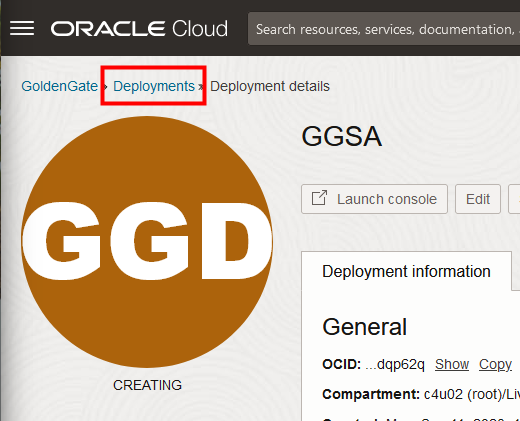
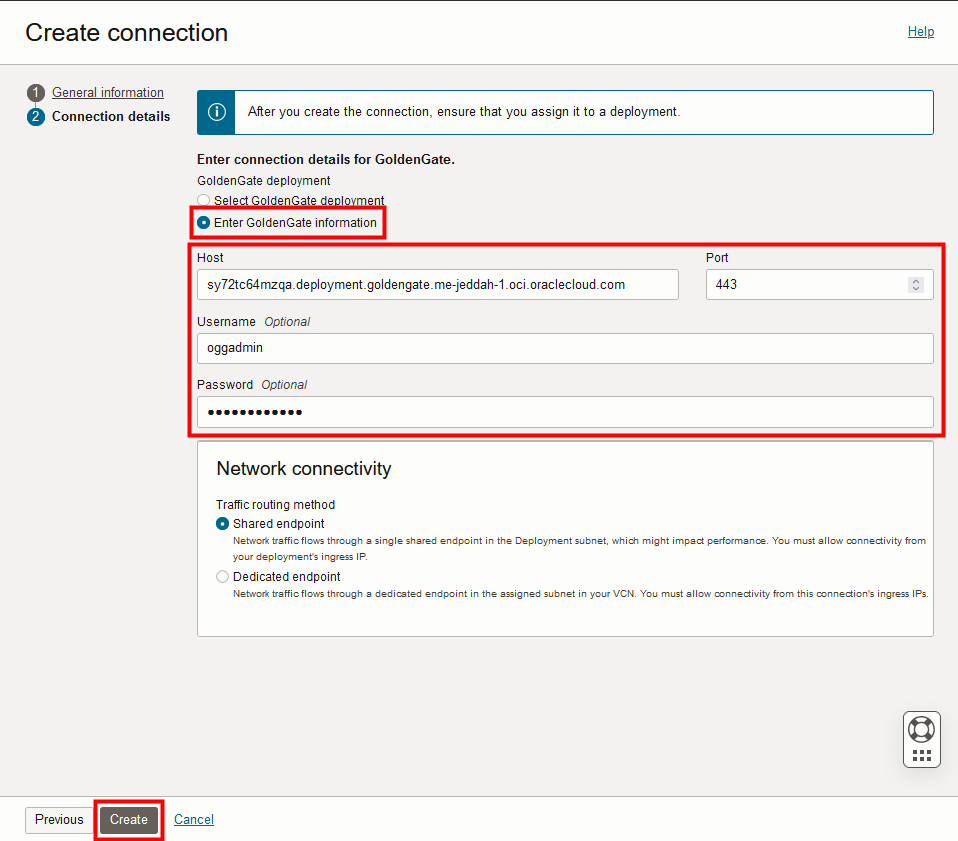
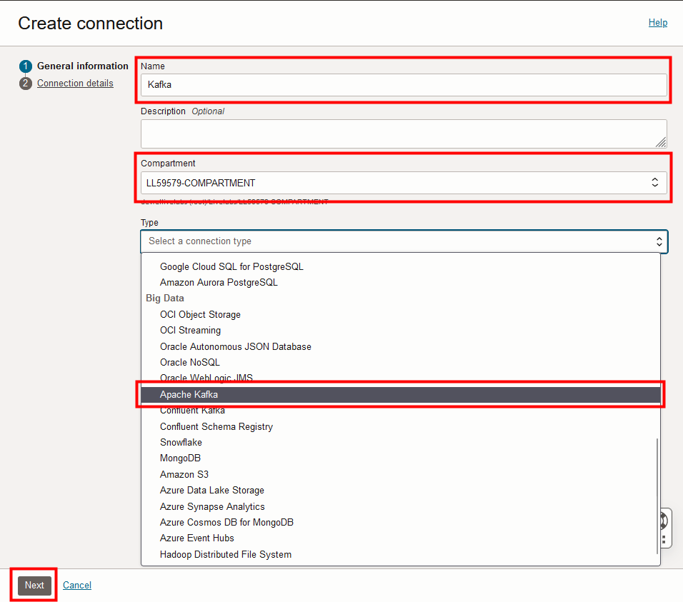

# Create the Oracle Cloud Infrastructure GoldenGate resources

## Introduction

In this lab, you learn to create an Oracle Cloud Infrastructure (OCI) GoldenGate Stream Analytics deployment and connections.

Estimated time: 30 minutes

Watch the video below for a quick walk through of the lab.
[Watch the video](videohub:1_ae299i9n)

### About Oracle Cloud Infrastructure GoldenGate Stream Analytics deployments and connections

A Oracle Cloud Infrastructure GoldenGate deployment manages the resources it requires to function. The GoldenGate deployment also lets you access the GoldenGate Stream Analytics console, where you can create and manage Stream Analytics pipelines and dashboards.

Connections store the source and target credential information for OCI GoldenGate. A connection also enables networking between the Oracle Cloud Infrastructure (OCI) GoldenGate service tenancy virtual cloud network (VCN) and your tenancy VCN using a private endpoint.

### Objectives

In this lab, you will:
* Locate Oracle Cloud Infrastructure GoldenGate in the Console
* Create an OCI GoldenGate Stream Analytics deployment
* Create connections to Kafka and GoldenGate replication
* Assign connections to the Stream Analytics deployment

### Prerequisites
* Completion of Get started - LiveLabs login

## Task 1: Log in to the Oracle Cloud console

1. In your lab instructions, click **View Login Info**. The Reservation Information panel opens.

    

2. In the Reservation Information panel, click **Launch OCI**.

    

3. The User Name should be auto filled. If not, copy and paste it from the Reservation Information panel.

4. For Password, copy and paste the **Password** from the Reservation Information panel. 

5. Click **Sign In**. 

    > **Note:** If this is your first time logging in, you must reset the default password.

## Task 2: Create a Stream Analytics deployment

> **Note:** Compartment names in the screenshots may differ from values that appear in your environment.

1.  In the Oracle Cloud console, open the **navigation menu**, navigate to **Oracle Database**, and then select **GoldenGate**.

    

2.  On the GoldenGate **Overview** page, click **Deployments**.

    

3.  You may need to select a compartment. Under List Scope, from the Compartment dropdown, expand the root compartment, and then select the compartment associated with your username. For example, if your LiveLab username is LL1234-user, expand root, expand LiveLabs, and then select the compartment **LL1234-COMPARTMENT**.

    > **Tip:** You can find your Username in the **Reservation Information** panel.

4.  On the Deployments page, a precreated **Replication** deployment appears in Deployments list for this lab. Click **Create deployment**.

    

5.  In the Create Deployment panel, enter **GGSA** for Name.

6.  From the Compartment dropdown, select **&lt;USER&gt;-COMPARTMENT**.

7.  Select **Development or testing**. Your **OCPU count** updates to the preset governed by your selection.

8.  Select **Auto scaling**.

9.  For Subnet, select a private subnet. If you're using the workshop environment, select **&lt;USER&gt;-SUBNET-PRIVATE**.

10.  For License type, select **Bring Your Own License (BYOL)**.

11. Click **Show advanced options**, and then select **Enable GoldenGate console public access**. 

12. Click **Next**.

     

13. On the GoldenGate details screen, for Choose a deployment type, select **Stream analytics**.

14. For GoldenGate Instance Name, enter **ggsa**.

15. For Administrator Username, enter **osaadmin**.

16. For Password secret in &lt;USER&gt;-COMPARTMENT, click **Create password secret**.

    

17. In the Create secret panel, enter `LLsecret`.

18. For User password, enter a password 8 to 30 alphanumeric characters in length, containing at least 1 uppercase, 1 lowercase, 1 numeric, and 1 special character.

    > **NOTE**: The special characters must not be $, ^, or ?. 

    

19. Confirm the password, and then click **Create**.

20. Back in the Create deployment panel, for Password secret, ensure **LLsecret** is selected, and then click **Create**.

You're brought to the Deployment details page. Continue with the following tasks while the deployment creates. Its status changes from CREATING to ACTIVE when it's ready for you to use.

## Task 3: Create the GoldenGate connection

Follow these steps to connect the GoldenGate Replication deployment to the GGSA deployment.

1.  Use the Oracle Cloud Console breadcrumb to navigate to the **Deployments** page. 

    

2.  In the GoldenGate menu, click **Connections**.

    

3.  On the Connections page, a precreated **ADB_Connection** connection appears in the Connections list for this lab. Click **Create connection**. 

    

4.  The Create connection wizard consists of 2 pages. On the General information page, for Name, enter **GoldenGate** and optionally, a description.

5.  From the Compartment dropdown, select **&lt;USER&gt;-COMPARTMENT**.

6.  From the a Type dropdown, select **GoldenGate** from the **Generic** section.

7.  Click **Next**.

    

8.  Open the Reservation Information panel, and then click **Copy value** for **GG Deployment Host**. 

    

9.  On the Connection details page, under GoldenGate deployment, select **Enter GoldenGate information**

10.  For Host, paste the **GG Deployment Host** value copied from the Reservation Information panel (Step 8).

11.  For Port, enter **443**.

12.  For Username, enter **oggadmin**.

13. For Password, enter **Admin password** from the Reservation Information panel.

14. Click **Create**.

    

    The connection becomes Active after a few minutes. You can continue with the next task.

## Task 4: Create the Kafka connection

Follow these steps to connect the Kafka event hub.

1.  Use the breadcrumb to return to the Connections page.

2.  Click **Create connection**.

3.  In the Create connection panel, on the General information page, for Name, enter **Kafka** and optionally, a description.

4.  From the Compartment dropdown, select **&lt;USER&gt;-COMPARTMENT**.

5.  From the a Type dropdown, select **Apache Kafka** from the Big Data section.

    

6.  Click **Next**.

7.  On the Connection details page, under Bootstrap servers, select **Customer-assigned subnet**.

8.  For Host, copy and paste the **Kafka Private FQDN** from the Reservation Information panel.

9.  For Port, enter **9092**.

10. For Private IP address, copy and paste the **Kafka Private IP** from the Reservation Information panel.

11. Click **Create**.

    

12.  Use the Oracle Cloud Console breadcrumb to navigate back to the Connections page.

    

The connection becomes Active after a few minutes. Please wait for both new connections to become Active before proceeding.    

## Task 5: Create connection assignments

You must assign connections need to a deployment before they can be used. 

1.  Click **Deployments** in the GoldenGate menu.

    

2.  Select the GGSA deployment from the list. 

    

3.  Ensure the deployment is in the ACTIVE state before you continue.

    

4.  On the deployment details page, from the Resources menu, click **Assigned Connections**.

    

5. Click **Assign connection**.

    

6. In the Assign connection dialog, from the Connection in &lt;compartment-number&gt;-COMPARTMENT dropdown, select **ADB\_Connection**. Click **Assign connection**.

    

7.  Repeat the previous step to assign the **Kafka** and **GoldenGate** connections to the deployment. Wait for all assignments to become active.

     

You may now **proceed to the next lab.**

## Learn more

* [Managing deployments](https://docs.oracle.com/en/cloud/paas/goldengate-service/ebbpf/index.html)
* [Managing connections](https://docs.oracle.com/en/cloud/paas/goldengate-service/mcjzr/index.html)

## Acknowledgements
* **Author** - Alex Kotopoulis, Director of Product Management, Data Integration Development
* **Contributors** - Hope Fisher and Kaylien Phan, Database Product Management
* **Last Updated By/Date** - Jenny Chan, November 2023

