# Create a GoldenGate Stream Analytics Deployment

This lab focuses on establishing connections between your GoldenGate Stream Analytics deployment, Kafka instance, and autonomous database.

## **Lab Prerequisites**

* Completion of Lab 1: Review GoldenGate Replication

## Task 1: Create a connection between Kafka and GoldenGate

1. Create a connection to Kafka instance using that instance's public IP.

   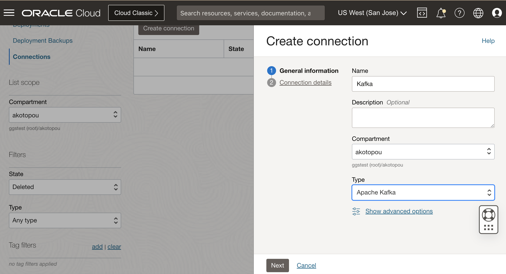

   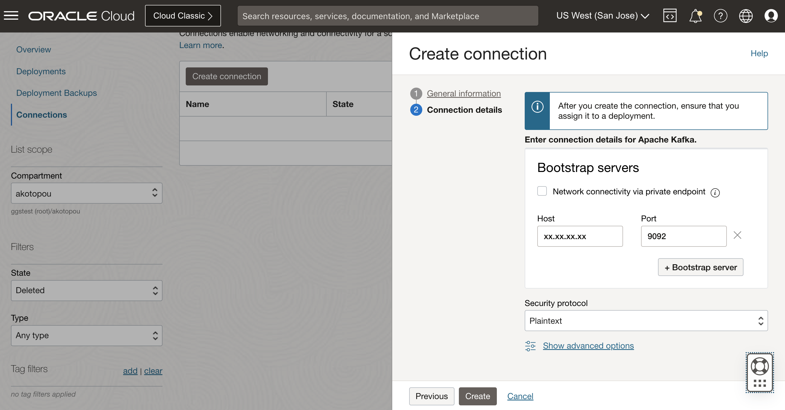

2. Now, create a connection to GoldenGate.

   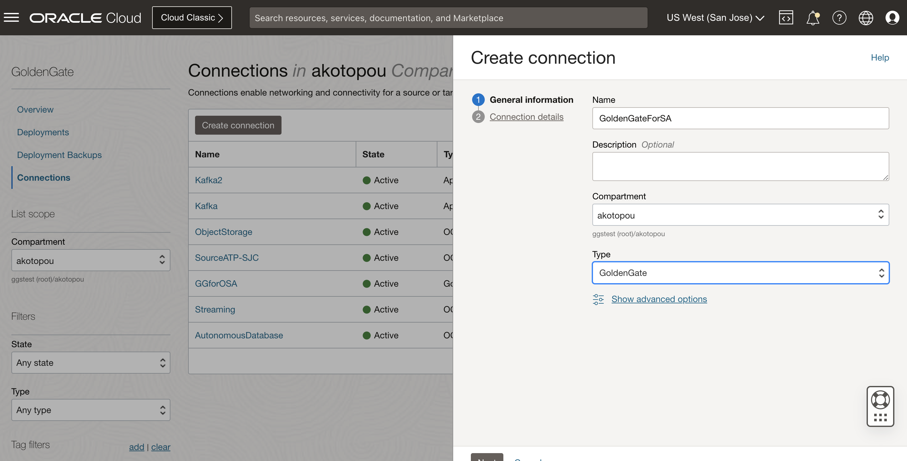

   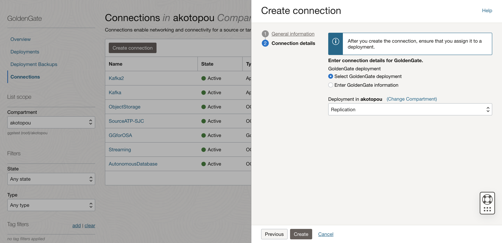

## Task 2: Create GoldenGate Stream Analytics deployment

1. Create the deployment "Stream Analytics" with **4 OCPUs**, license type **BYOL**, **Public VCN**, and **Public endpoint** in advanced options.

   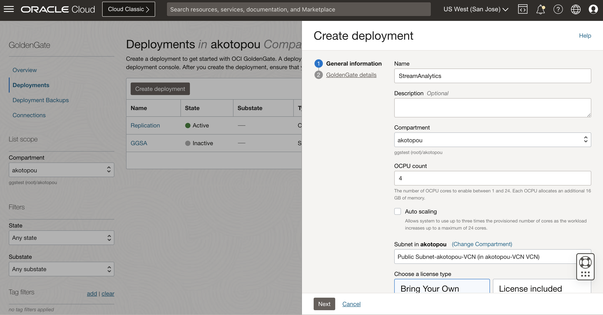

2. On the second page, select **Stream Analytics**, image name **StreamAnalytics**, administrator **oggadmin**, and the password.

   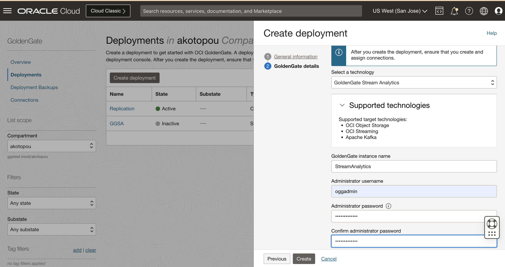

3. The GoldenGate deployment is now being created and should take 7-8 minutes to complete.

## Task 3: Assign Connections

1. Open the GoldenGate Stream Analytics deployment.

   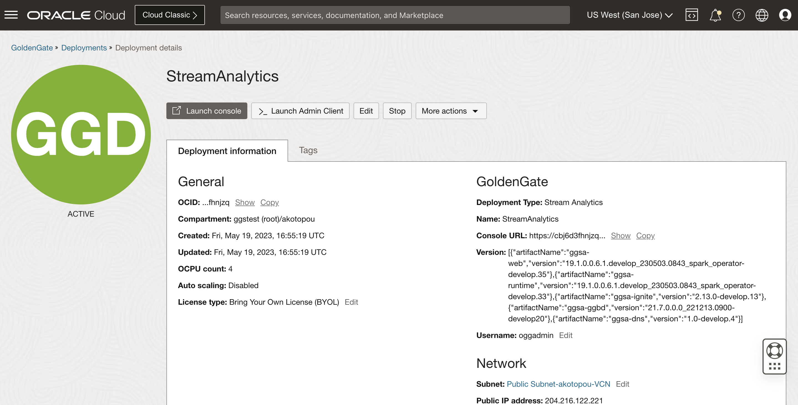

2. Assign the Kafka Connection.

   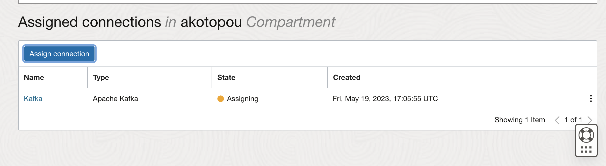

3. Assign the GoldenGate connection.

4. Assign the AutonomousDatabase connection.

## Task 3: Login to admin

1. Open the GoldenGate Stream Analytics user interface.

   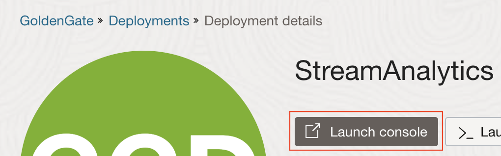

2. Login with oggadmin and your password.

   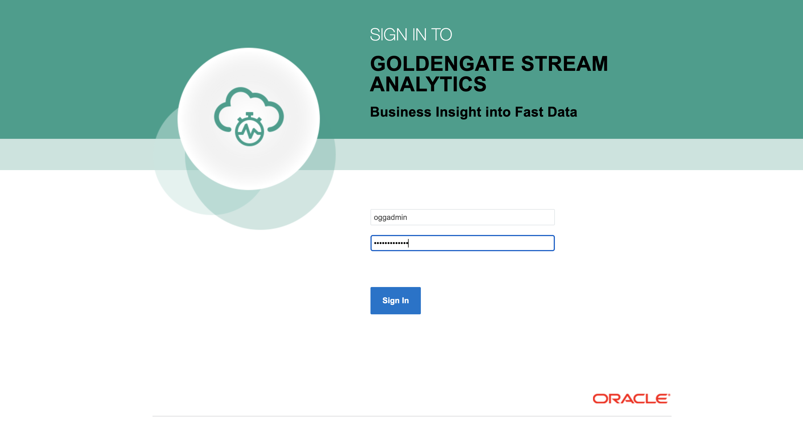

   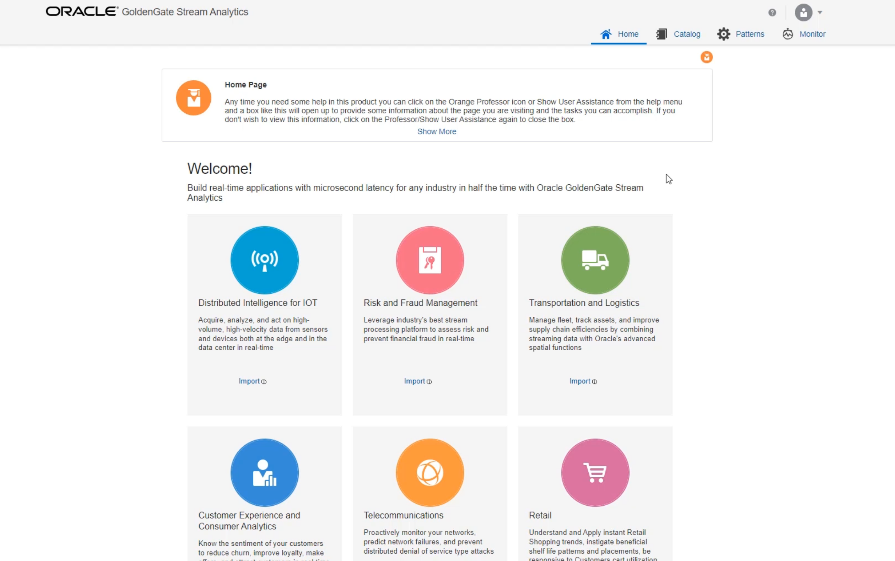

## Learn More

* [GoldenGate Stream Analytics](https://docs.oracle.com/en/middleware/fusion-middleware/osa/19.1/using/introduction-goldengate-stream-analytics.html)

## Acknowledgements

* **Author** - Alex Kotopoulis, Director of Product Management, Data Integration Development
* **Contributors** - Hope Fisher and Kaylien Phan, Database Product Management
* **Last Updated By/Date** - Hope Fisher, June 2023

