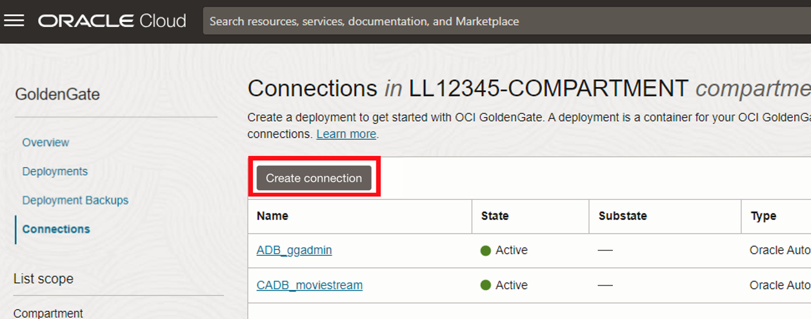
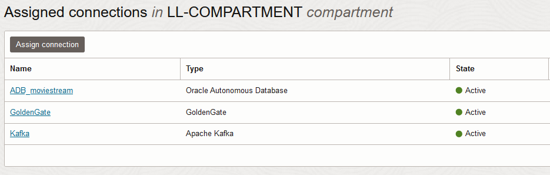

# Create the Oracle Cloud Infrastructure GoldenGate resources

## Introduction

In this lab, you learn to create an Oracle Cloud Infrastructure (OCI) GoldenGate Stream Analytics deployment.

Estimated time: 30 minutes

Watch the video below for a quick walk through of the lab.
[Watch the video](videohub:1_hz7gsiin)

### About Oracle Cloud Infrastructure GoldenGate Stream Analytics deployments and connections

A Oracle Cloud Infrastructure GoldenGate deployment manages the resources it requires to function. The GoldenGate deployment also lets you access the GoldenGate Stream Analytics console, where you can create and manage Stream Analytics pipelines and dashboards.

Connections store the source and target credential information for OCI GoldenGate. A connection also enables networking between the Oracle Cloud Infrastructure (OCI) GoldenGate service tenancy virtual cloud network (VCN) and your tenancy VCN using a private endpoint.

### Objectives

In this lab, you will:
* Locate Oracle Cloud Infrastructure GoldenGate in the Console
* Create an OCI GoldenGate Stream Analytics deployment
* Create connections to Kafka and GoldenGate Replication
* Assign connections to the Stream Analytics deployment

### Prerequisites
* Completion of Get started - LiveLabs login

## Task 1: Create a Stream Analytics deployment

> **Note:** Compartment names in the screenshots may differ from values that appear in your environment.

1.  In the Oracle Cloud console, open the **navigation menu**, navigate to **Oracle Database**, and then select **GoldenGate**.

    

2.  On the GoldenGate **Overview** page, click **Deployments**.

    

3.  You may need to select a compartment. Under List Scope, from the Compartment dropdown, expand the root compartment, and then select the compartment associated with your username. For example, if your LiveLab username is LL1234-user, expand root, expand LiveLabs, and then select the compartment **LL1234-COMPARTMENT**.

    > **Tip:** You can find your User name in the Workshop Details section.

4.  On the Deployments page, click **Create deployment**.

    

5.  In the Create Deployment panel, enter **GGSA** for Name.

6.  From the Compartment dropdown, select **&lt;USER&gt;-COMPARTMENT**.

7.  For OCPU Count, enter **1**.

8.  Check the Auto scaling checkbox

9.  For Subnet, select a subnet. If you're using the workshop environment, select **&lt;USER&gt;-SUBNET-PUBLIC**.

10.  For License type, select **Bring Your Own License (BYOL)**.

11. Click **Show advanced options**, and then select **Enable GoldenGate console public access**.

     

12. Click **Next**.

13. For Choose a deployment type, select **Stream analytics**.

14. For GoldenGate Instance Name, enter **ggsa**.

15. For Administrator Username, enter **oggadmin**.

16. For Administrator Password, select **Admin Password** from Terraform output.

17. Click **Create**.

    

You're brought to the Deployment Details page. Please continue the next steps as it takes a few minutes for the deployment to be created. Its status will change from CREATING to ACTIVE when it is ready for  you to use.

## Task 2: Create the GoldenGate connection

First, follow the steps below to connect the GoldenGate deployment to be used by GGSA.

1.  Use the Oracle Cloud Console breadcrumb to navigate back to the Connections page.

    

2.  Click **Create connection**.

    

3.  On the General information page, for Name, enter **GoldenGate** and optionally, a description.

4.  From the Compartment dropdown, select **&lt;USER&gt;-COMPARTMENT**.

5.  From the a Type dropdown, select **GoldenGate** from the section **Generic**.

    

6.  Click **Next**.

7.  On the Connection details page, under GoldenGate deployment, select **Enter GoldenGate information**

8.  For Host, enter **GG Deployment Host** from the Terraform output.

9.  Enter for Port: **443**.

10.  For Username, enter **oggadmin**.

11. For Password, enter **Admin password** from the Terraform output.

12. Click **Create**.

    

    The connection becomes Active after a few minutes. You can continue with the next task.

## Task 3: Create the Kafka connection

First, follow the steps below to connect the Kafka event hub.

1.  Use the Oracle Cloud Console breadcrumb to navigate back to the Deployments page.

    

2.  Click **Connections**.

    

3.  Click **Create connection**.

    

4.  The Create connection panel consists of two pages. On the General information page, for Name, enter **Kafka** and optionally, a description.

5.  From the Compartment dropdown, select **&lt;USER&gt;-COMPARTMENT**.

6.  From the a Type dropdown, select **Apache Kafka** from the section **Big Data**.

    

7.  Click **Next**.

8.  On the Connection details page, under Bootstrap servers, check the **Customer-assigned subnet** checkbox.

9.  For Host enter: **Kafka Private FQDN** from the Terraform output.

10. For Port, enter: **9092**.

11. For Private IP address, eenter **Kafka Private IP** from the Terraform output.

10. Click **Create**.

    

11.  Use the Oracle Cloud Console breadcrumb to navigate back to the Connections page.

    
    The connection becomes Active after a few minutes. Please wait for both new connections to become Active before proceeding.

    

## Task 4: Create connection assignments

OCI GoldenGate connections need to be assigned to a deployment before they can be used. The following steps assign the just created connections to the GGSA deployment.

1.  Click **Deployments** in the left-hand menu.

    

2.  Open the deployment GGSA from the list.

    

3.  Wait for the deployment GGSA to become Active. This might take a few minutes.

    

4.  Go to Assigned Connections on the left-hand menu of the Deployment page.

5. Click **Assign connection**.

    

6. In the Assign connection dialog, from the Connection in &lt;compartment-number&gt;-COMPARTMENT dropdown, select **ADB\_Connection**. Click **Assign connection**.

    

7.  Repeat Task 4, steps 5-6, to also assign connections **Kafka** and **GoldenGate** to the deployment. Wait for all assignments to become active.

     

You may now **proceed to the next lab.**

## Learn more

* [Managing deployments](https://docs.oracle.com/en/cloud/paas/goldengate-service/ebbpf/index.html)
* [Managing connections](https://docs.oracle.com/en/cloud/paas/goldengate-service/mcjzr/index.html)

## Acknowledgements
* **Author** - Alex Kotopoulis, Director of Product Management, Data Integration Development
* **Contributors** - Hope Fisher and Kaylien Phan, Database Product Management
* **Last Updated By/Date** - Alex Kotopoulis, June 2023

