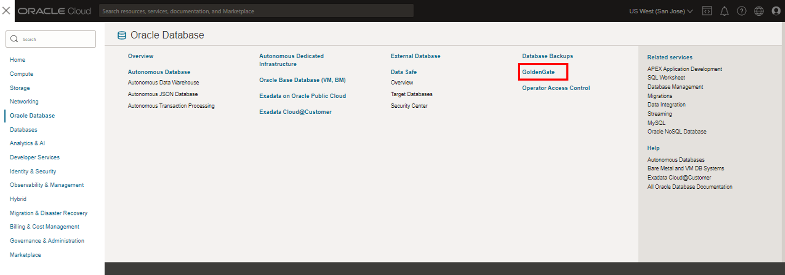
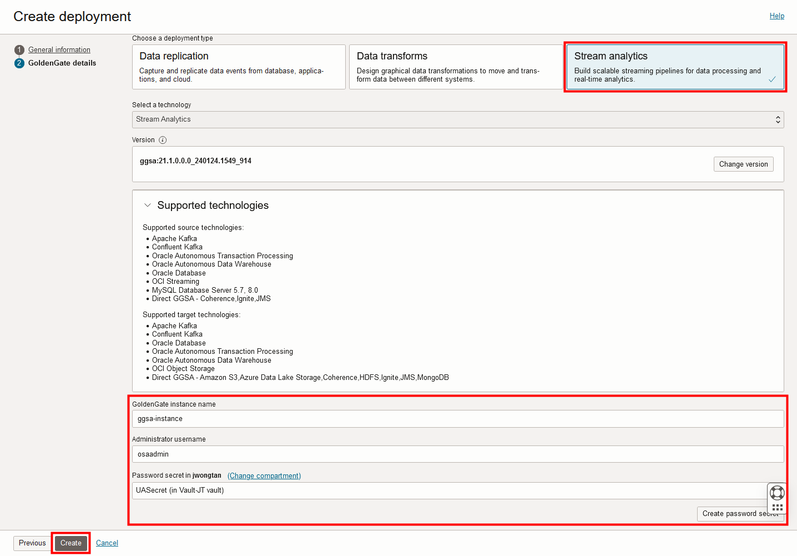
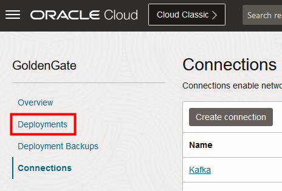

# Create the Oracle Cloud Infrastructure GoldenGate resources

## Introduction

In this lab, you learn to create an Oracle Cloud Infrastructure (OCI) GoldenGate Stream Analytics deployment and connections.

Estimated time: 30 minutes

Watch the video below for a quick walk through of the lab.
[Watch the video](videohub:1_ae299i9n)

### About Oracle Cloud Infrastructure GoldenGate Stream Analytics deployments and connections

A Oracle Cloud Infrastructure GoldenGate deployment manages the resources it requires to function. The GoldenGate deployment also lets you access the GoldenGate Stream Analytics console, where you can create and manage Stream Analytics pipelines and dashboards.

Connections store the source and target credential information for OCI GoldenGate. A connection also enables networking between the Oracle Cloud Infrastructure (OCI) GoldenGate service tenancy virtual cloud network (VCN) and your tenancy VCN using a private endpoint.

### Objectives

In this lab, you will:
* Create an OCI GoldenGate Stream Analytics deployment
* Create connections to OCI Streaming and GoldenGate replication
* Assign connections to the Stream Analytics deployment

### Prerequisites

To successfully complete this lab, you must:

* Have successfully completed the Get started lab
* If you enable public deployment console access when creating the deployment, OCI GoldenGate creates a load balancer in your tenancy VCN on your behalf. To ensure successful creation of the deployment and load balancer, you must have the appropriate policies, quotas, and limits in place.
* You may want a text editor open to keep track of values you need to reuse.

## Task 1: Create an OCI GoldenGate deployment for data replication

## Task 2: Create a Stream Analytics deployment

> **Note:** Compartment names in the screenshots may differ from values that appear in your environment.

1.  In the Oracle Cloud console, open the **navigation menu**, navigate to **Oracle Database**, and then select **GoldenGate**.

    

2.  On the GoldenGate **Overview** page, click **Deployments**.

    

3.  You may need to select a compartment. Under List Scope, from the Compartment dropdown, expand the root compartment, and then select the compartment associated with your username. For example, if your LiveLab username is LL1234-user, expand root, expand LiveLabs, and then select the compartment **LL1234-COMPARTMENT**.

    > **Tip:** You can find your Username in the **Reservation Information** panel.

4.  On the Deployments page, a precreated **Replication** deployment appears in Deployments list for this lab. Click **Create deployment**.

    

5.  In the Create Deployment panel, enter **GGSA** for Name.

6.  From the Compartment dropdown, select **&lt;USER&gt;-COMPARTMENT**.

7.  Select **Development or testing**. Your **OCPU count** updates to the preset governed by your selection.

8.  Select **Auto scaling**.

9.  For Subnet, select a private subnet. If you're using the workshop environment, select **&lt;USER&gt;-SUBNET-PRIVATE**.

10.  For License type, select **Bring Your Own License (BYOL)**.

11. Click **Show advanced options**, select **Enable GoldenGate console public access**, and then select a public subnet. 

12. Click **Next**.

     

13. On the GoldenGate details screen, for Choose a deployment type, select **Stream analytics**.

14. For GoldenGate Instance Name, enter **ggsa**.

15. For Administrator Username, enter **osaadmin**.

16. For Password secret in &lt;USER&gt;-COMPARTMENT, click **Create password secret**.

    

17. In the Create secret panel, enter `LLsecret`.

18. For User password, enter a password 8 to 30 alphanumeric characters in length, containing at least 1 uppercase, 1 lowercase, 1 numeric, and 1 special character.

    > **NOTE**: The special characters must not be $, ^, or ?. 

    

19. Confirm the password, and then click **Create**.

20. Back in the Create deployment panel, for Password secret, ensure **LLsecret** is selected, and then click **Create**.

You're brought to the Deployment details page. Continue with the following tasks while the deployment creates. Its status changes from CREATING to ACTIVE when it's ready for you to use.

## Task 3: Create the source Autonomous Database connection

## Task 4: Create the GoldenGate connection

To create the GoldenGate connection, you must first obtain the data replication deployment host information and secret password contents. 

1.  Use the Oracle Cloud console breadcrumb to navigate to the Deployments page. 

2.  On the Deployments page, select the deployment for data replication to open its Details page.

3.  On the deployment details page, in the Deployment information card, under GoldenGate, copy the Console URL value. You can paste this to a text editor for reference.

4.  Use the Oracle Cloud Console breadcrumb to navigate to the **Connections** page. 

5.  On the Connections page, click **Create connection**. 

    

6.  The Create connection wizard consists of 2 pages. Complete the General information page as follows, and then click **Next**:
    
    * For Name, enter **GoldenGate**.
    * For Compartment, select **&lt;USER&gt;-COMPARTMENT** from the dropdown.
    * For Type, under **Generic**, select **GoldenGate** from dropdown.

    

7.  Complete the Connection details page as follows, and then click **Create**:

    * For GoldenGate deployment, select **Enter GoldenGate information**.
    * For Host, paste the Console URL value you copied from the data replication deployment details page. Ensure that you remove the https:// and any trailing slashes. 
    * For Port, enter **443**.
    * For Username, enter **osaadmin**.
    * For Password, enter the LLsecret password from Task 1, step 20.

    

    The connection becomes Active after a few minutes. You can continue with the next task.

## Task 5: Create an Auth token

1. In the Oracle Cloud console global header, click **Profile**, and then select **My profile**.

    

2. On the User Details page, under **Resources**, click **Auth tokens**, and then click **Generate token**. 

    

3. In the Generate token dialog, enter a description, and then click **Generate Token**.

    

4. Copy the auth token from the dialog to a secure location from where you can retrieve it later, and then click **Close**.

    

## Task 6: Create a Stream and copy the Stream Pool username

1. In the Oracle Cloud console navigation menu, click **Analytics & AI**, and then under **Messaging**, select **Streaming**.

    

2. On the Streams page, click **Create Stream**.

3. On the Create Stream page, enter a **Stream Name**, and then click **Create**.

4. In the Analytics menu, click **Stream Pools**.

5. On the Stream Pools page, select your stream pool to view its details.

6. On the Stream Pool details page, under **Resources**, click **Kafka Connection Settings**.

7. Copy the **Bootstrap Servers** value and username parameter value from the **SASL Connection Strings** field to a text editor for later use.

    

## Task 7: Create the OCI Streaming connection

1.  Use the Oracle Cloud console navigation menu to return to GoldenGate.

2.  On the GoldenGate Overview page, click **Connections**, and then click **Create connection**.

3.  In the Create connection panel, on the General information page, for Name, enter **OCIStream** and optionally, a description.

4.  From the Compartment dropdown, select **&lt;USER&gt;-COMPARTMENT**.

5.  From the a Type dropdown, select **OCI Streaming** from the Big Data section.

6.  Click **Next**.

7.  On the Connection details page, choose **Enter stream pool information**. 

8.  For Host, paste the stream pool's Bootstrap Servers host value copied from Lab 1 Task 7.

9.  For Port, paste the stream pool's Bootstrap Servers port value copied from Lab 1 Task 7.

10. For **Username**, enter the Stream Pool username copied from the SASL Connection Settings in Lab 1 Task 7.

11. For **Password**, enter the Auth token copied in Lab 1 Task 6.

12. Click **Create**.

13.  Use the Oracle Cloud Console breadcrumb to navigate back to the Connections page.

The connection becomes Active after a few minutes. Please wait for both new connections to become Active before proceeding.    

## Task 8: Assign connections

You must assign connections to deployments you can use them. 

1.  Click **Deployments** in the GoldenGate menu.

    

2.  Select the GGSA deployment from the list. 

    

3.  Ensure the deployment is in the ACTIVE state before you continue.

    

4.  On the deployment details page, from the Resources menu, click **Assigned Connections**.

    

5. Click **Assign connection**.

    

6. In the Assign connection dialog, from the Connection in &lt;compartment-number&gt;-COMPARTMENT dropdown, select **ADB\_Connection**. Click **Assign connection**.

    

7.  Repeat the previous step to assign the **Kafka** and **GoldenGate** connections to the deployment. Wait for all assignments to become active.

     

You may now **proceed to the next lab.**

## Learn more

* [Create Stream Analytics resources](https://docs.oracle.com/en/cloud/paas/goldengate-service/cwuvu/index.html)
* [Connect to GoldenGate Paths](https://docs.oracle.com/en/cloud/paas/goldengate-service/cggjh/index.html)
* [Connect to OCI Streaming](https://docs.oracle.com/en/cloud/paas/goldengate-service/oioio/index.html)

## Acknowledgements
* **Author** - Alex Kotopoulis, Director of Product Management, Data Integration Development
* **Contributors** - Hope Fisher and Kaylien Phan, Database Product Management
* **Last Updated By/Date** - Jenny Chan, March 2024

