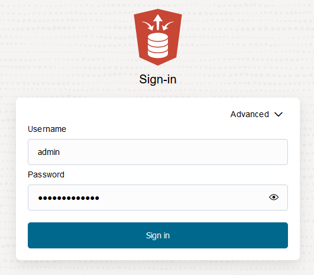

# Set up the environment

## Introduction

In this lab, you learn to create the required resources you'll use for Oracle Cloud Infrastructure (OCI) GoldenGate. We'll show you how to create a VCN and subnet, provision autonomous database instances, and load data into the databases.

Estimated time: 20 minutes

### Objectives

-  Provision a VCN and subnet
-  Provision, connect, and load data into an Autonomous Transaction Processing (ATP) instance

### Prerequisites

To successfully complete this lab, you must:

* Have completed the Get Started lab and sign up for Free Tier/Log in to Oracle Cloud.
* For IAM-enabled tenancies, ensure that you [configure Identity domains for OCI GoldenGate](https://docs.oracle.com/en/cloud/paas/goldengate-service/mkmbs/#GUID-DD9C1BF8-69FE-4C9A-A2D1-74C73550ED65).
* For non-IAM enabled tenancies, ensure that you ensure that you first [set up your Vault](https://docs.oracle.com/en-us/iaas/Content/KeyManagement/Tasks/managingvaults_topic-To_create_a_new_vault.htm#createnewvault).  [Learn more about Vault service](https://docs.oracle.com/en-us/iaas/Content/KeyManagement/Concepts/keyoverview.htm).


> **Notes:** 

> * You may see differences in account details (eg: Compartment Name is different in different places) as you work through the labs. This is because the workshop was developed using different accounts over time.
> * This workshop was designed to use Oracle Autonomous Databases as the source and target. If you plan to use Oracle Database, ensure that you use the CDB user to capture data from the PDBs.

## Task 1: Create a VCN and subnet

[](include:01-create-vcn-subnet.md)


## Task 2: Add Ingress rules

1.  On the Virtual Cloud Network Details page, select the private subnet.

2.  On the private subnet's details page, under **Security Lists**, select the Default security list.

3.  On the Security List Details page, under **Ingress Rules**, click **Add Ingress Rules**.

4.  In the Add Ingress Rules panel, complete the following fields, and then click **Add Ingress Rules**: 

    - For **Source CIDR**, enter `10.0.0.0/0`.
    - For **Destination Port Range**, enter `443`.

5.  Repeat steps 1 to 4 to add Source CIDR `0.0.0.0/0` and Destination Port Range `443` to the public subnet.

## Task 2: Create an ATP instance

[](include:02-create-atp-instance.md)


## Task 3: Load the ATP schema and enable supplemental logging

1.  Download the database schema:

    [Archive.zip](https://objectstorage.us-ashburn-1.oraclecloud.com/p/VEKec7t0mGwBkJX92Jn0nMptuXIlEpJ5XJA-A6C9PymRgY2LhKbjWqHeB5rVBbaV/n/c4u04/b/livelabsfiles/o/data-management-library-files/Archive.zip)

2.  Save `Archive.zip` to a download directory, and then unzip the file.

3.  Back in the Oracle Cloud console, select your ATP instance from the Autonomous Databases page to view its details and access tools.

    

4.  On the SourceATP Database Details page, click **Database actions**, and then select **SQL** from the dropdown. If the Database actions menu takes too long to load, you can click **View all database actions** directly, and then select **SQL** from the Database actions page.

    

5.  If prompted, log in with the ADMIN user and password provided when you created the ATP instance.

    

6.  (Optional) Close the Help dialog.

7.  Copy and paste the SQL script from **OCIGGLL\_OCIGGS\_SETUP\_USERS\_ATP.sql** into the SQL Worksheet.

    

8.  On Line 1 of the SQL worksheet, change the password to remove special characters. Ensure that it has at least 12 alphanumeric characters.

9.  Click **Run Script**. The Script Output tab displays confirmation messages.

10. Copy and paste the SQL script from **OCIGGLL\_OCIGGS\_SRC\_USER\_SEED\_DATA.sql** a new SQL Worksheet.

    

11. Click **Run Script**. The Script Output tab displays confirmation messages.

	> **Note:** If you find that running the entire script does not create the tables, then try running each table creation and insert statements one at a time until all the tables are created. You may also need to relaunch SQL to continue running the scripts until all tables are created and populated.

12. Close the SQL window and then reopen it from Database Actions again.

13. In the Navigator tab, look for the SRC\_OCIGGLL schema and then select tables from their respective dropdowns to verify the schema and tables were created. You may need to log out and log back in if you can't locate SRC\_OCIGGLL.

    

14. To enable supplemental logging, run the following command:

    ```
    <copy>ALTER PLUGGABLE DATABASE ADD SUPPLEMENTAL LOG DATA;</copy>
    `


## Task 4: Unlock the GGADMIN user

Oracle Autonomous Databases come with a GGADMIN user that is locked by default. The following steps guide you through how to unlock the GGADMIN user.

1.  From the Oracle Cloud Console navigation menu, click **Oracle Database**, and then select **Autonomous Transaction Processing**.

	

2.  From the list of databases, select **SourceATP**.

    

3.  On the SourceATP Database Details page, click **Database actions**, and then select **Database Users** from the dropdown. If the Database actions menu takes too long to load, you can click **Database actions** directly, and then select **Database users** from the Database actions page.

    

4.  If prompted, log in to Database actions as **admin**, using the ATP Admin Password from **View Login Info** in your Workshop instructions.

    

5.  From the list of users, locate **GGADMIN**, and then click the ellipsis (three dots) icon and select **Edit**.

    

6.  In the Edit User panel, deselect **Account is Locked**, enter the password you gave the ggadmin user in the Task 2, Step 10, and then click **Apply Changes**.

    

    Note that the user icon changes from a padlock to a checkmark.


You may now **proceed to the next lab.**

## Acknowledgements

- **Author** - Jenny Chan, Consulting User Assistance Developer
- **Last Updated** - February 2024
- **PAR Expiration date** - February 2024
