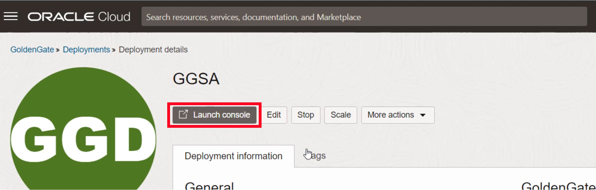
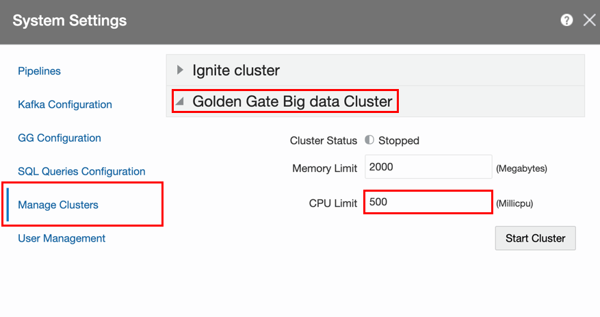

# Prepare a Stream Analytics Pipeline

## Introduction

Estimated Time: 15 minutes

This lab focuses on creating supporting object used in a streaming pipeline

### Objectives
* Understand connections forwarded from OCI GoldenGate
* Set up GoldenGate Change Data through local GoldenGate Big Data cluster
* Set up Streams, References, and Geo Fences

### Prerequisites
* Completion of Lab 1: Create GoldenGate Stream Analytics Deployment

## Task 1: Open GoldenGate Stream Analytics console

Now that we have created deployment and connections, we can open the Stream Analytics console and start creating supporting objects for a pipeline.

1. Navigate to the list of OCI GoldenGate deployments and open the GGSA deployment.


2. Open the Stream Analytics console by pressing the **Launch console** button.



3. The GGSA console will open in a new browser tab. For User Name, enter **oggadmin**, and for Password enter **Admin Password** from the Terraform output. Then press **Sign In**


4. The GGSA console opens with the homepage. Switch to the catalog page by pressing **Catalog**.  


## Task 2: Start GoldenGate Big Data cluster

OCI GoldenGate Stream Analytics embeds a GoldenGate Big Data environment to receive a change stream from GoldenGate extracts. 

1. Open System Settings in the upper right user menu


2. In System Settings, open the **Manage Clusters** tab and expand the **GGBD Cluster** area


3. Press the **Start Cluster** button and wait until the status of the cluster is in Cluster Status: Running. Close the System Settings dialog.


## Task 3: Change credentials in GoldenGate connection

The GoldenGate connection is available in Stream Analytics console trough the connection assignment. However, the credentials are not transfered and need to be updated. 

1. In the catalog page, click on the GoldenGate connection object.


2. On the first page of the Edit Connection dialog, press **Next**.


3. On the second page of the Edit Connection dialog, for GG User Name, enter **oggadmin**.

4. Press the link **Change Password** and then for GG Password, enter **Admin Password** from the Terraform output.

5. Press **Test connection** to make sure the connection is working. The text **Successful** will appear.

6. Press **Save** to close the dialog.


## Task 4: Create GoldenGate Change Data

GoldenGate Change Data creates an internal GoldenGate replicat process that connects to an external extract process to consume captured transactions. 

1. On the catalog page, click on **Create New Item** and select **GG Change Data**.

   

2. On the first page of the Create dialog, for Name, enter **ChangeData**.

3. For GG Type, select **Change Data**

4. Press **Next**.

   

5. On the second page of the Create dialog, for Connection, select **GoldenGate**.

6. Press **Next**.

   

7. On the third page of the Create dialog, for GG Extract, select **EDEMO**.

8. For Target Trail, enter **TT**.

9. For Kafka Connection, select **Kafka**.

10. For GG Change Data name, enter **GG**.

11. Press **Save**.

   

 12. On the catalog page, click on the Start icon on the far right of the ChangeData object in the list. The icons appear on hover over the row. Press **OK** on the confirmation dialog. Wait for the status to change to **Running**.

  

## Task 5: Change User Name in ADB Connection

Database connections are created with default user ggadmin. We will change this to a different user moviestream.

1. Switch back to the browser tab with GGSA console on catalog page. 

2. Click on **ADB\_Connection** object in the catalog list.

   

3. On Edit Connection dialog first page, press **Next**

4. On Edit Connection dialog second page, for Username, enter **moviestream**. Password does not need to be changed, it is the same (Admin Password from Terraform output).

5. Press **Test Connection** to check that connection works. The word "Successful" should appear.

6. Press **Save** to close the Dialog.

   

## Task 6: Create Database References

Create database references for two lookup tables for customers and movies to enrich events in the streaming pipeline.

1. On the catalog page, click on **Create New Item** and select **Reference** and in submenu **Database Table**.

   

2. On the first page of the Create Reference dialog, for Name, enter **Customer**.

3. Press **Next**.

   

4. On the second page of the Create Reference dialog, for Connection, select **ADB\_Connection**.

5. Press **Next**.

   

6. On the last page of the Create dialog, for shape, select the table **CUSTOMER**.

7. Press **Save**.

  

8. Repeat the same for table Movie: On the catalog page, click on **Create New Item** and select **Reference** and in submenu **Database Table**.

   

9. On the first page of the Create Reference dialog, for Name, enter **Movie**.

10. Press **Next**.

   

11. On the second page of the Create Reference dialog, for Connection, select **ADB\_Connection**.

12. Press **Next**.

   

13. On the last page of the Create dialog, for shape, select the table **MOVIE**.

14. Press **Save**.

  

## Task 7: Create Geofence

We are creating a GeoFence to select customers for two regions in the United States. Only customers located in these regions will be selected in the pipline.

1. On the catalog page, click on **Create New Item** and select **Geo Fence**.

   

2. On the first page of the Create Geo Fence dialog, for Name, enter **Regions**.

3. For Geo Fence Type, enter **Manually Created Geo Fence**.

3. Press **Save**.

 

 4. The Geo Fence editor opens. If any dialog for the browser asking your location opens, deny it. Press on the list icon to minimize it.

   

5. Double-click on the center of the United States to zoom in and center on it.

   

6. Click on the **Polygon Tool** icon and then click on points to draw a polygon over the West Coast of the US. Make sure the polygon is closed. It doesn't have to be exact, but should include a reasonably big area of multiple states.

   

7. Rename the region to **West Coast** in the text box on right-hand side and press Enter.
    

8. If necessary, drag the map with the mouse to get the East Coast fully visible.

9. Press the **Polygon Tool** icon again and draw another polygon over the East Coast of the US.  Rename the region to **East Coast** in the text box on right-hand side and press Enter.

10. Press **Return To Catalog**.

   


## Task 8: Start Event Generator

For this tutorial we are using an event generator that continuously inserts rows into the source database to simulate movie selections by customers. 

1. Go to the OCI console on a separate browser tab, leave the GGSA console open. 

2. In the OCI console, press the Developer Tools icon on top and select **Cloud Shell**
   

3. The Cloud Shell opens on the bottom of the screen. Enter the command ```ssh opc@IP_ADDRESS```, replacing the IP\_ADDRESS with **Kafka IP** from the Terraform output.

4. When asked 

   The authenticity of host ... can't be established.
   ...
   Are you sure you want to continue connecting (yes/no)?

   Enter the word **yes**.

5. When asked for a password, use the **Admin Password** from the Terraform output.

6. Enter the command ```sh eventgen.sh```. A continous output of insert statements will be shown. Keep the cloud shell window open for the duration of the tutorial. The command can later be stopped and restarted as necessary.

   


## Task 9: Create Kafka Stream

Create a stream to feed a pipeline with events from the Kafka topic that GoldenGate feeds into. 

1. On the catalog page, click on **Create New Item** and select **Stream** and in submenu **Kafka**.

   

2. On the first page of the Create Stream dialog, for Name, enter **ActivityStream**.

3. Press **Next**.

   

4. On the second page of the Create Stream dialog, for Connection, select **Kafka**.

5. For Topic name, select **gg_MOVIESTREAM.ACTIVITY**.

5. Press **Next**.

   

6.  On the third page of the Create Stream dialog, press **Next** without changes.

7. On the last page of the Create dialog, for shape, review that Infer shows as Successful.

8. Press **Save**.

  


You may now **proceed to the next lab.**

## Learn More

* [GoldenGate Stream Analytics](https://docs.oracle.com/en/middleware/fusion-middleware/osa/19.1/using/introduction-goldengate-stream-analytics.html)

## Acknowledgements

* **Author** - Alex Kotopoulis, Director of Product Management, Data Integration Development
* **Contributors** - Hope Fisher and Kaylien Phan, Database Product Management
* **Last Updated By/Date** - Hope Fisher, June 2023