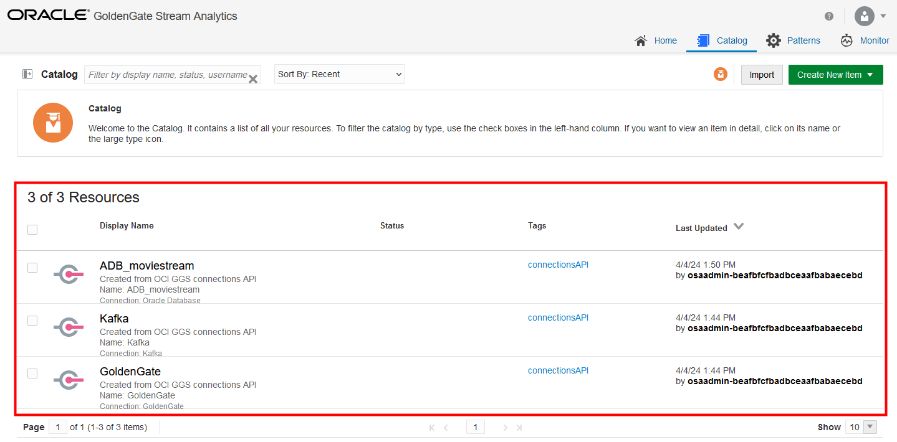
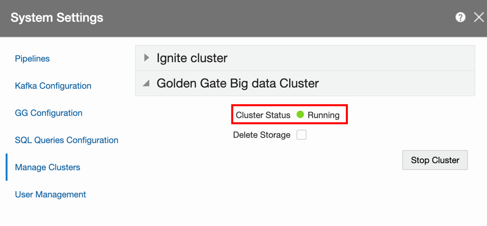

# Prepare a objects for Stream Analytics pipeline

## Introduction

Estimated Time: 15 minutes

In this lab, you create the supporting objects to use in a streaming pipeline.

Watch the video below for a quick walk through of the lab.
[Watch the video](videohub:1_5g86ol4o)

### Objectives
* Start the GoldenGate Big Data cluster
* Set up GoldenGate Change Data through local GoldenGate Big Data cluster
* Configure the connections from OCI GoldenGate
* Set up Streams, References, and Geo Fences

### Prerequisites
In order to complete this lab, you should have completed the preceding lab.

## Task 1: Launch the GoldenGate Stream Analytics console

Now that we have created deployment and connections, we can launch the Stream Analytics console and start creating supporting objects for a pipeline.

1. From the GGSA deployment details page, click **Launch console**.

   

2. The GGSA console will open in a new browser tab. Enter **oggadmin** for User Name. Copy and paste the **Admin Password** from the Reservation Information panel. Click **Sign In**.

   

3. You're brought to the GoldenGate Stream Analytics Home page. Click **Catalog**.  

   

   Observe the three connections, ADB_Connection, GoldenGate, and Kafka in the list of Resources.

   

## Task 2: Start the GoldenGate Big Data cluster

OCI GoldenGate Stream Analytics embeds a GoldenGate Big Data environment to receive a change stream from GoldenGate extracts. 

1. Click the oggadmin menu, and then select **System Settings**.

   

2. In the System Settings dialog, click **Manage Clusters** and then expand **GGBD Cluster**.

3. Change CPU Limit to `500` Millicpu.

   

4. Click **Start Cluster** and wait until the status of the cluster is **Cluster Status: Running**. Close the System Settings dialog.

      > **Note:** In rare cases, cluster creation will take longer than expected and a message **“Activating GGBD cluster is taking time”** will appear. In this case, close and reopen System Settings dialog after waiting for 1 minute. When cluster is running, close the System Settings dialog.

   

## Task 3: Start Event Generator

For this workshop, an event generator continuously inserts rows into the source database to simulate movie selections by customers. 

1. Return to the Oracle Cloud console, which should still be open in a separate browser tab. Leave the GGSA console open. 

2. In the Oracle Cloud console, click **Developer Tools** and then select **Cloud Shell**.

   

3. The Cloud Shell opens as a panel at the bottom of your window. It takes a few minutes to connect.

4. After Cloud Shell connects, enter `N` to skip the tutorial. 

5. At the command prompt, run the following command. Replace `<kafka-public-ip>` with the **Kafka Public IP** value copied from the Reservation Information panel.

      ```
      <copy>ssh opc@<kafka-public-ip></copy>
      ```

6. Enter `yes`, when asked **Are you sure you want to continue?**

7. When asked for a password, paste the **Admin Password** copied from the Reservation Information panel.

      > **Note:** The password won't be visible in Cloud Shell when you paste it in.

8. At the command prompt, run `sh eventgen.sh`. A continuous output of insert statements will be shown. Keep the cloud shell window open for the duration of the workshop. The command can be stopped and restarted as necessary.

      ```
      <copy>sh eventgen.sh</copy>
      ```

   


## Task 4: Create GoldenGate Change Data

GoldenGate Change Data creates an internal GoldenGate Replicat process that connects to an external extract process to consume captured transactions. 

1. Return to the Stream Analytics console. On the Catalog page, click **Create New Item** and then select **GG Change Data**.

   

2. Create GG Change Data consists of three pages. On the Type Properties page, for Name, enter **ChangeData**.

3. For GG Type, select **Change Data**, and then click **Next**.

   

4. On the GG Deployment Details page, for Connection, select **GoldenGate**, and then click **Next**.

   

5. On the GG Change Data Data Details page, for GG Extracts, select **EDEMO**.

6. For Target Trail, enter `TT`.

7. For Kafka Connection, select **Kafka**.

8. For GG Change Data name, enter **GG**.

9. Click **Save**.

   

10. On the Catalog page, place your mouse over ChangeData, and then click **Start GG Change Data**. 

   

11. Click **OK** in the warning dialog. Wait for the status to change to **Running**.

   

## Task 5: Create Database References

Create database references for two lookup tables for customers and movies to enrich events in the streaming pipeline.

1. On the Catalog page, click **Create New Item**, then **Reference**, and then **Database Table**.

   

2. The Create Reference dialog consists of four pages. On the Type Properties page, for Name, enter **Customer**, and then click **Next**.

   

4. On the Source Details page, for Connection, select **ADB\_moviestream**, and then click **Next**.

   

5. On the Shape page, from Shape Name dropdown, select **CUSTOMER**, and then click **Save**.

  

7. Repeat Steps 1 to 5 for **Movie**.

   

## Task 6: Create a Geofence

Create a GeoFence to select customers for two regions in the United States. Only customers located in these regions will be selected in the pipeline.

1. On the Catalog page, click **Create New Item**, and then select **Geo Fence**.

   

2. The Create Geo Fence dialog consists of three pages. On the Type Properties page, for Name, enter **Regions**.

3. For Geo Fence Type, select **Manually Created Geo Fence**, and then click **Save**.

   

 4. The Geo Fence editor opens. If a dialog asking for your location opens, select **Remember this decision,** and then click **Block**. Click **Saved Geo-Fences** to minimize the Regions list.

   

5. Double-click the center of the United States to zoom in and center on it.

   

6. Click the **Polygon Tool** icon and then click on points to draw a polygon over the West Coast of the US. Make sure the polygon is closed. It doesn't have to be exact, but should include a reasonably big area of multiple states.

   

7. Rename the region **West Coast** in the Polygon dialog and press Enter.
    

8. If necessary, use your mouse to click and drag the map so the East Coast is fully visible.

9. Use the **Polygon Tool** to draw another polygon over the East Coast of the US.  Rename the region to **East Coast** in the Polygon dialog and press Enter.

10. Click **Return To Catalog**.

   


## Task 7: Create a Kafka Stream

Create a stream to feed a pipeline with events from the Kafka topic into which GoldenGate feeds.

1. On the Catalog page, click **Create New Item**, then **Stream** and then **Kafka**.

   

2. The Create Stream dialog consists of four pages. On the Type Properties page, for Name, enter **ActivityStream**, and then click **Next**.

   

3. On the Source Details page, for Connection, select **Kafka**.

4. For Topic name, select **gg_MOVIESTREAM.ACTIVITY**, and then click **Next**.

   

5. On the Data Format page, click **Next**.

6. On the Shape page, confirm that Infer is **Successful**.

   

7. Click **Save**.

  


You may now **proceed to the next lab.**

## Learn More

* [GoldenGate Stream Analytics](https://docs.oracle.com/en/middleware/fusion-middleware/osa/19.1/using/introduction-goldengate-stream-analytics.html)

## Acknowledgements

* **Author** - Alex Kotopoulis, Director of Product Management, Data Integration Development
* **Contributors** - Hope Fisher and Kaylien Phan, Database Product Management
* **Last Updated By/Date** - Katherine Wardhana, May 2024