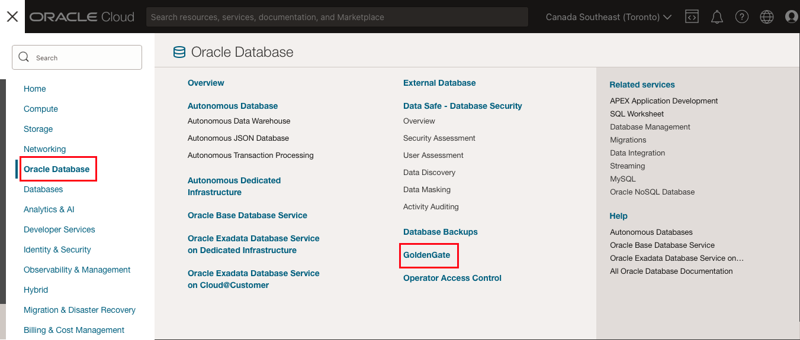
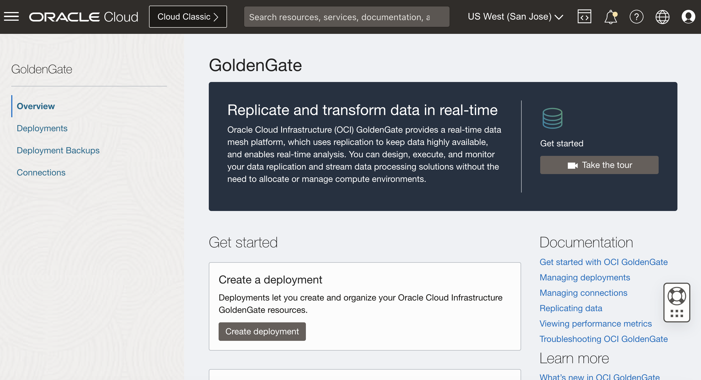
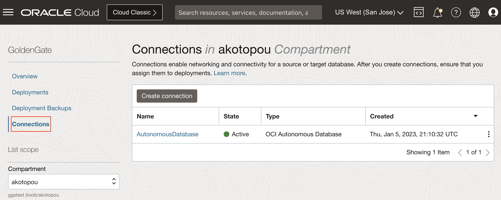
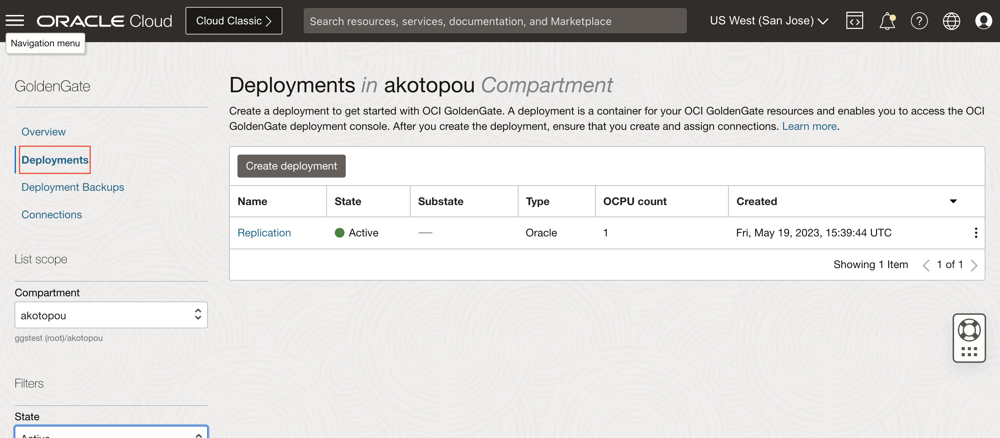
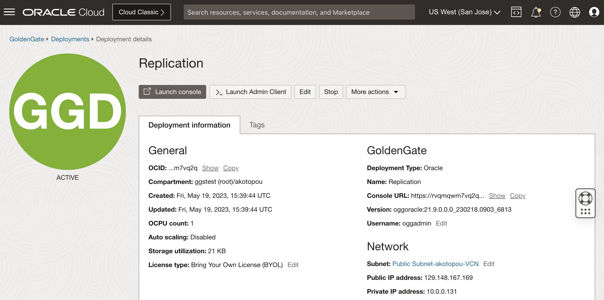
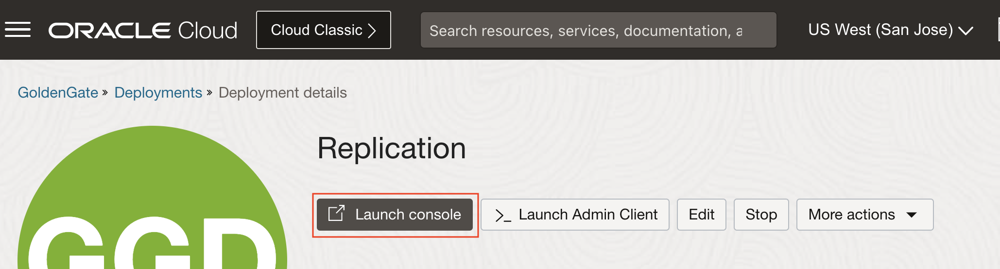
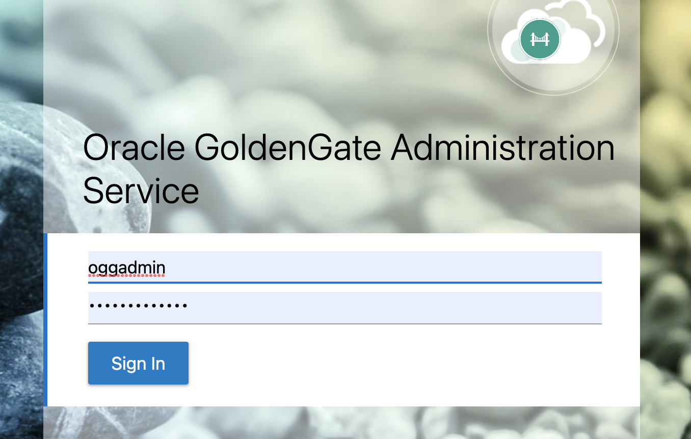
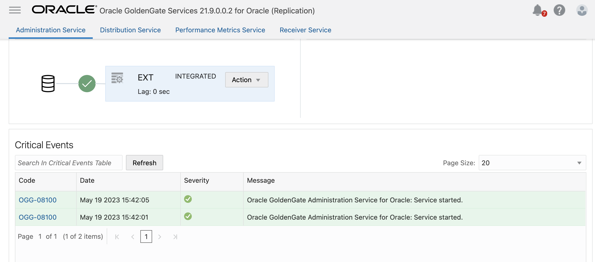

# Review GoldenGate Replication

## Introduction

Estimated Time: XXX minutes

This lab reviews the GoldenGate essentials - connections, deployments, and extracts. You will also start a generator script for continuous transactions to your autonomous database table.

### Objectives
* XXXX

### Prerequisites
* Experience with Oracle Database
* Familiarity with Oracle GoldenGate is helpful, but not required
* Familiarity with Oracle Cloud Infrastructure is helpful, but not required
* An Oracle Free Tier, Always Free, Paid or LiveLabs Cloud Account

## Task 1: Open OCI GoldenGate in OCI to review

1. From your OCI console, go to Oracle Database, then GoldenGate

   

2. Review the GoldenGate overview page

   

## Task 2: Review connection to source database

1. Open Connections

2. Review the pre-created Connection "Autonomous Database"

   

## Task 3: Open the GoldenGate deployment

1. In Deployments, find the pre-created deployment "Replication"

   

2. Open Replication and review the instance

   

3. Review the assigned connections. You will see that Autonomous Database is assigned.

## Task 4: Open the Oracle GoldenGate user interface

1. Launch the GoldenGate console

   

2. Login with oggadmin and <password>

   

## Task 5: Review the extract

1. Review the extract from the source database

   

## Task 6: Start continuous transactions

1. Open cloud shell

2. Upload private key to cloud shell or create key file

3. Execute the following code with your **private_key_file** and **kafka_instance_ip_address**

    ```
    <copy>
    ssh -i <private_key_file> opc@<kafka_instance_ip_address>
    ./gen_inserts
    </copy>
    ```

    Inserts to the Autonomous Database are now being created.


4. You may proceed to the next lab.

## Learn More

* [GoldenGate current release](https://docs.oracle.com/en/middleware/goldengate/core/index.html)

## Acknowledgements

* **Author** - Alex Kotopoulis, Director of Product Management, Data Integration Development
* **Contributors** - Hope Fisher and Kaylien Phan, Database Product Management
* **Last Updated By/Date** - Hope Fisher, June 2023