# Setup a Stream Analytics Pipeline

This lab focuses on creating a pipeline and establishing stages, filters, and visualizations.

## **Lab Prerequisites**

* Completion of Lab 2: Create GoldenGate Stream Analytics Deployment

## Task 1: Review Connections

1. Review the connections created.

   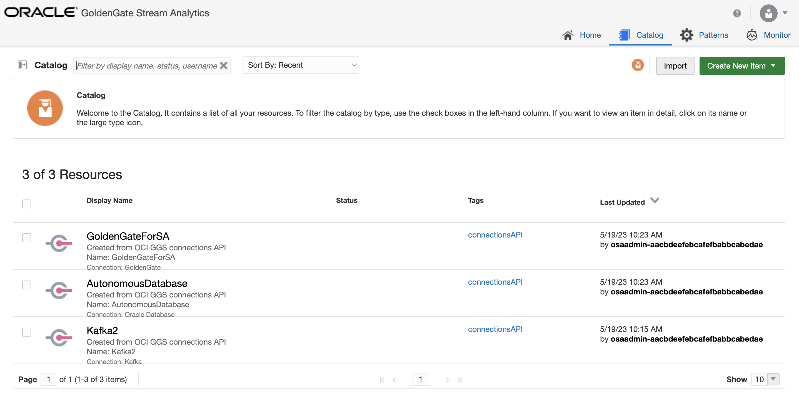

## Task 2: Create GoldenGate Change Data

1. To create a GoldenGate Change Data, we will use the GoldenGate extract.

   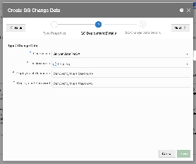

## Task 3: Create Stream

1. To create a Stream, we will use the Kafka topic.

   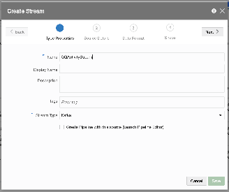

## Task 4: Create References

1. To create Refereneces, we will use the lookup tables in the autonomous database.

   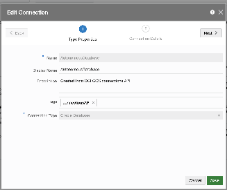

## Task 5: Create pipeline

1. Create a pipeline.

   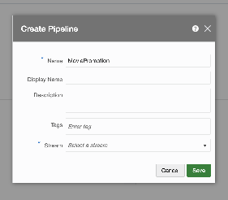

2. Open the pipeline editor.

   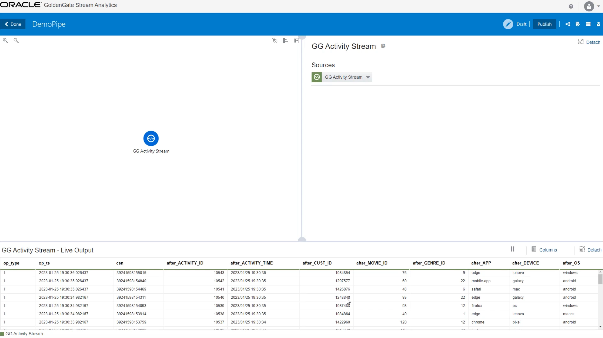

    **Note:**

    * The pipeline would continue to run even after you log out since the pipeline is now in published state.

    * By default the Pipeline is in *Draft* state, and quitting the pipeline editor without publishing will remove the pipeline and release all cluster resources.

3. Insert a query stage and use References for lookup

   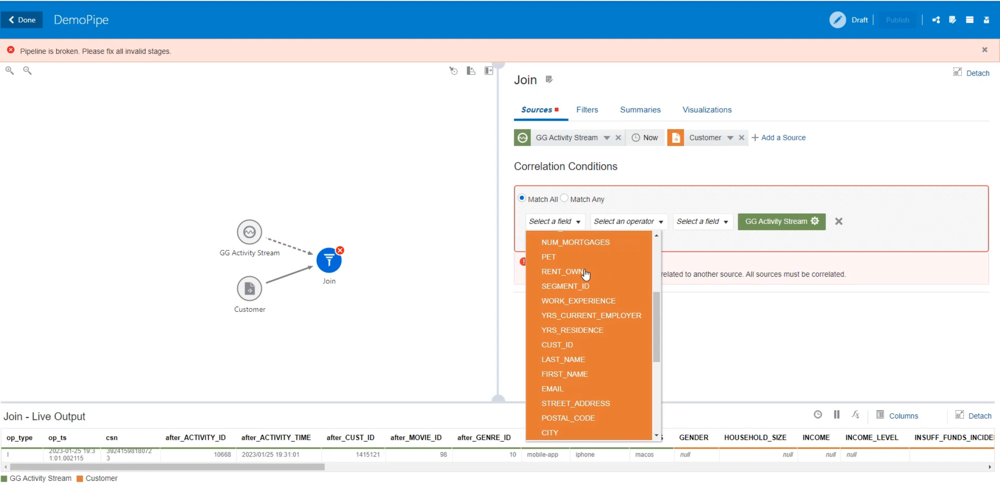

## Task 6: Add Geofence

1. Open the Geofence editor and create a geofence for the promotion areas.
    *Note: we will suggest a simplified area*

   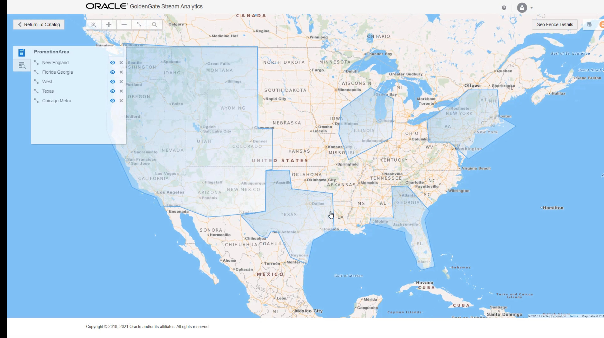

2. Go to the pipeline and add a Geofence pattern stage.

   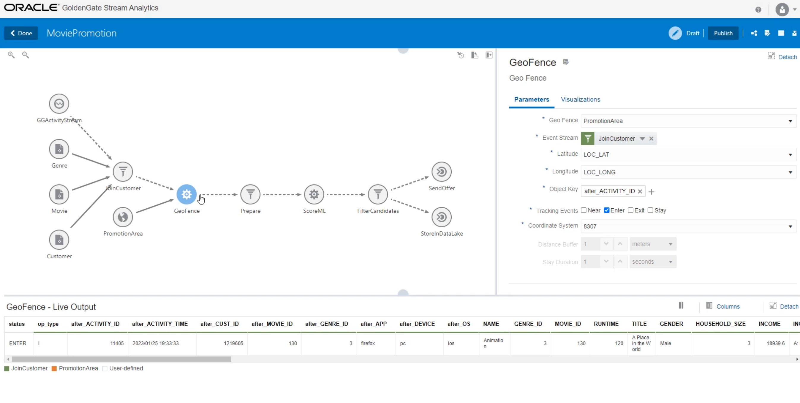

## Task 7: Add OML stage

1. Optional: Open the OML URL to review the existing OML model

   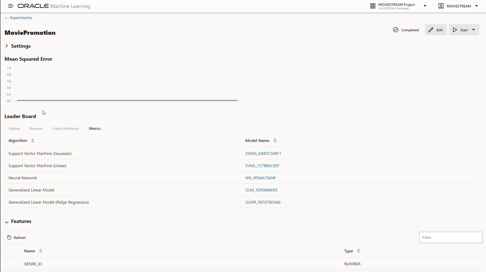

2. Go to the pipeline and add an OML stage.

   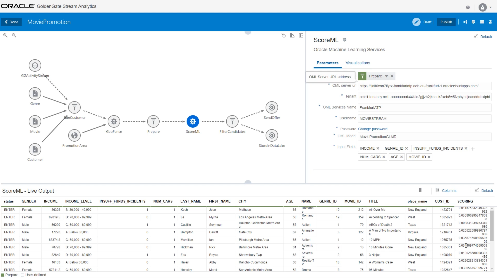

## Task 8: Query stage and visualization

1. Add a query stage and filter

   

2. Add a pie-chart visualizaiton.

   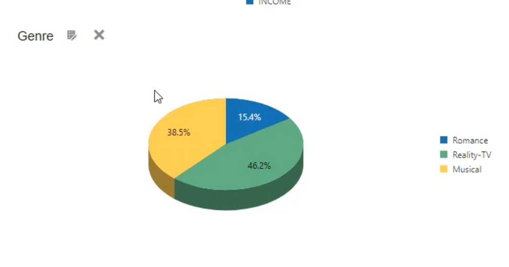

## Task 9: Add target stage

1. Add a target stage to the autonomous database and write to table.

   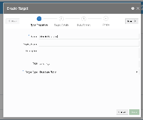

2. Add a second target stage to Kafka. Create a target to a new topic for sending out offers.

   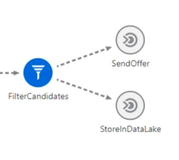

You have now successfully completed Introduction to GoldenGate Stream Analytics!

## Learn More

* [GoldenGate Stream Analytics](https://docs.oracle.com/en/middleware/fusion-middleware/osa/19.1/using/introduction-goldengate-stream-analytics.html)

## Acknowledgements

* **Author** - Alex Kotopoulis, Director of Product Management, Data Integration Development
* **Contributors** - Hope Fisher and Kaylien Phan, Database Product Management
* **Last Updated By/Date** - Hope Fisher, June 2023