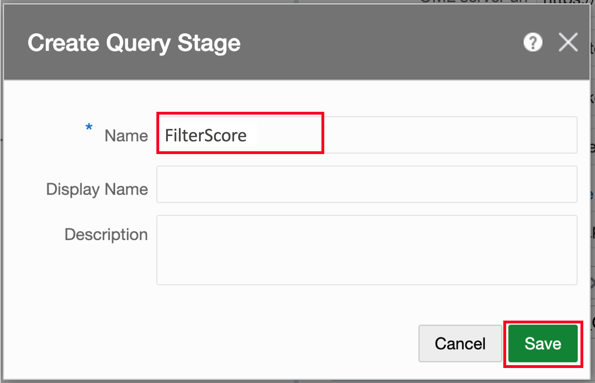

# Create and publish the Stream Analytics pipeline

## Introduction

Estimated Time: 20 minutes

In this lab, you create a pipeline and add stages, filters, and visualizations.

Watch the video below for a quick walk through of the lab.
[Watch the video](videohub:1_d9leh5at)

### Objectives
* Learn how to create pipelines
* Understand different stage types such as stream, query, pattern, target
* Configure complex stage type
* Publish a pipeline

### Prerequisites
In order to complete this lab, you should have successfully completed the preceding lab.

## Task 1: Create a pipeline

Now that we have created deployment and connections, we can open the Stream Analytics console and start building a pipeline.

1. On the Catalog page, click **Create New Item** and select **Pipeline**.

   

2. In the Create Pipeline dialog, for Name, enter **MoviePromotion**.

3. For Stream, select **ActivityStream**, and then click **Save**.

   

4. The pipeline editor opens. At this point, the pipeline is deployed in draft mode, which takes 1-2 minutes. Wait until "Starting Pipeline..." disappears at the bottom of the page and events start to be appear. Click **Got it** in the help dialog to continue.

   

## Task 2: Enrich Events with Database References and Select Columns

In this task, you add a Query Stage, which can join, filter, and aggregate events and select and transform columns, similar to a SQL Select statement.

1. Right-click the ActivityStream stage, select **Add a Stage**, and then **Query**.

   

2. In the Create Query Stage dialog, for Name, enter **EnrichActivity**, and then click **Save**.

   

3. In the EnrichActivity panel, click **Add a Source**, and then select **Customer**.

   

4. Ignore the errors that appear, they warn that the current join is incomplete. Click the **Add Source**, and then select **Movie**.

   

5. Under Correlation Conditions, click **Add Condition**.

   

6. In the three condition fields select **MOVIE\_ID**, **equals**, and **after\_MOVIE\_ID**.

   

7. Click **Add Condition** again.

8. In the three condition fields select **CUST\_ID** (scroll down to expand Customer), **equals**, and **after\_CUST\_ID**.

  

9. Click anywhere outside the condition box to apply the conditions.

   

10. In the EnrichActivity - Live Output panel, click **Columns**. 

   

11. In the Columns dialog, **Move ALL** unselect all columns. All columns move to the Unselected/Removed Columns list. 

   

12. CTRL+click to multiselect the following columns and then click **Move Selected**.

      * after\_GENRE\_ID
      * LOC\_LAT
      * LOC\_LONG
      * AGE
      * INCOME
      * INSUFF\_FUNDS\_INCIDENTS
      * NUM\_CARS
      * CITY
      * FIRST\_NAME
      * CUST\_ID
      * LAST\_NAME
      * TITLE

   

13. Click **Save**.

14. Rename the column **after\_GENRE\_ID** to **GENRE\_ID**. Double-click the **after\_GENRE\_ID** column header. In the edit field change the name to **GENRE\_ID**. Click Enter to save your changes.
   

## Task 3: Filter Customers with Geo Fence

In this task you add a Query Stage, which can join, filter, and aggregate events and select and transform columns similar to a SQL statement.

1. Right-click the EnrichActivity stage, then select **Add a Stage**, and then **Pattern**.

   

2. In the Select Pattern dialog, select the category **Spatial**, and then the Pattern **Geo Fence**.

   

3. In the Create Pattern Stage dialog, for Name, enter **FilterRegion** and click **Save**.

   

4. In the FilterRegion panel, for **Geo Fence** select **Regions**.

5. For **Latitude** select **LOC\_LAT**.

6. For **Longitude** select **LOC\_LONG**.

7. For **Object Key** select **CUST\_ID**.

8. In **Tracking Events** deselect **Near**, **Exit**, and **Stay**, so that only **Enter** remains selected.

9. Click somewhere outside the condition box to apply the changes.

  

10. Wait for changes to apply and events to appear in the Live Event Output. Click **Visualizations** to see customer locations within the West Coast and East Coast regions.

  

## Task 4: Add Machine Learning (OML) Scoring

You can now score customer events based on the likelihood to respond to a promotion. There is a pre-trained OML model in the Autonomous Data Warehouse that you can use.

1. Right-click the FilterRegion stage, select **Add a Stage**, and then **Pattern**.

   

2. In the Select Pattern dialog, choose the category **Machine Learning** and then the Pattern **Oracle Machine Learning Services**.

   

3. In the Create Pattern Stage dialog, for Name, enter **Score** and then click **Save**.

   

4. In the Score panel, for OML server url, copy and paste the **ADB URL** from the Reservation Information panel. Ensure that no trailing slashes (/) are added to the end of the url.

5. For **Tenant**, copy and paste the **Tenancy OCID** from the Reservation Information panel.

6. For **OML Services Name**, enter **ADB Name** from the Reservation Information panel.

7. For **Username**, enter **omluser**.

8. For **Password**, click **Change password** and then copy and paste the **Admin Password** from the Reservation Information panel.

9. For **OML\_Model** enter **score\_promo**.

10. For **Input Fields** select **CITY**, **GENRE\_ID**, **INCOME**, **INSUFF\_FUNDS\_INCIDENTS**, and **NUM\_CARS**.

11. Click somewhere outside the condition box to apply the changes.

  

12. Wait for changes to apply and events to appear in the Live Event Output. A **SCORING** column appears and has values up to 0.1. Later, you will use scores above 0.04 to determine candidates for promotion.

   

## Task 5: Add Target to Write to Data Warehouse

Write all score results to a data warehouse for later analysis. Add a target here prior to filtering. 

1. Right-click the Score stage, select **Add a Stage**, and then **Target**.

   

2. In the Create Target Stage dialog, for Name, enter **WriteToADW** and then click **Save**.

   

2. In the WriteToADW panel, for Target, click **Create**.

   

3. The Create Target dialog consists of four pages. On the Type Properties page, for Name, enter **WriteToADW**.

4. For Target Type, select **Database Table**, and then click **Next**.

   

5. On the Target Details page, for Connection, select **ADB\_moviestream**, and then click **Next**.

   

6. On the Shape page, for Table Name, select **PROMO\_CUSTOMER**, and then click **Save.**

  

7. All fields of the events are automatically mapped to target fields as they have the same name. Wait for changes to apply and events to appear in the Live Event Output.

  

## Task 6: Filter Customers based on ML Score

In this task, you add a Query Stage to filter events by the ML score. Only events with a score above 0.04 should proceed.

1. Right-click the Score stage, select **Add a Stage**, and then **Query**.

   

2. In the Create Query Stage dialog, for Name, enter **FilterScore**, and then click **Save**.

  

3. In the FilterScore panel, click **Filters**, and then click **Add Filter**.

   

4. In the three condition fields select **SCORING**, **greater than or equals**, and type in **0.04**.
   

5. Click anywhere outside the condition box to apply the changes.

  

## Task 7: Add Target to Send Offer to Customer

In the final task you create a Kafka target to send out offer messages that will be relayed to the customer through downstream applications. 

1. Right-click the FilterScore stage, select **Add a Stage**, and then **Target**.

   

2. In the Create Target Stage dialog, for Name, enter **SendOffer** and then click **Save**.

   

3. In the SendOffer Target Mapping panel, click **Create**.

   

4. On the Type Properties page, for Name, enter **SendOffer**.

5. For Target Type, select **Kafka**, and then click **Next**.

   

6. On the Target Details page, for Connection, select **Kafka**.

7. For Topic name, enter **CustomerOffer**, and then click **Next**. On Data Formats page, keep the default and press **Next**.

   

8.  On the Shape page, you can leave all field mappings unchanged. The JSON document inside Kafka events will contain these fields. Click **Save**.

   

9. Wait for the changes to apply and new events to be displayed in the Live Event Output. The pipeline is now finished and produces offers to customers.

   

## Task 8: Publish Pipeline

The pipeline currently runs in draft mode for developers, meaning that it will stop when the editor is closed, and no output is written to the targets. To run a pipeline in production, it needs to be published.

1. Click **Publish**.

  

2. In the publish dialog, you can set resource allocation and runtime parameters for the pipeline. Leave the defaults unchanged and click **Publish**.

  

3. Wait for the pipeline to publish. After the pipeline is published, the status is shown on the upper right. The pipeline is now in production and writes to Autonomous Data Warehouse and Kafka. 

  

You have now successfully completed your introduction to GoldenGate Stream Analytics!

## Learn More

* [GoldenGate Stream Analytics](https://docs.oracle.com/en/middleware/fusion-middleware/osa/19.1/using/introduction-goldengate-stream-analytics.html)

## Acknowledgements

* **Author** - Alex Kotopoulis, Director of Product Management, Data Integration Development
* **Contributors** - Hope Fisher and Kaylien Phan, Database Product Management
* **Last Updated By/Date** - Katherine Wardhana, May 2024