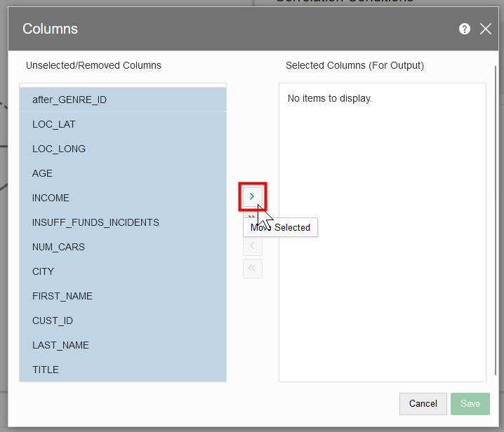
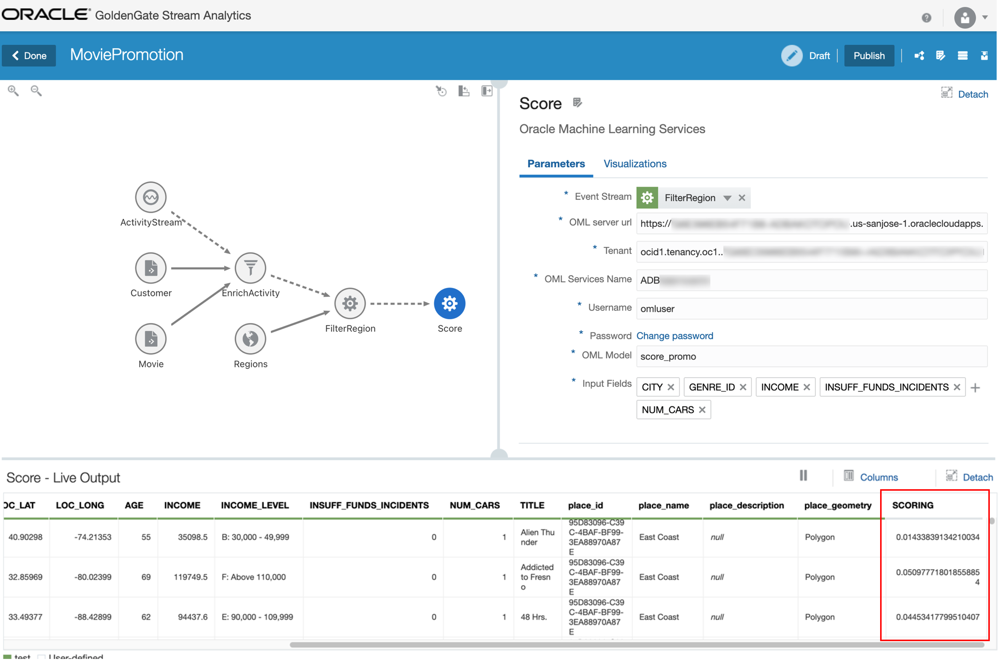
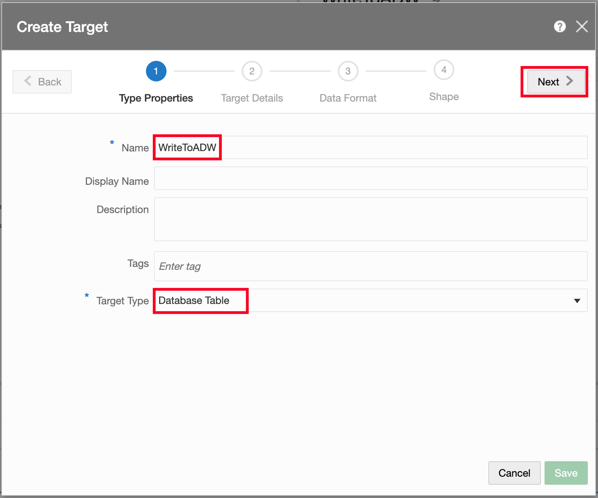
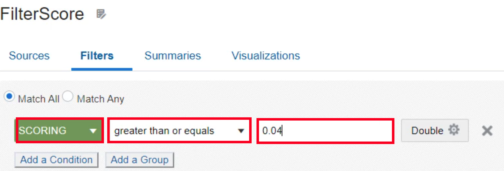

# Setup a Stream Analytics Pipeline

## Introduction

Estimated Time: 20 minutes

This lab focuses on creating a pipeline and establishing stages, filters, and visualizations.

### Objectives
* Learn how to create pipelines
* Understand different stage types such as stream, query, pattern, target
* Configure complex stage type
* Publish a pipeline

### Prerequisites
* Completion of Lab 2: Prepare a Stream Analytics Pipeline

## Task 1: Create a pipeline

Now that we have created deployment and connections, we can open the Stream Analytics console and start building a pipeline.

1. Open the GGSA console on the Catalog page. If you don't have it open, please repeat lab 1, task 1, steps 1-4.

2. In the catalog page, click on **Create New Item** and select **Pipeline**.

   

3. On the Create Pipeline dialog, for Name, enter **MoviePromotion**.

4. For Stream, select **ActivityStream**

5. Press **Save**.

   

6. The pipeline editor opens. At this point the pipeline is being deployed in draft mode, which will take 1-2 min. Please wait until "Starting Pipeline..." at the bottom disappears and events are started to be listed. You can press the **Got it** button on the help text appearing next to the ActivityStream stage.

   

## Task 2: Enrich Events with Database References and Select Columns

In this task we will add a Query Stage, which, much like a SQL Select statement, can join, filter, and aggregate events and select and tranform columns.

1. Right-click the ActivityStream stage and select in the menu **Add a Stage** and in the submenu **Query**.
   

2. In the Create Query Stage dialog, for Name enter **EnrichActivity**.

3. Press **Save**.
  

4. Press the **Add Source** button on the right side of the screen.

5. In the menu select **Customer**.

   

6. Ignore errors appearing on the screen, they warn that the current join is incomplete. Press again the **Add Source** button on the right side of the screen.

7. In the menu select **Movie**.

   

8. Press **Add Condition**

   

9. In the three condition fields select **Movie > MOVIE\_ID**, **equals**, and **after\_MOVIE\_ID**

  

10. Press **Add Condition** again

9. In the three condition fields select **Customer > CUST\_ID**, **equals**, and **after\_CUST\_ID**

  

12. Click somewhere outside the condition box to apply the condition.

   

13. Click on **Columns** above the Live Event Output. 
   

14. On the Columns dialog, first press the **<<** button to unselect all columns. They are moved to the left side. 

15. Select the following columns and press **>** to move them to the right side. You can do multi-select with Ctrl button or move one-by-one. 
   after\_GENRE\_ID, CITY, CUST\_ID, LAST\_NAME, FIRST\_NAME, LOC\_LAT, LOC\_LONG, AGE, INCOME, INSUFF\_FUNDS\_INCIDENTS, NUM\_CARS, TITLE
   

16. Press Save to close the dialog.

17. We need to rename the column **after\_GENRE\_ID** to **GENRE\_ID**. Double-click on the **after\_GENRE\_ID** column header. An edit field will appear, change the name to **GENRE\_ID**. Press Enter after renaming.
   

## Task 3: Filter Customers with Geo Fence
In this task we will add a Query Stage, which, much like a SQL Select statement, can join, filter, and aggregate events and select and tranform columns.

1. Right-click the EnrichActivity stage and select in the menu **Add a Stage** and in the submenu **Pattern**.
   

2. In the Select Pattern dialog, choose the category **Spatial** and then the Pattern **Geo Fence**.
   

3. In the Create Pattern Stage dialog, for Name, enter **FilterRegion** and press **Save**.
   

4. In the field **Geo Fence** select **Regions**
5. In the field **Latitude** select **LOC\_LAT**
6. In the field **Longitude** select **LOC\_LONG**
7. In the field **Object Key** select **CUST\_ID**
8. In **Tracking Events** deselect **Near**, **Exit**, and **Stay**, so that only **Enter** remains checked.
9. Click somewhere outside the condition box to apply the changes.

  

10. Wait for changes to apply and events to appear in the Live Event Output. Then press the Visualizations tab and see customer locations within the West Coast and East Coast regions.

  

## Task 4: Add OML Machine Learning Scoring

We can now score customer events based on the likelihood to respond to a promotion. We have a pre-trained OML model in the autonomous data warehouse that we can use.

1. Right-click the FilterRegion stage and select in the menu **Add a Stage** and in the submenu **Pattern**.
   

2. In the Select Pattern dialog, choose the category **Machine Learning** and then the Pattern **Oracle Machine Learning Services**.
   

3. In the Create Pattern Stage dialog, for Name, enter **Score** and press **Save**.
   

4. In the field **OML server url** enter **ADB URL** from the Terraform output
5. In the field **Tenant** enter **Tenant OCID** from the Terraform output
6. In the field **OML Services Name** enter **ADB Name** from the Terraform output
7. In the field **Username** enter **omluser**
7. In the field **Password** enter **Admin Password** from the Terraform output
7. In the field **OML_Model** enter **score\_promo**
8. In **Input Fields** select **CITY**, **GENRE\_ID**, **INCOME**, **INSUFF\_FUNDS\_INCIDENTS**, and **NUM\_CARS**.
9. Click somewhere outside the condition box to apply the changes.

  

10. Wait for changes to apply and events to appear in the Live Event Output. The rightmost column in output is **SCORING** and has typically values up to 0.1. We will use scores above 0.06 later to determine candidates for promotion.

   

## Task 5: Add Target to Write to Data Warehouse

We want to write all score results to a data warehouse for later analysis. We add a target here prior to filtering. 

1. Right-click the Score stage and select in the menu **Add a Stage** and in the submenu **Target**.
   

2. In the Create Target Stage dialog, for Name, enter **WriteToADW** and press **Save**.
   

2. On the Target Mapping panel, press **Create**.
   

3. On the first page of the Create Target dialog, for Name, enter **WriteToADW**.

4. For Target Type, select **Database Table**.

5. Press **Next**.

   

6. On the second page of the Create Target dialog, for Connection, select **ADB_Connection**.

7. Press **Next**.

   

8. On the last page of the Create dialog, for Table Name, select **PROMO\_CUSTOMER**.

9. Press **Save**.

  

10. All fields of the events are automatically mapped to target fields as they have the same name. Wait for changes to apply and events to appear in the Live Event Output.

  

## Task 6: Filter Customers based on ML Score

In this task we will add a Query Stage to filter events by the ML score. Only events with a score above 0.06 should proceed.

1. Right-click the Score stage and select in the menu **Add a Stage** and in the submenu **Query**.
   

2. In the Create Query Stage dialog, for Name enter **EnrichActivity**.

3. Press **Save**.
  

4. Select the Filter tab on the right-hand side

5. Press the **Add Filter** button.
   

6. In the three condition fields select **Score > SCORING**, **greater than**, and type in **0.06**
   

7. Click somewhere outside the condition box to apply the changes.

  

## Task 7: Add Target to Send Offer to Customer

In the final task we create a Kafka target to send out offer messages that will be relayed to the customer through downstream applications. 

1. Right-click the Filter stage and select in the menu **Add a Stage** and in the submenu **Target**.
   

2. In the Create Target Stage dialog, for Name, enter **SendOffer** and press **Save**.
   

2. On the Target Mapping panel, press **Create**.
   

3. On the first page of the Create Target dialog, for Name, enter **SendOffer**.

4. For Target Type, select **Kafka**.

5. Press **Next**.

   

6. On the second page of the Create Target dialog, for Connection, select **Kafka**.

7. For Topic, enter **CustomerOffer**.

8. Press **Next**.

   

9.  On the third page of the Create Stream dialog, press **Next** without changes.

10. On the last page of the Create dialog, you can leave all field mappings unchanged. The JSON document inside Kafka events will contain these fields.

11. Press **Save**.

  

12. Wait for the changes to apply and new events to be displayed in the Live Event Output. The pipeline is now finished and produces offers to customers.

  

## Task 8: Publish Pipeline

The pipeline currently runs in draft mode for developers, meaning that it will stop when the editor is closed, and no output is written to the targets. To run a pipeline in production, it needs to be published.

1. Press the **Publish** button on the upper right.

  

2. In the publish dialog you can set resource allocation and runtime parameters for the pipeline. Leave the defaults unchanged and press the **Publish** button.

  

3. Wait for the pipeline to get published, After the pipeline is published, the status is shown on the upper right. The pipeline is now in production and writes to Autonomous Data Warehouse and Kafka. 

  

You have now successfully completed Introduction to GoldenGate Stream Analytics!

## Learn More

* [GoldenGate Stream Analytics](https://docs.oracle.com/en/middleware/fusion-middleware/osa/19.1/using/introduction-goldengate-stream-analytics.html)

## Acknowledgements

* **Author** - Alex Kotopoulis, Director of Product Management, Data Integration Development
* **Contributors** - Hope Fisher and Kaylien Phan, Database Product Management
* **Last Updated By/Date** - Hope Fisher, June 2023