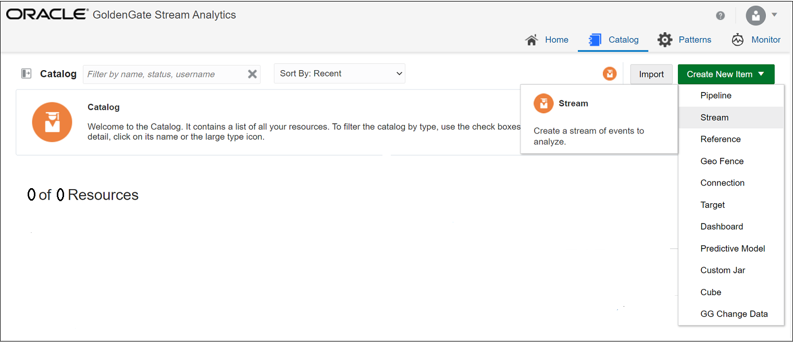
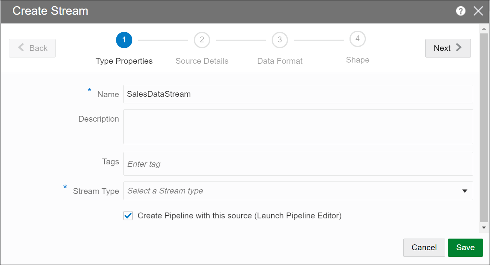
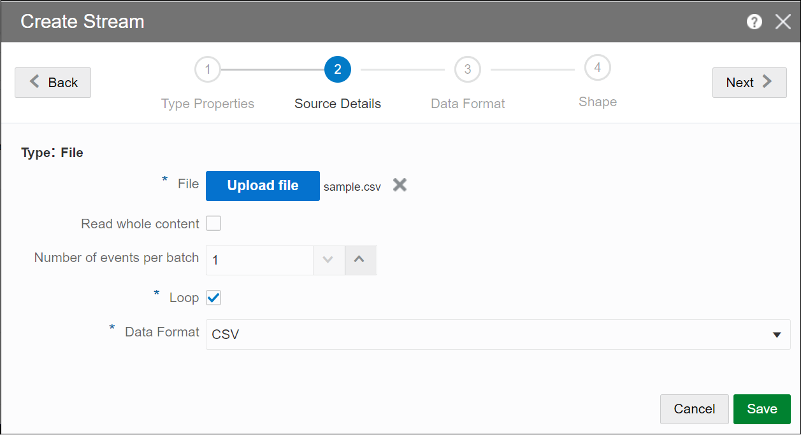
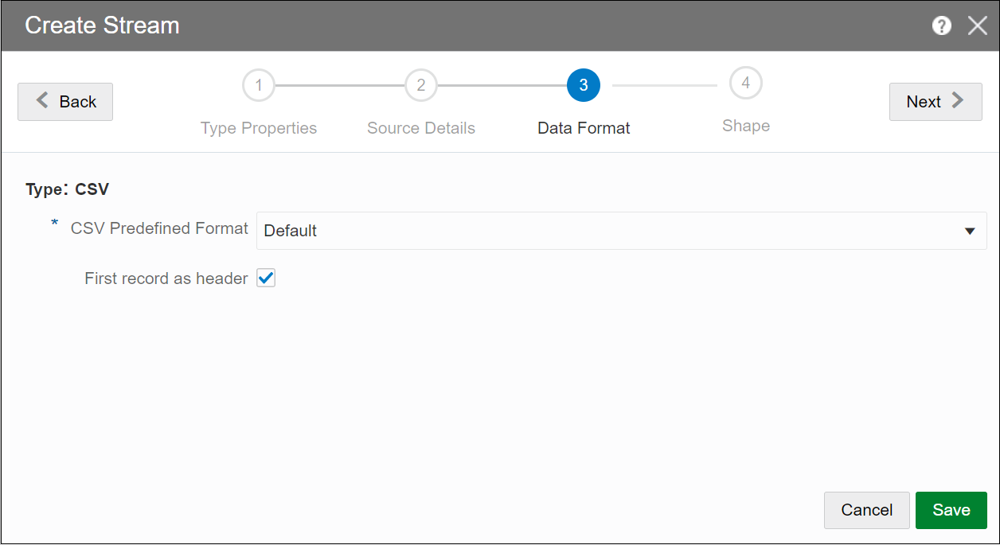
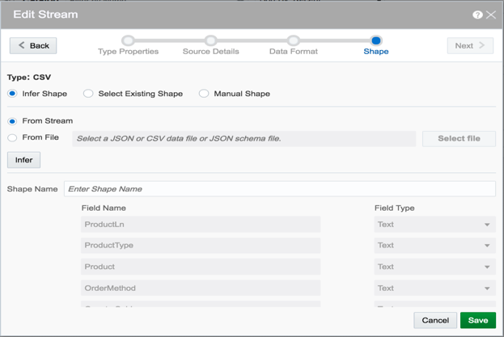
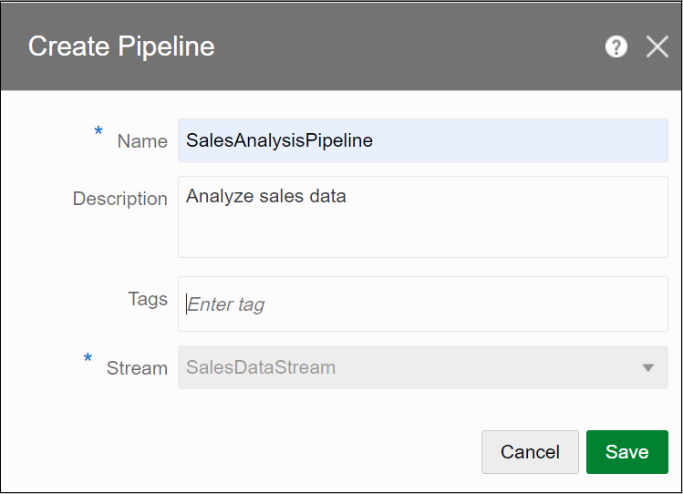
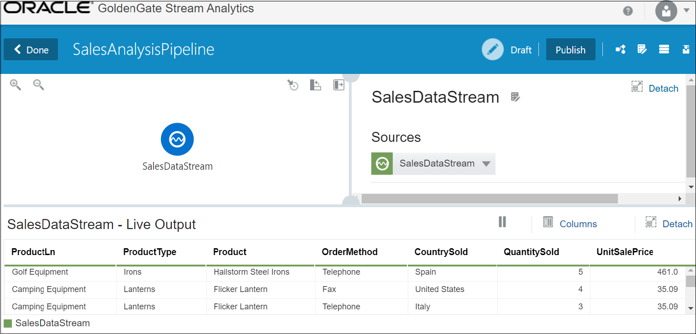
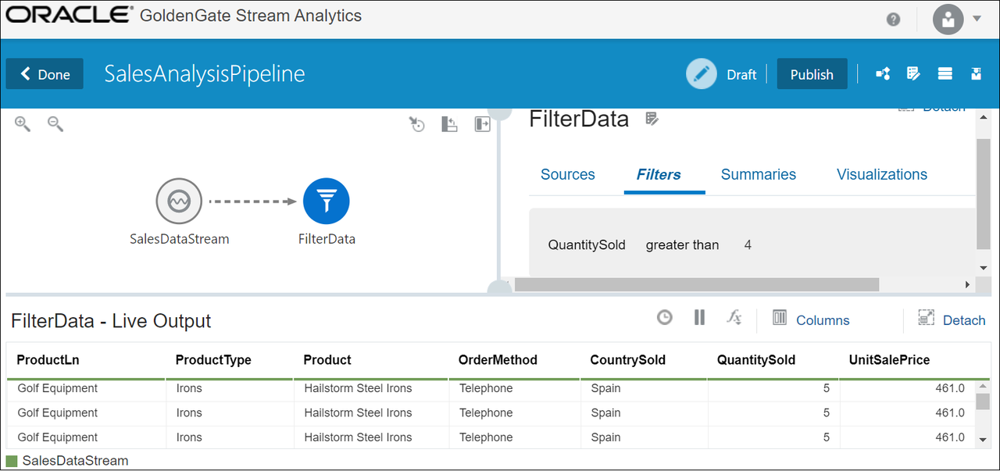

# Create your HelloWorld Pipeline

This lab helps you create a basic pipeline, add a query stage and a filter to it, and publish the pipeline; all this in less than 10 minutes!

### **What is a Pipeline?**

A pipeline includes a sequence of data processing stages such as, Query, Pattern, Rule, Query Group, Custom, and Scoring. You can apply business logic to an input data stream, within a pipeline.

## **Lab Prerequisites**

## Task 1: Create a CSV file

Create a CSV file and copy the following lines into it:

* `ProductLn,ProductType,Product,OrderMethod,CountrySold,QuantitySold,UnitSalePrice`
* `Personal Accessories,Watches,Legend,Special,Brazil,1,240`
* `Outdoor Protection,First Aid,Aloe Relief,E-mail,United States,3,5.23`
* `Camping Equipment,Lanterns,Flicker Lantern,Telephone,Italy,3,35.09`
* `Camping Equipment,Lanterns,Flicker Lantern,Fax,United States,4,35.09`
* `Golf Equipment,Irons,Hailstorm Steel Irons,Telephone,Spain,5,461`

## Task 2: Log in to GoldenGate Stream Analytics

Log in to the GoldenGate Stream Analytics using the url, with the following credentials:

* **User Name:** **osaadmin**

* **Password:** **welcome1**

## Task 3: Create a File Stream

1. To create a File stream, on the **Catalog** page, click **Create New Item**, and select **Stream** to display the **Create Stream** screen.

   

2. Select **File** in the **Stream Type** drop-down list.

   

3. Select **Create Pipeline with this source (Launch Pipeline Editor)**.

4. Click **Next**, to update the source details.

## Task 4: Upload the CSV file

1. To upload the CSV file, on the **Source Details** screen, click **Upload File** to browse and upload the CSV file that you had created in **STEP 1**.

   

2. Click **Next**, to display the **Data Format** screen.

## Task 5: Set Record Header

1. To set the first record as header, on the **Data Format** screen, select **First record as header**.

   

2. Click **Next**, to infer shape for the event.

## Task 6: Infer Event Shape

1. To infer shape from stream, on the **Shape** screen, ensure **Infer Shape** and **From Stream** options are selected, and verify if the shape of the event is successfully inferred as shown in following screenshot.

   

2. Click **Save**, to open the **Create Pipeline** screen.

## Task 7: Create Pipeline

1. To create a pipeline, on the **Create Pipeline** screen, enter a name for the pipeline, and click **Save** to launch the Pipeline Editor.

   

## Task 8: View the Pipeline in the Pipeline Editor

1. In the pipeline editor, you will see the message *Starting Pipeline* followed by *Listening to Events*. This is the first access of the cluster, therefore it will take a while to copy the libraries.

2. You should eventually see the following screen, with a single node representing the source stream in the left pane, and the **Sources** used in the pipeline, in right pane.

   

## Task 9: Add a Query Stage

1. To add a **Query** stage to the source stream, right-click on the source stream, select **Add a Stage** and then select **Query**.

2. Enter a **Name** and **Description** for the Query Stage.

3. Click **Save**. A Query stage is added to the source stream.

## Task 10: Add a Filter to the Query Stage

1. To add a **Filter** to a **Query** stage, click **Filters** in the left pane, and click **Add a Filter**. In this example, the filter is **QuantitySold is greater than 4**, as shown in the following screenshot.

   

## Task 11: Publish the Pipeline

1. To publish a pipeline click **Publish** on the top-right corner. Publish with defaults, for your pipeline to filter data in real-time.

**Note:**

* The pipeline would continue to run even after you log out since the pipeline is now in published state.

* By default the Pipeline is in *Draft* state, and quitting the pipeline editor without publishing will remove the pipeline and release all cluster resources.

## Learn More

* [Transform and Analyze Data Streams](https://docs.oracle.com/en/middleware/fusion-middleware/osa/19.1/using/creating-pipeline-transform-and-analyze-data-streams.html#GUID-9DB9B57A-1095-4557-ACB9-816A696EB121)

## Acknowledgements
* **Author** - Pratibha Manjunath, Senior User Assistance Developer, GoldenGate Stream Analytics
* **Contributors** - Prabhu Thukaram, Senior Director, Software Development
* **Reviewers:**
    * Anuradha Chepuri, Principal User Assistance Developer, Oracle GoldenGate
    * Prabhu Thukaram, Senior Director, Software Development
    * Aslam Khan, Senior User Assistance Manager, ODI, OGG, EDQ

* **Last Updated By/Date** - Pratibha Manjunath, November 2020

