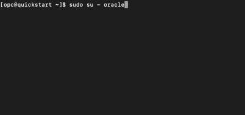

# Active Active / HA-DR Replication with GoldenGate

### Introduction
In this lab we will load data in and configure active-active for High Availability. This bidirectional technology allows High Availability using GoldeGate technology.

*Estimated Lab Time*:  60 minutes

### Objectives
Active - Active Replication using GoldenGate

### Prerequisites
This lab assumes you have:
- A Free Tier, Paid or LiveLabs Oracle Cloud account
- SSH Private Key to access the host via SSH
- You have completed:
    - Lab: Generate SSH Keys
    - Lab: Prepare Setup
    - Lab: Environment Setup
    - Lab: Configure GoldenGate

## Task 1: GoldenGate - Oracle Data Capture

1. Open a terminal session

  

```
<copy>ssh -i (sshkey) opc@xxx.xxx.xx.xxx</copy>
```
```
<copy>sudo su - oracle</copy>
```

2. Oracle data capture - Create a GoldeGate extract to define the objects to extract from the source any any parameters to help refine what is being extracted.

To configure the Oracle Integrated Extract:
Execute the GGSCI command:

```
<copy>edit param etpc</copy>
```

3. Enter the following settings:

```
<copy/>extract etpc
exttrail ./dirdat/et
useridalias oggcapture
reportcount every 120 seconds, rate
ddloptions report
warnlongtrans 60m, checkinterval 15m
table pdbeast.tpc.*;</copy>
```

4. Add the parameter that will cause Integrated Extract to capture DDL operations that are of mapped scope.
Add the parameter that will cause Integrated Extract to encrypt its OGG Trail files.

5. Save and close the file.

6. Data transmission to MySQL
This is not technically required because the OGG and MySQL installations are on the same machine. However, if data is being transmitted over a LAN/WAN an **Extract Data Pump** is required.
To configure the Oracle to MySQL Extract Data Pump:

7. Execute the GGSCI command:

```
<copy>edit param pmysql</copy>
```

8. Enter the following settings:

```
<copy>extract pmysql
rmthost localhost, mgrport 8809
rmttrail ./dirdat/rt
reportcount every 120 seconds, rate
table pdbeast.tpc.*;</copy>
```

9. Add the RMTHOST option that will cause the Extract Data Pump to encrypt data transmissions with the aes256 algorithm.

10. Save and close the file.

## Task 2:  GoldenGate - Oracle Data Apply

1. To configure the **Parallel Replicat** which will define on the target parameters relative to how the real time changes will handled by GoldeGate.
Execute the GGSCI command:

```
<copy>./ggsci</copy>
```

```
<copy>edit param rtpc</copy>
```

2. Enter the following settings:

```
<copy>replicat rtpc
useridalias ggapplywest
map_parallelism 3
split_trans_recs 1000
ddl include mapped
ddloptions report
reportcount every 120 seconds, rate
map pdbeast.tpc.*, target pdbwest.tpc.*;</copy>
```

3. Add the parameters to auto-tune the number of Appliers; with a minimum of 3 and a maximum of 12.

4. Save and close the file.

## Task 3: GoldenGate - MySQL Data Apply

1. MySQL change **data apply** using GoldeGate

To configure the Coordinated Replicat in the MySQL OGG environment:

```
<copy>./ggsci</copy>
```

2. Execute the GGSCI command:

```
<copy>edit param rtpc</copy>
```

3. Enter the following settings:

```
<copy>replicat rtpc
targetdb tpc@db-ora19-mysql:3306, useridalias ggapply
reportcount every 120 seconds, rate
usededicatedcoordinationthread
map pdbeast.tpc.categories, target "tpc"."categories", thread (20);
map pdbeast.tpc.categories_description, target "tpc"."categories_description", thread (20);
map pdbeast.tpc.customers, target "tpc"."customers", thread (20);
map pdbeast.tpc.customers_info, target "tpc"."customers_info", thread (20);
map pdbeast.tpc.customers_lkup, target "tpc"."customers_lkup", thread (20);
map pdbeast.tpc.next_cust, target "tpc"."next_cust", thread (20);
map pdbeast.tpc.next_order, target "tpc"."next_order", thread (20);
map pdbeast.tpc.orders_total, target "tpc"."orders_total", thread (20);
map pdbeast.tpc.products, target "tpc"."products", thread (20);
map pdbeast.tpc.products_description, target "tpc"."products_description", thread (20);
map pdbeast.tpc.products_to_categories, target "tpc"."products_to_categories", thread (20);</copy>
```

4. Enter "MAP" statements for the following:

  - Operations for the table "tpc.orders" are to be applied by thread 1.
  - Operations for the table "tpc.orders_products" and to be ranged across threads 2, 3, and 4.
  - Operations for the table "tpc.orders_status_history" are to be ranged across threads 6 and 7.

5. Save and close the file.

6. Enable schema level supplemental logging in source.

To enable schema level supplemental logging in the source Oracle PDB:

Execute the GGSCI commands:

```
<copy>./ggsci</copy>
```

```
<copy>dblogin useridalias oggcapture
add schematrandata pdbeast.tpc</copy>
```

6. Create the OGG replication Groups

Create the OGG Groups by executing the following commands:
Oracle Integrated Extract:

```
<copy>./ggsci</copy>
```

```
<copy>dblogin useridalias oggcapture
add extract etpc, integrated tranlog, begin now
register extract etpc, database, container (*)
add exttrail ./dirdat/et, extract etpc, megabytes 250</copy>
```

7. **Oracle Extract Data Pump**

```
<copy>add extract pmysql, exttrailsource ./dirdat/et
add rmttrail ./dirdat/rt, extract pmysql, megabytes 250</copy>
```

8. **Oracle Parallel Apply**

```
<copy>dblogin useridalias ggapplywest
add replicat rtpc, parallel, exttrail ./dirdat/et, checkpointtable pdbwest.ggadmin.ggchkpoint</copy>
```

## Task 4: GoldenGate - MySQL Coordinated Replicat

1. MySQL Coordinated Replicat

```
<copy>./ggsci</copy>
```
```
<copy>dblogin sourcedb ggadmin@db-ora19-mysql:3306, useridalias ggrep</copy>
```
```
<copy>add replicat rtpc, coordinated, exttrail ./dirdat/rt</copy>
```

2. Start OGG and generate data
Start the OGG environment:

```
<copy>./ggsci</copy>
```

3. Oracle:

```
<copy>start er *</copy>
```  

4. MySQL:

```
<copy>./ggsci</copy>
```

```
<copy>start er *</copy>
```

Verify all OGG Groups are running.
Generate data

In the window connected to the database server:
Change to the "/Test_Software/Scripts/Oracle/orderentry" directory.

5. Login to the database as the user "tpc"

```
<copy>sqlplus tpc@pdbeast</copy>
```

When prompted enter the password: Oracle1

At the SQL> prompt, enter:

```
<copy>@gentrans.sql</copy>
```

Enter "100" at the prompt, and return.

## Task 5: GoldenGate - Verify Replication

Verify data has been replicated

1. Check that all OGG Groups remain running.			
For any STOPPED or ABEND groups, view their report file to find the error.

Use the ggsci "stats" command to see how many operations were processed by each Extract and Replicat.

2. Use the ggsci "view report" command to see how many operations were processed per second by each Extract and Replicat.

3. For MySQL, use the ggsci command "info rtpc, detail" to see how many Replicats were spawned.

```
<copy>info rtpc, detail</copy>
```

4. On the database server:

Login to PDBWEST as ggadmin:

```
<copy>sqlplus ggadmin@pdbwest</copy>
```

When prompted enter the password: Oracle1

5. Execute the following query to see additional information about lag:  

```
<copy>set heap on
set wrap off
set line 300
column Extract format a9
column Data_Pump format a10
column Replicat format a9
select to_char(incoming_heartbeat_ts,'DD-MON-YY HH24:MI:SSxFF') Source_HB_Ts
, incoming_extract Extract
, extract (day from (incoming_extract_ts - incoming_heartbeat_ts))*24*60*60+
extract (hour from (incoming_extract_ts - incoming_heartbeat_ts))*60*60+
extract (minute from (incoming_extract_ts - incoming_heartbeat_ts))*60+
extract (second from (incoming_extract_ts - incoming_heartbeat_ts)) Extract_Lag
, incoming_routing_path Data_Pump
, extract (day from (incoming_routing_ts - incoming_extract_ts))*24*60*60+
extract (hour from (incoming_routing_ts - incoming_extract_ts))*60*60+
extract (minute from (incoming_routing_ts - incoming_extract_ts))*60+
extract (second from (incoming_routing_ts - incoming_extract_ts)) Data_Pump_Read_Lag
, incoming_replicat Replicat
, extract (day from (incoming_replicat_ts - incoming_routing_ts))*24*60*60+
extract (hour from (incoming_replicat_ts - incoming_routing_ts))*60*60+
extract (minute from (incoming_replicat_ts - incoming_routing_ts))*60+
extract (second from (incoming_replicat_ts - incoming_routing_ts)) Replicat_Read_Lag
, extract (day from (heartbeat_received_ts - incoming_replicat_ts))*24*60*60+
extract (hour from (heartbeat_received_ts - incoming_replicat_ts))*60*60+
extract (minute from (heartbeat_received_ts - incoming_replicat_ts))*60+
extract (second from (heartbeat_received_ts - incoming_replicat_ts)) Replicat_Apply_Lag
, extract (day from (heartbeat_received_ts - incoming_heartbeat_ts))*24*60*60+
extract (hour from (heartbeat_received_ts - incoming_heartbeat_ts))*60*60+
extract (minute from (heartbeat_received_ts - incoming_heartbeat_ts))*60+
extract (second from (heartbeat_received_ts - incoming_heartbeat_ts)) Total_Lag
from ggadmin.gg_heartbeat_history order by heartbeat_received_ts desc;</copy>
```

## Task 6: GoldenGate - Replicate Oracle DDL

Replicate Oracle DDL

1. On the database server:
Login to PDBEAST as tpc:

```
<copy>sqlplus tpc@pdbeast</copy>
```

2. When prompted enter the password: Oracle1
Execute the following:

```
<copy>create table ddltest (
cola number(15,0) not null,
colb timestamp(6) not null,
colc varchar(100),
primary key (cola)
);
insert into ddltest values (1, CURRENT_TIMESTAMP, 'Row 1 insert');
insert into ddltest values (2, CURRENT_TIMESTAMP, 'Row 2 insert');
insert into ddltest values (3, CURRENT_TIMESTAMP, 'Row 3 insert');
insert into ddltest values (4, CURRENT_TIMESTAMP, 'Row 4 insert');
insert into ddltest values (5, CURRENT_TIMESTAMP, 'Row 5 insert');
commit;

update ddltest set colb=CURRENT_TIMESTAMP, colc='Row 3 update' where cola=3;
delete from ddltest where cola=2;
commit;</copy>
```

3. View the Oracle Replicat report file to validate the DDL was applied.

4. Execute the GGSCI "stats" command to see information for the table ddltest

```
<copy>./ggsci</copy>
```
```
<copy>stats rtpc, table pdbwest.tpc.ddltest</copy>
```

5. Shutdown all Extracts and Replicats.

You may now *proceed to the next lab*.

## Learn More

* [Oracle GoldenGate for Big Data 19c | Oracle](https://www.oracle.com/middleware/data-integration/goldengate/big-data/)

## Acknowledgements
* **Author** - Brian Elliott, Data Integration November 2020
* **Contributors** - Madhu Kumar, Rene Fontcha
* **Last Updated By/Date** - Rene Fontcha, LiveLabs Platform Lead, NA Technology, November 2020


